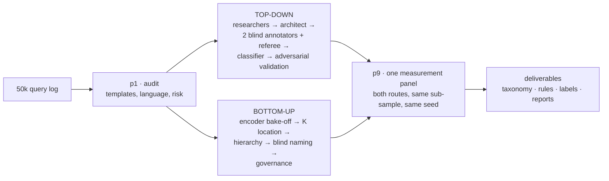
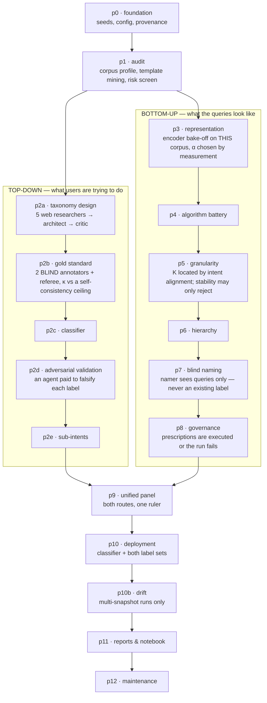

# QMine — a query-intent mining agent team

English | [中文](README.zh.md)

**Turns a raw search log into a defensible intent taxonomy, a labelled corpus, and the evidence for every choice in it.**

QMine is a [LangGraph](https://github.com/langchain-ai/langgraph) agent team that
runs **two independent routes over the same corpus** — a top-down intent taxonomy
built by researchers and blind annotators, and a bottom-up cluster tree built from
embeddings — then measures both under one harness and reports where they agree.

The distinguishing property is not that agents are involved. It is that **no agent
can decide anything.** Agents research, propose, name, annotate and write; every
parameter is settled by a measured quantity, and every claim that reaches a
deliverable is checked against the artifact it cites.



---

**Who it is for.** Teams who need a defensible intent taxonomy over their own query
log — search relevance, query understanding, content strategy, annotation
programmes — and who will be asked to show their work.

**Who it is not for.** Anyone who wants labels quickly and does not need the
evidence behind them. One good prompt against a strong model is far cheaper;
[Why not just prompt a frontier model?](#why-not-just-prompt-a-frontier-model)
argues why it is not the same thing, but if you do not need the argument you do
not need this.

### Before you start

- It needs **API keys for DeepSeek, Zhipu, Qwen AND OpenRouter** — all four, under
  the default `configs/live.yaml`. OpenRouter is not optional: four roles are
  pinned to `moonshotai/kimi-k3`, which is reachable only there, and an
  unroutable pin is treated as a config error that stops the run rather than
  degrading it. Anthropic and OpenAI keys do **nothing** here — both labs are in
  `excluded_labs`. With no keys at all it runs a deterministic offline stand-in
  and says so loudly: useful for checking the wiring, useless as output.
- **Budget a full 50k run at 3–4 hours and $5–$7.** That is `live39`
  (3.4 h / **$5.52**) and `live40` (4.0 h / **$7.01**), the two full runs whose
  every token had a published price. Routing dominates both: swap in one expensive
  model and the bill moves by an order of magnitude. `qmine models` prints the
  routing plan and an estimate before you spend anything; run it first.
- **`--fast` removes the second-opinion layer rather than shrinking the
  analysis**, and lands at **1.1–2.4 h / $3.01–$4.49** across nine runs of
  10,000–20,000 rows. It keeps the full corpus, the full grids and the full gold
  set; what it gives up is the κ, the pilot and the adversarial pass. See
  [Two speeds](#two-speeds-and-what-the-fast-one-gives-up).
- **Deliverables are written in Chinese** by default. `report_language` switches
  the reports; the machine-readable CSVs are language-neutral.
- It is a **research pipeline, not a product.** There is no hosted service and no
  uptime promise. The open questions are kept in the open, dated, in
  [`HANDOFF.md` §2](HANDOFF.md) — including the ones with no fix yet.

```bash
make install                 # builds .venv and installs the `qmine` entry point into it
make demo                    # 8k rows, offline stand-in, ~4 min — checks the wiring, spends nothing
.venv/bin/qmine models       # the routing plan and a cost estimate — still spends nothing
make live RUN=my-first-run   # the real thing: 50k rows, real models, 3-4 h, $5-$7
```

`make install` builds a virtualenv at `.venv`; `qmine` is installed **into it**, not
onto your `PATH`. Either `source .venv/bin/activate` once, or call
`.venv/bin/qmine` as written throughout this file.

---

## What's here

- [What it produces](#what-it-produces) — the files you get
- [What you do with the output](#what-you-do-with-the-output) — the schema, and three uses
- [Using it](#using-it) — commands, and the two speeds
- [How it works](#how-it-works) — the twelve phases
- [Comparing two time periods](#comparing-two-time-periods) — pooled snapshots and drift
- [What is new here](#what-is-new-here) — six things a scripted pipeline does not do
- [Why not just prompt a frontier model?](#why-not-just-prompt-a-frontier-model) — the measured failure modes
- [Persistence, generations and recovery](#persistence-generations-and-recovery)
- [Reproducibility](#reproducibility) · [Repository layout](#repository-layout) · [Support](#support)

The evidence and the longer arguments live in [`docs/`](docs/):
**[results across all 14 live runs](docs/RESULTS.md)** — κ, cost, route agreement
and the delivered shapes, with the figures — plus
[why not a prompt](docs/WHY_NOT_A_PROMPT.md),
[what an intent taxonomy is for](docs/WHAT_ITS_FOR.md),
[architecture](docs/ARCHITECTURE.md) and [model routing](docs/MODEL_ROUTING.md).

---

## What it produces

One command against one or more query corpora produces a complete, self-describing delivery:

| deliverable | what it is |
|---|---|
| `00_索引.md` | the reading order — what to open first, and what each file is for |
| `00_最终报告.md` | the through-line, **written by an agent**, every number checked against a fact sheet |
| `类目清单.md` | every top-down intent class — definition, satisfaction criterion, worked positive/negative examples, delivered row count (**20** on live44; 15–25 across the fourteen runs) |
| `叶清单.md` | every delivered cluster leaf with its blind-assigned name and the sampled queries it was named from |
| `家族与叶层级.md` | the delivered two-level tree, with each family's true composition |
| `标注规范与裁定规则.md` | the labeling guide **verbatim** and every adjudication rule the run earned — **162** on live44, 70–283 across the full runs — enough to reproduce the annotation |
| `自上而下类目体系最终报告.md` | the top-down route: taxonomy → gold standard → classifier → adversarial validation |
| `自下而上聚类最终报告.md` | the bottom-up route: encoder bake-off, K location, hierarchy, governance, and every rejected alternative |
| `统一度量面板.md` | both routes under one measurement harness |
| `交付前审核报告.md` | what a final auditing agent changed in the documents, and what it refused to change |
| `自下而上聚类全流程.ipynb` | an executed notebook — the figures are produced by running it, not drawn separately |
| `labels_full.csv` | every query with both routes' labels, plus machine-readable CSVs of the classes, rules and tree |
| `deployment.json` + centroids | the deployable classifier — 140–256 KB of centroids; inference is `encode(query) → hybrid transform → argmax(x @ centroids.T)`, with rows under a 0.02 margin routed to a fallback |
| `快照对比_漂移分析.md` | **multi-snapshot runs only** — what moved between the two periods, and what the comparison cannot tell you |

Deliverables are written in Chinese by default (`report_language`); the CSVs are
language-neutral. A `--fast` run ships the three reference documents instead of the
ten — see [Two speeds](#two-speeds-and-what-the-fast-one-gives-up).

---

## What you do with the output

The file you will actually use is `labels_full.csv` — every row of your corpus,
labelled by both routes, with a confidence and an ambiguity flag on each.

| column | what it is |
|---|---|
| `td_l1`, `td_l1_name` | the top-down intent class and its name |
| `td_user_need` | what the user is trying to accomplish, in one phrase |
| `td_confidence`, `td_margin`, `td_ambiguous` | the classifier's confidence, its margin over the runner-up, and whether the row was flagged as genuinely ambiguous |
| `td_decided_by` | which mechanism assigned it — annotator, referee, rule or classifier |
| `bu_leaf`, `bu_leaf_name`, `bu_user_need` | the delivered cluster leaf |
| `bu_family_final` | its family in the delivered two-level tree |
| `bu_leaf_pre_governance` | the leaf before phase-8 governance rewrote the tree — kept so a delivered label can be traced back |
| `bu_margin`, `bu_ambiguous` | distance to the nearest competing centroid, and the flag derived from it |

Two real rows from `filmdrift`, and the reason both routes ship:

| query | top-down intent | bottom-up leaf |
|---|---|---|
| `以法之名` | 解析裸片名/类型限定作品条目 *(resolve a bare title)* — 0.949 | 电视剧免费全集在线观看查询 |
| `以法之名张译电视剧在线观看免费高清` | 在线播放指定作品 *(play a named work)* — 0.988 | 电视剧免费全集在线观看查询 |

Same cluster, different intent. The bottom-up route groups them because they share
surface form; the top-down route separates them because a bare title is a request
to **disambiguate** and the long query is a request to **play**. They want
different result pages. A pipeline with only one route cannot see this.

**Three things to do with it on day one.**

- **Route on `td_l1`.** This was the original point of intent taxonomies: Broder
  introduced the navigational/informational/transactional split because "each type
  is best satisfied by very different results."
- **Gate on `td_margin` / `td_ambiguous`.** Rows the pipeline itself flags as
  ambiguous are where a confident wrong answer costs most — send them to a
  fallback path rather than to the winning class.
- **`group by bu_leaf` against your content inventory.** Intent volume is a
  `group by`; the demand/supply gap is a diff against your catalogue.

The most reusable artifact is not a number: `标注规范与裁定规则.md` ships the labeling
guide verbatim plus every adjudication rule the run produced (139 on `live42`, 162
on `live44`), which is enough for a human team to reproduce the annotation — or to
disagree with it precisely.

→ [Why an intent taxonomy is worth building at all](docs/WHAT_ITS_FOR.md) — the
survey of how retrieval routing, query rewriting, sensitive-query handling and
compliance regimes consume one, with citations.

---

## Using it

```bash
make install                 # encoders, notebook tooling, tests
cp .env.example .env         # DEEPSEEK / ZHIPU / QWEN / OPENROUTER keys — all four
                             # optional: TAVILY_API_KEY or BRAVE_API_KEY for web research

.venv/bin/qmine models                 # the routing plan and cost estimate — spends nothing
make demo                    # 8k rows, offline stand-in, ~4 min
make live RUN=live45         # the full corpus on real models
make fast RUN=live46         # same analysis, no second-opinion layer, 3 documents
.venv/bin/qmine watch live45           # attach the dashboard to a run, live or finished
.venv/bin/qmine render live45          # rebuild the deliverables from a finished run's artifacts
```

### Two speeds, and what the fast one gives up

`--fast` is for when you want the clustering and the labels now and can do
without the evidence that they were checked. It runs **the same analysis** — the
same corpus in full, the same α and K grids, the same gold-set size, the same
phases — and removes only the layer that second-guesses it:

| | full (default) | `--fast` |
|---|---|---|
| annotators on the gold set | 2, independent | **1** |
| inter-annotator κ | measured | **absent** — not 1.0, not 0.0 |
| pilot, guide repair, boundary redraw | run | not run |
| per-phase observers | run | not run |
| adversarial validation | run | not run |
| agent-written report, pre-delivery audit | run | not run |
| **grids, corpus, gold size, researchers** | full | **identical** |
| **intermediate artifacts** | all | **all** |
| deliverables | 10 documents + 6 CSVs + notebook | **3 reference documents** |
| **snapshot drift (`p10b`)** | run | **identical** — it is the point of a pooled run |

Measured on 10,000 finance queries: `fin03` ran in **1.4 h for ~$3.19** over 193
calls, 17/17 phases, and passed `verify_run` **21 / 0**. Its gold set was the full
derived 3,000 rows and its α sweep the full grid — fast mode shrank nothing.

**How to run it**

```bash
# the bundled defaults (K12 corpus)
make fast RUN=my-fast-run

# your own corpus — call the CLI with a corpus config
.venv/bin/qmine run --input data/raw/mine.xlsx --domain finance_zh \
          --config configs/live_finance.yaml --provider router --fast \
          --run-id my-fast-run
```

**Use a corpus config rather than the `LIVE_*` variables for anything with a
frequency column.** The `make` targets pass `configs/live.yaml`, which names no
`weight_column`, so a run started that way counts **distinct queries** — a head
term carrying six figures of traffic weighs the same as a one-off, and
`population_weighted_accuracy` does not exist at all. On `fin03` that metric read
0.941 against an unweighted 0.914. A corpus config sets the column once:

```yaml
# configs/live_finance.yaml
extends: corpus_wise_export.yaml     # text_column, weight_column, reference columns
```

The chain must bottom out at `live.yaml`, because `--config` **replaces** the
default rather than merging with it — without that inheritance the whole provider
policy is silently dropped, including the role pins and the lab-independence rule
that double-blind annotation depends on. `configs/live_finance.yaml`,
`live_film.yaml` and `live_people.yaml` are one-line worked examples.

**What you get**

```
<domain>_自上而下_意图体系完整定义.md   the intent system: classes, rules, gold, classifier
<domain>_自下而上_聚类树完整定义.md     the delivered tree: families, leaves, definitions
<domain>_query_挖掘结果.xlsx           every row labelled by both routes, + definition sheets
快照对比_漂移分析.md                    multi-snapshot runs only — what moved between periods
```

Each opens with a machine-generated banner naming exactly what was skipped, and
each ends with a map from every table back to the artifact it came from — so a
fast run can still be audited to the source, it just has not been audited *for*
you. `mode` and `fast_skipped` are recorded in `run_summary.json`, and
`verify_run.py` reports **N/A** rather than `PASS` for any check whose component
did not run, so a fast run can never be mistaken for a verified one — and its
PASS count is not comparable with a full run's.

**When NOT to use it.** If the labels are going to train something, settle an
argument, or be defended to someone else, run full: κ, the pilot ceiling and the
adversarial pass are the evidence that the labels are trustworthy, and fast mode
does not produce them.

Not to be confused with `--smoke`, which shrinks the grids for a wiring test and
is not a result at all.

**Real models are the default.** With provider keys present the pipeline routes
to them; with none it falls back to a deterministic stand-in and says so loudly —
in the log, in a `p0_provider` gate, and in the run summary. Stand-in output looks
complete and is not a model's, so the question "was this run real?" is answerable
from the artifacts.

**A run in progress.** Every phase announces its gates with the observed value and
the threshold it was judged against, so a watcher can see what was decided and on
what evidence — not just that something happened:

```
16:19:17  gate p1_template_coverage: PASSED — 12 phrasing families cover 18,298 rows (36.6%)
16:19:17  ✔ p1_audit completed in 0.6s
16:34:26  gate p3_observer: PASSED — observer found nothing blocking in p3
16:34:26  ✔ p3_represent completed in 908.8s
17:28:25  gate p2a_pilot_agreement: PASSED — pilot: kappa 0.875 (95% upper 0.915) on 200 queries
17:28:25  gate p2a_taxonomy_shape: PASSED — 20 L1 intents, 48 adjudication rules the annotator can cite
17:33:58  ✔ p2a_taxonomy completed in 4481.3s
```

`qmine watch <run>` renders the same stream as a browsable dashboard — the phase
tree with both branches, every agent call with what it returned, the gate ledger,
spend, and a faceted event log. It attaches to a live run or replays a finished
one from `run.log`.

**Another corpus:**

```bash
make live RUN=x LIVE_INPUT=data/queries.csv LIVE_DOMAIN=finance_zh \
                LIVE_TEXT=query LIVE_REFS=          # empty if you have no legacy labels
```

Deeper references live in [`docs/`](docs/): [`ARCHITECTURE.md`](docs/ARCHITECTURE.md)
for the graph and state model, [`MODEL_ROUTING.md`](docs/MODEL_ROUTING.md) for how
roles are assigned to providers and priced, [`LANGUAGE_AND_DOMAIN.md`](docs/LANGUAGE_AND_DOMAIN.md)
for domain profiles and the report language, and [`PLAYBOOK_MAPPING.md`](docs/PLAYBOOK_MAPPING.md)
for how each phase maps to the source methodology. [`docs/research/`](docs/research/)
holds the dossiers behind the design decisions.

---

## How it works

Every parameter choice, the candidates it beat, and the measurement that settled
it — one image, `live44`:


Seventeen graph nodes implement the twelve-phase methodology. The two routes fork
after the corpus audit and run **concurrently** — measured on real runs, the fork
hid **62 minutes** of bottom-up work inside the top-down critical path on
`live42`, 23% of that run's wall clock.



Every phase writes artifacts to a generation directory. Generations are
append-only: a rejected tree is kept, because a rejected artifact is still
evidence.

---

## Comparing two time periods

Give the runner **several files instead of one** and it pools them into a single
corpus, tagging each row with the snapshot it came from. Everything downstream —
the taxonomy, the gold set, the encoder bake-off, K location, the tree, the
naming — is derived **once, over both periods together**. A phase then splits the
finished labels by snapshot and compares.

```bash
.venv/bin/qmine run --input data/raw/金融query-250701.xlsx,data/raw/金融query-260701.xlsx \
          --domain finance_zh --config configs/live_finance.yaml \
          --provider router --fast --run-id fin-pool
```

Each corpus gets a one-line config that inherits the column names and the
provider policy — `configs/live_finance.yaml`, `live_film.yaml`,
`live_people.yaml`, all `extends: corpus_wise_export.yaml`.

**Why pooling, rather than one run per period and a diff.** Because the diff is
not computable, and there are two independent demonstrations of it in this repo.
`fin01` and `fin02` are the two finance files run separately: **20 and 19 classes
sharing zero codes**. They are not contradictory — `LOOKUP_FX_RATE` and
`FX_RATE_LOOKUP` are the same intent — but nothing joins them, and a human
deciding which pairs match is redoing the taxonomy by hand and injecting the
answer. That comparison confounds two things, though, because the two files hold
different data. The clean control is `film-pool` against `filmdrift`: the **same
20,000 rows**, verified byte-identical and in the same order, same config, same
mode — and the delivered tree moved from **12 leaves to 34**
([the full comparison](docs/RESULTS.md)). Pooled, a class means the same
thing in both periods **because it was defined once, on both**, and the comparison
becomes a lookup.

**The snapshot tag** is a constant date-like column if the file has one
(`event_day` in these exports), else a digit run in the filename, else the stem.
It is carried beside `weight`, never as a reference column: declaring it as one
would ask the K locator to find a K that separates 2025 from 2026, which is the
opposite of the shared frame the comparison needs. Duplicate tags are refused
rather than silently merged.

**What p10b measures.** Everything is a **share within its own snapshot**, both by
row and by traffic weight — never a raw count. One medical pair fell 9.74M to
5.21M in total weight; on raw counts every single class "declined" and the
composition, the only thing a drift report is for, was invisible. Classes present
in only one period are reported **separately** as emergent or receded, since a
class that appeared has no share *change* and reading "appeared" as "grew" is a
different claim. Groups too thin to compare (< 30 rows on a side) are named as
such rather than being given a delta the sample cannot support. Effect size is
Cramér's V, because at n = 20,000 a χ² p-value is significant for differences too
small to act on.

**A guardrail on the premise.** The comparison assumes both periods share one
label frame. `p10b` measures each group's snapshot purity and flags any group
sitting almost entirely in one period — that group was *separated*, not compared.
Measured across six pooled runs: `fin-pool` 0 of 52 leaves, `med-pool` 0 of 24,
`edu-pool` 0 of 28, `film-pool` 0 of 12, `filmdrift` 0 of 34 leaves but 1 of 17
top-down classes, and the news-driven `ppl-pool` **6 of 24** — all six of those
genuine period-specific public figures. So the gate warns rather than blocks: a
nonzero count is a prompt to look, not a defect.

**What ships.** `快照对比_漂移分析.md`, generated entirely from
`drift_analysis.json` — every number in it is a lookup, so it costs no model call
and ships in **both** full and fast mode. Its last section states plainly what the
comparison cannot tell you: no causation, two points are not a trend, a pooled
shift can reverse within every segment (Simpson's paradox), and whether the two
exports were sampled the same way is not something the pipeline can verify.

**What it found on five verticals.** Same two dates one year apart, ~20,000 pooled
rows each, one taxonomy per corpus labelling both years:

| corpus | queries in both years | of this year's traffic | intent-mix movement | biggest single shift |
|---|---:|---:|---:|---|
| medical | 6,329 (46.3%) | 77.8% | 0.111 | 药品功效与副作用查询 **+5.44pp** |
| education | 6,713 (50.5%) | 78.3% | 0.103 | 高等院校信息查询 **−2.82pp** |
| finance | 5,447 (37.4%) | 80.7% | 0.216 | 查询个股股票信息 **+7.08pp** |
| public figures | 4,494 (29.0%) | 56.3% | 0.288 | 查询人物个人资料简介 **+12.00pp** |
| film/TV | 2,841 (16.6%) | 36.7% | 0.203 | 免费完整版在线观看 **−13.62pp** |

<picture>
  <source media="(prefers-color-scheme: dark)" srcset="docs/img/fig_churn_vs_drift_dark.png">
  
</picture>

**The two axes are independent, and that is the finding.** film/TV recycles only
16.6% of its distinct queries and only 36.7% of this year's traffic sits on
queries that existed a year ago — the titles turn over almost completely — yet its
intent mix moved *less* than the public-figures corpus, whose queries are twice as
stable. Track query strings and you would call film/TV the most-changed corpus and
public figures one of the calmest. Both readings are wrong. The surface churns;
the intents persist.

**Is a shift one thing or many?** For each class, `p10b` computes the
concentration (HHI) of the per-query delta and ships the queries that carry it.
On film/TV the −13.6pp decline in free-full-episode viewing is spread across
**6,201 distinct queries** (HHI 0.004) — 2025's dramas ageing out, a broad
behavioural shift. The +11.0pp rise in live-TV viewing has one query carrying 23%
of it, and its top five deltas are all `cctv5` variants: one entity, not a trend.
The report names the measurement and prints the queries; it does not tell you
which it is.

Runs are unchanged when given a single input: no snapshot column, no drift phase,
no extra deliverable.

---

## What is new here

Six things this project does that a scripted pipeline or a prompt does not.

**1. Two routes, one ruler — and the comparison is the point.**
A cluster tree answers "what do these queries look like?"; an intent taxonomy
answers "what is the user trying to do?". They are different questions, and
merging them loses both answers. QMine delivers both label sets side by side and
measures them on the same sub-sample with the same seed. Across every run that
recorded it, the two agree at **AMI 0.309–0.679** and never approach 1 — neither
is recoverable from the other. And some intents are *structurally invisible* to
clustering — every run measures which, against a bar taken from that corpus's own
spread rather than a constant:

| run | corpus | classes | rule-dependent |
|---|---|---:|---:|
| `live44` | K12 | 20 | **6** |
| `live42` | K12 | 21 | **6** |
| `med04` | medical | 18 | **8** |
| `edu-pool` | education | 20 | **6** |
| `fin-pool` | finance | 17 | **5** |
| `film-pool` | film/TV | 15 | **5** |
| `ppl-pool` | public figures | 15 | **3** |

A quarter to two-fifths of every taxonomy, on every corpus tried. On `live44` they
are `correctness_verdict`, `riddle_solving`, `exercise_answer`,
`classical_interpretation`, `site_navigation` and `unclassifiable_noise` — meanings
that live in pragmatics rather than wording. No amount of clustering finds them;
they draw their accuracy from the rule layer. That is the measured justification
for running the expensive route at all.

**2. Blindness is enforced, not requested.**
The cluster namer sees member queries and nothing else. Prompt instructions are
not enough, so a firewall scans every payload for the forbidden vocabulary and
raises if a label leaks (`memory/context.py`). The annotators are independent
models from different labs, so agreement is not one model agreeing with itself.

**3. Agent output enters through doors, each with a mechanical guardrail.**
An agent may never change a parameter. What it *can* do is bounded per channel:

| channel | what it may do | the guardrail |
|---|---|---|
| prose (`agents/verify.py`) | write a report section | every number must appear in that section's fact sheet, checked value by value |
| observation (`agents/observe.py`) | flag a problem | must cite a resolving artifact key, and may carry an assertion the pipeline evaluates itself |
| grid proposal (`ops/propose.py`) | suggest a value to sweep | proposed **blind to scores**, so it is pre-registered; capped, additions only, graded every run |
| deliverable edit (`ops/edits.py`) | fix a document | anchored replacement, anchor must be unique, numbers must come from the artifact it cites |
| narrative (`agents/narrate.py`) | write the final report | a fact sheet per section **plus a coverage check** — `check_numbers` is precision-only and blind to omission |
| prescription | change the tree | settled or the run fails before reports are written |

**4. Findings cannot quietly disappear.**
A critic once found a real defect before the run that shipped it, and nothing
read the critic. Findings now live in a run-level ledger and close only when
their own assertion passes — not when someone decides they are fine.

**5. "Confirmed" is not "defective", and the pipeline says so.**
Machine-checked findings are re-verified independently. On one run, 13 findings
were machine-confirmed and only **2** were real defects — most of the rest
compared two fields that measure different populations. A check proves an
assertion failed; it says nothing about whether the conclusion holds. Both the
report framing and the observer prompt carry that measured rate.

**6. Two time periods are labelled ONCE, then compared.**
The obvious way to track drift is to run the pipeline on each period and diff the
results. That does not work: the same 20,000 rows run twice delivered **12 leaves
and then 34**, so a diff of two runs measures the pipeline's variance on top of
the corpus's ([the runs](docs/RESULTS.md)). QMine stacks
the snapshots into **one** corpus, derives **one** taxonomy and **one** cluster
tree from the pooled rows, and only then splits by snapshot to compare. Every
class means the same thing in both periods because it was defined once, on both.
See [Comparing two time periods](#comparing-two-time-periods).

---

## Why not just prompt a frontier model?

The honest question. The short answer is that the failure modes are measured and
they are exactly the ones this task hits:

- **A long context is not a read corpus.** Put the relevant material in the middle
  of a long input and accuracy falls *below* the same model given no documents at
  all — a U-shaped curve, and a bigger window does not fix it (Claude-1.3 scores
  76.1 against Claude-1.3-100K's 76.4). Under RULER, *effective* context runs far
  under the advertised number and degrades fastest on **aggregation** with many
  distractors. A taxonomy over 50,000 queries is an aggregation task.
- **Asking a model to check its own work makes it worse.** Intrinsic
  self-correction is measured net-negative: GPT-4 on GSM8K goes 95.5 → 91.5 → 89.0
  over two rounds. The published successes used oracle labels to decide when to
  stop.
- **A model judging its own output is not an instrument.** LLM judges show heavy
  position bias — asked which of two answers is better, Claude-v1 is
  order-consistent 23.8% of the time — and are fooled by verbose restatement.

So this pipeline never asks a model to grade itself, never asks one to hold the
corpus in its head, and never lets one set a parameter.

→ [The full argument, with citations and what each result implies for the design](docs/WHY_NOT_A_PROMPT.md)

---

## Persistence, generations and recovery

A four-hour run must survive an outage, and a rejected result must survive a
decision to reject it.

**Generations are append-only.** Re-deriving anything opens `gen02` beside
`gen01`; the old one is never touched. That is not politeness about disk — the
source project's discarded 107-leaf tree later became its phrasing-pattern
library. `qmine new-generation <run> --reason '...'` records why the last one was
set aside.

**Paid work is cached at the run level.** `llm_cache/` is keyed by prompt content
and shared across generations, so re-running a corrected phase replays every call
whose inputs did not change instead of buying them again.

**The graph is checkpointed.** A run killed in phase 9 resumes at phase 9 rather
than re-encoding 50,000 rows. One caveat, honestly stated: the two routes run
concurrently, and restarting *into* the forked region is not yet reliable — open a
new generation and run it once instead.

**Deliverables can be rebuilt without re-running anything.**
`qmine render <run>` regenerates every report from artifacts already on disk, into
a new generation, with no model calls. `--agents` additionally re-runs the
agent-authored parts, replaying from cache wherever the prompt is unchanged. This
is how a report fix gets verified against a real run for about a dollar instead of
thirty.

---

## Reproducibility

**What is deterministic.** Seeds are declared in the config and recorded in the
run manifest (`seed_metric`, `seed_viz`, and a replay pair used for stability
measurement). Clustering, sweeps, sub-sampling and the exemplars shown in reports
are pure functions of the data and those seeds. Every run writes
`config.resolved.yaml` and a manifest carrying the config hash, package versions,
platform, and a SHA for every prompt file — so two runs can be compared on
whether they were even asking the same question.

**What is not, and cannot be.** Model sampling is not reproducible across
providers or over time, and the web-using researchers see a changing internet: the
same phase can return different candidates on two runs, which changes the
architect's prompt and cascades a cache miss through everything below it. When
comparing runs, reuse the taxonomy rather than expecting the research to repeat.

**What is checked rather than assumed.** `run_summary.json` records
`llm_usage.provider`, and a `p0_provider` gate records whether real models ran at
all — because offline stand-in output is complete-looking and is not a model's.
`tools/verify_run.py` runs 28 mechanical checks over a finished run and is meant
to be pointed at an older, known-broken run as a control: a harness that passes on
one proves nothing.

---

## Repository layout

```
src/qmine/graph/      the twelve phases as LangGraph nodes
src/qmine/agents/     the agent roles, and the guardrail on each one
src/qmine/ops/        the measured operations no agent can override
src/qmine/report/     report, reference-shelf and notebook generators
src/qmine/llm/        provider routing, the fetched model catalogue, budgets
configs/              run configs; live.yaml is the default and routes to real models
docs/                 architecture, routing, domain profiles, playbook mapping
docs/research/        the dossiers behind the design decisions
tests/                one test per defect — the docstring names which
tools/verify_run.py   mechanical checks over a finished run
tools/run_evidence.py aggregates every complete live run into one table
tools/readme_figures.py rebuilds this README's cross-run figures from that table
HANDOFF.md            dated log of state, findings and open questions
runs/<id>/gen01/      artifacts and deliverables (git-ignored — runs stay local)
```

**711 tests.** Each one records the defect it was written after, and its docstring
names that defect — `tests/` is the real index of the invariants this pipeline
holds.

```bash
HF_HOME=$(pwd)/.hf .venv/bin/python -m pytest tests/ -q
```

---

## Support

Open an issue. Before filing, [`HANDOFF.md`](HANDOFF.md) §2 lists what is already
known to be broken or unresolved — it is kept current, and an item there is a
known gap rather than a surprise.

`.venv/bin/qmine doctor` reports installed packages, which provider credentials it
found, and whether matplotlib can find a CJK font (without one the figures render
boxes). It does **not** probe any model — for that use `.venv/bin/qmine models`,
which resolves the routing plan and prices it without spending anything.

**Licence:** none is declared yet. Until one is added, treat this as
all-rights-reserved and ask before redistributing.

---
