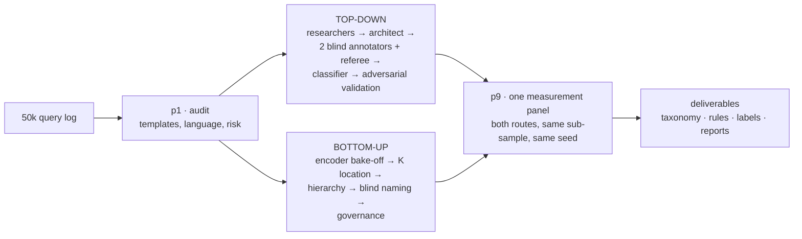
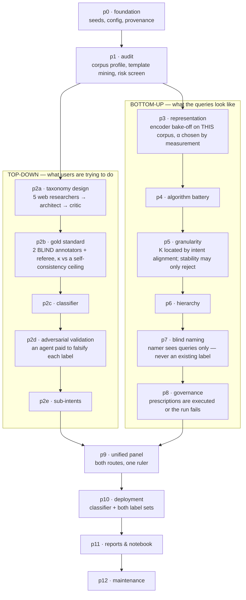
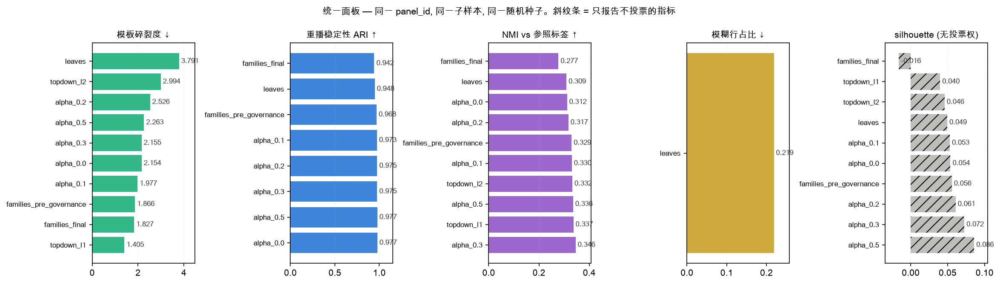
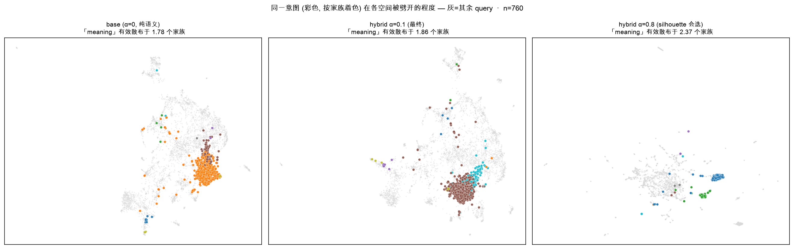
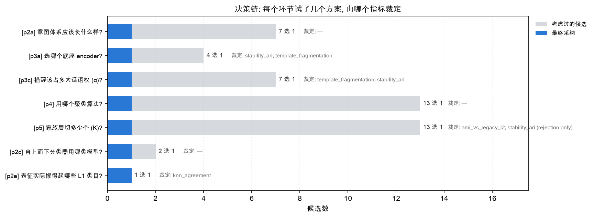

# QMine — a query-intent mining agent team

**Turns a raw search log into a defensible intent taxonomy, a labelled corpus, and the evidence for every choice in it.**

QMine is a [LangGraph](https://github.com/langchain-ai/langgraph) agent team that
runs **two independent routes over the same corpus** — a top-down intent taxonomy
built by researchers and blind annotators, and a bottom-up cluster tree built from
embeddings — then measures both under one harness and reports where they agree.

The distinguishing property is not that agents are involved. It is that **no agent
can decide anything.** Agents research, propose, name, annotate and write; every
parameter is settled by a measured quantity, and every claim that reaches a
deliverable is checked against the artifact it cites.



### Before you start

- It needs **API keys** for at least one provider (DeepSeek, Zhipu, Qwen,
  OpenRouter, Anthropic, OpenAI…). Without them it runs a deterministic offline
  stand-in and says so loudly — useful for checking the wiring, useless as output.
- A full 50k run takes **about 4–4.5 hours**. Cost depends almost entirely on
  routing: `live40` spent **$7.01** over 696 calls, `live42` **$29.69** over 702.
  Nearly the same call count, 4× the bill — one expensive model in the mix.
  Run `qmine models` for an estimate before you spend anything.
  `qmine models` prints the routing plan and an estimate before you spend anything.
- **Deliverables are written in Chinese** by default. `report_language` switches
  the reports; the machine-readable CSVs are language-neutral.
- It is a **research pipeline, not a product.** There is no hosted service, no
  uptime promise, and the open questions are listed in the open rather than
  smoothed over.

```bash
make install
make demo                    # 8k rows, offline, ~4 min — check the wiring
make live RUN=my-first-run   # the full 50k corpus on real models
```

---

## Table of contents

- [What it produces](#what-it-produces)
- [How it works](#how-it-works)
- [Why not just prompt a frontier model?](#why-not-just-prompt-a-frontier-model)
- [What is new here](#what-is-new-here)
- [What it is for](#what-it-is-for)
- [Results from a real run](#results-from-a-real-run)
- [Using it](#using-it)
- [Persistence, generations and recovery](#persistence-generations-and-recovery)
- [Reproducibility](#reproducibility)
- [Known limitations](#known-limitations)
- [Support](#support)
- [Repository layout](#repository-layout)
- [Status and contributing](#status-and-contributing)

---

## What it produces

One command against a 50,000-query corpus produces a complete, self-describing
delivery. This is what the current generators emit; the `live42` directories
predate some of them, so no single generation on disk holds every row:

| deliverable | what it is |
|---|---|
| `00_索引.md` | the reading order — what to open first, and what each file is for |
| `00_最终报告.md` | the through-line, **written by an agent**, every number checked against a fact sheet |
| `类目清单.md` | the 21 top-down intent classes: definition, satisfaction criterion, worked positive/negative examples, delivered row count |
| `叶清单.md` | every delivered cluster leaf with its blind-assigned name and the sampled queries it was named from |
| `家族与叶层级.md` | the delivered two-level tree, with each family's true composition |
| `标注规范与裁定规则.md` | the labeling guide **verbatim** and all 139 adjudication rules — enough to reproduce the annotation |
| `自上而下类目体系最终报告.md` | the top-down route: taxonomy → gold standard → classifier → adversarial validation |
| `自下而上聚类最终报告.md` | the bottom-up route: encoder bake-off, K location, hierarchy, governance, and every rejected alternative |
| `统一度量面板.md` | both routes under one measurement harness |
| `交付前审核报告.md` | what a final auditing agent changed in the documents, and what it refused to change |
| `自下而上聚类全流程.ipynb` | an executed notebook — the figures are produced by running it, not drawn separately |
| `labels_full.csv` | every query with both routes' labels, plus machine-readable CSVs of the classes, rules and tree |

Deliverables are written in Chinese by default (`report_language`).

---

## How it works

Seventeen graph nodes implement the twelve-phase methodology. The two routes fork
after the corpus audit and run **concurrently** — measured on real runs, the fork
hid **62 minutes** of bottom-up work inside the top-down critical path on
`live42`, 23% of that run's wall clock.



Every phase writes artifacts to a generation directory. Generations are
append-only: a rejected tree is kept, because a rejected artifact is still
evidence.

---

## Why not just prompt a frontier model?

The honest question, and it deserves measurements rather than adjectives. You
*can* paste queries into a strong model and ask for a taxonomy. Every claim below
is a published result about why the answer cannot be trusted, followed by what
this pipeline does instead.

**A long context is not a read corpus.** Put the relevant material in the middle
of a long input and accuracy falls *below* the same model given no documents at
all — the curve is U-shaped, primacy at the front, recency at the end, a trough in
between ([Liu et al., TACL 2024][lim]). A bigger window does not fix it: GPT-3.5
and GPT-3.5-16K trace nearly superimposed position curves, and Claude-1.3 scores
76.1 against Claude-1.3-100K's 76.4. Nor is it a language-understanding problem —
the same U-shape appears on pure UUID key-value lookup. Under [RULER][ruler],
*effective* context runs well under the advertised number (GPT-4: 128k claimed,
64k effective), and degrades fastest on **aggregation** tasks with many
distractors. A taxonomy over 50,000 queries — roughly 500k tokens — is an
aggregation query with 49,999 distractors, several times outside the regime
anyone has validated.

So QMine never asks a model to read the corpus. Phase 3 encodes every row
numerically, Phases 4–6 cluster them, and agents receive a **card** for one
cluster at a time — centre, random and edge members — a bounded, position-
controlled payload. Counts and shares are arithmetic over the full table, never a
model's impression of it.

**Asking a model to check its own work makes it worse.** Intrinsic
self-correction — review with no external feedback — is measured net-negative:
GPT-4 on GSM8K goes 95.5 → 91.5 → 89.0 over two rounds, GPT-3.5 on CommonSenseQA
75.8 → 38.1 ([Huang et al., ICLR 2024][selfcorr]). The published successes used
**oracle labels** to decide when to stop; remove the oracle and the gains invert.
Adding agents does not rescue it either — multi-agent debate loses to plain
self-consistency at matched inference budget (83.2 vs 85.3 at six responses).

This is why QMine's guardrails are not review agents. Every one is arithmetic
against an external record: written numbers checked value-by-value against a fact
sheet, an agent's assertion evaluated as an expression, an edit required to name
the artifact it came from. And it is the strongest argument for Phase 2b — a
refereed gold set *is* the oracle those results say you need.

**A model grading its own output is not a neutral instrument.** LLM judges
recognise their own generations and the strength of that self-preference is
linearly correlated with the recognition ([Panickssery et al., NeurIPS
2024][selfpref]). They also carry heavy position bias — asked which of two
answers is better, then asked again with the order swapped, Claude-v1 was
consistent 23.8% of the time — and are fooled by verbose restatement 91.3% of the
time ([Zheng et al., NeurIPS 2023][judge]). The constructive finding in that same
paper is the one QMine is built on: chain-of-thought only halved a judge's
grading errors (14/20 → 6/20), but giving it a **reference answer** took them to
3/20. An answer key beats a better prompt.

QMine's Phase 9 panel is blind, and Phase 7's fan-out makes blindness structural
rather than an instruction — each naming agent sees only its own payload.
Anything that decides is a measurement, not a judgement.

**A labelling scheme already has an acceptance test, and it is strict.**
Computational linguistics reads κ > 0.8 as reliable and 0.67–0.8 as supporting
only tentative conclusions; Krippendorff's own preconditions include a guide
**fixed in advance**, coders working **independently**, and no discussion or
voting — "any of these practices make the resulting data unusable for measuring
reproducibility" ([Artstein & Poesio, CL 2008][kappa]). A single prompt produces
a scheme for which no such number exists, or can exist.

Each of those preconditions is a test here: the guide is frozen before annotation
and every rule the architect *and* the referee write must reach the annotator;
each annotator's labels come back as its own; a row nobody labelled is missing
data, not agreement; guide repair runs on a fresh sample so refereed rows survive.
And because an annotator disagrees with **itself** about a quarter of the time
([Abercrombie et al.][intra]), κ is read against a self-consistency ceiling —
which is what separates a fixable guide gap from irreducible ambiguity.

**The convenient clustering scores do not mean what they look like.** Silhouette
is defined on the dissimilarity you hand it ([Rousseeuw 1987][sil]), so comparing
one embedding's silhouette to another's compares two different measurements that
share a name — and embedding geometry makes the absolute values untrustworthy
across spaces anyway ([Ethayarajh, EMNLP 2019][aniso]; [Steck et al., WWW
2024][cosine]). Stability is asymmetric for a deeper reason: high instability is
provably informative, but the converse **is not a theorem** — counter-examples
exist, and in the large-*n* K-means limit stability tracks the symmetry of the
distribution rather than whether K is right ([von Luxburg 2010][stab]).

Hence the rule that K is *located* by intent alignment and stability may only
*reject*; hence silhouette is reported with no voting rights; hence a null test,
because a model asked for a taxonomy will always return one ([Ben-Hur et
al. 2002][benhur]).



Measured on this corpus, that exclusion changes the answer. The same intent, in
the three candidate spaces — the α silhouette would have picked (0.8) scatters it
across 2.37 families where the chosen α=0.1 keeps it in 1.86:



**There is no single true taxonomy to find.** What counts as correct is set by
the aim, so clustering becomes scientific through open communication of the aims
and choices, not through uniqueness of the solution ([Hennig 2015][hennig]).
That makes the record the deliverable. A dataset others build on is expected to
document its motivation, composition and collection process
([Datasheets][datasheets]); a model shipped for use is expected to report
disaggregated performance, not one aggregate ([Model Cards][cards]); and
provenance — which entity was generated by which activity, derived from what — is
a [W3C Recommendation][prov] with a data model, not a vibe. A run directory here
answers those by construction: which rows, which sampling, which encoder, which
guide version, which annotators, what *n*, what was excluded and why.



**The fair comparison, stated honestly.** Reported self-correction gains have
turned out to be artefacts of a weak starting prompt — on CommonGen-Hard, one
well-written prompt beat seven rounds of refinement, 81.8 to 67.0
([Huang et al.][selfcorr] §5). The same standard applies to us: a pipeline
costing *N* model calls should be compared against the best *N*-call baseline,
not against one lazy call, and any advantage that a better prompt would also
supply is not an advantage of the architecture. What is left after that test is
the part a prompt cannot produce at any length: a labelled gold set with a κ and
an *n*, a K chosen against a null, an adversary paid to falsify the labels, and a
partition re-measured *after* governance rewrote it.

[lim]: https://aclanthology.org/2024.tacl-1.9/
[ruler]: https://arxiv.org/abs/2404.06654
[selfcorr]: https://arxiv.org/abs/2310.01798
[selfpref]: https://arxiv.org/abs/2404.13076
[judge]: https://arxiv.org/abs/2306.05685
[kappa]: https://aclanthology.org/J08-4004/
[intra]: https://arxiv.org/abs/2301.10684
[sil]: https://doi.org/10.1016/0377-0427(87)90125-7
[aniso]: https://aclanthology.org/D19-1006/
[cosine]: https://arxiv.org/abs/2403.05440
[stab]: https://arxiv.org/abs/1007.1075
[benhur]: https://psb.stanford.edu/psb-online/proceedings/psb02/benhur.pdf
[hennig]: https://doi.org/10.1016/j.patrec.2015.04.009
[datasheets]: https://arxiv.org/abs/1803.09010
[cards]: https://arxiv.org/abs/1810.03993
[prov]: https://www.w3.org/TR/prov-overview/

---

## What is new here

Five things this project does that a scripted pipeline or a prompt does not.

**1. Two routes, one ruler — and the comparison is the point.**
A cluster tree answers "what do these queries look like?"; an intent taxonomy
answers "what is the user trying to do?". They are different questions, and
merging them loses both answers. QMine delivers both label sets side by side and
measures them on the same sub-sample with the same seed. Some intents are
*structurally invisible* to clustering — on `live42`, 6 of 21 classes fell below
the kNN-agreement bar, among them `navigational`, `inappropriate_content` and
`interpret_figurative_meaning`. Their meaning lives in pragmatics rather than
wording, so no amount of clustering will find them and they must draw their
accuracy from the rule layer. That is the measured justification for running the
expensive route at all.

**2. Blindness is enforced, not requested.**
The cluster namer sees member queries and nothing else. Prompt instructions are
not enough, so a firewall scans every payload for the forbidden vocabulary and
raises if a label leaks (`memory/context.py`). The annotators are independent
models from different labs, so agreement is not one model agreeing with itself.

**3. Agent output enters through doors, each with a mechanical guardrail.**
An agent may never change a parameter. What it *can* do is bounded per channel:

| channel | what it may do | the guardrail |
|---|---|---|
| prose (`agents/verify.py`) | write a report section | every number must appear in that section's fact sheet, checked value by value |
| observation (`agents/observe.py`) | flag a problem | must cite a resolving artifact key, and may carry an assertion the pipeline evaluates itself |
| grid proposal (`ops/propose.py`) | suggest a value to sweep | proposed **blind to scores**, so it is pre-registered; capped, additions only, graded every run |
| deliverable edit (`ops/edits.py`) | fix a document | anchored replacement, anchor must be unique, numbers must come from the artifact it cites |
| prescription | change the tree | settled or the run fails before reports are written |

**4. Findings cannot quietly disappear.**
A critic once found a real defect before the run that shipped it, and nothing
read the critic. Findings now live in a run-level ledger and close only when
their own assertion passes — not when someone decides they are fine.

**5. "Confirmed" is not "defective", and the pipeline says so.**
Machine-checked findings are re-verified independently. On one run, 13 findings
were machine-confirmed and only **2** were real defects — most of the rest
compared two fields that measure different populations. A check proves an
assertion failed; it says nothing about whether the conclusion holds. Both the
report framing and the observer prompt carry that measured rate.

---

## What it is for

An intent taxonomy is not a report you file. It is a control surface, an
analytics substrate, and — increasingly — a compliance artifact.

**It decides which retrieval path runs.** This was the point from the beginning:
Broder introduced the navigational/informational/transactional split because "each
type is best satisfied by very different results" ([SIGIR Forum 2002][broder]),
and Rose & Levinson spelled out the mechanism — advice-seeking queries lean on
usage- and connectivity-based relevance, open-ended research on term-frequency
signals ([WWW 2004][rose]). It is still how it works. Google's rater guidelines
make intent **step one** of relevance measurement, before any rating is given
([SQRG][sqrg]). And LinkedIn's production query-understanding model routes every
query into four types — extract structured constraints, rewrite with member
context, fall back to high-recall lexical retrieval when intent is unclear, or
block — cutting request failures 17.13% in an online A/B, with relevance up 57% on
navigational and 75% on exploratory queries ([KDD '26][linkedin]). Note the shape:
four classes, one of them a **risk** class, one an explicit **unclear-intent
fallback**.

**A borrowed taxonomy collapses, measurably.** Three studies of the *same* three
Broder classes report navigational at 20%, at 11.7–15.3%, and at ~10%, and
informational at 48%, 61–63%, and >80% ([Broder][broder]; [Rose &
Levinson][rose]; [Jansen et al. 2008][jansen]) — a factor of four on identical
labels. Worse, when Rose & Levinson's taxonomy was applied to real Bing question
queries, **86.7% of them fell into a single category**; a purpose-built 16-class
taxonomy spread them out *and* achieved higher inter-assessor agreement
([Cambazoglu et al., CHIIR 2021][cambazoglu]). Finer was not harder to agree on.
That is the case for mining the taxonomy from the corpus you actually have, and
it is the same lesson this repo learned the expensive way when K12 thresholds were
imported into gates meant to be corpus-independent.

**Once labelled, the log becomes an instrument.** Microsoft Research applied a
product-intent classifier to Bing logs and could then report, per class, success
rate (navigational 77.28%, comparison 61.31%), volume share, relative user effort
(navigational costs 2.63× comparison), and session position — 56% of transactional
queries are preceded by a comparison query ([Rao et al.][rao]). Applying the same
taxonomy to corpora a decade apart measured a demand shift: 15–17% of web queries
are product-related, against 5–7% before. Two of their five classes — Comparison
and Support — appear in no prior taxonomy and came from the data, which is the
argument for this pipeline's bottom-up route in one sentence.

Every query in a QMine run carries both labels, so intent volume is a `group by`
and the demand/supply gap is a diff against your catalogue or content inventory
([Goswami et al., WWW '19][goswami] — abstract-level only; the method detail is
unverified).

**It is the guardrail on query rewriting.** eBay's null/low-result rewriter treats
the shopping-category distribution as the check that a rewrite has not destroyed
intent: "a sufficiently strong signal that the alternative query distorts user's
search intent if the inferred level-2 categories are changed", with top-1 rewrites
preserving category 71.5% of the time ([SIGIR eCom 2017][ebay] — offline on 3,000
sampled queries; no online A/B, despite what secondary sources say). Zero-results
rate is a first-class tracked KPI at least at [Wikimedia][wmf].

**The risk class is not optional, and for this corpus it is regulatory.** NAVER
ships a 12-class sensitive-query taxonomy as a runtime classifier in front of
generation, grouped Legal / Ethical / Service-sensitive, with **Age-restricted
contents** as a first-class category ([arXiv 2404.08672][naver]). Their data also
shows why a taxonomy is re-run rather than written once: self-harm queries average
1.6% of sensitive traffic and hit **17.2% in a single day** against a news event.
For a Chinese K12 corpus this is law, not practice — the
《[未成年人网络保护条例][minors]》 took effect 1 January 2024, and the CAC's
《[移动互联网未成年人模式建设指南][cac]》 (Nov 2024) prescribes five age bands
(<3, 3–8, 8–12, 12–16, 16–18) each with its own content prescriptions.

QMine's taxonomy carries an explicit risk class and the screen runs on **every
row**, not the sample. On `live42` it hit 1,499 rows across 30 leaves, and the leaf
catalogue reports each leaf's own count — because the blind namer's risk flag sees
a *sample* and the screen sees *everything*, and conflating them hides most of the
exposure. What a mined risk class is **not** is a shipped safety system: NAVER's
live harm-class precision was 74.7% with ~50 queries reviewed by humans daily.

**It replaces the most expensive part of an annotation programme.** The published
cost of building one taxonomy by hand: 1,000 queries, five assessors, **50–70
hours each** — roughly 250–350 person-hours of labelling alone — through a nine-
phase loop of draft, pilot, feedback, guideline revision, relabel, adjudicate
([Cambazoglu et al.][cambazoglu]). At product scale it never ends: Google works
with ~16,000 raters against a ~180-page guideline revised roughly twice a year
([SQRG][sqrg]), NIST budgets six contractors for two to four weeks per track
([Soboroff][nist]), and LinkedIn labelled ~14K production queries while noting that
"query understanding labels are expensive: correctness depends not only on semantic
plausibility but also on product policy" ([KDD '26][linkedin]). And the labels do
not amortise — "whenever a new vertical is introduced, a costly new set of
editorial data must be gathered" ([Arguello et al., SIGIR 2010][arguello]).

The most reusable thing QMine emits is therefore not the labels but
`标注规范与裁定规则.md`: the labeling guide plus 139 adjudication rules, each with
its trigger, target class, rationale and worked examples, marked by whether the
architect predicted it or the referee earned it against a real disagreement. That
is the artifact those 250–350 hours produce.

**Migrating to another domain.** Nothing above is K12-specific. Point it at a
different corpus and override the defaults; domain profiles carry the phrasing
seeds and risk vocabulary, and the pipeline gates whether a corpus has the
reference labels it would otherwise silently do without.

[amazon]: https://www.amazon.science/blog/from-structured-search-to-learning-to-rank-and-retrieve
[broder]: https://sigir.org/files/forum/F2002/broder.pdf
[rose]: https://www.ambuehler.ethz.ch/CDstore/www2004/docs/1p13.pdf
[jansen]: https://eprints.qut.edu.au/30951/
[cambazoglu]: https://marksanderson.org/files/papers/CHIIR21b.pdf
[sqrg]: https://services.google.com/fh/files/misc/hsw-sqrg.pdf
[linkedin]: https://arxiv.org/abs/2605.27441
[rao]: https://arxiv.org/pdf/2005.08591
[goswami]: https://dl.acm.org/doi/10.1145/3308560.3316605
[ebay]: https://ceur-ws.org/Vol-2311/paper_8.pdf
[wmf]: https://www.mediawiki.org/wiki/Wikimedia_Discovery/FAQ
[naver]: https://arxiv.org/abs/2404.08672
[minors]: https://www.moj.gov.cn/pub/sfbgw/zcjd/202310/t20231024_488321.html
[cac]: https://www.cac.gov.cn/2024-11/15/c_1733364304749288.htm
[nist]: https://arxiv.org/abs/2409.15133
[arguello]: https://ils.unc.edu/~jarguell/ArguelloSIGIR10.pdf

---

## Results from a real run

`live42`, 49,999 Chinese K12 search queries, four providers, roughly 4.5 hours.

| | |
|---|---|
| top-down | **21** L1 intent classes, **139** adjudication rules |
| bottom-up | **24** families / **58** leaves over all 49,999 rows |
| gold standard | κ **0.8928** on **n=2,999** double-annotated rows (raw agreement 0.902) |
| adversarial validation | **93.3%** of 150 attacked labels survived falsification |
| quality gates | **26** recorded — 15 measured (observed value + threshold), 11 advisory observer gates |

**How to read that κ.** Published multi-annotator query-intent work lands around
κ 0.79–0.82: ORCAS-I reports Cohen's 0.82 on 1,000 queries with two annotators,
Product Insights Fleiss 0.79 on 1,500 with three. So 0.8928 is in band — but read
it with three caveats. It is agreement between two **LLM** annotators from
different labs, not between humans. It is measured against the annotator's own
self-consistency ceiling, which is the number that makes it interpretable at all.
And agreement degrades with depth everywhere it has been measured: ORCAS-I's
labeller scores 90.2% on three top-level classes and 78.3% on five, and the
residual "abstain" class scores κ 0.303 where the real classes score 0.68–0.81.
A pipeline reporting near-perfect leaf-level agreement should be suspected, not
celebrated. Roughly 3–5% of queries have no single recoverable intent even for
careful human assessors.

For contrast on why the gate exists at all: Rose & Levinson (2004), the
second-most-cited taxonomy in the field, was labelled by "one of the authors" and
reports no agreement statistic — its own Future Work section concedes the
framework still needed testing by judges other than the authors.

Three of the source methodology's counter-intuitive findings were reproduced
independently, as measurements rather than restatements: a smaller encoder beat a
larger one on clustering stability; silhouette would have chosen the α that
fragments intents worst; and HDBSCAN produced overwhelming noise at every
`min_cluster_size` tried.

> **Read `n` before believing any metric.** That rule is in this repository
> because a κ of 0.813 was once computed on 199 of 600 rows after an outage and
> shipped as a methodology result. Coverage is now reported beside every score,
> and a row nobody labelled counts as missing data, not as agreement.

---

## Using it

```bash
make install                 # encoders, notebook tooling, tests
cp .env.example .env         # DEEPSEEK_API_KEY / ZHIPU_API_KEY / QWEN_API_KEY
                             # optional: TAVILY_API_KEY or BRAVE_API_KEY for web research

qmine models                 # the routing plan and cost estimate — spends nothing
make demo                    # 8k rows, offline stand-in, ~4 min
make live RUN=live45         # the full corpus on real models
make fast RUN=live46         # same analysis, no second-opinion layer, 3 documents
qmine watch live45           # attach the dashboard to a run, live or finished
qmine render live45          # rebuild the deliverables from a finished run's artifacts
```

### Two speeds, and what the fast one gives up

`--fast` is for when you want the clustering and the labels now and can do
without the evidence that they were checked. It runs **the same analysis** — the
same corpus in full, the same α and K grids, the same gold-set size, the same
twelve phases — and removes only the layer that second-guesses it:

| | `make live` (full) | `make fast` |
|---|---|---|
| annotators on the gold set | 2, independent | **1** |
| inter-annotator κ | measured | **absent** — not 1.0, not 0.0 |
| pilot, guide repair, boundary redraw | run | not run |
| per-phase observers | run | not run |
| adversarial validation | run | not run |
| agent-written report, pre-delivery audit | run | not run |
| **grids, corpus, gold size, researchers** | full | **identical** |
| **intermediate artifacts** | all | **all** |
| deliverables | 13 documents + notebook | 3 reference documents |

The three fast deliverables are the intent system, the cluster tree, and one
workbook with every row labelled by both routes. Each opens with a
machine-generated banner naming exactly what was skipped, and each ends with a
map from every table back to the artifact it came from — so a fast run can still
be audited to the source, it just has not been audited *for* you. `mode` is
recorded in `run_summary.json`, and `verify_run.py` reports `N/A` rather than
`PASS` for any check whose component did not run: a fast run can never be
mistaken for a verified one.

Not to be confused with `--smoke`, which shrinks the grids for a wiring test and
is not a result at all.

**Real models are the default.** With provider keys present the pipeline routes
to them; with none it falls back to a deterministic stand-in and says so loudly —
in the log, in a `p0_provider` gate, and in the run summary. Stand-in output looks
complete and is not a model's, so the question "was this run real?" is answerable
from the artifacts.

**A run in progress.** Every phase announces its gates with the observed value and
the threshold it was judged against, so a watcher can see what was decided and on
what evidence — not just that something happened:

```
16:19:17  gate p1_template_coverage: PASSED — 12 phrasing families cover 18,298 rows (36.6%)
16:19:17  ✔ p1_audit completed in 0.6s
16:34:26  gate p3_observer: PASSED — observer found nothing blocking in p3
16:34:26  ✔ p3_represent completed in 908.8s
17:28:25  gate p2a_pilot_agreement: PASSED — pilot: kappa 0.875 (95% upper 0.915) on 200 queries
17:28:25  gate p2a_taxonomy_shape: PASSED — 20 L1 intents, 48 adjudication rules the annotator can cite
17:33:58  ✔ p2a_taxonomy completed in 4481.3s
```

`qmine watch <run>` renders the same stream as a browsable dashboard — the phase
tree with both branches, every agent call with what it returned, the gate ledger,
spend, and a faceted event log. It attaches to a live run or replays a finished
one from `run.log`.

**Another corpus:**

```bash
make live RUN=x LIVE_INPUT=data/queries.csv LIVE_DOMAIN=finance_zh \
                LIVE_TEXT=query LIVE_REFS=          # empty if you have no legacy labels
```

Deeper references live in [`docs/`](docs/): [`ARCHITECTURE.md`](docs/ARCHITECTURE.md)
for the graph and state model, [`MODEL_ROUTING.md`](docs/MODEL_ROUTING.md) for how
roles are assigned to providers and priced, [`LANGUAGE_AND_DOMAIN.md`](docs/LANGUAGE_AND_DOMAIN.md)
for domain profiles and the report language, and [`PLAYBOOK_MAPPING.md`](docs/PLAYBOOK_MAPPING.md)
for how each phase maps to the source methodology. [`docs/research/`](docs/research/)
holds the dossiers behind the design decisions.

---

## Persistence, generations and recovery

A four-hour run must survive an outage, and a rejected result must survive a
decision to reject it.

**Generations are append-only.** Re-deriving anything opens `gen02` beside
`gen01`; the old one is never touched. That is not politeness about disk — the
source project's discarded 107-leaf tree later became its phrasing-pattern
library. `qmine new-generation <run> --reason '...'` records why the last one was
set aside.

**Paid work is cached at the run level.** `llm_cache/` is keyed by prompt content
and shared across generations, so re-running a corrected phase replays every call
whose inputs did not change instead of buying them again.

**The graph is checkpointed.** A run killed in phase 9 resumes at phase 9 rather
than re-encoding 50,000 rows. One caveat, honestly stated: the two routes run
concurrently, and restarting *into* the forked region is not yet reliable — open a
new generation and run it once instead.

**Deliverables can be rebuilt without re-running anything.**
`qmine render <run>` regenerates every report from artifacts already on disk, into
a new generation, with no model calls. `--agents` additionally re-runs the
agent-authored parts, replaying from cache wherever the prompt is unchanged. This
is how a report fix gets verified against a real run for about a dollar instead of
thirty.

---

## Reproducibility

**What is deterministic.** Seeds are declared in the config and recorded in the
run manifest (`seed_metric`, `seed_viz`, and a replay pair used for stability
measurement). Clustering, sweeps, sub-sampling and the exemplars shown in reports
are pure functions of the data and those seeds. Every run writes
`config.resolved.yaml` and a manifest carrying the config hash, package versions,
platform, and a SHA for every prompt file — so two runs can be compared on
whether they were even asking the same question.

**What is not, and cannot be.** Model sampling is not reproducible across
providers or over time, and the web-using researchers see a changing internet: the
same phase can return different candidates on two runs, which changes the
architect's prompt and cascades a cache miss through everything below it. When
comparing runs, reuse the taxonomy rather than expecting the research to repeat.

**What is checked rather than assumed.** `run_summary.json` records
`llm_usage.provider`, and a `p0_provider` gate records whether real models ran at
all — because offline stand-in output is complete-looking and is not a model's.
`tools/verify_run.py` runs 28 mechanical checks over a finished run and is meant
to be pointed at an older, known-broken run as a control: a harness that passes on
one proves nothing.

---

## Known limitations

Measured, unresolved, and listed here rather than in an issue tracker nobody
reads. The full log is in [`HANDOFF.md`](HANDOFF.md).

**The request timeout assumes one throughput for every role, and it is wrong by
5x in both directions.** `timeout_seconds` derives from a single constant of 40
output tokens/sec. Measured across roles on `live44`, real throughput runs from
**7.4 tok/s** (a tool-free researcher) to **181.7** (an annotator). The slow end
is reasoning: with no tool round-trips, wall time is dominated by thinking, and
thinking tokens are not counted in the output total — so they land in the
denominator and not the numerator.

The consequence compounds, because the provider SDK is given `max_retries=2`. A
role whose timeout is marginal spends *three* attempts reaching it before the
pipeline's own retry begins: on `live44` two researchers each burned
3 × 585s = **1,757 seconds returning zero tokens**, then succeeded on the retry.
Two angles cost ~48 minutes apiece instead of ~14, and roughly a third of the
design phase bought nothing.

Note what is **not** wrong here, since an earlier draft of this file said it was:
only `literature` and `risk_compliance` are given web tools. `log_reading`,
`legacy_audit` and `pragmatic_intents` are deliberately tool-free — the whole
value of the log reader is that it forms its view from the rows and nothing else,
and a search box invites it to substitute recall for observation. The tool-free
angles returned **12** candidates each on `live44`, more than either web angle's
10 and 11.

**The α decision sits inside its own noise.** Across five seed replicates the
winner was 0.1, 0.5, 0.1, 0.0, 0.1. The tie band is roughly 4.5× narrower than the
metric's own spread. Widening the band makes it worse — at a measured 2-sd band
the run elects an α its own panel shows fragments intents more. The fix is
replication, which has not been done.

**Refinement has never converged.** Every run so far hits the iteration limit, so
the delivered leaf count depends partly on which round it stopped at. Disclosed in
the reports; not fixed.

**Restarting into the concurrent region is unreliable.** The two routes fork, and
a resume that lands inside the fork has silently dropped a branch. The join now
halts loudly instead, but the underlying question — whether a multi-superstep
fan-out can be restored at all — is open. Open a new generation and run it once.

**Model behaviour is a live variable.** One provider returned the JSON *schema*
instead of data on 69 of 197 `annotator_b` calls on `live44` (35%), against 1 of
137 for the other annotator; because every field on the response
model had a default, that validated into a valid-but-empty result and silently
lost half a gold set before it was caught. It is now rejected before validation
and retried — but the class of failure is general, and a permissive default
anywhere is a place it can recur.

**An intent taxonomy may not be the right primitive at all.** Amazon argues the
opposite case directly: mapping query tokens to entity categories and attributes
yields "static query plans that cannot incorporate feedback in the retrieval
stage" and "compounding errors due to incorrect query understanding and/or content
understanding", and they favour learning to rank and retrieve instead
([Amazon Science][amazon]). The defensible claim for this project is that a
taxonomy is an *interpretable control surface and an analytics substrate* — not
that it is state of the art in retrieval.

**The annotated distribution is not the corpus distribution.** Gold rows are drawn
by cluster-stratified sampling precisely so rare intents survive selection
([Rao et al.][rao] avoid random sampling for the same reason), which means class
shares on the gold set are *not* an estimate of class shares in the corpus. Those
come from the delivered labels over all rows. Anywhere the two are printed near
each other is a place to check the denominator.

**Three of the shipped domain profiles have never been run on real data.**
`finance_zh`, `sports_zh` and `politics_zh` are untested; a corpus with no profile
falls back to mined phrasing groups, which is gated but not validated.

---

## Support

Open an issue. Before filing, [`HANDOFF.md`](HANDOFF.md) §2 lists what is already
known to be broken or unresolved — it is kept current, and an item there is a
known gap rather than a surprise.

`qmine doctor` reports installed packages and whether matplotlib can find a CJK
font (without one the figures render boxes). Note that it currently checks only
`ANTHROPIC_API_KEY` and probes no model, so it will **not** tell you whether your
DeepSeek / Zhipu / Qwen keys work — use `qmine models`, which resolves the routing
plan and prices it without spending anything.

**Licence:** none is declared yet. Until one is added, treat this as
all-rights-reserved and ask before redistributing.

---

## Repository layout

```
src/qmine/graph/      the twelve phases as LangGraph nodes
src/qmine/agents/     the agent roles, and the guardrail on each one
src/qmine/ops/        the measured operations no agent can override
src/qmine/report/     report, reference-shelf and notebook generators
src/qmine/llm/        provider routing, the fetched model catalogue, budgets
configs/              run configs; live.yaml is the default and routes to real models
docs/                 architecture, routing, domain profiles, playbook mapping
docs/research/        the dossiers behind the design decisions
tests/                one test per defect — the docstring names which
tools/verify_run.py   mechanical checks over a finished run
HANDOFF.md            dated log of state, findings and open questions
runs/<id>/gen01/      artifacts and deliverables (git-ignored — runs stay local)
```

**625 tests.** Each one records the defect it was written after, and its docstring
names that defect — `tests/` is the real index of the invariants this pipeline
holds.

```bash
HF_HOME=$(pwd)/.hf .venv/bin/python -m pytest tests/ -q
```

---

## Status and contributing

**What this is.** A working research pipeline, exercised end to end on a 50,000-row
corpus across several live runs. It is not a hosted product and makes no
uptime promise.

**What it is honest about.** [`HANDOFF.md`](HANDOFF.md) carries a dated log of
every open question, including the measured and unresolved ones — an alpha
decision that sits inside its own noise, a refinement loop that has not converged
on any run, and a client timeout that can burn half the design phase and return
nothing. Findings that cannot yet be acted on are kept where they cannot quietly
disappear rather than being written out of the record, and entries there are
corrected when they turn out to be wrong.

**If you are extending it**, two habits save the most time here, and both were
learned expensively:

- **Execute and look — never infer a result you could measure.** Read figures back
  after generating them; run notebooks rather than trusting that cells compile.
  Nearly every real defect in this repository was found by running, and several
  *false* findings came from reasoning that looked sound.
- **Read `n` before believing any metric.** A κ of 0.813 was once computed on 199
  of 600 rows after an outage and shipped as a methodology result.

Start from `tests/` — each test's docstring names the defect it was written
after, which is faster than reading the module it guards.

**Contributions** that come with a test recording the defect they fix are the ones
that will land fastest — that is the convention the whole suite follows.
