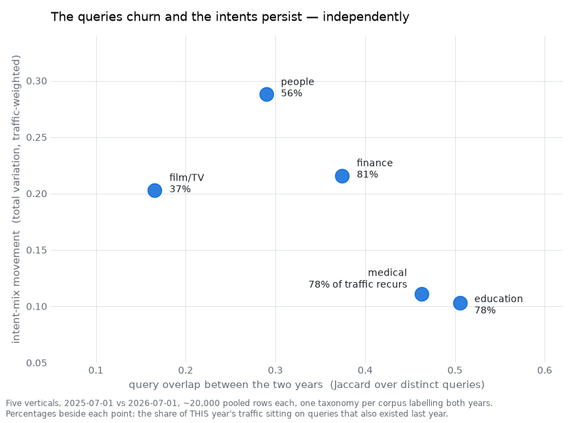

# QMine — 一个查询意图挖掘智能体团队

**将原始搜索日志转化为可验证的意图分类体系、标注语料库，以及每一项决策的依据。**

QMine 是一个基于 [LangGraph](https://github.com/langchain-ai/langgraph) 的智能体团队，它对**同一语料库执行两条独立的分析路径**——一条是由研究人员与盲标注人员构建的自上而下的意图分类体系，另一条是基于向量嵌入生成的自下而上的聚类树；随后在统一框架下对两者进行度量，并报告二者的一致之处。

其核心特点不在于使用了智能体，而在于**没有任何智能体能单独决定任何事**。智能体负责调研、提议、命名、标注和撰写；每一个参数都由量化指标确定，每一项最终交付的结论都要对照其引用的原始结果进行校验。

```
flowchart LR
  C["5万条查询日志"] --> A["p1 · 审计<br/>模板、语言、风险"]
  A --> TD["自上而下<br/>研究人员 → 架构师 →<br/>2名盲标注员 + 仲裁员 →<br/>分类器 → 对抗性验证"]
  A --> BU["自下而上<br/>编码器选型对比 → K值定位 →<br/>层级构建 → 盲命名 →<br/>治理校验"]
  TD --> P["p9 · 统一度量面板<br/>两条路径、同一样本子集、同一随机种子"]
  BU --> P
  P --> D["交付成果<br/>分类体系 · 规则 · 标注 · 报告"]
```

---

**适用人群**：需要基于自有查询日志构建可验证意图分类体系的团队——包括搜索相关性、查询理解、内容策略、标注项目等场景，且需要为工作成果提供依据的团队。
**不适用人群**：只需要快速获得标注、无需背后依据的用户。用一个优质提示词搭配大模型成本要低得多；[为什么不直接调用前沿大模型？](#为什么不直接调用前沿大模型) 一节解释了二者的本质区别，但如果你不需要论证过程，就不需要使用本工具。

### 开始之前

- 需要**DeepSeek、智谱、通义千问 AND OpenRouter 的 API 密钥**——默认配置文件 `configs/live.yaml` 中需要全部四个。OpenRouter 不是可选项：有四个角色固定使用 `moonshotai/kimi-k3` 模型，该模型仅能通过 OpenRouter 调用；如果无法路由到该模型，会被视为配置错误并终止运行，而非降级处理。Anthropic 和 OpenAI 的密钥在此**不起作用**——两个实验室都在 `excluded_labs`（排除实验室）列表中。如果没有任何密钥，程序会运行确定性的离线模拟程序并明确提示：仅用于检查流程连通性，输出结果无实际价值。
- **5万条数据的完整运行预算：3–4 小时，5–7 美元**。对应 `live39`（3.4 小时 / **5.52 美元**）和 `live40`（4.0 小时 / **7.01 美元**），这两次完整运行的每一笔 token 消耗都有公开定价。路由成本占主导：替换一个高价模型，账单就会出现数量级的变化。运行 `qmine models` 可以在产生任何费用前查看路由计划和预估成本；建议先执行此命令。
- **`--fast` 模式会移除二次校验层，而非缩小分析范围**，在 9 次 1 万–2 万条数据的运行中，耗时 **1.1–2.4 小时，费用 3.01–4.49 美元**。它保留完整语料库、完整参数网格和完整黄金标准集；舍弃的是 κ 系数检验、试点运行和对抗性校验环节。参见[两种运行速度](#两种运行速度及快速模式的取舍)。
- **交付成果默认使用中文撰写**。可通过 `report_language` 切换报告语言；机器可读的 CSV 文件不受语言影响。
- 这是一个**研究管线，而非成品产品**。没有托管服务，也不承诺可用性。未解决的问题公开记录在 [`HANDOFF.md` 第2节](HANDOFF.md) 中，包括尚未修复的问题。

```bash
make install                 # 构建虚拟环境 .venv 并安装 qmine 命令入口
make demo                    # 8千条数据，离线模拟，约4分钟 — 检查流程，不产生费用
.venv/bin/qmine models       # 查看路由计划和成本预估 — 仍不产生费用
make live RUN=my-first-run   # 正式运行：5万条数据，真实模型，3-4小时，5-7美元
```

`make install` 会在 `.venv` 目录构建虚拟环境；`qmine` 是**安装到该环境中**，而非添加到系统 `PATH` 中。可以执行一次 `source .venv/bin/activate` 激活环境，或像本文档中一样直接调用 `.venv/bin/qmine`。

## 目录

- [产出内容](#产出内容) — 你会得到的文件
- [输出结果的用途](#输出结果的用途) — 数据结构与三种应用场景
- [使用方法](#使用方法) — 命令与两种运行速度
- [工作原理](#工作原理) — 十二个阶段
- [跨时间段对比](#跨时间段对比) — 合并快照与漂移分析
- [创新点](#创新点) — 脚本化管线做不到的六件事
- [为什么不直接调用前沿大模型？](#为什么不直接调用前沿大模型) — 已量化的失效模式
- [持久化、版本迭代与恢复](#持久化版本迭代与恢复)
- [可复现性](#可复现性) · [仓库结构](#仓库结构) · [技术支持](#技术支持)

详细论证与依据见 [`docs/`](docs/) 目录：**[14次正式运行的结果汇总](docs/RESULTS.md)** — κ 系数、成本、路径一致性及最终分类形态，附数据图表；另外还有 [为什么不用提示词](docs/WHY_NOT_A_PROMPT.md)、[意图分类体系的作用](docs/WHAT_ITS_FOR.md)、[架构设计](docs/ARCHITECTURE.md) 和 [模型路由](docs/MODEL_ROUTING.md)。

## 产出内容

对 5 万条查询的语料库执行一条命令，即可生成完整的、自解释的交付包：

| 交付文件                      | 说明                                                                                                                                      |
| ----------------------------- | ----------------------------------------------------------------------------------------------------------------------------------------- |
| `00_索引.md`                  | 阅读指引 — 优先打开哪些文件，以及每个文件的用途                                                                                           |
| `00_最终报告.md`              | 完整主线报告，**由智能体撰写**，所有数据均对照事实表校验                                                                                  |
| `类目清单.md`                 | 所有自上而下的意图类别——定义、判定标准、正/负示例、覆盖数据行数（`live44` 为 **20** 个；14次运行区间为 15–25 个）                         |
| `叶清单.md`                   | 所有最终聚类叶节点，包含盲命名结果及用于命名的采样查询                                                                                    |
| `家族与叶层级.md`             | 最终的两层聚类树，以及每个类族的实际构成                                                                                                  |
| `标注规范与裁定规则.md`       | 完整的**标注指南原文**，以及本次运行生成的所有裁定规则（`live44` 为 **162** 条；完整运行区间为 70–283 条）——足以复现标注过程              |
| `自上而下类目体系最终报告.md` | 自上而下路径：分类体系 → 黄金标准 → 分类器 → 对抗性验证                                                                                   |
| `自下而上聚类最终报告.md`     | 自下而上路径：编码器选型、K值定位、层级构建、治理校验，以及所有被否决的备选方案                                                           |
| `统一度量面板.md`             | 同一度量框架下两条路径的对比结果                                                                                                          |
| `交付前审核报告.md`           | 最终审核智能体对文档的修改内容，以及拒绝修改的部分                                                                                        |
| `自下而上聚类全流程.ipynb`    | 可执行的 Notebook — 图表由运行直接生成，而非单独绘制                                                                                      |
| `labels_full.csv`             | 每条查询的两条路径标注结果，以及类别、规则、聚类树的机器可读 CSV 文件                                                                     |
| `deployment.json` + 质心文件  | 可部署的分类器 — 140–256 KB 质心数据；推理逻辑为 `encode(query) → 混合变换 → argmax(x @ centroids.T)`，置信度低于 0.02 的查询会走兜底逻辑 |
| `快照对比_漂移分析.md`        | **仅多快照运行包含** — 两个时间段之间的变化，以及对比的局限性说明                                                                         |

交付成果默认中文（由 `report_language` 控制）；CSV 文件语言无关。`--fast` 模式仅输出 3 份参考文档而非 10 份——参见[两种运行速度](#两种运行速度及快速模式的取舍)。

## 输出结果的用途

你实际会用到的核心文件是 `labels_full.csv`——语料库中每一行都带有两条路径的标注，以及置信度和歧义标记。

| 字段                                         | 说明                                                    |
| -------------------------------------------- | ------------------------------------------------------- |
| `td_l1`, `td_l1_name`                        | 自上而下的意图类别及其名称                              |
| `td_user_need`                               | 用户想要完成的目标，一句话概括                          |
| `td_confidence`, `td_margin`, `td_ambiguous` | 分类器的置信度、与次优类别的差值、是否被标记为真实歧义  |
| `td_decided_by`                              | 标注由哪种机制生成——标注员、仲裁员、规则或分类器        |
| `bu_leaf`, `bu_leaf_name`, `bu_user_need`    | 最终的聚类叶节点                                        |
| `bu_family_final`                            | 该叶节点在最终两层聚类树中所属的类族                    |
| `bu_leaf_pre_governance`                     | 第8阶段治理校验重构树之前的叶节点——保留用于追溯标注来源 |
| `bu_margin`, `bu_ambiguous`                  | 与最近竞争质心的距离，以及由此衍生的歧义标记            |

以下是 `filmdrift` 中的两条真实数据，也解释了为什么需要两条路径：

| 查询                                 | 自上而下意图                                                 | 自下而上叶节点             |
| ------------------------------------ | ------------------------------------------------------------ | -------------------------- |
| `以法之名`                           | 解析裸片名/类型限定作品条目 *(resolve a bare title)* — 0.949 | 电视剧免费全集在线观看查询 |
| `以法之名张译电视剧在线观看免费高清` | 在线播放指定作品 *(play a named work)* — 0.988               | 电视剧免费全集在线观看查询 |

同一聚类，不同意图。自下而上路径将它们归为一类，因为它们表面形式相似；自上而下路径将它们分开，因为裸片名是**消歧义**请求，而长查询是**播放**请求。用户需要的结果页面完全不同。单一路径的管线无法识别这种差异。

**上线第一天就能做的三件事：**

- **基于 `td_l1` 做路由**。这正是意图分类体系的初衷：Broder 提出导航型/信息型/交易型的划分，就是因为“每种类型都需要截然不同的结果才能最好地满足”。
- **基于 `td_margin` / `td_ambiguous` 做兜底**。管线自身标记为歧义的条目，恰恰是错误答案代价最高的场景——将它们发送到兜底路径，而非直接归入置信度最高的类别。
- **按 `bu_leaf` 分组对比内容库**。意图量级通过分组统计得到；供需缺口就是与你的内容目录的差值。

最具复用价值的不是某个数字：`标注规范与裁定规则.md` 包含完整的标注指南原文，以及本次运行生成的所有裁定规则（`live42` 为 139 条，`live44` 为 162 条），足以让人工团队复现标注——或者精准地提出异议。

→ [为什么值得构建意图分类体系](docs/WHAT_ITS_FOR.md) — 关于检索路由、查询改写、敏感查询处理和合规体系如何使用意图分类体系的调研，附引用文献。

## 使用方法

```bash
make install                 # 安装编码器、Notebook 工具、测试用例
cp .env.example .env         # 配置 DEEPSEEK / ZHIPU / QWEN / OPENROUTER 密钥 — 全部四个
# 可选：配置 TAVILY_API_KEY 或 BRAVE_API_KEY 用于联网调研
.venv/bin/qmine models                 # 查看路由计划和成本预估 — 不产生费用
make demo                    # 8千条数据，离线模拟，约4分钟
make live RUN=live45         # 全量语料 + 真实模型
make fast RUN=live46         # 同等分析，无二次校验层，输出3份文档
.venv/bin/qmine watch live45           # 挂载仪表盘查看运行状态，支持运行中或已完成的运行
.venv/bin/qmine render live45          # 从已完成运行的产物重新生成交付成果
```

### 两种运行速度及快速模式的取舍

`--fast` 模式适用于需要立即获得聚类和标注结果、可以接受省去校验依据的场景。它执行**完全相同的分析**——完整语料、相同的 α 和 K 参数网格、相同的黄金集大小、相同的阶段——仅移除了二次校验层：

|                                          | 完整模式（默认）             | `--fast` 快速模式                     |
| ---------------------------------------- | ---------------------------- | ------------------------------------- |
| 黄金集标注员数量                         | 2名，相互独立                | **1名**                               |
| 标注员间 κ 系数                          | 计算                         | **不计算** — 既不是1.0也不是0.0       |
| 试点、指南修正、边界重绘                 | 执行                         | 不执行                                |
| 分阶段观察者                             | 执行                         | 不执行                                |
| 对抗性验证                               | 执行                         | 不执行                                |
| 智能体撰写报告、交付前审核               | 执行                         | 不执行                                |
| **参数网格、语料、黄金集大小、研究人员** | 完整                         | **完全一致**                          |
| **中间产物**                             | 全部                         | **全部保留**                          |
| 交付成果                                 | 10份文档 + 6份CSV + Notebook | **3份参考文档**                       |
| **快照漂移分析（p10b）**                 | 执行                         | **完全一致** — 这是合并运行的核心意义 |

基于 1 万条金融领域查询的实测：`fin03` 运行耗时 **1.4 小时，约 3.19 美元**，共 193 次调用，17/17 个阶段，`verify_run` 校验结果为 **21 项通过 / 0 项失败**。其黄金集为完整的 3000 条数据，α 参数遍历完整网格——快速模式没有缩小任何分析范围。

**如何运行**

```
# 使用内置默认配置（K12 语料）
make fast RUN=my-fast-run
# 使用自有语料 — 通过 CLI 指定语料配置
.venv/bin/qmine run --input data/raw/mine.xlsx --domain finance_zh \
          --config configs/live_finance.yaml --provider router --fast \
--run-id my-fast-run
```

**对于包含频次列的数据，请使用语料配置文件，而非 `LIVE_*` 环境变量。** `make` 目标使用的 `configs/live.yaml` 未指定 `weight_column`，因此以此方式启动的运行按**去重查询数**统计——流量百万级的热门查询和一次性查询权重相同，且不会计算 `population_weighted_accuracy`（按流量加权准确率）。在 `fin03` 中，该指标为 0.941，而未加权准确率为 0.914。语料配置文件只需设置一次列名：

```
# configs/live_finance.yaml
extends: corpus_wise_export.yaml     # text_column, weight_column, reference columns
```

配置链必须最终继承自 `live.yaml`，因为 `--config` 是**替换**默认配置而非合并——如果没有该继承关系，整个提供商策略会被静默丢弃，包括双盲标注依赖的角色固定和实验室独立规则。`configs/live_finance.yaml`、`live_film.yaml` 和 `live_people.yaml` 是一行式的示例配置。

**你会得到什么**

```
<domain>_自上而下_意图体系完整定义.md   意图体系：类别、规则、黄金标准、分类器
<domain>_自下而上_聚类树完整定义.md     最终聚类树：类族、叶节点、定义
<domain>_query_挖掘结果.xlsx           每条查询的双路径标注 + 定义表
快照对比_漂移分析.md                    仅多快照运行包含 — 时间段间的变化
```

每份文件开头都有机器生成的标识，明确说明跳过了哪些环节；结尾都有对照表，追溯每个数据的来源——因此快速模式的结果仍可溯源校验，只是没有替你完成校验。`mode` 和 `fast_skipped` 会记录在 `run_summary.json` 中，`verify_run.py` 对未执行的校验项会报告 **N/A** 而非 `PASS`，因此快速模式永远不会被误认为是完整验证模式——其通过数也无法与完整运行比较。

**不应使用快速模式的场景：** 如果标注结果将用于模型训练、争议裁定或向他人交付论证，请运行完整模式：κ 系数、试点上限和对抗性校验是标注可信度的依据，快速模式不生成这些。

注意不要与 `--smoke` 混淆，后者会缩小参数网格用于流程测试，输出不具备实际结果价值。

**默认使用真实模型。** 配置了提供商密钥时，管线会路由到真实模型；没有密钥时会回退到确定性模拟程序并明确提示——在日志中、`p0_provider` 关卡中、运行摘要里都会说明。模拟输出看起来完整，但并非真实模型的结果，因此“本次运行是否真实”可以从产物中明确判断。

**运行中的状态：** 每个阶段都会公布其关卡结果，包括观测值和判定阈值，因此观察者可以看到决策内容和依据——而不只是知道发生了某事：

```
16:19:17  关卡 p1_template_coverage: 通过 — 12个句式类族覆盖18,298条数据（36.6%）
16:19:17  ✔ p1_audit 完成，耗时0.6秒
16:34:26  关卡 p3_observer: 通过 — 观察者在p3阶段未发现阻塞问题
16:34:26  ✔ p3_represent 完成，耗时908.8秒
17:28:25  关卡 p2a_pilot_agreement: 通过 — 试点：200条查询上kappa值0.875（95%上限0.915）
17:28:25  关卡 p2a_taxonomy_shape: 通过 — 20个一级意图，48条标注员可引用的裁定规则
17:33:58  ✔ p2a_taxonomy 完成，耗时4481.3秒
```

`qmine watch <run_id>` 会将同样的信息流渲染为可浏览的仪表盘——包含两条分支的阶段树、每次智能体调用的返回结果、关卡台账、费用，以及多维度事件日志。它可以挂载到正在运行的任务，也可以从 `run.log` 回放已完成的运行。

**使用其他语料：**

```
make live RUN=x LIVE_INPUT=data/queries.csv LIVE_DOMAIN=finance_zh \
                LIVE_TEXT=query LIVE_REFS=          # 没有历史标注则留空
```

更多详细参考见 [docs/](docs/) 目录：[ARCHITECTURE](docs/ARCHITECTURE.md) 介绍图结构与状态模型，[MODEL_ROUTING](docs/MODEL_ROUTING.md) 介绍角色如何分配给提供商及定价，[LANGUAGE_AND_DOMAIN](docs/LANGUAGE_AND_DOMAIN.md) 介绍领域配置与报告语言，[PLAYBOOK_MAPPING](docs/PLAYBOOK_MAPPING.md) 介绍每个阶段对应的方法论来源。[docs/research/](docs/research/) 包含设计决策背后的调研档案。

## 工作原理

每一个参数选择、它击败的候选方案，以及最终决策的度量指标——都在这张 `live44` 的图里：


17个图节点实现了十二阶段方法论。两条路径在语料审计后分叉并**并行执行**——实测显示，`live42` 中自下而上路径的 62 分钟工作时间完全隐藏在自上而下路径的关键路径内，占总运行时长的 23%。

```
flowchart TB
  P0["p0 · 基础准备<br/>随机种子、配置、数据来源"] --> P1["p1 · 审计<br/>语料画像、模板挖掘、风险筛查"]
  P1 --> TD1 & BU1
  subgraph TD["自上而下 — 用户想要做什么"]
    direction TB
    TD1["p2a · 分类体系设计<br/>5名联网研究员 → 架构师 → 评审"]
    TD2["p2b · 黄金标准构建<br/>2名盲标注员 + 仲裁员，κ系数对标自洽上限"]
    TD3["p2c · 分类器训练"]
    TD4["p2d · 对抗性验证<br/>专门负责推翻每条标注的智能体"]
    TD5["p2e · 子意图细分"]
    TD1 --> TD2 --> TD3 --> TD4 --> TD5
  end
  subgraph BU["自下而上 — 查询长什么样"]
    direction TB
    BU1["p3 · 表征学习<br/>基于本语料的编码器选型，α值由度量确定"]
    BU2["p4 · 算法组合测试"]
    BU3["p5 · 粒度确定<br/>通过意图对齐定位K值；稳定性校验仅可否决方案"]
    BU4["p6 · 层级构建"]
    BU5["p7 · 盲命名<br/>命名者仅可见查询 — 不可见任何已有标签"]
    BU6["p8 · 治理校验<br/>规则必须执行，否则运行失败"]
    BU1 --> BU2 --> BU3 --> BU4 --> BU5 --> BU6
  end
  TD5 --> J["p9 · 统一面板<br/>两条路径，同一度量标准"]
  BU6 --> J
  J --> P10["p10 · 部署交付<br/>分类器 + 两套标注"]
  P10 --> P10B["p10b · 漂移分析<br/>仅多快照运行"] --> P11["p11 · 报告与Notebook"] --> P12["p12 · 维护"]
```

每个阶段都会将产物写入对应版本目录。版本采用追加模式：被否决的树也会保留，因为被否决的产物依然是证据。

## 跨时间段对比

给程序传入**多个文件而非一个**，它会将它们合并为单个语料库，并为每行标记所属的快照。后续所有环节——分类体系、黄金集、编码器选型、K值定位、聚类树、命名——都**基于两个时间段的合并数据一次性生成**。之后由专门阶段将最终标注按快照拆分并进行对比。

```
.venv/bin/qmine run --input data/raw/金融query-250701.xlsx,data/raw/金融query-260701.xlsx \
          --domain finance_zh --config configs/live_finance.yaml \
--provider router --fast --run-id fin-pool
```

每个语料对应一行配置，继承列名和提供商策略——`configs/live_finance.yaml`、`live_film.yaml`、`live_people.yaml` 都继承自 `corpus_wise_export.yaml`。

**为什么要合并，而非分时间段运行再做差值？** 因为直接做差值无法计算，本仓库中有两个独立的验证案例。`fin01` 和 `fin02` 是两份金融文件分别运行的结果：**20 个和 19 个类别，没有一个编码是相同的**。它们并非矛盾——`LOOKUP_FX_RATE` 和 `FX_RATE_LOOKUP` 是同一个意图——但没有任何机制将它们关联起来，人工判断哪些类别匹配相当于手动重做分类体系，并注入了主观答案。而且这种对比混淆了两个变量，因为两份文件的数据本身就不同。最干净的对照是 `film-pool` 对比 `filmdrift`：**完全相同的 2 万条数据**，字节级一致且顺序相同，配置相同、模式相同——最终聚类树从 **12 个叶节点变成了 34 个**（完整对比见[结果文档](docs/RESULTS.md)）。合并模式下，每个类别在两个时间段的含义一致，**因为它是基于两份数据一次性定义的**，因此对比只是简单的查表。

**快照标记：** 如果文件中有日期类列（这些导出文件中为 `event_day`），就使用该列；否则使用文件名中的数字编号；再否则使用文件名主干。该标记与 `weight` 列并列，**永远不会**作为参考列：如果将其声明为参考列，相当于要求 K 值定位器找出能区分 2025 和 2026 年的 K 值，这与对比所需的统一框架完全相反。重复的标记会被拒绝，而非静默合并。

**p10b 度量的内容：** 所有指标都是**对应快照内的占比**，既按行数也按流量权重统计——绝对不会用原始计数。某医疗领域的两组数据总权重从 974 万降到 521 万；如果看原始计数，每个类别都“下降了”，而漂移报告真正关注的构成变化却完全看不到。仅在单个时间段出现的类别会**单独**报告为新增或消退，因为新出现的类别没有占比变化，将“出现”解读为“增长”是不同的结论。样本量过小无法对比的组别（单侧少于 30 行）会明确标注，而非给出样本无法支撑的变化值。效应量使用克莱姆 V 系数，因为在 2 万样本量下，卡方检验的 p 值对过小的差异也会显著，而这样的差异不具备行动价值。

**前提假设的防护机制：** 对比假设两个时间段共享同一标签框架。`p10b` 会计算每个组的快照纯度，并标记几乎完全属于单个时间段的组——这类组是被**区分开**的，而非可对比的。六次合并运行的实测结果：`fin-pool` 52个叶节点中0个异常，`med-pool` 24个中0个，`edu-pool` 28个中0个，`film-pool` 12个中0个，`filmdrift` 34个叶节点中0个但17个自上而下类别中有1个，而新闻驱动的 `ppl-pool` **24个中有6个**——这6个都是真实的特定时期公众人物。因此该关卡是预警而非拦截：非零计数提示需要人工核查，而非缺陷。

**交付内容：** `快照对比_漂移分析.md`，完全由 `drift_analysis.json` 生成——其中所有数字都是查表得到，因此不需要额外模型调用，在完整和快速模式下都会生成。最后一节会明确说明对比的局限性：不代表因果关系，两个时间点不构成趋势，合并偏移可能在每个细分段内反转（辛普森悖论），且管线无法验证两次导出的采样方式是否一致。

**五个垂直领域的发现：** 同样间隔一年的两个时间点，每个领域约 2 万条合并数据，每个语料用一个分类体系同时标注两年的数据：

| 领域     | 两年均出现的查询 | 占今年流量比例 | 意图结构变动幅度 | 最大单一变化                            |
| -------- | ---------------- | -------------- | ---------------- | --------------------------------------- |
| 医疗     | 6,329 (46.3%)    | 77.8%          | 0.111            | 药品功效与副作用查询 **+5.44个百分点**  |
| 教育     | 6,713 (50.5%)    | 78.3%          | 0.103            | 高等院校信息查询 **−2.82个百分点**      |
| 金融     | 5,447 (37.4%)    | 80.7%          | 0.216            | 查询个股股票信息 **+7.08个百分点**      |
| 公众人物 | 4,494 (29.0%)    | 56.3%          | 0.288            | 查询人物个人资料简介 **+12.00个百分点** |
| 影视     | 2,841 (16.6%)    | 36.7%          | 0.203            | 免费完整版在线观看 **−13.62个百分点**   |



**两个坐标轴是独立的，这正是核心发现。** 影视领域仅 16.6% 的去重查询会重复出现，今年流量中仅 36.7% 来自一年前已有的查询——标题几乎完全迭代——但其意图结构的变动幅度**小于**公众人物领域，而后者的查询稳定性是前者的两倍。如果只跟踪查询字符串，你会认为影视领域变化最大，公众人物领域最稳定。这两个结论都是错的。表面在 churn，意图在延续。

**变化是单一因素还是多元因素？** 对每个类别，`p10b` 会计算单条查询贡献变化的集中度（HHI指数），并列出贡献最大的查询。影视领域中，免费全集观看下降 13.6 个百分点，分散在 **6201 条不同的查询**中（HHI 0.004）——这是 2025 年剧集下架带来的广泛行为变化。而直播观看上升 11.0 个百分点，其中单条查询贡献了 23%，前五名变化都是 `cctv5` 相关变体：这是单一实体驱动，而非趋势。报告会列出度量指标并打印具体查询，但不会替你下结论。

传入单个输入时运行逻辑不变：没有快照列，没有漂移阶段，没有额外交付物。

## 创新点

本项目做到了六件脚本化管线或单纯提示词做不到的事。

**1. 两条路径，同一标尺 — 对比本身就是核心价值。**
聚类树回答“这些查询长什么样？”；意图分类体系回答“用户想要做什么？”。这是两个不同的问题，强行合并会丢失两个答案。QMine 并排交付两套标注，并在同一样本子集、同一随机种子下对二者进行度量。所有记录在案的运行中，二者的一致性（AMI）在 **0.309–0.679** 之间，永远不会接近 1——二者无法相互推导。而且有些意图是聚类**从结构上就无法识别**的——每次运行都会计算这类意图的比例，基准来自该语料自身的分布而非固定常数：

| 运行ID      | 领域     | 类别数 | 依赖规则的类别 |
| ----------- | -------- | ------ | -------------- |
| `live44`    | K12教育  | 20     | **6**          |
| `live42`    | K12教育  | 21     | **6**          |
| `med04`     | 医疗     | 18     | **8**          |
| `edu-pool`  | 教育     | 20     | **6**          |
| `fin-pool`  | 金融     | 17     | **5**          |
| `film-pool` | 影视     | 15     | **5**          |
| `ppl-pool`  | 公众人物 | 15     | **3**          |

在所有测试语料中，占分类体系四分之一到五分之二的类别，是聚类无法发现的。在 `live44` 中，它们是 `correctness_verdict`（正确性判断）、`riddle_solving`（解谜）、`exercise_answer`（习题答案）、`classical_interpretation`（经典解读）、`site_navigation`（站内导航）和 `unclassifiable_noise`（不可归类噪声）——这些含义存在于语用层面而非字面层面。再多的聚类也找不出它们，其准确性来自规则层。这正是运行高成本路径的量化依据。

**2. 盲态是强制机制，而非口头要求。**
聚类命名者只能看到成员查询，看不到任何其他信息。仅靠提示指令是不够的，因此有防火墙扫描每一次交互的 payload，检查禁用词汇，一旦发现标签泄露就终止运行（见 `memory/context.py`）。标注员来自不同实验室的独立模型，因此一致性不是模型自己同意自己。

**3. 智能体输出通过关卡准入，每个关卡都有机械防护。**
智能体永远不能修改参数。每个通道的可操作范围都有明确边界：

| 通道                             | 可执行操作       | 防护机制                                                                          |
| -------------------------------- | ---------------- | --------------------------------------------------------------------------------- |
| 文案（`agents/verify.py`）       | 撰写报告章节     | 每个数字必须出现在该章节的事实表中，逐值校验                                      |
| 观察（`agents/observe.py`）      | 标记问题         | 必须引用可解决的产物键，且可附带管线自评的断言                                    |
| 参数网格提议（`ops/propose.py`） | 建议遍历的参数值 | 提议时**对分数不可见**，实现预注册；仅可增量添加，每次运行评级                    |
| 交付物编辑（`ops/edits.py`）     | 修正文档         | 锚定式替换，锚点必须唯一，数字必须来自所引用的产物                                |
| 叙事（`agents/narrate.py`）      | 撰写最终报告     | 每章节对应一张事实表**加上覆盖率检查** — `check_numbers` 仅校验精确性，不检查遗漏 |
| 规则指令                         | 修改聚类树       | 必须通过校验，否则运行在生成报告前失败                                            |

**4. 发现结果不会凭空消失。**
曾有评审在运行发布前发现了一个真实缺陷，但没人看到评审意见。现在发现结果记录在运行级别的台账中，只有当自身断言通过时才会关闭——而非由人判断没问题就关闭。

**5. “已确认”不等于“有缺陷”，管线会明确区分。**
机器确认的发现会被独立复核。某次运行中，13 个机器确认的发现里只有 **2 个**是真实缺陷——其余大多是对比了两个度量不同群体的字段。校验只能证明断言不成立，不能说明结论是否正确。报告框架和观察者提示都携带了这个实测比率。

## **6. 两个时间段一次性标注，再做对比。**
追踪漂移最直观的方法是分时间段运行管线再对比结果。但这行不通：同样 2 万条数据运行两次，得到的聚类树分别是 **12 个叶节点和 34 个叶节点**，因此两次运行的差值既包含语料的变化，也叠加了管线自身的方差（见[运行结果](docs/RESULTS.md)）。QMine 将快照合并为**一个**语料库，从合并数据中一次性生成**一个**分类体系和**一个**聚类树，之后才按快照拆分对比。每个类别在两个时间段的含义一致，因为它是基于两份数据一次性定义的。参见[跨时间段对比](#跨时间段对比)。

## 为什么不直接调用前沿大模型？

这是个实在的问题。简短的答案是：失效模式已经被量化，而它们恰好命中了本任务的痛点：

- **长上下文不等于读懂了语料库。** 将相关材料放在长输入中间，准确率反而**低于**不给任何文档的同模型——呈 U 型曲线，更大的窗口也解决不了（Claude-1.3 得分 76.1，而 Claude-1.3-100K 为 76.4）。在 RULER 基准测试中，**有效**上下文远低于宣传数值，且在包含大量干扰项的**聚合**任务中退化最快。对 5 万条查询做分类体系正是聚合任务。
- **让模型检查自己的工作会更糟。** 内在自我修正的净效应为负：GPT-4 在 GSM8K 上经过两轮自检，得分从 95.5 → 91.5 → 89.0。已发表的成功案例都使用了外部标准答案来决定何时停止。
- **模型评判自己的输出不算度量工具。** 大模型评判存在严重的立场偏差——被问到两个答案哪个更好时，Claude-v1 有 23.8% 的概率偏向先出现的答案——且会被冗长的复述所迷惑。

因此本管线从不让模型给自己打分，从不让模型在脑中记住整个语料库，也从不让模型设定参数。

→ [完整论证，含引用文献及每个结果对设计的启示](docs/WHY_NOT_A_PROMPT.md)

## 持久化、版本迭代与恢复

四小时的运行必须能承受中断，被否决的结果也必须保留决策痕迹。

**版本采用追加模式。** 任何重新推导都会在 `gen01` 旁生成 `gen02`；旧版本永远不会被修改。这不是出于磁盘空间的礼貌——源项目中被丢弃的 107 叶节点树后来变成了它的句式模式库。运行 `qmine new-generation <run> --reason '...'` 可以记录上一版本被搁置的原因。

**已付费的调用在运行级别缓存。** `llm_cache/` 以提示内容为键，跨版本共享，因此修正某个阶段后重跑时，输入未变的调用会直接复用，无需重新付费。

**图计算支持检查点。** 在第9阶段被终止的运行可以从第9阶段恢复，而无需重新编码 5 万条数据。坦诚说明一个限制：两条路径并行运行，重启到分叉区域的功能尚不可靠——建议新建一个版本重新运行。

**无需重新运行即可重建交付成果。**`qmine render <run>` 可以从磁盘上已有的产物重新生成所有报告，输出到新版本，无需任何模型调用。加上 `--agents` 参数会额外重新运行智能体撰写的部分，只要提示未变就尽可能从缓存复用。这样修复报告只需约 1 美元的成本，就能对照真实运行进行验证，而非 30 美元。

## 可复现性

**确定性部分：** 随机种子在配置中声明，并记录在运行清单中（`seed_metric`、`seed_viz`，以及用于稳定性测量的重放种子对）。聚类、参数遍历、子采样和报告中的示例都是数据和这些种子的纯函数。每次运行都会生成 `config.resolved.yaml` 和包含配置哈希、包版本、平台、每个提示文件 SHA 值的清单——因此两次运行可以对比是否在问同一个问题。

**非确定性部分，且无法做到：** 模型采样在不同提供商或不同时间无法复现；使用联网能力的研究员看到的是不断变化的互联网：同一阶段两次运行可能返回不同的候选，这会改变架构师的提示，并连锁导致下游所有缓存失效。对比运行时，请复用分类体系，而非期望研究过程完全重复。

**校验而非假设的部分：** `run_summary.json` 记录 `llm_usage.provider`，`p0_provider` 关卡记录是否真正运行了真实模型——因为离线模拟输出看起来完整，但并非真实模型的结果。`tools/verify_run.py` 会对已完成的运行执行 28 项机械检查，设计初衷就是可以指向已知有问题的旧运行作为对照组：一次全部通过的校验本身不能证明什么。

## 仓库结构

```bash
src/qmine/graph/      十二个阶段，实现为 LangGraph 节点
src/qmine/agents/     智能体角色，及每个角色的防护机制
src/qmine/ops/        可度量的操作，智能体无法覆盖
src/qmine/report/     报告、参考库和 Notebook 生成器
src/qmine/llm/        提供商路由、模型目录、预算管理
configs/              运行配置；live.yaml 是默认配置，路由到真实模型
docs/                 架构、路由、领域配置、方法论映射
docs/research/        设计决策背后的调研档案
tests/                每个缺陷对应一个测试 — 文档说明对应哪个缺陷
tools/verify_run.py   对已完成运行的机械检查
tools/run_evidence.py 汇总所有正式运行数据到一张表
tools/readme_figures.py 从该表重建本 README 的跨运行统计图表
HANDOFF.md            状态、发现与未解决问题的日志，带日期
runs/<id>/gen01/      产物与交付成果（git 忽略 — 运行数据保存在本地）
```

**711 个测试。** 每个测试都记录了它是为哪个缺陷编写的，文档说明对应缺陷——`tests/` 目录是本管线不变量的真实索引。

```
HF_HOME=$(pwd)/.hf .venv/bin/python -m pytest tests/ -q
```

---

## 技术支持

**提交 Issue**。提交前，[`HANDOFF.md`](HANDOFF.md) 第2节列出了已知的故障或未解决问题——该文件保持更新，其中的条目是已知缺口，而非意外问题。

运行 `.venv/bin/qmine doctor` 会报告已安装的包、检测到的提供商凭证，以及 matplotlib 是否能找到中文字体（没有的话图表会显示方框）。它**不会**探测任何模型——要了解模型信息请使用 `.venv/bin/qmine models`，它会解析路由计划和价格，不产生任何费用。

**许可证：** 尚未声明。在添加许可证之前，视为保留所有权利，转载前请询问。