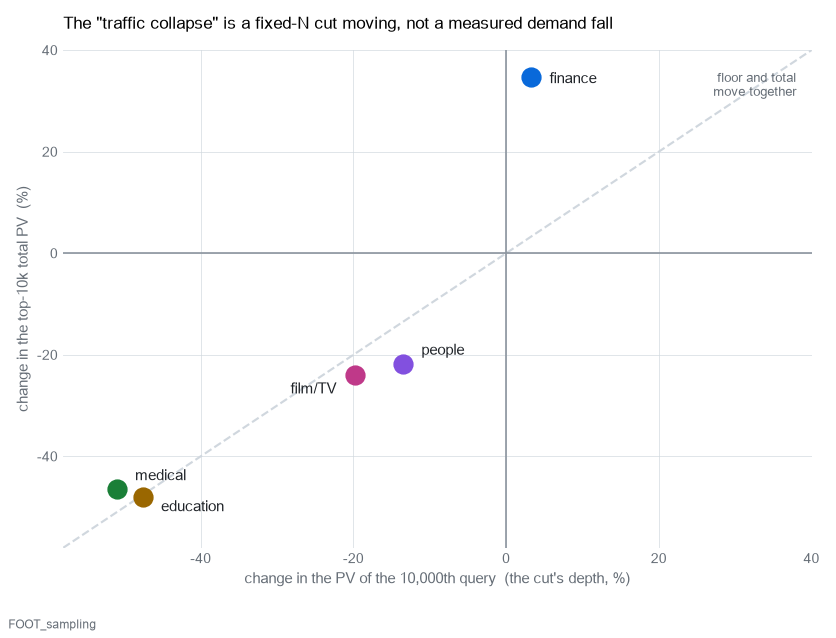
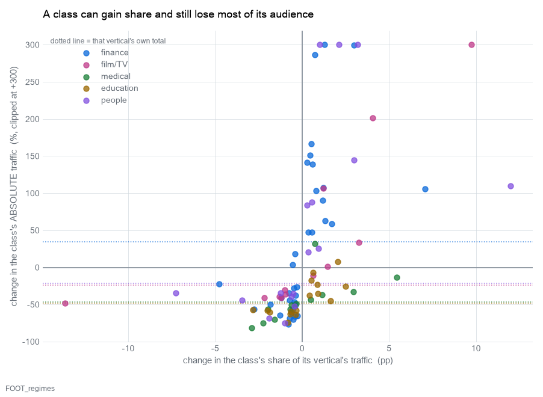
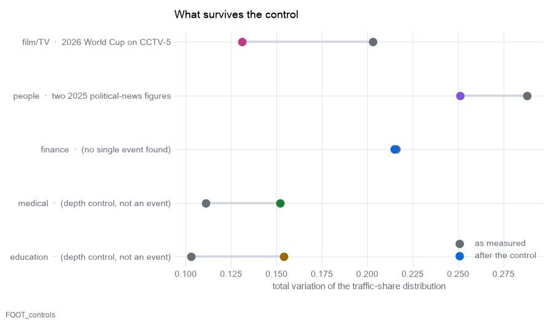

# What changed in five Chinese search verticals, 2025-07-01 → 2026-07-01

> 中文版：[`DRIFT_ANALYSIS.zh.md`](DRIFT_ANALYSIS.zh.md)

An analysis of the pooled two-snapshot runs. The per-domain mechanical reports are
`runs/{fin,film,med,edu,ppl}-pool/gen02/快照对比_漂移分析.md`; this document is the
cross-domain reading of them, plus the external context that explains what it can.

**Provenance.** Every internal number here is computed by `src/qmine/ops/drift.py`
from artifacts on disk and is reproducible with `tools/backfill_drift.py`. Nothing
was re-run and no model was asked to produce a figure. External claims are marked
by how well they are verified: **[verified]** means I checked the primary source
myself, **[researched]** means an agent found and cited it, **[unverified]** means
it is a plausible mechanism with no source I could confirm.

---

## Summary

Five verticals, ~20,000 pooled queries each, the same two dates one year apart.

0. **Each snapshot is one day, and the export is a census, not a sample.** Both facts
   were tested rather than assumed, and together they turn the central caveat into a
   measurement: among queries clearing a fixed page-view bar — a population fully
   observed in both years — traffic fell **59.8%** in medical and **61.5%** in
   education, rose **35.5%** in finance, and the *count* of qualifying queries more
   than halved in medical and education.
1. **The largest single "finding" in the corpus is a football tournament.** 2026-07-01
   fell inside the World Cup Round of 32, live on CCTV-5. Eight of the top twelve
   film/TV queries that day are cctv5 stream lookups, and it carries about a third of
   that vertical's entire measured drift.
2. **Two of the five verticals did not change composition — they shrank.** In medical
   and education essentially no class grew in absolute traffic. Every "riser" is a
   class that fell more slowly than the vertical did.
3. **On AI: the substitution story is refuted, the complexity story is refuted in
   four verticals and weakly supported in the fifth** — medical, where queries did get
   longer and more question-like. The scope limit is decisive rather than
   decorative: a conversational query has a page-view count near 1 and therefore
   *cannot appear* in a top-10,000-by-views cut in either year.
4. **Finance is the exception on every axis** — the only vertical to grow and the only
   one whose floor rose — against a documented retail trading boom. But its growth is
   **intensity, not breadth**: the same queries got busier.
5. **The people vertical shows a real change in phrasing** — bare names giving way to
   explicit profile requests — that survives every control and gets stronger under
   them.
6. **Medical and education are ~95% unexplained, and that is the finding.** Every
   identified cause covers 3% and 7% of their declines respectively; the documented
   platform-wide contraction (−12%) is a quarter of what is needed. By contrast
   film/TV is *fully* accounted for and people 79%. The gap is flagged rather than
   narrated over, and one number would close it.

---

## Before any number: three traps

These are not caveats appended at the end. Each one changes the sign or the meaning
of a headline figure, and two of them nearly made this analysis wrong.

### 0. Each snapshot is ONE DAY, and that was tested, not assumed

`event_day` holds a single value per file — `20250701`, `20260701` — but that is a
column name, and both fall on the first of a month, which is also how a *monthly*
partition is conventionally labelled. Two independent content tests settle it:

- **The admissions cycle.** Chinese gaokao admissions run in a known order: results
  ~23–26 June → applications late June/early July → **投档 (file transfer) mid-July**
  → **录取通知书 (admission letters) late July**. In both education files the early
  stages are present in force (分数线 366 queries / 696k PV) and the mid and late
  stages are **absent**: 投档 = **0 queries**, 录取通知书 = 4, 开学/报到 = **0**. A
  whole-of-July aggregate must contain them.
- **The World Cup.** The 2026 tournament ran 11 June – 19 July. A July-2026 file would
  span the Round of 32 through the **Final on 19 July**. Queries for 决赛 (final),
  半决赛, 冠军, 八强 and 16强 are **all zero**, and every cctv5 query is a watch-now
  string (`在线直播`, `正在直播`).

So each file is a single day, and **"total traffic" below means the sum over every
query in that vertical on that one day** — 2025-07-01 or 2026-07-01 — not a month.

### 1. Each snapshot is a fixed-N cut, and the cut moved

Each file is the **top 10,000 queries by page views** for that vertical on that day —
verified: rows are sorted by PV descending and stop at a hard floor. The floor is not
the same in both years.

| vertical | PV of the 10,000th query | top-10k total PV |
|---|---|---|
| finance | 153 → **158** (+3%) | 8.09M → **10.90M** (+35%) |
| film/TV | 354 → 284 (−20%) | 16.45M → 12.50M (−24%) |
| medical | 339 → 166 (**−51%**) | 9.74M → 5.21M (−47%) |
| education | 910 → 477 (**−48%**) | 28.50M → 14.80M (−48%) |
| people | 207 → 179 (−14%) | 9.97M → 7.79M (−22%) |

<picture>
  <source media="(prefers-color-scheme: dark)" srcset="img/fig_drift_sampling_dark.png">
  
</picture>

Floor and total move almost in lockstep — education −47.6% against −48.1%. Read as a
"total", that number mixes a change in traffic with a change in where the boundary
sits, so **"medical search fell 47%" is not what was measured.**

**But the cut is better than a sample, and this is the key to the whole problem.** A
top-10,000-by-page-views export is not a sample of the vertical: it is a **complete
census of every query at or above its floor**. So for any threshold T at or above both
years' floors, the population {queries with PV ≥ T} is *fully observed in both years*,
and comparing it needs no model, no extrapolation, and no assumption about how many
queries exist. That comparison is a measurement:

| vertical | T (PV) | queries ≥ T | traffic ≥ T |
|---|---:|---|---|
| finance | 158 | 9,687 → **10,000+** (+3.2%, censored) | 8.04M → 10.90M (**+35.5%**) |
| film/TV | 354 | 10,000 → 7,887 (−21.1%) | 16.45M → 11.83M (**−28.1%**) |
| people | 207 | 10,000 → 8,523 (−14.8%) | 9.97M → 7.51M (**−24.6%**) |
| medical | 339 | 10,000 → 4,412 (−55.9%) | 9.74M → 3.92M (**−59.8%**) |
| education | 910 | 10,000 → 3,978 (−60.2%) | 28.50M → 10.96M (**−61.5%**) |

These are exact. Note the second column especially: it is not a share but a **count of
distinct queries clearing an absolute bar**, and in medical and education that count
more than halved.

**What remains unknown is only the region below T** — and it can be bounded. For a
decline to be pure redistribution rather than a fall in demand, the sub-threshold tail
must have absorbed exactly the traffic the band lost. Since every hidden query carries
less than T by definition, that sets a hard minimum on how many *new* sub-threshold
queries the explanation needs:

| vertical | traffic lost in the band | minimum new sub-T queries required |
|---|---:|---:|
| education | 17.54M | **19,276** |
| medical | 5.82M | **17,166** |
| film/TV | 4.62M | **13,056** |
| people | 2.46M | **11,863** |

And that is the most generous case — every new query sitting exactly at the bar. If
they average a tenth of it, ten times as many are needed. For scale, each vertical's
entire observed above-bar population is 4,000–10,000 queries. Dispersion is therefore
**not excluded, but it is not free**: it requires a specifically shaped expansion of
the near-threshold tail, of a size comparable to or larger than the whole observed
head.

**How large is the background?** Two independent external series bracket it. Baidu's
own SEC filings say it directly **[verified — I read both 6-Ks]**: *"In June 2025,
Baidu App's MAUs reached 735 million"* and *"Baidu App's MAUs reached 644 million in
June 2026"* — **−12.4%** over exactly this window. (The same filings show online
marketing revenue already falling 15% year on year in Q2 2025, and Q2 2026 total
revenue down 4%.) CNNIC separately reports search-engine users 877.82m → 782.06m,
**−10.9%**, penetration 79.2% → 69.5% **[researched]**. So a platform-wide contraction of roughly **11–12%** is real and
documented. Medical (−47%) and education (−48%) are **four times** that, and finance
rose. Whatever moved those two verticals is specific to them, not the industry
weather.

Finance is the informative exception: its floor rose 3% while its total rose 35%. A
pure rescaling would move both by the same factor. The 32-point divergence means new
traffic arrived **above** the floor — the head got heavier, which is what genuine new
demand looks like.

### 2. A share can rise while the audience falls

The drift reports use within-snapshot shares, which is correct — raw counts would
report every class as declining when the base moved. But a share is a ratio, and in a
vertical that lost 47% of its measured traffic, a class can gain share while losing a
third of its readers.

<picture>
  <source media="(prefers-color-scheme: dark)" srcset="img/fig_drift_regimes_dark.png">
  
</picture>

| vertical | class | Δ share | Δ absolute traffic |
|---|---|---:|---:|
| medical | 药品功效与副作用查询 | **+5.44pp** | **−14%** |
| medical | 查询功效与作用 | +2.96pp | −32% |
| education | 汉字读音与拼音查询 | +2.50pp | −25% |
| finance | 查询个股股票信息 | +7.08pp | **+105%** |
| people | 查询人物个人资料简介 | +12.00pp | **+110%** |

"Drug efficacy and side-effect queries are growing" is false as stated. That class
lost 14% of its traffic while its vertical lost 47%.

### 3. The two cuts reach different depths, and that alone can flip a finding

Because the 2026 cut goes deeper, classes that live further down the distribution
gain share for free. Truncating both years at the higher floor removes the effect.

| vertical | drift as measured | drift at a common floor |
|---|---:|---:|
| finance | 0.216 | 0.215 |
| film/TV | 0.203 | 0.207 |
| people | 0.288 | 0.286 |
| **medical** | 0.111 | **0.152** |
| **education** | 0.103 | **0.154** |

Finance, film/TV and people are robust. Medical and education are not — their drift
is *understated* by 40–50% in the raw cut. And education's headline reverses:

- 高等院校信息查询 (university information): **−2.82pp → +0.85pp**
- 中国大学排名及层次查询 (university rankings): +1.64pp → **+8.71pp**

The apparent decline in university queries was a sampling artifact. Caveat on the
control: at a common floor only 3,978 of education's 2026 rows survive, so the two
sides are no longer equal-sized.

---

## What the data rules out

### Two different AI hypotheses, which predict opposite things

These get conflated, and they must not be, because the corpus answers them
differently:

- **H1 — complexity.** AI answers train users to type longer, more conversational
  queries. *Predicts: length up, question-form up.*
- **H2 — substitution.** AI answers absorb question-shaped demand, so those queries
  leave search. *Predicts: question-form down, and down most in the classes that are
  most question-shaped.*

**H2 is not supported anywhere in this corpus. H1 is refuted in four verticals and
weakly supported in the fifth.** Three depth-controlled measurements:

**Length did not rise.** Traffic-weighted mean query length *fell* in finance (−0.52
chars), film/TV (−0.44) and education (−0.16), and rose only in medical (+0.56) and
people (+1.16). Median length is unchanged in four of five.

**Question-form share did not rise.** It fell in all five verticals. But the
decomposition matters more than the aggregate — splitting each vertical's change into
behaviour *inside* classes and a change in the *mix* of classes:

| vertical | total Δ | within-class (behaviour) | between-class (mix) |
|---|---:|---:|---:|
| finance | −5.78pp | **−0.24** | **−6.01** |
| medical | +0.56pp | **+1.46** | −0.91 |
| people | −0.95pp | −0.45 | −0.62 |
| education | +1.64pp | −0.72 | **+2.87** |
| film/TV | −0.44pp | −0.47 | +0.12 |

Finance's dramatic −5.78pp is almost entirely mix: price-lookup intents grew,
customer-service intents shrank. Within-class behaviour barely moved (−0.24pp). There
is no consistent within-intent retreat from question phrasing anywhere in this corpus
— which is the direct refutation of **H2**.

**The one signal pointing the other way, stated plainly.** Medical is the exception on
both measurements that bear on **H1**: its traffic-weighted length *rose* (+0.56 at a
common floor, +0.49 raw — it rises in both cuts, so it is not a depth artifact), and
its within-class question share *rose* (+1.46pp). It is also by far the most
question-shaped vertical to begin with (~40% against 1–15% elsewhere). This is the
only measurement in the dataset consistent with H1, and unlike the people vertical's
lengthening it has no control on it that explains it away. It should be treated as
the open lead, not filed under "hypothesis refuted".

**The sharpest test fails.** If AI answers absorb question-shaped demand, then within
a vertical the more question-like a class is, the more share it should lose. Spearman
correlation between class question-share and class share-change:

| vertical | ρ | p | classes |
|---|---:|---:|---:|
| finance | −0.271 | 0.054 | 51 |
| medical | −0.136 | 0.535 | 23 |
| film/TV | +0.035 | 0.914 | 12 |
| education | +0.120 | 0.551 | 27 |
| people | +0.260 | 0.298 | 18 |

No vertical shows the relationship. Finance leans that way and is not significant at
0.05.

**Why the scope limit is decisive, not a formality.** A long conversational query is
close to unique and therefore carries a page-view count near 1. **It cannot enter a
top-10,000-by-page-views cut in either year.** This corpus is structurally incapable
of containing the queries H1 predicts, so its silence on them is not evidence. The
falling PV floors are *consistent* with traffic leaving the head; they simply carry no
signature of it leaving selectively by question-shape. The honest verdict: **H2 is
refuted in the head; H1 is refuted in the head of four verticals, weakly supported in
medical, and untestable in the tail where it would actually live.**

### Four more explanations the evidence contradicts

- **Query-suggestion reshuffling inflating the drift.** Collapsing token-reordered
  synonyms into single clusters and recomputing leaves total variation unchanged to
  four decimal places in all five verticals. Reordering explains none of the drift.
  (It does not test *suffix acquisition*, which is the people vertical's pattern.)
- **限韩令 easing driving the Korean-content rise.** The reported opening predates the
  2025 baseline; every top query in that class is unlicensed free streaming, the wrong
  channel for a licensing change; and the class's single largest query is
  `爱情契约泰剧免费观看` — a **Thai** drama.
- **One blockbuster driving the streaming collapse.** 哪吒2 is bounded at ≤0.83pp of
  the −13.62pp and sits in a different class. The decline's HHI of 0.004 across 6,201
  queries rules out any single title.
- **Short drama (微短剧) displacing long-form.** No 短剧 class exists in either
  taxonomy, and at a matched floor 短剧 rows *fall* 158 → 34.

### The people vertical did not become conversational either

Its queries genuinely lengthened (median +1 char, weighted +1.16) — the only vertical
where that happened. But the mechanism is templating, not conversation:

| marker | 2025 | 2026 | Δ |
|---|---:|---:|---:|
| 资料 (profile) | 6.35% | 18.03% | **+11.68pp** |
| 简介 (brief) | 5.97% | 16.73% | **+10.76pp** |
| 个人资料 | 5.70% | 13.69% | +7.99pp |
| 是谁 (*who is*) | 1.00% | 0.92% | −0.08pp |
| bare short name | 70.1% | 50.8% | **−19.4pp** |

The interrogative form did not move at all. People went from typing a name to typing
a name plus a profile keyword.

---

## Two regimes

The five verticals do not tell one story. They tell two.

**Regime A — real composition change.** finance, film/TV and people each contain
classes that grew in *absolute* traffic: +105% and +300% (finance), +554% and +201%
(film/TV), +110% and +1238% (people). Their drift survives the depth control almost
unchanged. Something genuinely moved.

**Regime B — uniform contraction.** In medical and education, essentially no class
grew absolutely. The one exception is education's 生肖谜语答案查询 at +8%. Every other
"riser" fell more slowly than its vertical. Their drift is also the most sensitive to
sampling depth. The honest description is not "composition changed" but "the measured
head shrank by half and some classes shrank slightly less".

The split lines up exactly with the sampling picture: the two verticals whose floors
collapsed (−51%, −48%) are the two where nothing grew.

<picture>
  <source media="(prefers-color-scheme: dark)" srcset="img/fig_drift_controls_dark.png">
  
</picture>

---

## By vertical

### 影视 film/TV — a third of the drift is one football tournament

**What moved.** Free full-episode streaming lookups −13.62pp; live-TV channel viewing
+9.72pp; Korean film and drama +4.06pp. Query overlap between years is the lowest of
the five at **0.166** — only 17% of distinct queries recur.

**Why.** The 2026 FIFA World Cup ran 11 June – 19 July 2026, and its **Round of 32
was 28 June – 3 July** — so 2026-07-01 was a match day **[verified]**. CCTV
announced in May 2026 that it holds the rights, with **CCTV-5 broadcasting 92 of the
104 matches live** **[verified]**. In the corpus: cctv5 queries went 58 → 185 and
their traffic 161,579 → 1,343,195 PV (**8.3×**); 世界杯 appears in 2026 only; and
**eight of the top twelve** film/TV queries on 2026-07-01 are cctv5 stream lookups,
against a 2025 top eight that is entirely TV dramas (以法之名, 逆爱, 书卷一梦…).

**A prediction that could have failed and did not.** If this were a general shift
toward live television, every CCTV channel would rise. It is confined to the channels
that carried the tournament: **CCTV-5 (sport) +719%**, CCTV-1 (general, which also
carried matches) +156%, while **CCTV-6 (film) −31%** and **CCTV-8 (drama) −72%**.

**How much it explains.** Removing live-TV and World Cup queries from *both* years
drops the vertical's drift from **0.203 to 0.131** — about a third of it was the
tournament. But **−10.12pp of the streaming decline survives**, so that decline is
real and mostly independent. And two classes get *larger* once the World Cup is
removed — Korean content +4.06 → **+4.82pp**, general drama +3.26 → **+4.26pp** —
they were being masked by it.

**One caveat on the attribution.** The 2025 baseline is not football-free: the 2025
Club World Cup Round of 16 ran 28 June – 1 July 2025, and the class has 109 rows in
2025. If CCTV carried any of it, this is a difference between two football days
rather than football versus none. Only ~0.5% of 2026 CCTV-5 traffic names 世界杯
explicitly, so the attribution rests on the verified broadcast schedule, not on the
query strings.

**Residual.** The streaming decline is spread over 6,201 distinct queries (HHI 0.004),
so it is title-cohort turnover, not one title: the 2025 head is specific dramas that
aged out. Whether the category is structurally shrinking, or 2025 simply had an
unusually strong drama slate, two snapshots cannot say.

### 金融 finance — the only vertical with unambiguous new demand

**What moved.** Individual-stock lookups +7.08pp (+105% absolute, spread over 2,184
distinct queries, HHI 0.005); tech-company stock lookups +2.98pp (+300%); FX
−4.77pp; bank customer-service phone numbers −2.76pp (−56%).

**Why.** Gold dominates this vertical in both years and grew hard: 今日金价 500,270 →
805,760 PV, 黄金价格 204,039 → 370,477, and gold-price queries together roughly +65%.

The external picture is unusually well documented. The Ministry of Finance's own
statistics page states it **[verified — I read the source]**: 「证券交易印花税1549亿元，
同比增长97.3%」 — H1 2026 securities transaction stamp duty ¥154.9bn, **+97.3% year on
year**. A tax receipt is a direct measure of trading volume, not a narrative.
Further **[researched]**: H1 2026 new A-share accounts were 20.16m, about +60%,
with June alone +74% (CSDC via 证券时报); H1 turnover roughly doubled; and the margin
balance passed ¥3tn for the first time on 2026-06-23, eight days before the snapshot.
Matched trading days: 2025-07-01 combined turnover ¥1,466bn against ~¥3,660bn on
2026-07-01, **2.5×**.

**But the growth is intensity, not breadth — and this corrects an intuition.** The
+7.08pp is spread thinly across the *delta* (HHI 0.005), which invites the reading
that many new tickers arrived. Measured at a common floor, distinct queries rose only
**+3.2%** while PV per query rose **+31.3%**. The same queries got busier; the head
got heavier, not wider. So this is existing participants searching more, not
straightforwardly a wave of new ones.

Two things the account-opening story cannot cover: several top risers — 英伟达
(NVIDIA), 闪迪, 美光科技, 康宁 — are **US-listed**, which a domestic brokerage account
cannot buy, so a global AI-semiconductor attention story predicts the same signature;
and a finance-vertical routing change or a new quote card would also produce it.

**Why it matters methodologically.** Finance is the only vertical whose floor rose,
and its floor rose far less than its total. That divergence is the cleanest evidence
in the whole corpus that at least one vertical saw genuine new demand rather than a
moving measurement.

**Residual.** The −2.76pp in bank customer-service numbers (−56% absolute) is
consistent with that task moving into banking apps, but nothing here tests it.

### 人物 people — a real change in how people phrase person searches

**What moved.** Explicit profile requests +12.00pp (+110% absolute); bare-name lookups
−7.25pp; proper-noun lookups −3.45pp. Largest composition drift of the five
(TV 0.288, Cramér's V 0.339).

**Why.** Not news, and not conversation. Two 2025 political-news figures carried a
remarkable share of that snapshot — 陈小江 **11.19%** of all 2025 people traffic (82
queries, 1,115,341 PV) and 马兴瑞 **5.74%** — and both had essentially vanished by
2026. Removing them and the 2026 medal cuts only **13%** of the drift (0.288 →
0.251), and the core shift gets *stronger*: bare-name lookups go from −7.25pp to
**−9.47pp**. So the phrasing change is structural.

One candidate mechanism has direct corpus support: Baidu appears to have shipped a
fan-engagement mechanic attached to person entity cards. 送花 ("send flowers") queries
go from 12 queries / 11,849 PV to **217 queries / 148,638 PV** **[researched,
corpus-confirmed]**. A platform surface that rewards navigating to a person's card
would plausibly also push phrasing toward explicit profile requests. The related
claim about an 影响力榜 leaderboard is **not supported** — that string appears in
neither snapshot.

**Residual.** Whether the templating is driven by that product, by a suggestion/
autocomplete change, or by content-supply effects is not settled by this data.

### 医疗 medical — the head halved and nothing grew

**What moved (share).** Drug efficacy and side effects +5.44pp; general efficacy
+2.96pp; drug-name lookups −2.91pp; symptom queries −2.23pp; lab-result interpretation
−1.96pp. At a common floor the same pattern is stronger (+6.03, +4.58, −3.35, −2.48,
−2.67).

**What moved (absolute).** Everything fell. +5.44pp is −14%; −2.91pp is −81%; symptom
queries −75%. The vertical's measured head fell 47%.

**Why, partly.** The single largest negative delta in the entire medical corpus is
**荔枝** (lychee): 50 queries / 79,549 PV → 3 queries / 1,859 PV, **−77,690 PV**. The
2025 top query was 荔枝的功效作用与主治. A seasonal-fruit-efficacy cohort simply is not
there in 2026 **[researched: a 2026 lychee crop failure; corpus-confirmed as a large
negative, cause unverified]**. A newly approved drug appears in 2026 only (昂伟达,
6 queries / 9,018 PV) **[researched, corpus-confirmed]**.

**The interesting pattern, stated carefully.** The two classes that fell most in share
are the two most purely explanatory — lab-value interpretation and symptom questions —
while drug-specific lookups held up best. That is the shape AI substitution would
produce, and it is the best circumstantial case in the corpus for it. It is *not*
proof: everything fell, so this is a ranking of decline rates, and the direct test
(question-share correlation, ρ = −0.136, p = 0.535) does not support it.

### 教育 education — a calendar, a collapse, and a vertical that is partly not education

**What moved.** Raw: university information −2.82pp, vocational colleges −1.85pp,
character pronunciation +2.50pp, zodiac riddles +2.03pp. **Depth-controlled the
picture changes**: university information +0.85pp, and the real riser is university
*rankings* at **+8.71pp**.

**Two things are going on.**

*The admissions calendar — ruled out arithmetically, whatever the dates were.* Both
snapshots sit just after the gaokao, inside the results-and-applications window, and
admission markers did collapse far faster than the vertical: 分数线 −76% in PV, 录取
−75%, 高考 −55%, 志愿 −64%, against −48%. That is suggestive, and the obvious next
step is to check whether the window moved between years.

It does not matter. **Admission-related queries are only 6.4% of 2025 education
traffic and account for 8.6% of the decline. Had they gone to zero, the vertical
would still have fallen 46.9%** against its actual 48.1%. No shift in the exam
calendar — of any size, in any direction — can produce this collapse, so the dates do
not need resolving to close the question.

(Independently, agent research reports the Beijing, Jiangsu and Shanghai application
windows as identical in both years **[researched]**; I verified the 2025 Beijing start
of 27 June directly but could not reach the 2026 provincial pages. The arithmetic
above makes that verification unnecessary.)

*So education's −48% has no established cause.* This is the largest unexplained fact
in the dataset and is labelled as such here. The candidate explanations are all far
too small: the school-age cohort declined ~3.4% (14× too small), and the best
window-matched platform benchmark is −12.4% (4× too small). Nothing external accounts
for the gap.

*Part of this vertical is not education.* The top education query on 2026-07-01 is
**斗方名士打一肖** (73k PV) — a 生肖 lottery riddle — followed by 一枝之栖是何肖 (35k).
In 2025 the top query was 翻译. Zodiac-riddle queries are the only class here that
grew absolutely (+8%). And it goes further: 杂项短查询处理 is 1,680 rows of strings like
`a`, `shine`, `jm`, and the top riser inside 汉字读音与拼音查询 is 拼豆图纸 — a
perler-bead craft query. Medical has the same problem: the top query of
医药企业信息查询 is **太极实业**, a listed industrial company. Part of what is being
measured is not the vertical it is filed under, and that is a data-routing issue
rather than a behaviour change.

**A worked example of trap 2.** 拼音 queries gained 1.43pp of rows while their
absolute traffic *fell* (0.32M → 0.27M PV). The share rose because the denominator
halved.

---

## Calendar and event effects, quantified

Both snapshots are 1 July. Year-over-year on a fixed date is the crudest possible
seasonal control, and three dated events land inside it:

| event | vertical | corpus evidence | share of that vertical's drift |
|---|---|---|---|
| 2026 World Cup Round of 32 on CCTV-5 **[verified]** | film/TV | cctv5 PV 8.3×; 8 of top 12 queries | **~35%** (TV 0.203 → 0.131) |
| 七一勋章 (July 1 Medal), a quinquennial award **[researched]** | people | **0 queries in 2025**, 74 / 177,875 PV in 2026 | part of the 13% news block |
| two 2025 political-news figures | people | 陈小江 11.19% + 马兴瑞 5.74% of the 2025 snapshot | **13%** (TV 0.288 → 0.251) |

The gaokao results window is a fourth candidate and the least resolved.

---

## Is it demand, or is it dispersion? What the shape says

Inside the census band — where both years are complete and describe the same
population — the distribution's shape is comparable like-for-like. Dispersion that
moves traffic from the head toward the bar should *flatten* it; a uniform fall should
leave it alone.

| vertical | Gini (band) | top-1% share | reading |
|---|---:|---:|---|
| finance | 0.660 → 0.711 (**+0.051**) | 34.8% → 38.4% (+3.6pp) | head concentrated **further** |
| people | 0.628 → 0.586 (−0.042) | 32.0% → 26.5% (−5.4pp) | mild flattening |
| medical | 0.426 → 0.396 (−0.030) | 9.0% → 8.4% (−0.6pp) | mild flattening |
| education | 0.482 → 0.457 (−0.025) | 10.2% → 8.5% (−1.7pp) | mild flattening |
| film/TV | 0.608 → 0.587 (−0.021) | 28.0% → 24.1% (−3.9pp) | mild flattening |

All four declining verticals flattened mildly, which is the direction dispersion
predicts — though the magnitudes are small (Gini shifts of 0.02–0.04) and a uniform
fall plus a little head churn produces the same. Finance moved the other way on both
measures while growing, which is what genuine new demand looks like and is
inconsistent with redistribution.

**A method that did not work, reported rather than buried.** I tried to close the
question parametrically: fit the rank–PV curve, extrapolate past rank 10,000, and
estimate the vertical's total. It does not survive its own diagnostic. The curve is
**not a single power law** — the fitted exponent drifts systematically with rank in
every vertical (medical 0.339 → 0.765 from ranks 10–100 to 1,000–10,000; education
0.300 → 0.764), so the tail is steepening and no single exponent describes both ends.
Two defensible fitting choices gave contradictory answers for finance (sign
undetermined versus growth robust), which is the signature of an unstable method
rather than a result. The census framing above needs none of it.

---

## How much is actually explained

The honest accounting. For each vertical that lost traffic, how much of the decline
the identified causes cover — measured, not asserted:

| vertical | PV decline | identified cause | covered | **unexplained** |
|---|---:|---|---:|---:|
| film/TV | 3.95M | the 2025 drama cohort ageing out (以法之名, 逆爱, 书卷一梦, 桃花映江山, 锦绣芳华) | **103%** | **~0%** |
| people | 2.17M | two 2025 political-news figures | **79%** | **21%** |
| medical | 4.53M | lychee/summer-fruit efficacy 2.4%, cold-and-flu drug names 1.0% | **3%** | **97%** |
| education | 13.70M | the admission cycle | **7%** | **93%** |

Film/TV is *fully* accounted for — the five named 2025 dramas alone lost more traffic
than the vertical did net, because other classes grew to partly offset them. That
vertical did not lose demand; a specific hit cohort aged out and a World Cup landed on
the replacement date. People is mostly accounted for by two news stories.

**Medical and education are ~95% unexplained**, and no external series comes close to
covering the gap: the documented platform-wide contraction is 11–12%, against 47% and
48%. This is the same split as everything else in this report — the two verticals
whose PV floors collapsed are the two where nothing grew absolutely and nothing
identified explains the fall. What the census framing adds is that the fall itself is
**not in doubt at the observed level**: among queries clearing an absolute bar, medical
lost 59.8% of its traffic and 55.9% of its qualifying queries, education 61.5% and
60.2%. Those are measurements. What is undetermined is whether the vertical's *total*
fell as far, and the mild flattening in both is consistent with some of it being
redistribution into the tail — but redistribution alone would need on the order of
17,000–19,000 new near-threshold queries per vertical to account for it. **One number
still decides it**: total page views over every query in the vertical on each of the
two days.

---

## What would settle the open questions

Ranked by how much they would change the conclusions, and all cheap:

1. **Total PV across all queries in each vertical, both days.** One number per
   vertical per snapshot. It yields the top-10k's share of the whole and settles
   level-versus-redistribution outright. Everything else on this list is a substitute
   for it.
2. **A far deeper cut — top 1,000,000 instead of top 10,000.** Traces the whole
   concentration curve rather than one point of it, and would make the complexity
   hypothesis testable for the first time, because a conversational query with PV ≈ 1
   can finally appear.
3. **What `wise_pv` counts** — impressions or clicks — plus any logging or
   vertical-routing change over the window. The cheapest item here and untried. Note
   the corpus records **no platform at all**: run manifests, data audits and file
   metadata carry no source field, though the column is named `wise_pv` and
   Baidu-specific mechanics (`百度送花`) appear in the data.
4. **A control vertical with externally known-stable demand**, cut identically. If it
   also falls ~48%, the cause is mechanical rather than behavioural.
5. **Distinct-query counts, or sessions/users per vertical per day.** Measures
   dispersion directly and separates "fewer people" from "fewer queries each".
6. **More than two dates — a weekly series.** Both snapshot days turn out to be
   event-contaminated, and n = 2 supplies no variance estimate, so every magnitude in
   this report is a point with no error bar.

---

## What to do with this, and what not to conclude

**Do:** treat within-snapshot shares as the composition measure and always read the
absolute alongside them; expect a fixed-N export to move its own floor and check that
before reading anything into a total; pool snapshots into one run so one taxonomy
labels both periods, because two runs of this pipeline on identical rows delivered 12
and then 34 leaves; and check the calendar before believing any July-to-July finding.

**Do not conclude:** that search demand in these verticals fell by the percentages
above — those are the top-10k's totals, and the boundary moved between years; the
defensible version is the census band, where medical fell 59.8% and education 61.5%
among queries clearing a fixed bar; that drug-efficacy or pronunciation queries are growing (they shrank
more slowly); that users are asking longer or more conversational questions (they are
not, in the head — and the tail is untested); that live TV is displacing streaming
(that was a World Cup, and it is confined to the channels that carried it); or that
the education decline is an exam-calendar artifact (the application windows were
identical in both years).

**The one finding I would act on** is the people vertical's phrasing shift: an
11.7-point move from bare names to explicit profile requests, robust to every control
applied, with a candidate platform mechanism visible in the corpus. It changes what a
person-search result page should be optimised for.
