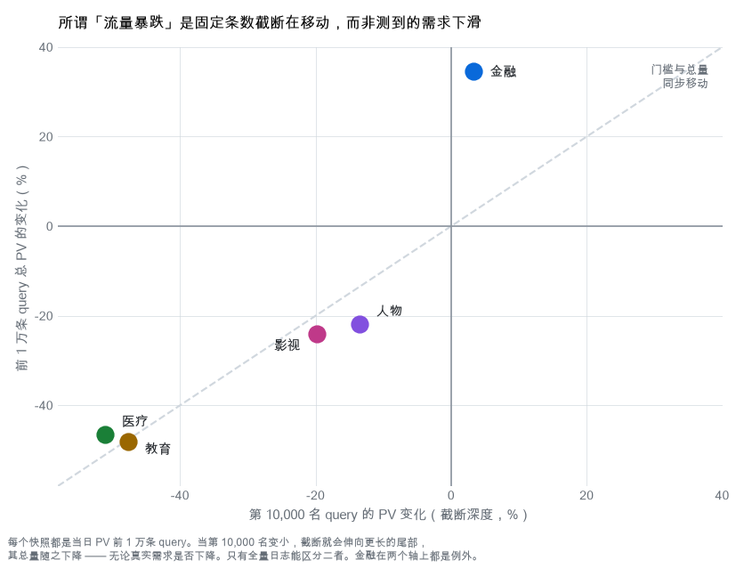
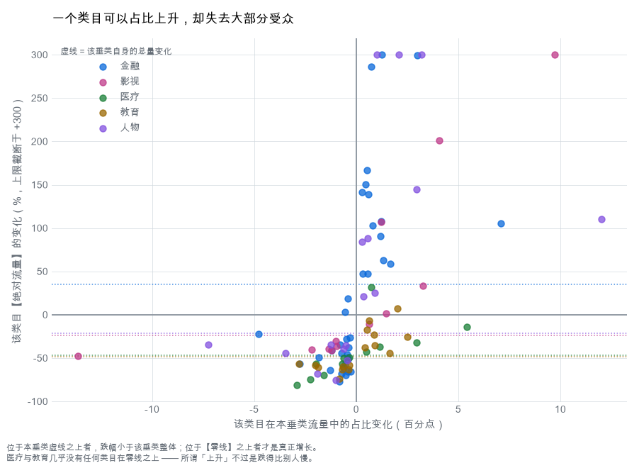
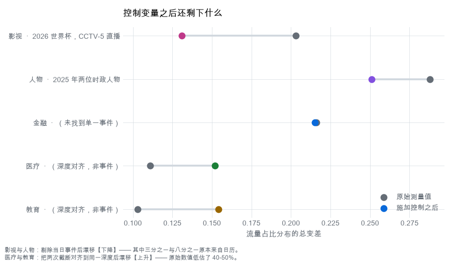

# 五个中文搜索垂类的变化：2025-07-01 → 2026-07-01

> English version: [`DRIFT_ANALYSIS.md`](DRIFT_ANALYSIS.md)

本文是对合并双快照运行结果的跨垂类解读。各垂类的机器生成报告在
`runs/{fin,film,med,edu,ppl}-pool/gen02/快照对比_漂移分析.md`；本文在它们之上做横向
比较，并补充能够解释的外部背景。

**数据来源。** 本文所有内部数字都由 `src/qmine/ops/drift.py` 从磁盘上的产物算出，
可用 `tools/backfill_drift.py` 复现。没有重新跑过任何一次运行，也没有让任何模型生成
过一个数字。外部结论按核实程度标注：**[已核实]** 表示我本人查阅了一手来源，
**[已检索]** 表示由 agent 检索并给出出处，**[未核实]** 表示机制合理但我找不到可确认
的来源。

---

## 摘要

五个垂类，各约 20,000 条合并后的 query，两个相隔整一年的同一日期。

0. **每个快照是「一天」，而且这份导出是普查而非抽样。** 这两点都是**验证过的，不是
   假设的**；两者合在一起，把本文最大的一条保留意见变成了一次测量：在**跨过固定 PV
   门槛**的那部分 query 里（这部分在两年中都被完整观测到），医疗流量下降
   **59.8%**、教育下降 **61.5%**、金融上升 **35.5%**，而达标 query 的**条数**在医疗
   与教育都减少了一半以上。
1. **本语料里最大的单条「发现」其实是一场足球赛事。** 2026-07-01 正处在世界杯 32 强
   淘汰赛期间，由 CCTV-5 直播。当天影视垂类 PV 前十二的 query 里有八条是 cctv5 的
   直播入口，它单独就占了该垂类全部实测漂移的约三分之一。
2. **五个垂类里有两个并没有发生结构变化 —— 它们只是萎缩了。** 医疗与教育里几乎没有
   任何类目在**绝对流量**上增长。所有「上升」的类目，不过是跌得比垂类整体慢而已。
3. **关于 AI：替代假说被证伪，复杂化假说在四个垂类被证伪、在第五个垂类得到弱支持**
   —— 那就是医疗，它的 query 确实变长了，也更像提问了。这里的适用范围限制是决定性
   的，而非装饰性的：一条口语化长 query 的 PV 接近 1，因此它**在任何一年都不可能进
   入 PV 前一万的截断**。
4. **金融在每一个维度上都是例外** —— 唯一增长的垂类，也是唯一门槛值上升的垂类，背后
   有据可查的散户交易热潮。但它的增长是**强度而非广度**：是同一批 query 变得更忙。
5. **人物垂类出现了真实的表述方式变化** —— 从光秃秃的人名转向明确的「个人资料」式
   请求 —— 它经受住了每一项控制变量，而且在控制之后反而更明显。
6. **医疗与教育各有约 95% 的下降无法解释，这本身就是结论。** 已识别的原因分别只能
   覆盖它们跌幅的 3% 与 7%；有据可查的全平台收缩（−12%）只有所需量级的四分之一。
   相比之下影视被**完全**解释，人物被解释了 79%。这个缺口在此被标记出来，而不是用
   叙述掩盖过去 —— 而只要一个数字就能填上它。

---

## 在看任何数字之前：三个陷阱

这不是附在文末的免责声明。下面每一条都会改变某个头条数字的**正负号或含义**，其中两条
差一点就让整篇分析出错。

### 0. 每个快照是「一天」—— 这是验证出来的，不是假设的

`event_day` 在每个文件里只有一个值（`20250701`、`20260701`），但那只是一个列名；而且
两者都落在某月的 1 号，而「月分区」在工程实践里恰恰就是用当月 1 号来标注的。两项相互
独立的内容检验可以定论：

- **高考录取周期。** 中国高考录取有确定的先后顺序：出分约 6/23–26 → 志愿填报在 6 月底
  至 7 月初 → **投档在 7 月中** → **录取通知书在 7 月下旬**。两个教育文件里，靠前的
  阶段大量存在（分数线 366 条 query / 69.6 万 PV），而中后段**完全缺席**：投档 =
  **0 条**、录取通知书 = 4 条、开学/报到 = **0 条**。若真是整月汇总，这些必然会出现。
- **世界杯。** 2026 年赛事从 6 月 11 日打到 7 月 19 日。一个「2026 年 7 月」的文件会
  横跨 32 强直到 **7 月 19 日的决赛**。而「决赛」「半决赛」「冠军」「八强」「16 强」
  的 query 数**全为 0**，并且每一条 cctv5 query 都是「此刻在看」式的（`在线直播`、
  `正在直播`）。

所以每个文件就是**一天**。下文所说的「总流量」，指的是该垂类在**那一天**（2025-07-01
或 2026-07-01）**全部 query** 的 PV 之和 —— 不是一个月。

### 1. 每个快照都是固定条数的截断，而截断线移动了

每个文件都是该垂类当天 **PV 排名前 10,000 的 query** —— 已验证：行按 PV 降序排列，并
在一个硬门槛处截止。而这个门槛在两年里并不相同。

| 垂类 | 第 10,000 名 query 的 PV | 前 1 万条总 PV |
|---|---|---|
| 金融 | 153 → **158**（+3%） | 809 万 → **1,090 万**（+35%） |
| 影视 | 354 → 284（−20%） | 1,645 万 → 1,250 万（−24%） |
| 医疗 | 339 → 166（**−51%**） | 974 万 → 521 万（−47%） |
| 教育 | 910 → 477（**−48%**） | 2,850 万 → 1,480 万（−48%） |
| 人物 | 207 → 179（−14%） | 997 万 → 779 万（−22%） |

<picture>
  <source media="(prefers-color-scheme: dark)" srcset="img/fig_drift_sampling_zh_dark.png">
  
</picture>

门槛与总量几乎同步移动 —— 教育是 −47.6% 对 −48.1%。把它当成「总量」来读，就把流量的
变化和边界位置的变化混在了一起，所以**「医疗搜索下降 47%」并不是我们测到的东西**。

**但这个截断比抽样要好得多，而这正是整个问题的钥匙。** PV 前一万的导出**不是**该垂类
的一个样本，而是**对所有 PV 达到或超过门槛的 query 的一次完整普查**。因此，只要取一个
不低于两年门槛的阈值 T，「PV ≥ T」这个总体在**两年中都被完整观测**，比较它不需要任何
模型、任何外推、也不需要假设总共存在多少条 query。这个比较是一次**测量**：

| 垂类 | T（PV） | PV ≥ T 的 query 条数 | PV ≥ T 的流量 |
|---|---:|---|---|
| 金融 | 158 | 9,687 → **10,000+**（+3.2%，右截断） | 804 万 → 1,090 万（**+35.5%**） |
| 影视 | 354 | 10,000 → 7,887（−21.1%） | 1,645 万 → 1,183 万（**−28.1%**） |
| 人物 | 207 | 10,000 → 8,523（−14.8%） | 997 万 → 751 万（**−24.6%**） |
| 医疗 | 339 | 10,000 → 4,412（−55.9%） | 974 万 → 392 万（**−59.8%**） |
| 教育 | 910 | 10,000 → 3,978（−60.2%） | 2,850 万 → 1,096 万（**−61.5%**） |

这些都是精确值。尤其请注意第二列：它不是占比，而是**跨过一个绝对门槛的去重 query
条数** —— 在医疗和教育，这个条数减少了一半以上。

**仍然未知的只有 T 以下的那部分** —— 而它可以被定界。如果某个下降其实只是「重新分配」
而非需求下滑，那么门槛以下的长尾就必须恰好吸收掉这一段所损失的流量。既然按定义每一条
隐藏 query 的 PV 都小于 T，这就给「需要多少条**新增**的门槛下 query」设了一个硬下限：

| 垂类 | 该区间损失的流量 | 所需新增门槛下 query 的最小条数 |
|---|---:|---:|
| 教育 | 1,754 万 | **19,276** |
| 医疗 | 582 万 | **17,166** |
| 影视 | 462 万 | **13,056** |
| 人物 | 246 万 | **11,863** |

而这还是最宽松的算法 —— 假定每条新 query 都恰好卡在门槛上。若它们平均只有门槛的十分
之一，就需要十倍的条数。作为对照：每个垂类**全部**可观测的门槛以上 query 也不过
4,000–10,000 条。所以「分散化」**没有被排除，但它并不免费**：它要求门槛附近的长尾发生
一次形态特定的扩张，规模与整个可观测头部相当甚至更大。

**背景收缩有多大？** 两条相互独立的外部序列可以把它夹住。百度自己的 SEC 文件直接给出
了数字 **[已核实 —— 我读了两份 6-K 原文]**：*"In June 2025, Baidu App's MAUs reached
735 million"* 与 *"Baidu App's MAUs reached 644 million in June 2026"* —— 恰好在本文
的时间窗内 **−12.4%**。（同一批文件还显示，2025 Q2 在线营销收入已同比下滑 15%，
2026 Q2 总营收同比下滑 4%。）CNNIC 另行报告搜索引擎用户 8.7782 亿 → 7.8206 亿，
**−10.9%**，使用率 79.2% → 69.5% **[已检索]**。也就是说，约 **11–12%** 的全平台收缩
是真实且有据可查的。而医疗（−47%）与教育（−48%）是它的**四倍**，金融还在上涨。推动
那两个垂类的因素是它们各自特有的，不是行业大气候。

金融是那个提供信息量的例外：门槛只涨了 3%，总量却涨了 35%。若是单纯的等比缩放，两者
应当同步。这 32 个百分点的背离说明新流量落在了**门槛之上** —— 头部变重了，而这正是
真实新增需求的样子。

### 2. 占比可以上升，受众却在流失

漂移报告使用「快照内占比」，这是对的 —— 在基数发生变化时，直接比原始计数会把每一类都
显示成下降。但占比是一个比值：在一个实测流量少了 47% 的垂类里，一个类目完全可以一边
占比上升、一边失去三分之一的读者。

<picture>
  <source media="(prefers-color-scheme: dark)" srcset="img/fig_drift_regimes_zh_dark.png">
  
</picture>

| 垂类 | 类目 | Δ 占比 | Δ 绝对流量 |
|---|---|---:|---:|
| 医疗 | 药品功效与副作用查询 | **+5.44pp** | **−14%** |
| 医疗 | 查询功效与作用 | +2.96pp | −32% |
| 教育 | 汉字读音与拼音查询 | +2.50pp | −25% |
| 金融 | 查询个股股票信息 | +7.08pp | **+105%** |
| 人物 | 查询人物个人资料简介 | +12.00pp | **+110%** |

「药品功效与副作用查询正在增长」这句话按字面理解是错的。这个类目丢掉了 14% 的流量，
只不过它所在的垂类丢掉了 47%。

### 3. 两次截断伸向不同深度，仅此一点就能让结论翻转

因为 2026 年的截断伸得更深，那些原本住在分布更下方的类目会**白得**一部分占比。把两年
都截断在较高的那个门槛上，就能消除这个效应。

| 垂类 | 实测漂移 | 同一门槛下的漂移 |
|---|---:|---:|
| 金融 | 0.216 | 0.215 |
| 影视 | 0.203 | 0.207 |
| 人物 | 0.288 | 0.286 |
| **医疗** | 0.111 | **0.152** |
| **教育** | 0.103 | **0.154** |

金融、影视、人物是稳健的。医疗与教育不是 —— 它们的漂移在原始截断下被**低估**了
40–50%。而且教育的头条结论直接反转：

- 高等院校信息查询：**−2.82pp → +0.85pp**
- 中国大学排名及层次查询：+1.64pp → **+8.71pp**

「高校类 query 下滑」原来是一个抽样假象。对这项控制本身的保留：在同一门槛下，教育
2026 年只剩 3,978 行，两侧样本量已不再对等。

---

## 数据排除了什么

### 两个关于 AI 的假说，它们的预测方向相反

这两者常被混为一谈，但绝不能混，因为本语料对它们给出的答案不同：

- **H1 —— 复杂化。** AI 答案让用户习惯输入更长、更口语化的 query。
  *预测：长度上升、疑问句式上升。*
- **H2 —— 替代。** AI 答案吸走了「提问型」需求，这类 query 因此离开搜索。
  *预测：疑问句式下降，且在最像提问的类目里下降最多。*

**H2 在本语料中没有任何一处得到支持；H1 在四个垂类被证伪，在第五个垂类得到弱支持。**
以下三项测量都做过深度对齐：

**长度并没有上升。** 按流量加权的平均 query 长度在金融（−0.52 字）、影视（−0.44）、
教育（−0.16）**下降**，只在医疗（+0.56）与人物（+1.16）上升。五个里有四个中位长度
没有变化。

**疑问句式占比也没有上升。** 它在五个垂类全都下降了。但比这个总量更重要的是**分解** ——
把每个垂类的变化拆成「类目**内部**的行为变化」与「类目**之间**的结构变化」：

| 垂类 | 总变化 | 类目内（行为） | 类目间（结构） |
|---|---:|---:|---:|
| 金融 | −5.78pp | **−0.24** | **−6.01** |
| 医疗 | +0.56pp | **+1.46** | −0.91 |
| 人物 | −0.95pp | −0.45 | −0.62 |
| 教育 | +1.64pp | −0.72 | **+2.87** |
| 影视 | −0.44pp | −0.47 | +0.12 |

金融那个看起来很惊人的 −5.78pp，几乎完全来自结构变化：查价类意图变大了，客服类意图
变小了；类目内部的行为几乎没动（−0.24pp）。**本语料中没有任何一处存在「同一意图内部
一致地远离提问式表述」的现象** —— 这就是对 **H2** 的直接证伪。

**唯一指向相反方向的信号，如实陈述。** 在关乎 **H1** 的两项测量上，医疗都是例外：它
按流量加权的长度**上升**了（同门槛下 +0.56，原始 +0.49 —— 两种截断下都上升，所以不是
深度假象），而且它类目内部的疑问句式占比也**上升**了（+1.46pp）。它本来就是五个垂类
中最像提问的（约 40%，其余为 1–15%）。这是全数据集中**唯一**与 H1 一致的测量，而且
不像人物垂类的变长那样能被别的控制变量解释掉。它应当被当作**尚待追查的线索**，而不是
归档到「假说已被证伪」里。

**最锋利的那项检验失败了。** 如果 AI 答案吸走的是提问型需求，那么在一个垂类内部，一个
类目越像提问，它应当丢失越多占比。类目的疑问句式占比与其占比变化之间的斯皮尔曼相关：

| 垂类 | ρ | p | 类目数 |
|---|---:|---:|---:|
| 金融 | −0.271 | 0.054 | 51 |
| 医疗 | −0.136 | 0.535 | 23 |
| 影视 | +0.035 | 0.914 | 12 |
| 教育 | +0.120 | 0.551 | 27 |
| 人物 | +0.260 | 0.298 | 18 |

没有任何一个垂类呈现这种关系。金融略微朝那个方向倾斜，但在 0.05 水平上并不显著。

**为什么适用范围的限制是决定性的，而不是一句客套。** 一条口语化的长 query 几乎是唯一
的，因此它的 PV 接近 1。**它在任何一年都进不了 PV 前一万的截断。** 本语料在结构上就
不可能包含 H1 所预测的那类 query，所以它对此保持沉默**并不构成证据**。门槛下滑与
「流量正在离开头部」是相容的，只是这里看不到「按提问句式被选择性带走」的任何痕迹。
诚实的结论是：**H2 在头部被证伪；H1 在四个垂类的头部被证伪、在医疗得到弱支持，而在
它真正会出现的长尾里无法检验。**

### 另外四个被证据推翻的解释

- **「query 推荐重排把漂移抬高了」。** 把词序颠倒的同义写法归并成同一簇后重算，五个
  垂类的总变差在小数点后四位都没有变化。重排无法解释任何漂移。（但它检验的是**词序**，
  而不是人物垂类那种**后缀获取**。）
- **「限韩令松动带动了韩国内容上升」。** 所报道的放开时点早于 2025 年基线；该类目里
  每一条头部 query 都是未授权免费观看，而这不是「许可放开」应有的渠道；而且该类目
  最大的一条 query 是 `爱情契约泰剧免费观看` —— 一部**泰剧**。
- **「一部爆款拉垮了免费长视频」。** 哪吒2 的上限是 −13.62pp 中的 ≤0.83pp，而且它属于
  另一个类目。该下降在 6,201 条 query 上的 HHI 仅 0.004，排除任何单一片名。
- **「微短剧替代了长视频」。** 两套体系里都不存在「短剧」类目，而且在同一门槛下，含
  「短剧」的行数**从 158 降到 34**。

### 人物垂类也没有变得更口语化

它的 query 确实变长了（中位 +1 字，加权 +1.16）—— 五个垂类里唯一如此。但机制是
**模板化**，不是对话化：

| 标记词 | 2025 | 2026 | Δ |
|---|---:|---:|---:|
| 资料 | 6.35% | 18.03% | **+11.68pp** |
| 简介 | 5.97% | 16.73% | **+10.76pp** |
| 个人资料 | 5.70% | 13.69% | +7.99pp |
| 是谁 | 1.00% | 0.92% | −0.08pp |
| 光秃秃的短人名 | 70.1% | 50.8% | **−19.4pp** |

疑问句式完全没有移动。用户从「打一个人名」变成了「打一个人名再加一个资料类关键词」。

---

## 两种形态

五个垂类讲的不是同一个故事，而是两个。

**形态 A —— 真实的结构变化。** 金融、影视、人物各自都包含**绝对流量**增长的类目：
+105% 与 +300%（金融）、+554% 与 +201%（影视）、+110% 与 +1238%（人物）。它们的漂移在
深度对齐后几乎不变。确实有东西动了。

**形态 B —— 整体性萎缩。** 在医疗与教育，几乎没有任何类目在绝对量上增长，唯一的例外
是教育的「生肖谜语答案查询」（+8%）。其余所有「上升」的类目，都只是跌得比垂类整体慢。
它们的漂移也是对抽样深度最敏感的。诚实的描述不是「结构变了」，而是「可观测的头部萎缩
了一半，其中某些类目缩得稍慢一点」。

这个划分与抽样图景完全吻合：门槛崩塌的那两个垂类（−51%、−48%），正是没有任何东西增长
的那两个。

<picture>
  <source media="(prefers-color-scheme: dark)" srcset="img/fig_drift_controls_zh_dark.png">
  
</picture>

---

## 逐垂类

### 影视 —— 三分之一的漂移来自一场足球赛事

**动了什么。** 免费全集在线观看 −13.62pp；电视频道直播 +9.72pp；韩国影视 +4.06pp。
两年之间的 query 重合度是五个垂类中最低的，Jaccard 仅 **0.166** —— 只有 17% 的去重
query 重复出现。

**为什么。** 2026 年世界杯从 6 月 11 日打到 7 月 19 日，其 **32 强淘汰赛为 6 月 28 日
至 7 月 3 日** —— 因此 2026-07-01 正是比赛日 **[已核实]**。中央广播电视总台在 2026 年
5 月宣布获得版权，其中 **CCTV-5 直播 104 场中的 92 场** **[已核实]**。语料里：cctv5
相关 query 从 58 条增至 185 条，流量从 161,579 增至 1,343,195 PV（**8.3 倍**）；
「世界杯」只在 2026 年出现；当天影视 PV **前十二里有八条**是 cctv5 直播入口，而 2025
年的前八全部是电视剧（以法之名、逆爱、书卷一梦……）。

**一个本可能失败却没有失败的预测。** 如果这是「整体转向看直播」，那么每一个 CCTV 频道
都应当上升。但它只集中在转播了赛事的频道上：**CCTV-5（体育）+719%**、CCTV-1（综合，
也转播了部分场次）+156%，而 **CCTV-6（电影）−31%**、**CCTV-8（电视剧）−72%**。

**它能解释多少。** 把直播与世界杯相关 query 从**两年**中同时剔除后，该垂类的漂移从
**0.203 降到 0.131** —— 约三分之一来自这场赛事。但**免费长视频下降中仍有 −10.12pp
存活下来**，所以那个下降是真实的，而且基本独立。并且有两个类目在剔除世界杯后反而
**变大**了 —— 韩国内容 +4.06 → **+4.82pp**，一般电视剧 +3.26 → **+4.26pp** —— 它们
原本是被世界杯掩盖了。

**关于归因的一点保留。** 2025 年的基线并非没有足球：2025 年世俱杯 16 强赛为 6 月 28 日
至 7 月 1 日，而该类目在 2025 年有 109 行。如果 CCTV 转播了其中任何一场，那么这就是
「两个足球日之间的差异」，而非「有足球 对 没足球」。2026 年 CCTV-5 流量中只有约 0.5%
明确含有「世界杯」字样，所以这项归因依据的是已核实的转播时间表，而不是 query 字面。

**残留。** 免费长视频的下降分散在 6,201 条去重 query 上（HHI 0.004），因此是**片单
代际更替**而非某一部剧：2025 年的头部是一批随后过气的具体剧集。至于这个品类是在结构性
萎缩，还是 2025 年恰好片单格外强势，两个快照无法回答。

### 金融 —— 唯一存在明确新增需求的垂类

**动了什么。** 个股信息查询 +7.08pp（绝对 +105%，分散在 2,184 条去重 query 上，
HHI 0.005）；科技公司股票查询 +2.98pp（+300%）；汇率 −4.77pp；银行人工客服电话
−2.76pp（−56%）。

**为什么。** 黄金在两年里都主导着这个垂类，且涨势凶猛：今日金价 500,270 → 805,760 PV，
黄金价格 204,039 → 370,477，金价类 query 合计约 +65%。

外部证据在这里格外扎实。财政部自己的统计页面白纸黑字 **[已核实 —— 我读了原文]**：
「证券交易印花税1549亿元，同比增长97.3%」—— 2026 上半年证券交易印花税 1,549 亿元，
**同比 +97.3%**。税收凭据是交易量的直接度量，不是叙事。此外 **[已检索]**：2026 上半年
A 股新开户 2,016 万户、约 +60%，其中仅 6 月同比 +74%（中国结算，经证券时报）；上半年
成交额约翻倍；两融余额于 2026-06-23 首次突破 3 万亿元，就在快照前八天。同日对照：
2025-07-01 两市成交 1.466 万亿元，2026-07-01 约 3.66 万亿元，**2.5 倍**。

**但这个增长是强度而非广度 —— 这一点纠正了一个直觉。** +7.08pp 在**增量**上分布很散
（HHI 0.005），这很容易被读成「涌入了大量新标的」。在同一门槛下测量：去重 query 只
增加了 **+3.2%**，而每条 query 的 PV 上升了 **+31.3%**。是同一批 query 变忙了；头部
变重，而不是变宽。所以这更像是既有参与者搜得更多，而不能直接读成一波新增参与者。

有两件事是「开户潮」这个故事覆盖不了的：几个涨幅居前的标的 —— 英伟达、闪迪、美光科技、
康宁 —— 是**美股**，境内券商账户买不了，因此一个「全球 AI 半导体注意力」的故事能预测出
同样的特征；另外，金融垂类的分流规则调整或一张新的行情卡片，也会产生同样的特征。

**它在方法论上为什么重要。** 金融是唯一门槛值上升的垂类，而且门槛的涨幅远小于总量的
涨幅。这一背离，是整个语料中最干净的证据，说明至少有一个垂类看到的是**真实的新增需求**，
而不是一把移动的尺子。

**残留。** 银行客服电话 −2.76pp（绝对 −56%）与「这项任务迁移进了银行 App」相容，但本文
没有任何东西检验过它。

### 人物 —— 人名搜索的表述方式发生了真实变化

**动了什么。** 明确的个人资料请求 +12.00pp（绝对 +110%）；光秃人名查询 −7.25pp；专名
查询 −3.45pp。这是五个垂类中最大的结构漂移（总变差 0.288，Cramér's V 0.339）。

**为什么。** 既不是新闻，也不是对话化。两位 2025 年的时政人物占据了那个快照惊人的份额
—— 陈小江占 2025 年人物垂类全部流量的 **11.19%**（82 条 query，1,115,341 PV），马兴瑞
占 **5.74%** —— 而到 2026 年两者都基本消失。把它们连同 2026 年的七一勋章一起剔除，
漂移只减少了 **13%**（0.288 → 0.251），而核心变化反而**更强**了：光秃人名查询从
−7.25pp 变成 **−9.47pp**。所以这个表述变化是结构性的。

有一个候选机制在语料中有直接支持：百度似乎上线了挂在人物实体卡片上的粉丝互动功能。
「送花」类 query 从 12 条 / 11,849 PV 变成 **217 条 / 148,638 PV**
**[已检索，语料已确认]**。一个奖励「导航到某人卡片」的平台入口，很可能同时把表述推向
明确的资料型请求。至于与之相关的「影响力榜」说法则**不成立** —— 该字串在两个快照中
都不存在。

**残留。** 这种模板化究竟由该产品驱动、由推荐/联想词改版驱动，还是由内容供给变化驱动，
本数据无法定论。

### 医疗 —— 头部腰斩，且没有任何东西增长

**动了什么（占比）。** 药品功效与副作用 +5.44pp；一般功效 +2.96pp；药品名称查询
−2.91pp；症状类 −2.23pp；化验指标解读 −1.96pp。在同一门槛下同样的模式更强
（+6.03、+4.58、−3.35、−2.48、−2.67）。

**动了什么（绝对量）。** 全都在跌。+5.44pp 实际是 −14%；−2.91pp 是 −81%；症状类 −75%。
该垂类可观测的头部下降了 47%。

**部分原因。** 整个医疗语料里最大的单条负增量是 **荔枝**：50 条 query / 79,549 PV →
3 条 / 1,859 PV，**−77,690 PV**。2025 年的头部 query 是「荔枝的功效作用与主治」。一整
批时令水果功效的 query 在 2026 年根本不存在
**[已检索：2026 年荔枝减产；语料已确认这是一个大负值，但成因未核实]**。另有一款新批
药品只在 2026 年出现（昂伟达，6 条 query / 9,018 PV）**[已检索，语料已确认]**。

**那个耐人寻味的模式，谨慎陈述。** 占比跌得最多的两个类目，恰好是最纯粹的「解释型」
任务 —— 化验值解读与症状提问 —— 而药品相关的具体查询扛得最好。这正是 AI 替代会造成
的形状，也是本语料中支持该假说最好的旁证。但它**不是**证明：一切都在跌，所以这只是
一个跌幅排序；而直接检验（疑问句式占比相关，ρ = −0.136，p = 0.535）并不支持它。

### 教育 —— 一份日历、一次崩塌，以及一个有一部分根本不是教育的垂类

**动了什么。** 原始值：高等院校信息 −2.82pp、职业院校 −1.85pp、汉字读音与拼音 +2.50pp、
生肖谜语 +2.03pp。**深度对齐后画面就变了**：高等院校信息 +0.85pp，而真正的上升者是
中国大学**排名**，达 **+8.71pp**。

**这里同时发生着两件事。**

*高考日历 —— 用算术排除，无论具体日期如何。* 两个快照都紧接高考之后，落在出分与志愿
填报的窗口里，而录取相关标记词的跌幅确实远大于垂类整体：分数线 PV −76%、录取 −75%、
高考 −55%、志愿 −64%，而垂类是 −48%。这很有启发性，下一步显然是去查两年的窗口是否
移动过。

**但这不重要。「录取相关 query 只占 2025 年教育流量的 6.4%，只贡献了跌幅的 8.6%。
即便它们全部归零，该垂类仍然会下跌 46.9%**，而实际是 48.1%。任何幅度、任何方向的考试
日历变动都产生不了这样的崩塌，所以不需要把日期查清就能了结这个问题。

（另外，agent 检索报告称北京、江苏、上海的志愿填报窗口在两年中完全相同 **[已检索]**；
我本人直接核实了 2025 年北京自 6 月 27 日开始，但未能打开 2026 年的省级页面。上面的
算术使这项核实变得不必要。）

*所以教育的 −48% 没有已确立的成因。* 这是本数据集中最大的一个未解事实，此处如实标出。
所有候选解释都远远不够：学龄人口约下降 3.4%（小了 14 倍），而时间窗最匹配的平台基准是
−12.4%（小了 4 倍）。没有任何外部数据能填上这个缺口。

*这个垂类有一部分根本不是教育。* 2026-07-01 教育垂类 PV 最高的 query 是
**斗方名士打一肖**（7.3 万 PV）—— 一条生肖彩票谜语 —— 其后是「一枝之栖是何肖」
（3.5 万）。2025 年的头部 query 则是「翻译」。生肖谜语是这个垂类里唯一绝对量增长的
类目（+8%）。而且不止如此：「杂项短查询处理」是 1,680 行诸如 `a`、`shine`、`jm` 的
字串，而「汉字读音与拼音查询」内部涨幅第一的是「拼豆图纸」—— 一条手工艺 query。医疗
也有同样的问题：「医药企业信息查询」的头部 query 是**太极实业**，一家上市工业公司。
被测量的东西有一部分并不属于它被归入的垂类，这是一个**数据分流问题**，不是行为变化。

**陷阱 2 的一个实例。** 含「拼音」的 query 行占比涨了 1.43pp，而它们的绝对流量却在
**下降**（32 万 → 27 万 PV）。占比之所以上升，是因为分母腰斩了。

---

## 日历与事件效应，量化

两个快照都是 7 月 1 日。在固定日期上做同比，是最粗糙的季节性控制，而有三个有确切日期
的事件正落在里面：

| 事件 | 垂类 | 语料证据 | 占该垂类漂移的比例 |
|---|---|---|---|
| 2026 世界杯 32 强赛，CCTV-5 直播 **[已核实]** | 影视 | cctv5 流量 8.3 倍；前 12 中占 8 条 | **约 35%**（总变差 0.203 → 0.131） |
| 七一勋章，每五年颁授一次 **[已检索]** | 人物 | **2025 年 0 条 query**，2026 年 74 条 / 177,875 PV | 属于那 13% 的新闻块 |
| 两位 2025 年时政人物 | 人物 | 陈小江 11.19% + 马兴瑞 5.74%（占 2025 快照） | **13%**（总变差 0.288 → 0.251） |

高考出分窗口是第四个候选，也是最未定的一个。

---

## 是需求下滑，还是分散化？分布形状怎么说

在**普查区间**内 —— 两年都完整、描述的是同一个总体 —— 分布的形状可以同口径比较。若是
「把流量从头部推向门槛」的分散化，形状应当**变平**；若是等比下滑，形状应当不变。

| 垂类 | 基尼系数（区间内） | 前 1% 占比 | 读法 |
|---|---:|---:|---|
| 金融 | 0.660 → 0.711（**+0.051**） | 34.8% → 38.4%（+3.6pp） | 头部**进一步集中** |
| 人物 | 0.628 → 0.586（−0.042） | 32.0% → 26.5%（−5.4pp） | 轻度变平 |
| 医疗 | 0.426 → 0.396（−0.030） | 9.0% → 8.4%（−0.6pp） | 轻度变平 |
| 教育 | 0.482 → 0.457（−0.025） | 10.2% → 8.5%（−1.7pp） | 轻度变平 |
| 影视 | 0.608 → 0.587（−0.021） | 28.0% → 24.1%（−3.9pp） | 轻度变平 |

四个下跌的垂类都轻度变平了，方向与分散化的预测一致 —— 只是幅度很小（基尼变动
0.02–0.04），而「等比下滑 + 一点头部换血」也会产生同样的结果。金融在两项指标上都朝
相反方向移动，同时还在增长，这正是真实新增需求的样子，与「重新分配」不相容。

**一个没有奏效的方法，如实报告而非藏起来。** 我曾试图用参数化的办法了结这个问题：拟合
「排名–PV」曲线，外推到第 10,000 名之外，再估计该垂类的总量。它没能通过自己的诊断。
这条曲线**不是单一幂律** —— 拟合指数在每个垂类都随排名系统性漂移（医疗从第 10–100 名
的 0.339 漂到第 1,000–10,000 名的 0.765；教育 0.300 → 0.764），即尾部在变陡，没有任何
单一指数能同时描述两端。两种同样站得住脚的拟合选择，对金融给出了**互相矛盾**的结论
（符号未定 对 增长稳健）—— 这是方法不稳定的特征，而不是一个结果。上文的普查框架完全
不需要它。

---

## 到底解释了多少

诚实的账。对每个流量下跌的垂类，已识别的原因能覆盖跌幅的多少 —— 测量值，不是断言：

| 垂类 | PV 跌幅 | 已识别的原因 | 覆盖 | **未解释** |
|---|---:|---|---:|---:|
| 影视 | 395 万 | 2025 年剧集代际过气（以法之名、逆爱、书卷一梦、桃花映江山、锦绣芳华） | **103%** | **约 0%** |
| 人物 | 217 万 | 两位 2025 年时政人物 | **79%** | **21%** |
| 医疗 | 453 万 | 荔枝/时令水果功效 2.4%，感冒药名 1.0% | **3%** | **97%** |
| 教育 | 1,370 万 | 录取周期 | **7%** | **93%** |

影视是**完全**被解释掉的 —— 仅那五部 2025 年剧集损失的流量就超过了该垂类的净跌幅，
因为别的类目增长抵消了一部分。那个垂类并没有失去需求；是一批爆款过气，而世界杯恰好
落在了替换它的那一天。人物则主要由两条新闻解释。

**医疗与教育各有约 95% 无法解释**，而且没有任何外部序列接近这个缺口：有据可查的全平台
收缩是 11–12%，而它们是 47% 与 48%。这与本文其他所有划分完全一致 —— 门槛崩塌的那两个
垂类，正是没有任何东西绝对增长、也没有任何已识别原因能解释其下跌的那两个。普查框架
补充的一点是：**在可观测的层面上，这个下跌本身毫无疑问** —— 在跨过绝对门槛的 query 里，
医疗损失了 59.8% 的流量与 55.9% 的达标条数，教育是 61.5% 与 60.2%。这些是测量值。
未定的是该垂类的**总量**是否跌得一样多；两者都出现的轻度变平，与「其中一部分是向长尾
的重新分配」是相容的 —— 但仅靠重新分配，每个垂类需要约 17,000–19,000 条新增的门槛附近
query 才能说得通。**仍然只需一个数字就能定论**：该垂类在这两天中每一天、全部 query 的
PV 总和。

---

## 什么能了结这些悬而未决的问题

按对结论的影响排序，而且全都很便宜：

1. **每个垂类在这两天里全部 query 的 PV 总量。** 每垂类每快照一个数字。它给出前一万条
   占整体的比例，直接了结「水平下降 对 重新分配」之争。此列表上其余各项都只是它的
   替代品。
2. **一次深得多的截断 —— 前 100 万而非前 1 万。** 它勾勒的是整条集中度曲线，而不是
   曲线上的一个点；而且这会让复杂化假说**第一次变得可检验**，因为 PV ≈ 1 的口语化
   query 终于能够出现。
3. **`wise_pv` 到底计的是什么** —— 展现还是点击 —— 以及这段时间窗内是否有任何日志口径
   或垂类分流的改动。这是清单上最便宜、也尚未尝试的一项。附带一提：语料里**完全没有
   记录来源平台** —— 运行清单、数据审计与文件元数据都没有 source 字段，尽管权重列名叫
   `wise_pv`，而且数据中出现了百度特有的机制（`百度送花`）。
4. **一个需求已知稳定的对照垂类**，用完全相同的口径截断。如果它也跌了约 48%，那么成因
   就是机械性的，而非行为性的。
5. **去重 query 条数，或每垂类每天的会话数/用户数。** 直接度量分散程度，并把「人变少」
   与「每人搜得少」区分开。
6. **多于两个日期 —— 一条周序列。** 两个快照日最后都被证明受到事件污染，而 n = 2 提供
   不了任何方差估计，所以本文中的每一个量级都是没有误差棒的一个点。

---

## 该怎么用它，以及不该得出什么结论

**该做的：** 把快照内占比当作结构度量，并且永远把绝对量与它并排来读；预期一份固定条数
的导出会移动它自己的门槛，在从任何「总量」里读出结论之前先检查这一点；把多个快照合并
进同一次运行，让同一套体系给两个时期打标 —— 因为本流水线在完全相同的行上跑两次，交付
的叶子数分别是 12 与 34；以及，在相信任何「7 月对 7 月」的结论之前，先查日历。

**不该得出的结论：** 不要认为这些垂类的搜索需求下降了上文那些百分比 —— 那些是前一万条
的总量，而边界在两年之间移动过；站得住脚的版本是普查区间，在跨过固定门槛的 query 里
医疗下降 59.8%、教育下降 61.5%。不要认为药品功效或拼音类 query 在增长（它们只是跌得
更慢）。不要认为用户在输入更长、更口语化的提问（在头部并没有 —— 而长尾未经检验）。
不要认为直播正在取代长视频（那是一场世界杯，而且只集中在转播了它的频道上）。也不要
认为教育的下跌是考试日历造成的假象（志愿填报窗口在两年中相同）。

**唯一一条我会据以行动的结论**，是人物垂类的表述变化：从光秃人名到明确的个人资料请求，
移动了 11.7 个百分点，经受住了所施加的每一项控制，而且在语料中能看到一个候选的平台
机制。它改变了一张人物搜索结果页应该为什么而优化。
