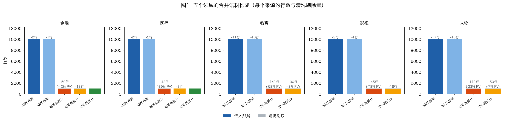
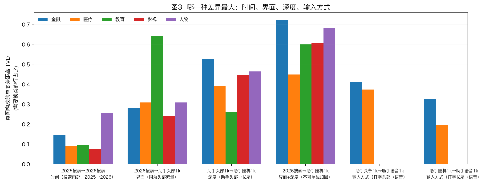
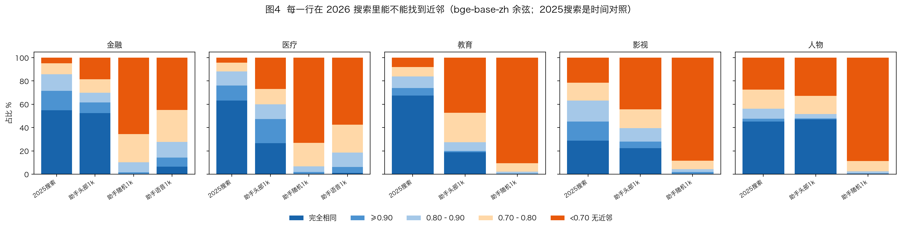

# 2026 五域同体系对比：2025 搜索 · 2026 搜索 · AI 助手（头部 / 长尾 / 语音）

> 本报告回答三个问题：**同一个领域里，五个来源的用户意图有什么不同**；**这些不同有多大，分别来自时间、界面、深度还是输入方式**；以及**为每个领域单独挖出来的意图体系，比一套通用框架多看见了什么**。
>
> 与上一版（《[SEARCH_VS_ASSISTANT_2026](SEARCH_VS_ASSISTANT_2026.zh.md)》）最大的方法差别：上一版用**一套 13 类通用框架**盲标所有切片，这一版把每个领域的五个来源**合并成一份语料、由挖掘程序一次跑完**，因此每个领域得到的是**为它自己的数据长出来的体系**（17–20 个领域专有类目），而不是通用标签。两版的口径在 §5 里逐条对照。

## 0. 摘要

> **读摘要前先记住一件事**：搜索快照在 7 月初，助手数据约在 8 月下旬（依据是查询里写出的日期，见 §1），语音时间未知。下面每一条**界面**结论里都含着这约两个月的时间差与升学/开学季，本报告只能用「时间线是四个领域里最小的一条」来约束它，**不能把它剥离**。

**做了什么。** 五个领域，每个领域把 **2025 搜索前 1 万 + 2026 搜索前 1 万 + AI 助手头部 1k + 助手随机 1k +（金融、医疗）助手语音 1k** 合并成一份语料，由挖掘程序**一次跑完**。于是每个领域得到**一套为它自己长出来的意图体系**（17–20 个类，名字是领域语言），五个来源的每一行都在同一个框架里被打标。分开跑两次不可比：同一份 10,000 行金融语料跑两次共享 **0** 个类目编码。

**1. 差异最大的不是"搜索 vs 助手"，是"头部 vs 长尾"。** 四条对比线的总变差距离（TVD，需要多大比例的行换类才能相等）：

| | 时间 2025→2026搜索 | 界面 2026搜索→助手头部 | 深度 助手头部→长尾 | 输入 打字头部→语音 |
|---|---:|---:|---:|---:|
| 金融 | 0.145 | 0.281 | **0.525** | 0.410 |
| 医疗 | 0.090 | 0.308 | **0.392** | 0.373 |
| 教育 | 0.095 | **0.643** | 0.260 | — |
| 影视 | 0.074 | 0.239 | **0.445** | — |
| 人物 | 0.256 | 0.309 | **0.464** | — |

深度在金融、影视、人物三个领域明确是最大的一条；**医疗的深度（0.392 [0.364, 0.436]）与语音（0.373 [0.347, 0.417]）区间重叠，分不出先后**；教育是唯一由界面领跑的（0.643）。时间在四个领域都是最小的一条，95% 区间与本域其余各线都不重叠；**人物是例外**——它的界面读数取决于拿哪一年做锚（锚 2026 是 0.309，锚 2025 只有 0.225），换锚后界面落到时间线以下，两条只能读作"量级相当"。

**2. 五个领域共有的结构性移动只有一组，而且指向长尾。**（下面三个类名是**上一版 13 类通用框架**的标签，把五个领域的同一批行重标一遍得到的——这是本报告唯一一个跨领域可加总的口径，领域自己的类目不可加总，见 §4.4。）助手头部 → 助手长尾：**裸实体降**（−13.0 ～ −46.6pp）、**个案判断与建议升**（+2.0 ～ +25.5pp）、**核实与动态升**（+2.1 ～ +7.9pp），5/5 方向一致且区间不含 0；**但量级极不均，而且两个类的格子大小不同**：`个案判断与建议`两侧都过 20 行的只有金融（77→241）与医疗（78→336），教育、影视、人物的助手头部一侧只有 3 / 0 / 1 行；`核实与动态`两侧都过 20 行的是金融（50→107）与人物（98→155）。换界面（2026 搜索 → 助手头部）只有一条 5/5：**无法判定升**（+3.9 ～ +37.4pp）。**搜索这一侧以名字为主，助手长尾这一侧以"给我一个判定"和"这说法是不是真的"为主**（没有 user id，这是两份样本的构成差异，不是同一批人的迁移）。

**3. "助手上问句更多"不是普遍规律。** 用同一条正则跑五个领域：换界面时疑问句在人物 +11.8、金融 +13.4、影视 +9.7，而**医疗 −6.7、教育 −4.4**（五个都显著）。界面上 5/5 同向显著的只有**第一人称**（+0.4 ～ +4.3），是非核实 4/5——**但这两条的格子极小**：第一人称在金融、医疗、人物的两侧都不足 20 行（医疗助手头部只有 4 行），是非核实只有金融（65→53 行）两侧过 20 行，按本报告自己的 4pp 门槛只有教育、影视两域够得上实质差异。**所以界面上能说的只是"第一人称是唯一没有被证伪的共同方向"，实质结论要收回到深度线**——深度线上疑问句 +23.7 ～ +44.5、是非核实 +7.0 ～ +19.8、第一人称 +2.7 ～ +10.4，六个标记（17 个测过的标记里的 6 个）× 五个领域三十格全部同向显著，每一格都在数百行的基数上。

**4. 界面差异不是"搜索挖得更深"造成的。** 把搜索也截到它自己的前 1,000 行（与助手头部同样的名义深度）重算，五个领域的界面 TVD **全部变大**（+0.026 ～ +0.185）；其中教育、医疗、金融的增量明显超出基线 TVD 的区间宽度，影视（+0.035）与人物（+0.026）与区间宽度相当，只作方向性读数（§4.2）。

**5. 时间这条线只测到"榜单换血"。** 同一字符串在一次运行里必然拿到同一个标签（五域零例外），所以年度差异只能来自哪些串进出前 1 万，**"同一句话含义变了"本方法测不到**。一年留存率：教育 67.2%、医疗 63.3%、金融 54.5%、人物 45.0%、影视 28.4%——**影视换血最狠，意图差异却排在最低的一档**（0.074 [0.062, 0.089]，与医疗 0.090、教育 0.095 的区间重叠，分不出先后）：换掉的是片名，要的东西没变。

**6. 领域定制的体系，买到的是分辨率，付出的是助手侧的空白。** 与上一版 13 类通用框架在同样的行上对照：通用的`裸实体`在教育被拆成"按裸校名检索院校"44% + "启动翻译工具"30%，`解释与介绍`在医疗被拆成中药材功效 28% + 药品功效 26%；反过来，金融的`查询金融资产实时行情`在通用框架里被拆成 52% 裸实体 + 46% 事实与数值——**同一件事被拆开了**。代价是体系在**搜索行**上拟合（搜索占合并语料 89.7%：金融 87.2%、医疗 87.1%、教育 91.6%、影视 91.2%、人物 91.6%），对助手特有的行为没有类目：教育助手头部 61.9% 落进残余类——其中 **53.6% 在通用框架里同样判"无法判定"**（多为 1–2 字的续轮片段，真的看不懂），另有 13.5% 是`会话与系统指令`、16.9% 是`裸实体`，**后面这 30.4% 才是框架缺口**。两种成因量级相当，处置办法完全不同（§5.1）。

**7. 加入助手行并没有可测地改变搜索行的意图划分——但聚类那一路变了。** 同样两万条搜索行，意图划分的一致度 AMI 0.59–0.74，而**同一份数据跑两次的基线是 0.774**，位移落在噪声量级内；**聚类划分则是 0.36–0.73 对基线 0.687，医疗 0.52、影视 0.43、人物 0.36 三域明显超出噪声带**——所以"体系没被改变"只能对意图这一路说。真正能说的是另一件事：新体系里出现了**以助手行为主体的类**——金融 4 个（个股买卖决策建议、同类产品比较、账户异常处置、信贷账单与征信规则，助手占 55%–70%），影视 2 个，人物 2 个，教育 1 个，医疗 0 个。

**8. 语音是第三种东西。** 扣掉仪器（无标点、约 40 字截断、1,000 行仅 885 个不同串、抽样方式未知）之后：医疗语音里"对具体行为、搭配或说法给出可行性裁决"占 **26.0%**（该来源内最高，相对集中度 5.2 倍），金融语音里"银行/支付操作指引" 13.5%、"金额与利率计算" 11.1%。它与打字助手行的逐字重合只有 0.68%（金融）/ 0.11%（医疗）、与搜索行 4.07% / 0.79%（均为去重口径，行口径见 §6），**不是打字数据的子集**；意图构成上离长尾更近，但两个方向的距离都远高于噪声上界，所以"语音就是长尾"不成立。

## 1. 这次是怎么做的

### 1.1 五个来源，四条只差一件事的对比线

| 来源 (source) | 是什么 | 行数级别 | 流量字段 | 时间 |
|---|---|---|---|---|
| `2025search` | 2025-07-01 搜索该垂类前 1 万 | ~10,000 | `wise_pv` | 2025 年 7 月初 |
| `2026search` | 2026-07-01 搜索该垂类前 1 万 | ~10,000 | `wise_pv` | 2026 年 7 月初 |
| `assistant_top` | AI 助手该类目 Top1000（头部） | ~950 | `search_num` | 约 2026 年 8 月下旬 |
| `assistant_random` | AI 助手该类目随机 1000（长尾） | ~980 | `search_num` | 约 2026 年 8 月下旬 |
| `assistant_voice` | AI 助手语音 query 1000（仅金融、医疗） | 1,000 | 无 | 未说明 |

四条对比线，每条只差一件事：

1. **时间**：`2025search → 2026search` —— 同一界面、同一抽样方式、相隔一年。**这是全篇噪声最低的一条**：两侧都是搜索前 1 万（T3b 里 n≈10,000），同源噪声上界只有 0.03，而别的线因为有一侧只有约一千行，噪声上界是 0.10–0.13。**所以别的线与它比较时，要各自对着 T3b 的噪声上界读，不是直接比原始读数。**
2. **界面**：`2026search → assistant_top` —— 两边都是各自的头部流量，时间相差约两个月。
3. **深度**：`assistant_top → assistant_random` —— 同一界面、同一时间，头部对长尾。
4. **输入方式**：`assistant_top / assistant_random → assistant_voice` —— 同一界面，打字对语音。

另有 `2026search → assistant_random`，界面与深度同时变化，**不能单独归因**，只用来说明"搜索头部和助手长尾之间的总距离"。

### 1.2 为什么必须合并成一份语料跑

这套流水线跑两次会给出两套互不相干的标签。项目自己的实测：`fin02` 与 `fin03` 跑的是**同样的 10,000 行**、同样的配置，结果**共享 0 个类目编码**——`LOOKUP_FX_RATE` 与 `FX_RATE_LOOKUP` 说的是同一件事，却无法对齐。所以"各跑一次再对比"比较的是命名噪声，不是数据。

合并之后：一次运行、一套意图体系、一棵聚类树，五个来源的每一行都在同一个框架里被打标，来源标签只是随行的一列，从不参与聚类，也从不作为参照类目。这是本报告所有跨来源比较成立的前提。

### 1.3 怎么读这里的占比

- **一律是"来源内占比"**。各来源行数差 10 倍（搜索每年 1 万行，助手每层约 1 千行），跨来源的原始条数没有意义。
- **流量（PV）只作补充**。搜索 PV、助手 PV 与完全没有 PV 的语音导出是三种不同的计量；本报告把每个来源的权重**各自归一到 10,000**，所以"流量占比"读作"占该来源自身流量的比例"，**从不跨来源比较 PV 绝对值**。语音行是均匀权重，它的流量占比等于行占比。
- **显著性**：每个类目的差异都带 Newcombe 95% 区间，区间不含 0 才算差异；小于 4 个百分点的差异即使显著也只作方向性描述。
- **整体距离用 TVD**（总变差距离）：两个来源的意图构成之间，需要有多大比例的行换类才能相等。它不像 p 值那样随样本量变得更显著，但**它本身在小样本上有正偏**：把同一个来源随机劈成两半重算，两侧都是搜索前 1 万的对比读出 0.030–0.040，而有一侧只有一千行的对比读出 0.096–0.128（T3b 的「同源噪声上界」列）。**所以每条线要先对着自己的噪声底读，不能拿时间线的读数直接当别的线的门槛。**

### 1.4 这套方法看不见什么（重要）

**同一个字符串在一次运行里必然拿到同一个标签。** 实测：医疗 13,184 行重复串、教育 13,621 行、金融 11,755 行、**人物 9,495 行**、影视 6,030 行，拿到两个不同意图标签或两个不同聚类叶的**一个也没有**。三条推论必须写在前面：

1. "两年共有的查询标签完全一致"**不是测量结果，而是标注方式的构造必然**，不能当作体系稳定的证据。
2. 2025→2026 的意图差异**只可能来自榜单换血**（哪些字符串进入/跌出前 1 万）。**同一句话含义变了**这种真正的概念漂移，本方法测不到。§3 因此把时间差异直接拆成"留存 / 掉榜 / 新进"三块。
3. 跨来源逐字重合的那部分行**不产生"标签变了"的差异**（同串必同标签，五域零例外），**但它照样进占比差，而且方向是把两个分布拉近**：去掉两侧共有的字符串重算界面线，金融 0.281 → 0.595、人物 0.309 → 0.542、医疗 0.308 → 0.308。共有的那批串在两个来源里占的**比例**不同，标签相同不等于份额相同。**所以本报告的界面线与深度线 TVD 都是下界**，不能读成"差异全部来自不重合的字符串"。时间线是例外：两侧同为搜索前 1 万、同一抽样口径，`TVD(时间) = 换血率 × TVD(掉榜, 新进)` 在五个领域的重建误差 ≤0.0001，那条恒等式可以照引。

与它互补的一个量是**包装对**：同一条搜索词被原样写进更长的助手查询之后就不再是同一个字符串，标签因此可以变。T13 给出每个领域、每个助手来源的包装对数、意图不变率与多写的字数（跨领域比较要一并看 T2 的类目数，见表注）。

#### T13 包装对：一条搜索词被原样写进更长的助手查询之后，意图还是不是同一个

| 领域 | 来源 | 包装对数 | 意图不变 | 多写的字数(中位) |
|---|---|---:|---:|---:|
| 人物 | 助手头部1k | 168 | 7.1% | 7.5 |
| 人物 | 助手随机1k | 136 | 11.0% | 9.0 |
| 医疗 | 助手头部1k | 216 | 13.4% | 4.0 |
| 医疗 | 助手随机1k | 188 | 6.9% | 10.0 |
| 医疗 | 助手语音1k | 224 | 8.5% | 8.0 |
| 影视 | 助手头部1k | 250 | 59.6% | 6.0 |
| 影视 | 助手随机1k | 264 | 26.5% | 10.5 |
| 教育 | 助手头部1k | 37 | 62.2% | 5.0 |
| 教育 | 助手随机1k | 121 | 42.1% | 12.0 |
| 金融 | 助手头部1k | 361 | 50.7% | 4.0 |
| 金融 | 助手随机1k | 216 | 22.7% | 10.0 |
| 金融 | 助手语音1k | 385 | 27.0% | 9.0 |

> 「意图不变」的比例受体系粒度影响（类目越细越容易变），跨领域比较时要一并看 T2 的类目数。

### 1.5 清洗

助手行沿用已经过两轮独立审计的 v3 分层（新移除行精度 96.7% [92.4, 98.6]），只保留 `tier == user` 的行进入挖掘；搜索行套用同一套 C1（无内容）与 S5（热点标题）规则；语音行只跑无内容规则——它没有 PV，按 PV 触发的规则无法生效。被剔除的行没有丢弃，全部保留在交付表的「被清洗剔除」页里，带剔除原因。逐来源的行数与剔除量见 §2 的 T1。

### 1.6 这一版与上一版的关系

上一版用一套 13 类通用框架（U01–U13）盲标所有切片，好处是跨领域可加总，代价是每个领域内部的结构被压平。这一版反过来：每个领域的体系由该领域的数据长出来，类目数 **17–20**，名字是领域语言（如医疗的`对具体行为、搭配或说法给出是否可行的裁决`、教育的`查询汉字笔顺写法`、金融的`处置账户异常与非预期扣款`）。两版在同样的行上直接对照，见 §5。

## 2. 语料与清洗

#### T1 五个领域的合并语料：每个来源进入挖掘的行数，以及清洗剔除量

| 领域 | 来源 | 原始行 | 进入挖掘 | 剔除行 | 剔除行占比 | 剔除 PV 占比 |
|---|---|---:|---:|---:|---:|---:|
| 金融 | 2025搜索 | 10,000 | 9,998 | 2 | 0.0% | 0.0% |
| 金融 | 2026搜索 | 10,000 | 9,999 | 1 | 0.0% | 0.0% |
| 金融 | 助手头部1k | 1,000 | 950 | 50 | 5.0% | 42.3% |
| 金融 | 助手随机1k | 1,000 | 987 | 13 | 1.3% | 1.1% |
| 金融 | 助手语音1k | 1,000 | 1,000 | 0 | 0.0% | — |
| 医疗 | 2025搜索 | 10,000 | 9,998 | 2 | 0.0% | 0.1% |
| 医疗 | 2026搜索 | 10,000 | 9,998 | 2 | 0.0% | 0.0% |
| 医疗 | 助手头部1k | 1,000 | 958 | 42 | 4.2% | 39.1% |
| 医疗 | 助手随机1k | 1,000 | 998 | 2 | 0.2% | 0.2% |
| 医疗 | 助手语音1k | 1,000 | 1,000 | 0 | 0.0% | — |
| 教育 | 2025搜索 | 10,000 | 9,989 | 11 | 0.1% | 0.1% |
| 教育 | 2026搜索 | 9,999 | 9,981 | 18 | 0.2% | 0.1% |
| 教育 | 助手头部1k | 1,000 | 859 | 141 | 14.1% | 57.8% |
| 教育 | 助手随机1k | 1,000 | 970 | 30 | 3.0% | 2.6% |
| 影视 | 2025搜索 | 10,000 | 9,998 | 2 | 0.0% | 0.0% |
| 影视 | 2026搜索 | 10,000 | 9,999 | 1 | 0.0% | 0.0% |
| 影视 | 助手头部1k | 1,000 | 955 | 45 | 4.5% | 78.3% |
| 影视 | 助手随机1k | 1,000 | 982 | 18 | 1.8% | 1.7% |
| 人物 | 2025搜索 | 10,000 | 9,983 | 17 | 0.2% | 0.1% |
| 人物 | 2026搜索 | 10,000 | 9,982 | 18 | 0.2% | 0.1% |
| 人物 | 助手头部1k | 1,000 | 889 | 111 | 11.1% | 33.4% |
| 人物 | 助手随机1k | 1,000 | 950 | 50 | 5.0% | 7.4% |

> 语音导出没有 PV，所以它没有「剔除 PV 占比」。助手头部的 PV 剔除量之所以高，是因为被剔除的是「生成视频」「👌 好的，继续吧」这类单条几十万 PV 的功能入口与按钮串。

三件事值得单独说：

- **搜索侧几乎不受清洗影响**：五个领域各两年、共 99,999 行，一共只标出 **74 行**（人物最多，35 行；教育次之，29 行，多为标点/确认语与热点标题）。
- **助手头部的流量大头不是用户打的字**：影视头部 78.3% 的 PV、教育 57.8%、金融 42.3%、医疗 39.1%、**人物 33.4%** 属于被清洗掉的功能入口、按钮串与卡片段落。**任何按 PV 加权的助手头部指标，都主要是清洗规则的函数**，所以本报告的主结论一律用行占比。
- **语音行一条都没被清掉**。它没有 PV，按 PV 触发的规则无法生效；同时它也确实不含确认语、唤醒词这类系统串——1,000 行里没有一条命中无内容规则。



## 3. 每个领域长出来的体系，以及助手行给它带来了什么

#### T2 每个领域自己长出来的意图体系（L1 类目）

> 类目数是**架构师写进体系的类**。人物的 20 类里有一类（`成人或泄露私密影像查询`）**实际一行都没有标到**，所以 T10、T11 与 §8.5 按**实际用到的 19 类**计。这条差异本身是个发现，见领域深挖的人物一节。

| 领域 | 类目数 | 类目 |
|---|---:|---|
| 金融 | 18 | 查询金融资产实时行情 / 进入个股股吧讨论区 / 计算具体金额或利率 / 查询历史价格走势图 / 获取市场动态与事件公告 / 查询交易日程与市场状态 / 解释金融术语与基础规则 / 获取银行或支付账户操作指引 / 处置账户异常与非预期扣款 / 查找官方渠道与客服入口 / 识别陌生电话号码归属 / 核实金融平台真伪与合法性 / 判定信贷产品账单与征信规则 / 比较同类金融产品并择优 / 寻求个股买卖与持有决策建议 / 寻求应急或无征信门槛借款渠道 / 获取每日答题活动答案 / 其他或无法判定的非金融查询 |
| 医疗 | 20 | 查询药品的功效与作用 / 查询中药材/食材/茶饮的功效与作用 / 查询药品用法用量与服用时机 / 在两个或几个选项之间给出裁决 / 查询指标的正常值或参考范围 / 解读用户本人的检查数值或报告分级 / 解释自身症状的原因 / 查询疾病的症状与早期征兆 / 查询疾病或医学术语的定义、病因与传染性 / 寻找疾病的治疗或缓解方案 / 由自述症状直接索取药品或药膏 / 评估疾病的严重程度、预后或时间预期 / 对具体行为、搭配或说法给出是否可行的裁决 / 查询就医科室、医院/医生导航与挂号入口 / 查询诊疗项目的费用、时长与恢复参数 / 查询中医方剂组成、经络穴位与中医理论 / 获取食疗/养生方的做法与搭配 / 对正在发生的具体不适做分诊与处置判断 / 仅给出名称的裸实体查询 / 处理非健康或无法归入上述意图的残余 |
| 教育 | 20 | 按裸校名检索院校信息 / 进入高校官网及校内业务平台 / 判定高校办学层次与标签 / 查询录取分数线与录取数据 / 导航至官方招考政务门户与登录入口 / 查询官方教务与考试办事流程 / 查询考试成绩与出分动态 / 进行升学与择校志愿决策咨询 / 了解专业培养内容与就业前景 / 查询职业资格与成人学历提升 / 查询汉字或词语读音 / 查询汉字笔顺写法 / 生成生字组词 / 按结构约束列举字词 / 查询词语或成语释义 / 检索古诗文与课文原文 / 启动翻译工具或查询英汉词句 / 求生肖谜语博彩谜底 / 完成中小学学科作业与写作任务 / 无意图或上下文依赖的残余查询 |
| 影视 | 17 | 获取作品的在线播放入口 / 直达指定集数的播放页 / 获取作品的网盘或资源下载渠道 / 导航到指定影视站点或平台 / 收看电视频道直播或查询节目表 / 查询剧情梗概或结局剧透 / 查询作品演员表与角色信息 / 按演职人员反查作品列表 / 核实播出信息与集数 / 获取成人或限制级内容 / 获取未删减或未遮挡版本 / 下载或安装影视App与排障 / 处理平台账号或客服问题 / 裸片名或仅带实体类型词的作品查询 / 剧情设定讨论与同人假设问答 / 凭情节片段反查片名 / 获取片段、台词或混剪等衍生内容 |
| 人物 | 20 | 裸名人物身份识别 / 人物近期事件状态查询 / 人事任免事件查询 / 人物档案调阅 / 人物单项属性查询 / 人物相关说法核实 / 作品角色反查人物 / 公共职务现任者查询 / 群体名单枚举 / 私人家世与感情关系查询 / 跳转人物站外主页 / 粉丝打榜投票入口 / 艺人平台热度数值查询 / 人物肖像图片获取 / 作品本体获取 / 人物相关梗与说法解释 / 成人或泄露私密影像查询 / 黑料绯闻炒作查询 / 性化类目浏览或非具体人物浏览 / 垂类外非人物查询 |

> 类目数是体系**声明**的 L1 类数。人物声明 20 个，实得有行的只有 19 个（`成人或泄露私密影像查询` 0 行，见 §8.5 与 §9⑦）；T10 / T11 用的是实得数 19。

### 3.1 这些体系是领域语言，不是通用标签

对比上一版的 13 类通用框架，这一版的类目直接说领域里的事：医疗有`对具体行为、搭配或说法给出是否可行的裁决`和`对正在发生的具体不适做分诊与处置判断`；教育有`查询汉字笔顺写法``按结构约束列举字词``求生肖谜语博彩谜底`；金融有`处置账户异常与非预期扣款``判定信贷产品账单与征信规则`；影视有`剧情设定讨论与同人假设问答``凭情节片段反查片名`。§5 会把这两套框架放在同样的行上直接对照。

### 3.2 加入助手行以后，搜索行的划分并没有被明显改写

#### T11 加入助手行以后，同样两万条搜索行的划分变了多少

| 语料 | 对齐行 | 老体系类数 | 新体系类数 | AMI(意图) | AMI(聚类) | 新体系中助手占多数的类 |
|---|---:|---:|---:|---:|---:|---:|
| 金融 | 19,995 | 17 | 18 | 0.686 | 0.725 | 4 |
| 医疗 | 19,996 | 20 | 20 | 0.681 | 0.516 | 0 |
| 教育 | 19,969 | 20 | 20 | 0.744 | 0.713 | 1 |
| 影视 | 19,992 | 15 | 17 | 0.590 | 0.425 | 2 |
| 人物 | 19,965 | 15 | 19 | 0.696 | 0.361 | 2 |
| 对照·同数据两次运行(fin02/fin03) | 9,999 | 19 | 16 | 0.774 | 0.687 | — |

> **参照系不是 1.0**：最后一行是同一份数据跑两次的结果，AMI 0.774 / 0.687 就是运行间噪声的量级。只有明显低于它的位移才谈得上「体系被改变了」。**两列要分开读**——意图那一列全部落在 0.774 的噪声带内，聚类那一列有医疗、影视、人物三个领域落在 0.687 之外。

读法：老运行（只有两万条搜索行）与新运行（同样两万条搜索行 + 两三千条助手行）对同一批搜索行的划分，**意图**那一路的 AMI 在 0.59–0.74 之间，**参照系是 0.774**——同一份数据跑两次的 AMI；观察到的位移**基本落在运行间噪声的量级内**，所以"助手行改变了搜索的划分方式"在意图这一路上无法宣称。**聚类那一路不同**：AMI 0.36–0.73 对基线 0.687，医疗 0.52、影视 0.43、人物 0.36 三个领域明显落在噪声带以外。两列要分开读（T11）。

真正能说的是另一件事：**新体系里出现了以助手行为主体的类目**。金融有 4 个类目一半以上的行来自助手（个股买卖决策建议 70%、同类产品比较择优 70%、账户异常处置 68%、信贷账单与征信规则 55%），影视 2 个，**人物 2 个（人物相关说法核实 74%、黑料绯闻炒作查询 54%——后者只有 28 行，刚过最小格子）**，教育 1 个，医疗 0 个。这些类的重心落在助手行上；它们在只看搜索的旧运行里对应到哪一类，本数据无法判定（§1.2、§10-10）。

### 3.3 每个来源最集中的是哪一类

#### T12 每个来源最集中的类目（index = 来源内占比 ÷ 全语料占比）

```text
【2026搜索 最集中的类目（index = 来源内占比 / 全语料占比）】
  金融: 进入个股股吧讨论区 1.3× | 查询历史价格走势图 1.3× | 查询金融资产实时行情 1.2×
  医疗: 查询中医方剂组成、经络穴位与中医理论 1.4× | 查询药品的功效与作用 1.3× | 查询药品用法用量与服用时机 1.2×
  教育: 查询汉字笔顺写法 1.4× | 导航至官方招考政务门户与登录入口 1.3× | 查询汉字或词语读音 1.2×
  影视: 获取作品的网盘或资源下载渠道 1.9× | 收看电视频道直播或查询节目表 1.5× | 直达指定集数的播放页 1.1×
  人物: 艺人平台热度数值查询 2.2× | 粉丝打榜投票入口 2.0× | 跳转人物站外主页 1.6×

【助手头部1k 最集中的类目（index = 来源内占比 / 全语料占比）】
  金融: 处置账户异常与非预期扣款 7.6× | 比较同类金融产品并择优 4.6× | 获取每日答题活动答案 3.7×
  医疗: 查询就医科室、医院/医生导航与挂号入口 3.7× | 处理非健康或无法归入上述意图的残余 2.9× | 仅给出名称的裸实体查询 1.5×
  教育: 无意图或上下文依赖的残余查询 4.3× | 完成中小学学科作业与写作任务 4.1× | 生成生字组词 2.0×
  影视: 凭情节片段反查片名 5.4× | 查询剧情梗概或结局剧透 5.1× | 获取片段、台词或混剪等衍生内容 4.3×
  人物: 黑料绯闻炒作查询 9.6× | 人物相关梗与说法解释 6.1× | 人物近期事件状态查询 5.5×

【助手随机1k 最集中的类目（index = 来源内占比 / 全语料占比）】
  金融: 寻求个股买卖与持有决策建议 9.9× | 比较同类金融产品并择优 9.4× | 判定信贷产品账单与征信规则 7.0×
  医疗: 对正在发生的具体不适做分诊与处置判断 7.4× | 对具体行为、搭配或说法给出是否可行的裁决 3.8× | 处理非健康或无法归入上述意图的残余 3.2×
  教育: 完成中小学学科作业与写作任务 8.2× | 查询职业资格与成人学历提升 3.3× | 无意图或上下文依赖的残余查询 2.8×
  影视: 剧情设定讨论与同人假设问答 17.9× | 凭情节片段反查片名 8.4× | 处理平台账号或客服问题 7.4×
  人物: 人物相关说法核实 15.4× | 人事任免事件查询 6.4× | 人物近期事件状态查询 5.6×

【助手语音1k 最集中的类目（index = 来源内占比 / 全语料占比）】
  金融: 获取银行或支付账户操作指引 6.0× | 处置账户异常与非预期扣款 4.6× | 判定信贷产品账单与征信规则 4.5×
  医疗: 对具体行为、搭配或说法给出是否可行的裁决 5.2× | 对正在发生的具体不适做分诊与处置判断 2.5× | 处理非健康或无法归入上述意图的残余 2.4×
```

## 4. 四条对比线：时间、界面、深度、输入方式

#### T3 四条对比线的整体距离 TVD（需要多大比例的行换类，两个来源的意图构成才相等）

| 对比线 | 差的是什么 | 人物 | 医疗 | 影视 | 教育 | 金融 |
|---|---|---:|---:|---:|---:|---:|
| 2025搜索 → 2026搜索 | 时间（搜索内部，2025→2026） | 0.256 | 0.090 | 0.074 | 0.095 | 0.145 |
| 2026搜索 → 助手头部1k | 界面（同为头部流量） | 0.309 | 0.308 | 0.239 | 0.643 | 0.281 |
| 助手头部1k → 助手随机1k | 深度（助手头部→长尾） | 0.464 | 0.392 | 0.445 | 0.260 | 0.525 |
| 2026搜索 → 助手随机1k | 界面+深度（不可单独归因） | 0.682 | 0.448 | 0.607 | 0.599 | 0.721 |
| 助手头部1k → 助手语音1k | 输入方式（打字头部→语音） | — | 0.373 | — | — | 0.410 |
| 助手随机1k → 助手语音1k | 输入方式（打字长尾→语音） | — | 0.196 | — | — | 0.327 |

> TVD 不随显著性水平膨胀，但**在小样本上有正偏**：跨对比线比较前先看 T3b 的「同源噪声上界」——两侧都是搜索前 1 万的时间线是 0.03，有一侧只有一千行的线是 0.10–0.13。**时间那一行是全篇噪声最低的一条，不是可以直接当门槛的一条。**

#### T3b 同一批 TVD，带自助法 95% 区间与「同源噪声上界」

| 领域 | 对比线 | TVD [95% 区间] | 同源两半的 TVD 上界 | n(a) | n(b) |
|---|---|---|---:|---:|---:|
| 金融 | 2025搜索 → 2026搜索 | 0.145 [0.133, 0.158] | 0.031 | 9,998 | 9,999 |
| 金融 | 2026搜索 → 助手头部1k | 0.281 [0.253, 0.315] | 0.103 | 9,999 | 950 |
| 金融 | 助手头部1k → 助手随机1k | 0.525 [0.494, 0.566] | 0.112 | 950 | 987 |
| 金融 | 2026搜索 → 助手随机1k | 0.721 [0.702, 0.746] | 0.107 | 9,999 | 987 |
| 金融 | 助手头部1k → 助手语音1k | 0.410 [0.378, 0.451] | 0.118 | 950 | 1,000 |
| 金融 | 助手随机1k → 助手语音1k | 0.327 [0.295, 0.371] | 0.118 | 987 | 1,000 |
| 医疗 | 2025搜索 → 2026搜索 | 0.090 [0.085, 0.109] | 0.040 | 9,998 | 9,998 |
| 医疗 | 2026搜索 → 助手头部1k | 0.308 [0.283, 0.345] | 0.115 | 9,998 | 958 |
| 医疗 | 助手头部1k → 助手随机1k | 0.392 [0.364, 0.436] | 0.128 | 958 | 998 |
| 医疗 | 2026搜索 → 助手随机1k | 0.448 [0.429, 0.482] | 0.124 | 9,998 | 998 |
| 医疗 | 助手头部1k → 助手语音1k | 0.373 [0.347, 0.417] | 0.125 | 958 | 1,000 |
| 医疗 | 助手随机1k → 助手语音1k | 0.196 [0.163, 0.241] | 0.126 | 998 | 1,000 |
| 教育 | 2025搜索 → 2026搜索 | 0.095 [0.084, 0.110] | 0.040 | 9,989 | 9,981 |
| 教育 | 2026搜索 → 助手头部1k | 0.643 [0.622, 0.670] | 0.096 | 9,981 | 859 |
| 教育 | 助手头部1k → 助手随机1k | 0.260 [0.231, 0.313] | 0.101 | 859 | 970 |
| 教育 | 2026搜索 → 助手随机1k | 0.599 [0.582, 0.625] | 0.099 | 9,981 | 970 |
| 影视 | 2025搜索 → 2026搜索 | 0.074 [0.062, 0.089] | 0.032 | 9,998 | 9,999 |
| 影视 | 2026搜索 → 助手头部1k | 0.239 [0.219, 0.270] | 0.096 | 9,999 | 955 |
| 影视 | 助手头部1k → 助手随机1k | 0.445 [0.411, 0.485] | 0.111 | 955 | 982 |
| 影视 | 2026搜索 → 助手随机1k | 0.607 [0.581, 0.640] | 0.110 | 9,999 | 982 |
| 人物 | 2025搜索 → 2026搜索 | 0.256 [0.246, 0.270] | 0.030 | 9,983 | 9,982 |
| 人物 | 2026搜索 → 助手头部1k | 0.309 [0.290, 0.329] | 0.101 | 9,982 | 889 |
| 人物 | 助手头部1k → 助手随机1k | 0.464 [0.437, 0.511] | 0.119 | 889 | 950 |
| 人物 | 2026搜索 → 助手随机1k | 0.682 [0.657, 0.708] | 0.114 | 9,982 | 950 |

> 「同源噪声上界」是把**同一个来源**随机劈成两半算出来的 TVD 的 95 分位——样本量本身就会制造的下限。区间重叠的两条对比线不要排序。

**这一节的两条读法**：

1. **界面线的 TVD 是下界；深度线不是。** 两个来源逐字共有的那批串把分布**拉近**（§1.4 推论 3）——去掉共有串后重算界面线：金融 0.281 → 0.595、人物 0.309 → 0.542、影视 0.239 → 0.302、教育 0.643 → 0.651、医疗 0.308 → 0.308（共有串 156–494 条）。**深度线不受这个机制影响**：助手头部与助手随机之间**一条共有字符串都没有**（五域皆为 0，见 T6），去掉共有串前后 TVD 一位小数都不变。时间线同样不受影响。
2. **每条线先对着它自己的噪声底读**（T3b 的「同源噪声上界」列）：时间线两侧都是搜索前 1 万，噪声上界 0.03；凡有一侧只有约一千行的线，噪声上界是 0.10–0.13。**区间重叠的两条线不排序。**



#### T4 每条对比线上，95% 区间不含 0 的类目数（括号内：只在一侧出现的类目数）

| 对比 | 金融 | 医疗 | 教育 | 影视 | 人物 |
|---|---:|---:|---:|---:|---:|
| 2025搜索 → 2026搜索 | 13 | 8 | 15 | 10 | 16 (1) |
| 2026搜索 → 助手头部1k | 10 | 10 | 14 (3) | 8 (1) | 15 |
| 助手头部1k → 助手随机1k | 12 | 12 | 8 (2) | 10 (1) | 9 (2) |
| 2026搜索 → 助手随机1k | 14 | 14 | 15 (1) | 13 | 16 (2) |
| 助手头部1k → 助手语音1k | 12 | 11 | — | — | — |
| 助手随机1k → 助手语音1k | 12 | 8 | — | — | — |

### 4.1 时间是四个领域里最小的那一条（人物例外），而且它只由榜单换血构成

#### T5 一年之间，搜索前 1 万换了多少人（时间差异的全部来源）

| 领域 | 两年都在 | 掉榜 | 新进 | 留存占 2026 的 | 打字助手行也出现在搜索里 | 语音行也出现在搜索里 |
|---|---:|---:|---:|---:|---:|---:|
| 金融 | 5,446 | 4,551 | 4,552 | 54.5% | 26.5% | 7.4% |
| 医疗 | 6,329 | 3,669 | 3,669 | 63.3% | 13.9% | 1.7% |
| 教育 | 6,702 | 3,287 | 3,278 | 67.2% | 9.4% | — |
| 影视 | 2,841 | 7,155 | 7,155 | 28.4% | 11.6% | — |
| 人物 | 4,493 | 5,490 | 5,489 | 45.0% | 24.1% | — |

> 同一字符串在一次运行里必然同标签（§1.4），所以时间维度上的意图变化**只能**来自这张表里的「掉榜」与「新进」，本方法测不到「同一句话含义变了」。
>
> 倒数两列分开列，是因为把语音并进「助手行」会只稀释金融与医疗两列（另外三个领域没有语音），排序会因此翻转——这是跨领域综合分析的复核员发现的一处口径错误，已在 `p5_turnover.py` 里改掉。

一年之间，搜索前 1 万的留存率是 28.4%（影视）到 67.2%（教育）。意图构成的年度变化（**TVD 0.074–0.256**，人物最大、影视最小）**全部来自这批进出**：同一字符串在一次运行里必然同标签（§1.4），所以本方法测不到"同一句话含义变了"。影视换血最狠（留存 28.4%），意图差异却排在最低的一档（0.074 [0.062, 0.089]，与医疗 0.090、教育 0.095 的区间重叠，分不出先后）——换掉的是片名，要的东西没变。

### 4.2 界面差异不是"搜索挖得更深"造成的

最容易想到的反驳是：搜索给了前 1 万行，助手只给了前 1 千行，两边深度不同。把搜索也截到它自己的前 1,000 行（与助手头部同样的名义深度）重算：

| 领域 | 对比搜索前1万 | 对比搜索前1000 | 变化 |
|---|---:|---:|---:|
| 金融 | 0.281 | 0.354 | +0.073 |
| 医疗 | 0.308 | 0.482 | +0.173 |
| 教育 | 0.643 | 0.828 | +0.185 |
| 影视 | 0.239 | 0.275 | +0.035 |
| 人物 | 0.309 | 0.334 | +0.026 |

**五个领域的差距全都变大**。所以"深度不同"不能解释界面差异。其中教育、医疗、金融的增量明显超出基线 TVD 的区间宽度；**影视（+0.035）与人物（+0.026）的增量与区间宽度相当（人物 [0.290, 0.329] 宽 0.039），只作方向性读数**。需要同时说明的是：两个切片按 PV 仍然不对齐——搜索前 1,000 的 PV 下限是 1,012–2,940，助手头部的下限只有 44–281，所以这是"名义深度对齐、流量水位仍差一个量级"的对照，不是严格的等流量对照。

### 4.3 深度与输入方式，量级与界面相当甚至更大

助手头部 → 助手随机的 TVD 是 0.260（教育）到 0.525（金融），与界面差异同量级或更大；打字头部 → 语音是 0.373（医疗）、0.410（金融）。**"用助手还是用搜索"并不比"问的是热门问题还是冷门问题"更能决定一个人问什么**，而语音是第三个独立的轴。

### 4.4 哪些差异在五个领域都出现：一个不依赖类目对齐的测法

跨领域比较意图类目有一个绕不开的麻烦：每个领域的体系是各自长出来的，「医疗的可行性裁决」和「金融的个股买卖建议」
是不是同一件事，是判断，不是测量。写法标记没有这个问题——**同一条正则跑在五个领域、五个来源上**，
所以"同一个标记在五个领域同方向显著"本身就是跨领域规律。

#### T16 写法标记在各对比线上的变化（百分点；★=该领域 95% 区间不含 0）


**2025搜索 → 2026搜索（时间（搜索内部，2025→2026））**

| 标记 | 金融 | 医疗 | 教育 | 影视 | 人物 | 显著域数 |
|---|---:|---:|---:|---:|---:|---:|
| 定义 | -0.8★ | +0.1 | +0.3 | +0.0 | -0.2★ | 2 |
| 导航词 | -1.3★ | +0.0 | +1.2★ | +1.5★ | +0.1 | 3 |
| 方法/怎么办 | -0.5★ | -0.1 | +0.1 | -0.1 | -0.1★ | 2 |
| 是非核实 | -1.2★ | +0.8★ | -0.1 | -0.1 | -0.3★ | 3 |
| 疑问句 | -5.6★ | +0.6 | +1.6★ | -0.5★ | -0.8★ | 4 |
| 资源词 | -0.0 | +0.2 | +0.3★ | -2.4★ | +1.7★ | 3 |

**2026搜索 → 助手头部1k（界面（同为头部流量））**

| 标记 | 金融 | 医疗 | 教育 | 影视 | 人物 | 显著域数 |
|---|---:|---:|---:|---:|---:|---:|
| 定义 | +0.6 | -6.0★ | -1.5★ | +4.1★ | +1.7★ | 4 |
| 家庭成员 | -0.0 | +0.2 | +0.6★ | +0.5 | +0.9★ | 2 |
| 导航词 | +1.6★ | +0.1 | -3.7★ | -2.9★ | -0.0 | 3 |
| 方法/怎么办 | +2.5★ | -0.6 | +0.8★ | +0.3★ | +2.9★ | 4 |
| 是非核实 | +4.9★ | +1.3 | +1.8★ | +0.8★ | +1.6★ | 4 |
| 疑问句 | +13.4★ | -6.7★ | -4.4★ | +9.7★ | +11.8★ | 5 |
| 祈使/委托 | +0.1★ | +0.4★ | +5.2★ | +3.9★ | +0.1 | 4 |
| 称呼对方 | +0.1 | +0.2★ | +0.1 | +0.6 | +0.2★ | 2 |
| 第一人称 | +0.7★ | +0.4★ | +4.1★ | +4.3★ | +1.0★ | 5 |
| 资源词 | -0.0 | -0.3 | +0.0 | -20.1★ | -1.8★ | 2 |
| 输出约束 | +0.0 | +0.0 | +3.2★ | +1.7★ | -0.0 | 2 |
| 选择清单 | +2.0★ | -1.0 | +0.5 | +2.7★ | +2.9★ | 3 |

**助手头部1k → 助手随机1k（深度（助手头部→长尾））**

| 标记 | 金融 | 医疗 | 教育 | 影视 | 人物 | 显著域数 |
|---|---:|---:|---:|---:|---:|---:|
| 回指上文 | +0.5★ | +0.8★ | +0.6 | +0.7★ | +0.1 | 3 |
| 多问句(一行≥2问) | +1.4★ | +1.6★ | +1.6★ | +1.8★ | +1.2★ | 5 |
| 定义 | +0.0 | -0.9 | +3.8★ | -0.7 | +3.4★ | 2 |
| 家庭成员 | +0.4 | +1.8★ | +1.1★ | +1.3 | +0.1 | 2 |
| 方法/怎么办 | +7.2★ | +0.7 | +4.7★ | +3.4★ | +1.7 | 3 |
| 时效词 | -5.5★ | +2.4★ | +0.9★ | +1.2★ | +3.2★ | 5 |
| 是非核实 | +13.3★ | +19.8★ | +7.0★ | +8.3★ | +12.1★ | 5 |
| 疑问句 | +44.5★ | +30.9★ | +30.4★ | +23.7★ | +29.8★ | 5 |
| 祈使/委托 | +0.0 | +0.5 | +5.5★ | +1.1 | +0.8★ | 2 |
| 称呼对方 | +1.6★ | +1.6★ | +2.5★ | +3.6★ | +1.0★ | 5 |
| 第一人称 | +5.3★ | +7.0★ | +10.4★ | +7.1★ | +2.7★ | 5 |
| 资源词 | +0.2 | -1.2★ | +0.5 | -10.9★ | +0.4 | 2 |
| 身份/人生阶段 | +2.6★ | -0.7 | +2.5★ | +0.7 | +9.0★ | 3 |
| 选择清单 | +10.4★ | +5.7★ | +6.0★ | +5.0★ | +13.0★ | 5 |

**2026搜索 → 助手随机1k（界面+深度（不可单独归因））**

| 标记 | 金融 | 医疗 | 教育 | 影视 | 人物 | 显著域数 |
|---|---:|---:|---:|---:|---:|---:|
| 回指上文 | +0.5★ | +0.9★ | +3.4★ | +0.7★ | +0.1★ | 5 |
| 多问句(一行≥2问) | +1.5★ | +1.6★ | +1.6★ | +1.8★ | +1.1★ | 5 |
| 定义 | +0.6 | -6.9★ | +2.3★ | +3.3★ | +5.0★ | 4 |
| 家庭成员 | +0.4★ | +1.9★ | +1.7★ | +1.8★ | +1.0★ | 5 |
| 导航词 | +0.3 | -0.1 | -3.5★ | -2.8★ | -0.0 | 2 |
| 情绪词 | +0.0 | +0.6★ | +0.4★ | +0.7★ | +0.4★ | 4 |
| 方法/怎么办 | +9.7★ | +0.1 | +5.6★ | +3.6★ | +4.6★ | 4 |
| 时效词 | -1.2 | +2.4★ | +0.9★ | +0.4 | +3.0★ | 3 |
| 是非核实 | +18.2★ | +21.1★ | +8.8★ | +9.1★ | +13.7★ | 5 |
| 疑问句 | +57.9★ | +24.2★ | +26.0★ | +33.4★ | +41.6★ | 5 |
| 祈使/委托 | +0.1★ | +0.9★ | +10.6★ | +5.0★ | +0.9★ | 5 |
| 称呼对方 | +1.7★ | +1.8★ | +2.7★ | +4.2★ | +1.2★ | 5 |
| 第一人称 | +6.0★ | +7.4★ | +14.6★ | +11.4★ | +3.6★ | 5 |
| 资源词 | +0.2★ | -1.4★ | +0.5 | -31.0★ | -1.4★ | 4 |
| 身份/人生阶段 | +2.5★ | +0.6★ | +1.3 | +0.9★ | +8.9★ | 4 |
| 输出约束 | +0.0 | +0.4★ | +7.2★ | +2.2★ | -0.0 | 3 |
| 选择清单 | +12.4★ | +4.6★ | +6.4★ | +7.7★ | +15.8★ | 5 |

**助手头部1k → 助手语音1k（输入方式（打字头部→语音））**

| 标记 | 金融 | 医疗 | 显著域数 |
|---|---:|---:|---:|
| 时效词 | -8.2★ | +0.9★ | 2 |
| 是非核实 | +8.4★ | +19.1★ | 2 |
| 疑问句 | +31.9★ | +22.3★ | 2 |
| 第一人称 | +2.4★ | +2.3★ | 2 |
| 身份/人生阶段 | +3.9★ | -1.4★ | 2 |
| 选择清单 | +2.1★ | -1.9★ | 2 |

**助手随机1k → 助手语音1k（输入方式（打字长尾→语音））**

| 标记 | 金融 | 医疗 | 显著域数 |
|---|---:|---:|---:|
| 多问句(一行≥2问) | -1.5★ | -1.7★ | 2 |
| 时效词 | -2.7★ | -1.5★ | 2 |
| 疑问句 | -12.7★ | -8.6★ | 2 |
| 第一人称 | -3.0★ | -4.7★ | 2 |
| 选择清单 | -8.4★ | -7.5★ | 2 |

> 本表只列出至少两个领域显著的标记；**一共测了 17 个写法标记**，未列出的那些多数不显著或方向分裂。这些标记是**同一条正则**跑在五个领域上，所以「同一个标记在五个领域同方向显著」本身就是跨领域规律，不依赖任何类目名的对齐。正则有误报与漏报，只读同一规则下的相对差异。

#### T15 同一个搜索词，被写进更长的助手查询之后，意图就变了（全部为数据中的真实行）

| 领域 | 助手来源 | 搜索里的写法 | 助手里的写法 | 意图变化 |
|---|---|---|---|---|
| 金融 | 助手头部1k | 人民币 | 1欧元等于多少人民币 | 其他或无法判定的非金融查询 → 计算具体金额或利率 |
| 金融 | 助手语音1k | 支付宝 | 怎样把社保从微信支付转到支付宝支付 | 其他或无法判定的非金融查询 → 获取银行或支付账户操作指引 |
| 医疗 | 助手头部1k | bmi | bmi值正常标准是多少 | 仅给出名称的裸实体查询 → 查询指标的正常值或参考范围 |
| 医疗 | 助手语音1k | 飞蚊症 | 眼睛出现飞蚊症和小点黑影是什么原因 | 仅给出名称的裸实体查询 → 解释自身症状的原因 |
| 教育 | 助手随机1k | 复旦大学 | 2026年复旦大学的博士招满吗？ | 按裸校名检索院校信息 → 进行升学与择校志愿决策咨询 |
| 教育 | 助手随机1k | 为什么 | 30度对应的直角边是斜边的一半，为什么？ | 无意图或上下文依赖的残余查询 → 完成中小学学科作业与写作任务 |
| 影视 | 助手头部1k | 电视剧 | 2026年最火的电视剧有哪些 | 裸片名或仅带实体类型词的作品查询 → 核实播出信息与集数 |
| 人物 | 助手头部1k | 丁禹兮 | 丁禹兮的代表作品有哪些 | 裸名人物身份识别 → 人物单项属性查询 |

> 包装规则会产生**偶然**配对：核心词很短时（如英文 `know` 出现在 `I don't know` 里）匹配是字面巧合，不是同一个需求。上表的例子都经人工确认语义相关；T13 的统计量没有做这一步筛选，读的时候要记得这一点。

按这把尺子读出来的结论很清楚：

- **深度这条线在六个标记上五域完全一致。** 助手头部 → 助手长尾，疑问句 +23.7 到 +44.5 个百分点、是非核实 +7.0 到 +19.8、
  第一人称 +2.7 到 +10.4、选择清单 +5.0 到 +13.0、称呼对方 +1.0 到 +3.6、一行两个问号 +1.2 到 +1.8——
  **这六个标记、五个领域、三十个格子，全部同向且全部显著**。分母要写出来：一共测了 **17 个写法标记**，
  其中 6 个是这样；另外 11 个不是——导航词五域全不显著，时效词五域都显著但方向分裂（金融 −5.5、人物 +3.2），
  资源词在深度线上只有 2/5 显著（医疗 −1.2、影视 −10.9），两格同为负向，落选的原因是显著域数不够而不是方向分裂。**所以立得住的是"有一组一致的标记"，不是"这条线在五个领域完全一致"。**
- **界面这条线不是。** 「助手上问句更多」在五个领域都显著，但**方向是分裂的**：人物 +11.8、金融 +13.4、影视 +9.7，
  而医疗 −6.7、教育 −4.4。医疗搜索本来就是"X 是什么原因引起的"这种完整问句，教育助手头部则挤满了单字续轮，
  所以同一句"助手更像对话"在这两个领域不成立。
- **界面上没有一条够得上"实质且普遍"。** 第一人称在五个领域都显著上升（+0.4 到 +4.3），是非核实在四个领域显著上升
  （医疗除外，+0.8 到 +4.9）——但第一人称在金融（6→7 行）、医疗（5→4 行）、人物（4→9 行）两侧都不足 20 行，
  是非核实只有金融（65→53 行）两侧过 20 行；按本报告自己的 4pp 门槛，只有教育、影视两域的第一人称够得上实质差异。
  **所以界面上能说的只是"第一人称是唯一没有被证伪的共同方向"，不能说"带上我自己"是换界面的共同变化**；
  实质结论要收回到深度线（那里每个格子都在数百行的基数上）。"说话更长更像聊天"则连方向都不成立。

## 5. 领域定制的体系，比一套通用框架多看见了什么

#### T10 领域体系 vs 上一版的 13 类通用框架（同样的行）

| 领域 | 覆盖行 | 通用框架类数 | 本次体系类数 | AMI | NMI |
|---|---:|---:|---:|---:|---:|
| 金融 | 11,936 | 13 | 18 | 0.451 | 0.454 |
| 医疗 | 11,954 | 13 | 20 | 0.370 | 0.373 |
| 教育 | 11,810 | 13 | 20 | 0.426 | 0.429 |
| 影视 | 11,936 | 13 | 17 | 0.511 | 0.513 |
| 人物 | 11,821 | 13 | 19 | 0.560 | 0.562 |

**通用框架里的一类，被领域体系拆成多类（各占该类 ≥20%）**

| 领域 | 通用类 | 行数 | 被拆成 |
|---|---|---:|---|
| 医疗 | U03 事实与数值 | 603 | 查询诊疗项目的费用、时长与恢复参数 26% \| 查询指标的正常值或参考范围 24% |
| 医疗 | U04 解释与介绍 | 6,642 | 查询中药材/食材/茶饮的功效与作用 28% \| 查询药品的功效与作用 26% |
| 医疗 | U09 获取现成内容 | 311 | 仅给出名称的裸实体查询 28% \| 查询疾病的症状与早期征兆 24% \| 查询中医方剂组成、经络穴位与中医理论 24% |
| 教育 | U01 导航直达 | 839 | 导航至官方招考政务门户与登录入口 44% \| 进入高校官网及校内业务平台 24% |
| 教育 | U02 裸实体 | 4,862 | 按裸校名检索院校信息 44% \| 启动翻译工具或查询英汉词句 30% |
| 教育 | U04 解释与介绍 | 766 | 查询词语或成语释义 28% \| 了解专业培养内容与就业前景 23% |
| 教育 | U06 办事与操作 | 132 | 无意图或上下文依赖的残余查询 22% \| 完成中小学学科作业与写作任务 20% \| 查询职业资格与成人学历提升 20% |
| 教育 | U07 个案判断与建议 | 75 | 无意图或上下文依赖的残余查询 32% \| 进行升学与择校志愿决策咨询 25% |
| 教育 | U08 清单与推荐 | 549 | 生成生字组词 34% \| 进行升学与择校志愿决策咨询 23% |
| 教育 | U09 获取现成内容 | 598 | 求生肖谜语博彩谜底 33% \| 检索古诗文与课文原文 26% \| 无意图或上下文依赖的残余查询 21% |
| 教育 | U10 生成与编辑 | 337 | 完成中小学学科作业与写作任务 41% \| 无意图或上下文依赖的残余查询 27% \| 启动翻译工具或查询英汉词句 26% |
| 教育 | U11 会话与系统指令 | 184 | 无意图或上下文依赖的残余查询 62% \| 完成中小学学科作业与写作任务 24% |
| 影视 | U01 导航直达 | 866 | 导航到指定影视站点或平台 44% \| 收看电视频道直播或查询节目表 32% |
| 影视 | U03 事实与数值 | 279 | 核实播出信息与集数 31% \| 收看电视频道直播或查询节目表 30% |
| 影视 | U04 解释与介绍 | 351 | 查询剧情梗概或结局剧透 41% \| 剧情设定讨论与同人假设问答 28% |
| 影视 | U05 核实与动态 | 73 | 剧情设定讨论与同人假设问答 42% \| 裸片名或仅带实体类型词的作品查询 26% |
| 影视 | U08 清单与推荐 | 682 | 裸片名或仅带实体类型词的作品查询 32% \| 查询作品演员表与角色信息 25% |
| 影视 | U10 生成与编辑 | 106 | 获取片段、台词或混剪等衍生内容 61% \| 剧情设定讨论与同人假设问答 25% |
| 影视 | U12 违规或灰色内容 | 382 | 裸片名或仅带实体类型词的作品查询 34% \| 获取作品的在线播放入口 27% |
| 影视 | U13 无法判定 | 433 | 裸片名或仅带实体类型词的作品查询 48% \| 剧情设定讨论与同人假设问答 21% |
| 人物 | U01 导航直达 | 179 | 粉丝打榜投票入口 53% \| 跳转人物站外主页 23% |
| 人物 | U03 事实与数值 | 764 | 人物单项属性查询 25% \| 艺人平台热度数值查询 22% |
| 人物 | U05 核实与动态 | 340 | 人物近期事件状态查询 30% \| 人物相关说法核实 20% |

**反过来：领域体系的一个类，在通用框架里是好几类（纯度 <75%、≥200 行）**

| 领域 | 本次体系的类 | 行数 | 在通用框架里的构成 |
|---|---|---:|---|
| 金融 | 查询金融资产实时行情 | 7,000 | 裸实体 52% | 事实与数值 46% |
| 教育 | 无意图或上下文依赖的残余查询 | 2,095 | 裸实体 34% | 无法判定 31% |
| 医疗 | 解释自身症状的原因 | 1,046 | 解释与介绍 74% |
| 医疗 | 寻找疾病的治疗或缓解方案 | 934 | 个案判断与建议 48% | 办事与操作 39% |
| 金融 | 其他或无法判定的非金融查询 | 896 | 裸实体 59% |
| 医疗 | 处理非健康或无法归入上述意图的残余 | 820 | 解释与介绍 22% |
| 人物 | 垂类外非人物查询 | 622 | 裸实体 49% |
| 医疗 | 对具体行为、搭配或说法给出是否可行的裁决 | 592 | 核实与动态 45% | 个案判断与建议 22% | 解释与介绍 21% |
| 教育 | 检索古诗文与课文原文 | 575 | 裸实体 55% | 获取现成内容 27% |
| 影视 | 导航到指定影视站点或平台 | 562 | 导航直达 68% |
| 金融 | 查找官方渠道与客服入口 | 520 | 事实与数值 44% | 导航直达 42% |
| 金融 | 寻求个股买卖与持有决策建议 | 473 | 个案判断与建议 49% | 清单与推荐 22% |

> 覆盖范围：2026 搜索 + 助手头部 + 助手随机（2025 搜索与语音没有通用框架标签）。「拆分」看的是通用框架的一类被本体系分成几类，「合并」看的是本体系的一类在通用框架里由几类拼成，两张表的分母不同，不要相加。

三件事同时成立，缺一条结论就会被夸大：

- **拆分**：通用框架里的一类，在领域体系里是好几类。教育的`裸实体`拆成`按裸校名检索院校信息`（44%）与`启动翻译工具或查询英汉词句`（30%）；医疗的`解释与介绍`拆成`查询中药材/食材/茶饮的功效与作用`（28%）与`查询药品的功效与作用`（26%）——中药与西药的答案面完全不同，通用框架看不出这条边界。
- **合并**：通用框架分开的两类，在领域体系里是同一件事。金融的`查询金融资产实时行情`有 52% 的行在通用框架里是`裸实体`、46% 是`事实与数值`——区别只是用户打的是光秃秃的代码还是一句问句，要拿走的东西完全一样。
- **代价**：领域体系是在**搜索行**上拟合的——搜索占合并语料的 **89.7%**（金融 87.2%、医疗 87.1%、教育 91.6%、影视 91.2%、人物 91.6%），所以它对助手特有的行为没有类目。

#### T8 体系对每个来源的适配度（体系是在搜索行上拟合的：搜索占合并语料 89.7%——金融 87.2%、医疗 87.1%、教育 91.6%、影视 91.2%、人物 91.6%）

| 领域 | 来源 | 平均置信度 | 10 分位 | 模糊行(td) | 模糊行(聚类) |
|---|---|---:|---:|---:|---:|
| 人物 | 2025搜索 | 0.881 | 0.578 | 0.8% | 21.3% |
| 人物 | 2026搜索 | 0.902 | 0.643 | 0.6% | 21.7% |
| 人物 | 助手头部1k | 0.782 | 0.341 | 1.6% | 15.3% |
| 人物 | 助手随机1k | 0.520 | 0.238 | 5.8% | 16.4% |
| 医疗 | 2025搜索 | 0.831 | 0.515 | 1.0% | 12.3% |
| 医疗 | 2026搜索 | 0.826 | 0.509 | 1.0% | 12.1% |
| 医疗 | 助手头部1k | 0.794 | 0.483 | 1.0% | 17.0% |
| 医疗 | 助手随机1k | 0.609 | 0.305 | 4.2% | 29.4% |
| 医疗 | 助手语音1k | 0.673 | 0.337 | 3.2% | 24.7% |
| 影视 | 2025搜索 | 0.871 | 0.593 | 0.6% | 21.6% |
| 影视 | 2026搜索 | 0.863 | 0.587 | 0.5% | 21.8% |
| 影视 | 助手头部1k | 0.794 | 0.439 | 0.7% | 19.0% |
| 影视 | 助手随机1k | 0.652 | 0.325 | 2.4% | 24.7% |
| 教育 | 2025搜索 | 0.896 | 0.629 | 0.5% | 7.8% |
| 教育 | 2026搜索 | 0.897 | 0.635 | 0.6% | 8.2% |
| 教育 | 助手头部1k | 0.781 | 0.491 | 1.5% | 23.7% |
| 教育 | 助手随机1k | 0.620 | 0.342 | 3.9% | 26.8% |
| 金融 | 2025搜索 | 0.883 | 0.582 | 0.7% | 6.8% |
| 金融 | 2026搜索 | 0.914 | 0.702 | 0.5% | 7.0% |
| 金融 | 助手头部1k | 0.809 | 0.477 | 1.2% | 6.6% |
| 金融 | 助手随机1k | 0.606 | 0.325 | 3.1% | 10.8% |
| 金融 | 助手语音1k | 0.675 | 0.355 | 1.9% | 9.1% |

### 5.1 残余类：是用户没说清楚，还是体系没有位置

每套体系都有一个"归不进任何类"的残余类（影视是例外：它 17 个类里没有残余类，含糊的行落进 `裸片名或仅带实体类型词的作品查询`）。
残余在助手侧一律偏高，但**偏高的原因在各领域不同**。把被判为残余的行拿到上一版的 13 类通用框架里对照，可以把它拆成三块
（下面四列相加为 100%）：

| 领域 | 来源 | 残余占该来源 | 通用框架也判"无法判定" | 通用框架判"会话与系统指令" | 判"裸实体" | 通用框架能放进别的实质类目 |
|---|---|---:|---:|---:|---:|---:|
| 教育 | 助手头部1k | 61.9% | 53.6% | 13.5% | 16.9% | 16.0% |
| 教育 | 助手随机1k | 40.0% | 22.4% | 9.3% | 2.1% | 66.2% |
| 医疗 | 助手头部1k | 17.8% | 38.2% | 1.2% | 9.4% | 51.2% |
| 医疗 | 助手随机1k | 19.5% | 29.7% | 1.0% | 1.5% | 67.7% |
| 人物 | 助手头部1k | 9.5% | 42.9% | 1.2% | 36.9% | 19.0% |
| 人物 | 助手随机1k | 19.0% | 28.9% | 2.8% | 10.6% | 57.8% |
| 金融 | 助手头部1k | 9.5% | 16.7% | 0.0% | 41.1% | 42.2% |
| 金融 | 助手随机1k | 16.8% | 22.3% | 3.0% | 6.0% | 68.7% |
| 金融 | 2026搜索（对照） | 6.4% | 10.9% | 0.0% | 75.0% | 14.1% |

三种成因，混在同一个残余类里：

1. **真的看不懂**（两套框架都判无法判定）：教育助手头部的残余里 53.6% 属于这种，多为 1–2 字的续轮片段。**这一块不是框架缺口**。
2. **本体系接不住这一条**：通用框架有`会话与系统指令`和`裸实体`两类——教育助手头部残余里合计 30.4%、人物 38.1%、金融 41.1% 属于这一块。
   两类的成因不同：`会话与系统指令`**五个领域的体系里都没有对应类目**（纯粹的框架缺口）；`裸实体`则要分开看——教育与金融的体系确实没有通用裸实体类，
   而医疗（`仅给出名称的裸实体查询`）、影视（`裸片名或仅带实体类型词的作品查询`）、人物（`裸名人物身份识别`）都有，人物那 36.9% 是**不属于人物的**裸实体，
   落进了`垂类外非人物查询`。
3. **通用框架能放、领域体系放不下**：**助手长尾里这一块最大**（金融 68.7%、医疗 67.7%、教育 66.2%、人物 57.8%），
   说明长尾里有相当一部分需求，这个领域的体系根本没有长出对应的类目。

有一条独立证据支持"体系对**助手长尾**拟合更差"（助手头部并不一致：影视 0.417、人物 0.369 都高于本域搜索），它不依赖分类器自己报的置信度：同一次运行里有两条互不相干的路线
（嵌入聚类树、自上而下意图体系），两者在各来源上的一致度（AMI）为——

| 领域 | 2025搜索 | 2026搜索 | 助手头部1k | 助手随机1k | 助手语音1k |
|---|---:|---:|---:|---:|---:|
| 教育 | 0.752 | 0.752 | 0.387 | 0.319 | — |
| 医疗 | 0.564 | 0.568 | 0.495 | 0.288 | 0.359 |
| 金融 | 0.434 | 0.397 | 0.362 | 0.205 | 0.335 |
| 影视 | 0.399 | 0.381 | 0.417 | 0.298 | — |
| 人物 | 0.322 | 0.356 | 0.369 | 0.211 | — |

五个领域里，**助手长尾都是两条路线最不一致的那一层**（0.205–0.319；每层只有约 850–1,000 行，且 AMI 本身没有区间）。嵌入看到的结构与意图体系看到的结构在那里对不上。

## 6. 语音：第三种东西，但先要扣掉仪器

#### T14 语音导出的仪器特征（金融、医疗）

| 领域 | 来源 | n | 不同串 | len_median | len_p95 | len_max | len>=38字% | 句末语气词 | 填充词 | 标点 | 英文字母 |
|---|---|---:|---:|---:|---:|---:|---:|---:|---:|---:|---:|
| 医疗 | 2026搜索 | 9,998 | 9,998 | 10.0 | 15.0 | 28.0 | 0.0 | 0.4 | 0.0 | 3.2 | 2.2 |
| 医疗 | 助手头部1k | 958 | 952 | 7.0 | 13.0 | 46.0 | 0.2 | 0.2 | 0.1 | 3.9 | 2.2 |
| 医疗 | 助手随机1k | 998 | 998 | 13.0 | 44.0 | 985.0 | 6.5 | 1.9 | 0.9 | 35.5 | 2.6 |
| 医疗 | 助手语音1k | 1,000 | 885 | 11.0 | 23.0 | 42.0 | 0.5 | 1.2 | 1.0 | 1.3 | 2.0 |
| 金融 | 2026搜索 | 9,999 | 9,998 | 6.0 | 13.0 | 26.0 | 0.0 | 0.1 | 0.0 | 0.5 | 3.6 |
| 金融 | 助手头部1k | 950 | 942 | 7.0 | 15.0 | 157.0 | 0.2 | 0.3 | 0.0 | 2.0 | 4.8 |
| 金融 | 助手随机1k | 987 | 987 | 14.0 | 37.7 | 411.0 | 5.1 | 1.7 | 1.1 | 25.2 | 5.0 |
| 金融 | 助手语音1k | 1,000 | 885 | 12.0 | 28.0 | 46.0 | 1.0 | 1.6 | 1.4 | 1.5 | 5.5 |

> 语音行没有标点、英文小写、约 40 字处截断，1,000 行只有 885 个不同串。凡是跟长度、标点、完整度有关的差异，先归因到仪器，再谈用户。

语音导出没有 PV、几乎没有标点、英文一律小写、约 40 字处疑似截断，1,000 行里只有 885 个不同字符串，
而且**抽样方式（头部还是随机）导出方没有说明**。因此：

- 凡是跟**长度、标点、完整度**有关的差异，先归因到仪器，不作用户行为解读；
- 重复串（11.5%）是语音侧唯一的重复信号，**但别的来源都做过去重**（搜索 0.0%、助手随机 0.0%、助手头部 0.6–3.9%），所以 11.5% 很可能只说明这份导出没去重；在抽样方式未说明之前，它只能读作"同一个串在这份导出里出现了不止一次"，**不能当作使用频次，也不能与任何一个来源的 PV 对齐**；
- 语音与打字两侧的**逐字重合很低但不为零**（去重口径：金融 0.68% 对打字助手、4.07% 对搜索；医疗 0.11% / 0.79%；行口径与底表 T6 见下），所以它不是打字数据的子集。

扣掉仪器之后，语音在意图构成上确实自成一类：

- **医疗语音最想要一个裁决；金融语音仍以行情为首。** 医疗语音里`对具体行为、搭配或说法给出是否可行的裁决`占 26.0%，
  是该来源内占比最高的类，相对全语料集中度 5.2 倍；同一类在医疗打字头部只有 3.1%、搜索 3.7%。
  **金融语音的第一大类仍是`查询金融资产实时行情` 19.5%**，语音的特色体现在集中度而不是占比首位：
  `获取银行或支付账户操作指引` 13.5%（6.0 倍，五源最高）、`计算具体金额或利率` 11.1%、
  `处置账户异常与非预期扣款` 3.7%（4.6 倍）。
- **它不是打字数据的子集。** 逐字重合（去重到不同字符串）：与打字助手行，金融 0.68%、医疗 0.11%；
  与搜索行（2025∪2026），金融 4.07%、医疗 0.79%。按行口径分别是 2.0% / 0.1% 与 7.4% / 1.7%——
  两种口径都要给，因为语音 1,000 行里只有 885 个不同串，重复串会把行口径抬高。
  在 2026 搜索里找不到近邻（余弦 <0.70）的比例是金融 44.8%、医疗 57.6%，介于打字头部（18.6%、26.8%）
  与打字长尾（65.7%、73.2%）之间。
- **它离长尾更近，但不等于长尾。** 意图构成的距离：语音 ↔ 打字长尾 TVD 0.327（金融）/ 0.196（医疗），
  语音 ↔ 打字头部 0.410 / 0.373。两个方向都远高于同源噪声上界（约 0.12），所以"语音就是长尾"这句话不成立。

必须同时说明的仪器特征：没有 PV（权重均匀）、几乎没有标点（1.3–1.5%，打字长尾是 25–36%）、英文一律小写、
约 40 字处疑似截断（≥38 字的行只有 0.5–1.0%，而打字长尾有 5.1–6.5%）、1,000 行里只有 885 个不同字符串、
**抽样方式导出方未说明**。所以"语音更短、更口语"这类说法本报告不下；能下的是意图构成上的差异。

上面两组数的底表：逐字重合见 T6，近邻分档见 T7。

#### T6 逐字重合：A 的不同字符串里，有多少也出现在 B（%）


**金融**

| A ＼ B | 2025搜索 | 2026搜索 | 助手头部1k | 助手随机1k | 助手语音1k |
|---|---:|---:|---:|---:|---:|
| 2025搜索 | 100.0 | 54.5 | 4.1 | 0.0 | 0.3 |
| 2026搜索 | 54.5 | 100.0 | 4.9 | 0.0 | 0.3 |
| 助手头部1k | 43.5 | 52.4 | 100.0 | 0.0 | 0.6 |
| 助手随机1k | 0.1 | 0.1 | 0.0 | 100.0 | 0.0 |
| 助手语音1k | 3.3 | 3.4 | 0.7 | 0.0 | 100.0 |

**医疗**

| A ＼ B | 2025搜索 | 2026搜索 | 助手头部1k | 助手随机1k | 助手语音1k |
|---|---:|---:|---:|---:|---:|
| 2025搜索 | 100.0 | 63.3 | 2.4 | 0.0 | 0.1 |
| 2026搜索 | 63.3 | 100.0 | 2.5 | 0.0 | 0.1 |
| 助手头部1k | 25.0 | 26.6 | 100.0 | 0.0 | 0.1 |
| 助手随机1k | 0.1 | 0.1 | 0.0 | 100.0 | 0.0 |
| 助手语音1k | 0.7 | 0.6 | 0.1 | 0.0 | 100.0 |

**教育**

| A ＼ B | 2025搜索 | 2026搜索 | 助手头部1k | 助手随机1k |
|---|---:|---:|---:|---:|
| 2025搜索 | 100.0 | 67.1 | 1.4 | 0.0 |
| 2026搜索 | 67.2 | 100.0 | 1.6 | 0.0 |
| 助手头部1k | 16.9 | 18.3 | 100.0 | 0.0 |
| 助手随机1k | 0.1 | 0.1 | 0.0 | 100.0 |

**影视**

| A ＼ B | 2025搜索 | 2026搜索 | 助手头部1k | 助手随机1k |
|---|---:|---:|---:|---:|
| 2025搜索 | 100.0 | 28.4 | 1.4 | 0.0 |
| 2026搜索 | 28.4 | 100.0 | 2.1 | 0.0 |
| 助手头部1k | 15.2 | 22.1 | 100.0 | 0.0 |
| 助手随机1k | 0.1 | 0.1 | 0.0 | 100.0 |

**人物**

| A ＼ B | 2025搜索 | 2026搜索 | 助手头部1k | 助手随机1k |
|---|---:|---:|---:|---:|
| 2025搜索 | 100.0 | 45.0 | 4.0 | 0.0 |
| 2026搜索 | 45.0 | 100.0 | 4.0 | 0.1 |
| 助手头部1k | 46.7 | 46.5 | 100.0 | 0.0 |
| 助手随机1k | 0.4 | 0.5 | 0.0 | 100.0 |

#### T7 每一行在 2026 搜索里能不能找到近邻（bge-base-zh 余弦；2025 搜索是时间对照）

| 领域 | 来源 | n | 中位相似度 | 余弦≥0.999 | 无近邻 <0.70 |
|---|---|---:|---:|---:|---:|
| 人物 | 2025搜索 | 9,983 | 0.854 | 45.1% | 27.3% |
| 人物 | 助手头部1k | 889 | 0.828 | 47.1% | 32.7% |
| 人物 | 助手随机1k | 950 | 0.565 | 0.5% | 88.6% |
| 医疗 | 2025搜索 | 9,998 | 1.000 | 63.3% | 4.1% |
| 医疗 | 助手头部1k | 958 | 0.881 | 26.5% | 26.8% |
| 医疗 | 助手随机1k | 998 | 0.641 | 0.1% | 73.2% |
| 医疗 | 助手语音1k | 1,000 | 0.682 | 1.0% | 57.6% |
| 影视 | 2025搜索 | 9,998 | 0.876 | 28.8% | 21.5% |
| 影视 | 助手头部1k | 955 | 0.728 | 22.4% | 44.3% |
| 影视 | 助手随机1k | 982 | 0.556 | 0.1% | 88.5% |
| 教育 | 2025搜索 | 9,989 | 1.000 | 67.4% | 8.1% |
| 教育 | 助手头部1k | 859 | 0.709 | 18.7% | 47.3% |
| 教育 | 助手随机1k | 970 | 0.567 | 0.1% | 90.5% |
| 金融 | 2025搜索 | 9,998 | 1.000 | 54.8% | 4.7% |
| 金融 | 助手头部1k | 950 | 1.000 | 52.4% | 18.6% |
| 金融 | 助手随机1k | 987 | 0.655 | 0.2% | 65.7% |
| 金融 | 助手语音1k | 1,000 | 0.719 | 6.5% | 44.8% |

> 「余弦≥0.999」**不等于字符串相同**（标点、空格差异都会落进这一档）；逐字重合见 T6。



## 7. 风险与合规分层

#### T9 风控图层命中（每千行）

| 领域 | 2025搜索 | 2026搜索 | 助手头部1k | 助手随机1k | 助手语音1k |
|---|---:|---:|---:|---:|---:|
| 人物 | 62.1 | 41.8 | 69.7 | 93.7 | — |
| 医疗 | 51.4 | 52.9 | 45.9 | 45.1 | 15.0 |
| 影视 | 39.6 | 53.2 | 28.3 | 5.1 | — |
| 教育 | 39.1 | 49.7 | 26.8 | 14.4 | — |
| 金融 | 0.1 | 0.0 | 0.0 | 3.0 | 1.0 |

> 每个领域的风控正则由该领域的 domain profile 定义，**跨领域的绝对值不可比**；这里看的是同一把尺子在同一领域不同来源上的相对差异。

风控图层是各领域 domain profile 里写死的正则，**跨领域的绝对值不可比**（金融的规则窄、医疗的宽），
能读的是同一领域内不同来源的相对差异。

**助手不是一律更"危险"，方向取决于这个领域的风险规则在盯什么。**

- **人物**：风险密度在助手长尾最高（93.7/千行），头部次之，搜索最低。这与长尾里大量普通人查询一致。
  人物领域的独立风控扫描（在 `ppl-pool5b` 里由另一家实验室的模型执行）给出 8 条发现，其中包括一簇
  "软色情图片检索（含低龄指向词）"——这正是 `ppl-pool5` 因供应商内容过滤而完全失去的那次扫描。
- **影视、教育**：反过来，风险密度在**搜索**最高（53.2、49.7/千行），助手长尾最低（5.1、14.4）。
  这两个领域的风险规则盯的是盗版资源与博彩式谜题，而那是搜索行为：影视的"未授权获取"类查询在搜索侧成片出现，
  在助手长尾里几乎没有。
- **医疗**：四个打字来源都在 45–53/千行，只有语音明显低（15.0）。
- **金融**：规则窄（荐股、个性化建议、诈骗博彩三类正则），几乎不命中，所以这一行**不能读作"金融没有风险"**——
  领域深挖里用更宽的代理词面测到的量级要高得多，但那是另一把尺子。

跨领域的绝对值不可比：每个领域的风控正则由它自己的 domain profile 定义，宽窄差一个量级。

## 8. 分领域一页纸

每个领域的完整深挖见《[POOLED5_2026_领域深挖](POOLED5_2026_领域深挖.zh.md)》——那里有各自的体系全貌、四条对比线的
逐类结果、真实例子、画像推断与反证条件、风险与启示，以及**每份文末的「修订记录」**（独立复核员逐条重算之后被改掉或删掉的结论）。
下面每个领域只留一页。

### 8.1 金融

金融在五个来源之间最大的差别不是时间，而是**助手界面内部的头尾差**——头部→长尾 TVD 0.5254 [0.494, 0.566]，与界面线 0.2810 [0.253, 0.315] 区间不重叠、比值落在 1.6–2.2 之间，远大于时间线 0.1446。

**体系**：五个来源共享 **18 个 L1 意图**，交付的树是 **68 叶（66 个不同叶名，其中两组同名）/ 55 家族**。金融特有的类目有 `进入个股股吧讨论区`、`寻求应急或无征信门槛借款渠道`、`获取每日答题活动答案`。

**四条对比线**（占比一律是该来源内的行占比）：

- **时间**（2025搜索→2026搜索，TVD 0.1446）：13 个显著类里只有 `查询金融资产实时行情` 越过 4pp，54.2%→64.4%（+10.1pp [+8.8,+11.5]）；其余都在 4pp 以内。
- **界面**（2026搜索→助手头部1k，TVD 0.2810）：行情 -13.9pp、股吧 -13.9pp，`寻求个股买卖与持有决策建议` +8.1pp、`处置账户异常与非预期扣款` +5.9pp。对齐截断深度后行情扩大到 -33.2pp，股吧只剩 -2.19pp [-3.35,-1.23]。
- **深度**（助手头部1k→助手随机1k，TVD 0.5254，最大的一条）：行情 50.4%→8.7%（-41.7pp）、个股决策 9.2%→28.0%（+18.8pp）。同一界面，只差抽样口径。
- **输入方式**（助手语音1k）：对长尾 TVD 0.3270 [0.295, 0.371] 与对头部 0.4104 [0.378, 0.451] 区间不重叠，**语音明确更靠近长尾**（医疗同向，0.1962 vs 0.3733）。语音有自己的偏向：`获取银行或支付账户操作指引` 13.5%（五源最高）越过长尾，个股决策反向 -19.0pp。

**两点最值得注意**：

1. **风险筛几乎什么都没测到，是尺子对不上 query 腔。** 全语料仅 **5 行**被标记、含 1 行误报；官方筛在本体系 `寻求个股买卖与持有决策建议` 648 行里只命中 **3 行（0.46%）**，`寻求应急或无征信门槛借款渠道` 30 行命中 **0**。per_1k 是下界，不是估计值。
2. **体系接不住助手长尾。** 长尾残余约 **72%** 有意图却无对应类（15.1% 个案判断与建议、3.0% 会话与系统指令）；通用框架的`核实与动态`散成四块、最大去向不到 20%——**没有「核实/求证」的家**。

**读数时的注意事项**：

- 时间线的位移 **100% 来自榜单换血**：两年 Top-1 万换血 45.5%，同串必然同标签，共有串两侧分布相同是构造必然；换进来的 pv 顶部是黄金与美股芯片股，**行情事件与行为变化分不开**。搜索快照在 7 月初、助手约 8 月下旬，`获取每日答题活动答案` 这类逐日需求不得归因于界面。
- **抽样口径两个坑**：头尾差异不能写成界面差异（股吧用全量对头部会夸大 6 倍）；语音的抽样与去重口径导出方未说明（1,000 行只有 885 个不同串），是本领域最大的未知。本次单标注员，**kappa 不存在、不是 1.0**。

> 完整分析见《POOLED5_2026_领域深挖》的「金融」一节。

### 8.2 医疗

医疗五个来源最重要的差别不在时间，而在问句的目的：同一批实体，搜索侧停在「X 的功效与作用」的名词模板，助手长尾与语音侧带上动作、索取一句「能不能」的裁决。

**体系**：自上而下 20 个 L1 意图，自下而上交付 30 个叶、27 个家族；本领域特有的类目如`查询中药材/食材/茶饮的功效与作用``解读用户本人的检查数值或报告分级``对正在发生的具体不适做分诊与处置判断`。

**四条对比线**（占比一律为来源内占比）：

- **时间**（2025→2026搜索）最小：TVD 0.0899、8 个显著类，越过 4pp 的只有裸实体 18.56%→11.32% 与药品功效 12.39%→16.59%，其余显著类幅度均低于 4pp、只作方向性描述。
- **界面**（2026搜索→助手头部）TVD 0.3083；对齐截断深度后反升到 0.4815、四个主要落差全部变大，所以不是截断深度造的。
- **深度**（助手头部→助手随机）TVD 0.3921，四条线里最大：裸实体 22.13%→4.01%、行为裁决 3.13%→18.84%；两端是同一个界面，这是抽样口径差。
- **输入方式**：语音对长尾 TVD 0.1962，只有对头部 0.3733 的一半，明显偏长尾；相对长尾越过 4pp 的只有行为裁决 +7.16pp、裸实体 +4.39pp、残余 -4.84pp。

**两点最值得注意**：

1. 体系是在占语料 87% 的搜索行上拟合出来的（占金标 86.6%），助手随机 37.98% 的行标注置信度低于 0.5，残余、分诊、症状索药、食疗做法四类 F1 只有 0.500–0.654，恰是助手侧故事的承重类；通用 13 类框架下助手随机 33.67% 是`个案判断与建议`，本体系能接住的只有 13.8%——槽位缺口可定位，但其中多少是分类器误判，本数据分不开。
2. 风险筛按搜索腔写成，在语音上几乎失灵：命中率语音 15.00/千行 vs 2026搜索 52.91/千行；以不依赖措辞的危害代理做召回检查，官方筛在 2026搜索捕获 23.1%、助手随机 11.0%、语音仅 5.2%——语音风险暴露不低于搜索，15.00 是下界。另有 18 行带性暗示的身体形态短句被计入助手头部残余类（占该类 170 行的 10.6%，只记条数）。

**读数注意**：搜索快照在 7 月初、助手快照在 8 月下旬，时令与热点差异不得归因于界面；语音的抽样口径导出方没有说明，1,000 行只有 885 个不同串，很可能是唯一一个没有做去重的导出——本领域最大的未知。

> 完整分析见《POOLED5_2026_领域深挖》的「医疗」一节。

### 8.3 教育

教育域最重要的差别是界面而不是时间：同一个垂直隔一年只有不到十分之一的行需要重新归类，换一个入口要重新归类近三分之二。

**体系**：21,799 行 / 4 个来源挖出 **20 个 L1 意图**，配 57 条裁决规则。领域特有的类目包括`按裸校名检索院校信息``查询汉字笔顺写法``启动翻译工具或查询英汉词句`，以及体系自己写明属跨域的`求生肖谜语博彩谜底`。

**四条对比线**（TVD = 把 A 的分布变成 B 需重新归类的行占比；占比一律为来源内占比）

- **时间**（2025搜索→2026搜索）TVD **9.5%**：15 个显著类的差异全部低于 4pp，最大一条是读音 10.07%→13.42%（+3.34pp）；等秩对照 10.05%，对排名深度稳健。
- **界面**（2026搜索→助手头部）TVD **64.3%**：残余类 11.77%→61.93%（+50.16pp）、裸校名 21.48%→0.35%；但助手头部 39.2% 的行 ≤2 字，其残余 67.1% 属"无法判定/会话与系统指令"。
- **深度**（助手头部→助手随机）TVD **26.0%**：作业类 12.22%→24.43%（+12.21pp）、残余 61.93%→40.00%——差的是对话轮次的位置，不是人群。
- **界面+深度**（2026搜索→助手随机）TVD **59.9%**：两个变量叠在一起，**不可单独归因**。
- **语音缺席**：本领域没有语音来源，相关小节无数据，不要读成"测了，没有"。（包装对文件是在本域深挖定稿之后才生成的，见 T13 与 §9④：助手头部 37 对、中位加 5 字、意图不变 62.2%；助手随机 121 对、中位加 12 字、意图不变 42.1%。）

**两点最值得注意**

1. **长尾的"残余"主要是体系缺类，不是用户没说清楚。** 助手随机的 388 行残余里 **68.3%** 落进了实质统一类（助手头部只有 32.9%），缺的是家长向的处境咨询与校历等学校事务性事实——20 个类里没有一个能装"家长怎么办"。
2. **生肖博彩按流量是个大口子，而划它的规则不可执行。** 2026 搜索按 PV 的第一名就是一条生肖谜面（72,728）；含生肖词面的行里 13 条（2.7%）被判进别的类却带着 65,907 PV（两条误判为古诗文）。57 条规则里 17 条触发条件被判不可执行（12 条具名 + 5 条截断），`R_IDIOM_MEANING_VS_ZODIAC` 正是其一；其余均未测，既不能当作已验证也不能当作已证伪。

**读数注意**

- **界面与日历分不开。** 搜索快照是 7 月 1 日（升学季峰值），助手导出约 8 月下旬；招考门户、分数线、出分等 6 个显著类（2026 搜索合计 14.6% 行）加裸校名（21.5%）的差异全部与升学季重叠，本报告对它们只报数、不下界面结论。
- **口径与可靠性。** 本次为 `fast` 模式、单标注员，**kappa 没有被测量（不是 1.0）**；助手头部清洗剔掉 14.1% 的行却带走 57.81% 的原始 PV，故助手侧一律用行占比。

> 完整分析见《POOLED5_2026_领域深挖》的「教育」一节。

### 8.4 影视

影视最大的差别不在时间、也不在界面，而在**同一界面的头尾之间**：助手头部→助手随机 TVD **44.49%** > 搜索→助手头部 **23.92%** > 一年的 **7.39%**，排序与教育相反。

**体系**：17 个 L1 意图 + 54 条裁决规则，交付 19 个叶 / 16 个家族。特有类目：`裸片名或仅带实体类型词的作品查询`（自承"意图无法从文本判定"）、`获取作品的网盘或资源下载渠道`、`剧情设定讨论与同人假设问答`。

**四条对比线**（占比均为**来源内行占比**；TVD 的 95% 区间见 T3b，有一侧只有一千行的对比其同源噪声底是 0.10–0.13，**倍数只在两条线的区间不重叠时才读**）

- **时间** 2025→2026 搜索 **7.39%**：仅 `在线播放入口` 超 4pp（38.20%→33.62%，−4.57pp [−5.90,−3.25]）；两快照逐字重合仅 28.42%，**量到的主要是内容更替，不是用户变化**。
- **界面** 2026搜索→助手头部 **23.92%**：`在线播放入口` −16.45pp，`获取片段、台词或混剪等衍生内容` +9.03pp [+7.25,+11.13]。
- **深度** 助手头部→随机 **44.49%**：`剧情设定讨论与同人假设问答` 2.51%→36.15%（+33.64pp），也是混装桶——统一 13 类下散进 12 个非零类，最大一类仅 24.5%。
- **界面+深度** **60.70%**，不可单独归因。**本领域无语音来源**，不要读成"测了，没有"。

**两点最值得注意**

1. **意图类目接不住风险，新旧框架都不是抓手。** 机检命中的 928 行搜索行里，新框架 `获取成人或限制级内容` 只接住 13 行（1.4%），旧成人类 111 行（12.0%）；命中行落在播放入口 282、网盘 213、站点导航 147、裸片名 116。风险只能挂机检 + `family_final` 上的家族隔离。助手头部成人词面 12 行中 8 行含生成动词（搜索侧 0 行），**无一落在成人类**；未成年与性相关词面同现全语料 2 行（2025搜索 1、助手随机 1），需人工复核。
2. **`裸片名` 两界面占比差异不显著，但不是同一件事。** 44.15%→42.41%（Δ−1.75pp [−4.99,+1.56]，**只能说"没测出差别"**）；统一 13 类下判为"裸实体"的是 86.0% / 64.7% / 34.0%。助手侧照搬"作品枢纽页"会答非所问。

**读数注意事项**

- **界面与日历分不开**：搜索快照 7 月 1 日、助手导出约 8 月下旬；**该时间来自任务书，语料不带时间字段、无法自证**。界面线上剧情梗概、演员表、电视直播三类只报数、不下结论。
- **fast 模式单标注员，kappa 没有被测量（不是 1.0），54 条规则从未被检验**；交付 19 个叶名里 4 个宣告了没发生的合并，第 5 个宣告了真发生但没改名的合并。

> 完整分析见《POOLED5_2026_领域深挖》的「影视」一节。

### 8.5 人物

人物真正的分水岭不在搜索与助手之间，而在助手内部：头部装的是名字，长尾装的是句子（本领域只有四个来源，没有语音）。

**体系**：声明 20 个 L1 意图、实得 19 个有行，配 52 条裁决规则；自下而上交付 36 个叶 / 35 个家族。本领域特有的类目：`裸名人物身份识别`（全语料 57.14%）、`人事任免事件查询`、`人物相关说法核实`、`性化类目浏览或非具体人物浏览`。

**四条对比线**

- **时间**（2025搜索→2026搜索）TVD 25.61%，五个领域里最大：`裸名人物身份识别` −19.64pp 与 `人物档案调阅` +19.09pp 几乎正好抵消，后者 79% 落在一组档案后缀词上（带「简介/资料/简历/百科」等后缀的行 10.34%→25.35%）。
- **界面**（2026搜索→助手头部）TVD 30.86%，15 个显著类；最干净的一条是 `裸名人物身份识别`，在两边都是真的裸名（判为裸实体 96.7% / 96.1%）。
- **深度**（助手头部→助手随机）TVD 46.38%，三条可归因的线里最大：裸名由 54.67% 掉到 11.26%，长度中位数由 3 字跳到 12 字。
- **输入方式**：本领域**没有语音来源**，这条线整条缺席——不要读成「测了，没有差别」。

**最值得注意的两点**

1. 一个声明为最高危的类目 `成人或泄露私密影像查询` 实得 **0 行**，而它自己写的 4 条正例全部在语料里、没有一条被标进这个类。需求在，但任何以这个类目为条件的处置开关都不会被触发。
2. 助手长尾问的是基层的人：基层/教职工/企业任职词面在助手随机命中 **94 行（9.89%）**，两个搜索快照只有 1.24% / 0.60%；索取联系方式、证件、住址的行搜索侧 **0 行**、助手头部 1 行、助手随机 6 行——这是 POOLED-5 合并跑最直接的一个增量发现。

**读数注意**

- 界面线的数值取决于拿哪个搜索快照做锚：锚 2026 是 30.86%，锚 2025 只有 22.47%，换锚后它落到时间线以下、区间开始重叠。**只能读「深度 ≫ 界面≈时间」，不能读后两条的先后。**
- 交付树最大的一个叶占全语料 58.11%，它是一条账本记为「否决」的合并处方造出来的（32 个目标里 24 个真的被合并，56.7% 的行因此改了归属）；p6 闸门那个 94.2% 不描述交付的划分，对外应引面板的 0.7897。

> 完整分析见《POOLED5_2026_领域深挖》的「人物」一节。

## 9. 对产品与运营的启示

每条都写明：对应哪个测量、在哪几个领域成立、在哪个不成立。**没有"五个领域都这样"的说法被留在这里，除非它真的是 5/5。**

### ① 助手长尾要能给出一个判定——这是五域唯一共有的供给缺口

- **测量**：深度线上`个案判断与建议`5/5 显著上升（+2.0 ～ +25.5pp）、`核实与动态`5/5 上升（+2.1 ～ +7.9pp）；四个有残余类的领域里，助手长尾残余中"有实质意图但本体系接不住"占 57.8%–68.7%。
- **成立**：五域（方向），但**两个类的格子大小完全不同，必须分开说**。`个案判断与建议`：只有金融（77→241 行）与医疗（78→336 行）两侧都过 20 行，教育、影视、人物的助手头部一侧只有 3、0、1 行（长尾一侧 61、31、20 行）。`核实与动态`：两侧都过 20 行的是金融（50→107）与**人物**（98→155），医疗头部只有 15 行、影视 17 行、教育 2 行。量级也差一个数量级（医疗 +25.5pp vs 人物 +2.0pp）。所以"要不要做"五域一致，"投多少"必须按域定，而"人物、影视、教育也有这个缺口"只是方向性读数。
- **先投哪里**：缺口的主体只在金融与医疗——「个案判断+核实与动态」占助手长尾残余的金融 26.5%、医疗 25.1%，教育 9.3%、人物 10.6%。
- **注意**：五份领域报告并没有独立收敛到同一条处方，只有金融与医疗的第 3 条是同一条；影视、教育、人物提的是别的。

### ② 助手头部榜单不能当需求榜用

- **测量**：清洗带走助手头部原始 PV 的 33.4%–78.3%（5/5）；`无法判定`在助手头部的集中度指数 2.82–5.72（5/5）；标注置信度搜索 > 助手头部 > 助手长尾（5/5 单调，**但这是分类器自报的量，只作旁证**；不依赖它的那条证据见 §5.1 的双路线一致度）。
- **成立**：五域，程度差别很大。**教育最极端**（助手头部 61.9% 是残余类、51.9% 的行 ≤3 字、PV 掉 57.8%）；**影视最轻**（短串大多仍带一个可检索实体）。
- **做法**：导出时区分首轮与续轮；至少把 ≤2 字的高频串单独成榜，不要混进需求排行。

### ③ 界面差异可以用来做界面决策，但要复核两件事

- **测量**：对齐截断深度后，五域界面 TVD 全部上升（+0.026 ～ +0.185；教育、医疗、金融的增量超出基线区间宽度，影视 +0.035、人物 +0.026 与区间宽度相当，只作方向性读数），所以整条线不是抽样深度的产物。
- **不成立于单个类目**：金融`进入个股股吧讨论区`全量 −13.9pp，同深度只剩 −2.19pp。**逐类结论必须在同深度下复核一遍。**
- **锚点**：换 2025 搜索做锚，只有**人物**出现 ≥4pp 的显著类翻号（裸名 +5.1 → −14.6pp）。**人物的界面读数必须标出用哪一年做锚，其余四域不必。**

### ④ 搜索侧"实体直取"是对的，助手侧不能照搬

- **测量**：两个界面**字面共用**的那部分（打字助手行里字符串同时出现在 2025 或 2026 搜索的，各域 172–513 行，通用框架覆盖 100%），逐行映到通用框架后的构成是：
  **人物 `裸实体` 95%**、**影视 57%**、**医疗 50%**——这三个域共用的确实主要是一个对象名；**金融不是**（`事实与数值` 45% + `裸实体` 42%，是"给一个标的、要一个数"）；**教育更不是**（`无法判定` 51%、`裸实体` 只有 27%）。
  （这组数字由 `cross/shared_bucket_u_mix.csv` 重算得到。定稿前的一版写成"人物 100%、医疗 96%、影视 84%"，那其实是各域**最大共用类在全部行上**的通用框架纯度，不是共用行本身的构成，已更正。）
- **成立**：人物可直接照办（95% 就是对象名）；影视与医疗**一半**如此（57%、50%），另一半要按 ⑤ 处理。**金融要换说法**——共用的是"给一个标的、要一个数"，助手侧要补的是读数而不是枢纽页。**教育不成立**——它共用的那一半在通用框架里是无意图短串，没有对象可取，应走 ⑤。
- **包装对佐证**（T13）：头部加 4–7.5 字、长尾加 9–12 字（5/5）。**意图不变率不跨领域比**（受类目粒度影响，见 T13 表注）：在各自领域内读——人物助手头部 168 对里只有 7.1% 意图不变，影视助手头部 250 对里 59.6% 不变；两者的差别至少有一部分来自人物的最大类是裸名（占全语料 57%），任何加字都会把它推出该类。

### ⑤ 上下文补全是助手侧的前置步骤，不是可选项

- **测量**：`无法判定`在界面线 5/5 上升（+3.9 ～ +37.4pp）；助手头部残余里"说不清 + 结构性无槽位"合计 48.8%（医疗）–84.0%（教育）。
- **成立**：五域。**教育最重**；**人物最隐蔽**——该域助手头部残余的 42.9% 在通用框架里是"无法判定"，而"看图或无指代提问"的窄口径词面只命中 1.46%：**词面筛查抓不到这个面，归并到统一框架之后才显形**。
- **做法**：助手侧的裸实体要么追问一轮，要么用上下文补全后再路由。

### ⑥ 风控筛是按搜索腔写的，在助手与语音上失灵

- **测量（只在同一领域内比较，跨领域绝对值不可比）**：医疗同一套筛的召回 搜索 23.1% / 助手长尾 11.0% / 语音 5.2%；影视机检 928 行搜索行，新框架的成人类只接住 1.4%；人物 1,188 行命中里 65.9% 是"信源资质"而不是内容违规。
- **成立**：金融、医疗、影视、人物（四域都做过召回或口径检验）。**教育未经检验**——该域只做了词面命中。
- **做法**：给语音补一套无标点、含 ASR 变体的规则；把"许可式提问（能不能 / 可以吗 / 会不会）"单列为触发面。

### ⑦ 风险处置要挂在机检掩码与家族隔离上，不要挂在意图类目上

- **测量**：人物体系里`成人或泄露私密影像查询`声明了 `risk=True`、预期占比 0.6%，**实得 0 行**，而它自己的 4 条正例散进了另外 4 个类；影视的风险行同样跨类分布。
- **成立**：人物、影视（两域都有可验证的错配证据）。
- **做法**：风险策略绑定正则掩码与聚类家族，不要绑定意图类目名——类目会随运行重画，掩码不会。

### ⑧ 下一轮数据最该补的三件事

1. **同期采样**：搜索 7 月初、助手约 8 月下旬、语音时间未知，热点与时令混在界面差异里，本轮只能靠"时间线是最小的一条"来约束，不能剥离。
2. **首轮 / 续轮标记与附件标记**：助手侧"无法判定"的一大半是上下文依赖，有这两个字段就能直接计量，而不是靠残余类反推。
3. **语音的抽样说明**：是头部还是随机、是否去重、截断规则是什么。没有它，语音只能作为独立来源读，不能与头部或长尾对齐。

## 10. 局限：哪些结论不能下

1. **同串必然同标签**（§1.4）。年度差异只能来自榜单换血；"同一句话含义变了"这种真正的概念漂移，本方法测不到。
2. **没有用户 ID，也没有会话 ID**。查询重合不等于用户重合；"同一个人先搜索后用助手"这类说法本报告一律不下。
3. **三份数据不同期**：搜索快照 7 月初、助手约 8 月下旬（依据是查询文本里的日期分布，全部助手行只有 35 行写出日期，其中 22 行落在 8 月 25 日–9 月 1 日）、语音时间未知（11 行日期倾向 8 月初）。热点、时令、行情、播出进度相关的差异**不作界面解读**。
4. **语音的抽样方式未知**，它既可能是头部也可能是随机；本报告把它当作独立来源，不与"头部/长尾"对齐。
5. **助手头部的 PV 由清洗决定**（影视 78.3%、教育 57.8% 的原始 PV 是功能入口与按钮串），所以 PV 加权结论只作补充。
6. **体系是在搜索行上拟合的**——搜索占合并语料的 89.7%（金融 87.2%、医疗 87.1%、教育 91.6%、影视 91.2%、人物 91.6%），对助手特有行为（会话续轮、纯指令）缺少类目，残余类因此在助手侧偏高（§5.1）。
7. **每个领域一套体系，跨领域不可直接相加**。跨领域比较一律按"用户要拿走什么"归并后再比，归并判据写在《POOLED5_2026_领域深挖》与综合分析里，**不在 §4**——§4.4 用的是完全不依赖类目对齐的写法标记。
8. **fast 模式没有第二标注员**，所以没有 kappa：本次运行的标签可靠性没有独立证据。这不是"一致性很高"，是"没有测"。
9. **风控命中率不可跨领域比较**（§7）。
10. **两次运行本身就会给出不同的类目清单**（同一份数据跑两次 AMI 0.774/0.687），所以任何"体系变化"的结论都要对着这个噪声带读。

## 附录 A：怎么复现

全部脚本与中间产物在 `analysis/pooled5/`，按顺序跑：

```bash
# 1. 合并五份语料（搜索 2025/2026 + 助手头部/随机 + 语音），套用 v3 清洗分层
HF_HOME=$(pwd)/.hf .venv/bin/python analysis/pooled5/build_pooled5_corpus.py

# 2. 五次挖掘运行（fast 模式；人物用改路由的 pool5_ppl_b.yaml）
.venv/bin/qmine run --config configs/pool5_fin.yaml  --input data/raw/pooled5/金融_pooled5.parquet --domain finance_zh   --run-id fin-pool5  --fast
.venv/bin/qmine run --config configs/pool5_med.yaml  --input data/raw/pooled5/医疗_pooled5.parquet --domain medical_zh   --run-id med-pool5  --fast
.venv/bin/qmine run --config configs/pool5_edu.yaml  --input data/raw/pooled5/教育_pooled5.parquet --domain education_zh --run-id edu-pool5  --fast
.venv/bin/qmine run --config configs/pool5_film.yaml --input data/raw/pooled5/影视_pooled5.parquet --domain film_tv_zh   --run-id film-pool5 --fast
.venv/bin/qmine run --config configs/pool5_ppl_b.yaml --input data/raw/pooled5/人物_pooled5.parquet --domain people_zh   --run-id ppl-pool5b --fast

# 3. 逐域表格、逐行交付表、数字底稿
HF_HOME=$(pwd)/.hf .venv/bin/python analysis/pooled5/p5_tables.py
HF_HOME=$(pwd)/.hf .venv/bin/python analysis/pooled5/p5_deliverables.py
HF_HOME=$(pwd)/.hf .venv/bin/python analysis/pooled5/p5_digest.py 金融 > analysis/pooled5/work/金融/digest.txt   # 五个领域各一次

# 4. 对照与跨领域（顺序无关）
for s in p5_semantic_nn p5_wrap p5_voice p5_turnover p5_depth_control p5_residue \
         p5_concentration p5_route_agreement p5_form_contrasts p5_taxonomy_delta \
         p5_vs_unified p5_tvd_ci p5_cross; do
  HF_HOME=$(pwd)/.hf .venv/bin/python analysis/pooled5/$s.py
done

# 5. 表格、图、拼装
HF_HOME=$(pwd)/.hf .venv/bin/python analysis/pooled5/p5_report_tables.py
HF_HOME=$(pwd)/.hf .venv/bin/python analysis/pooled5/p5_figs.py
HF_HOME=$(pwd)/.hf .venv/bin/python analysis/pooled5/p5_assemble_report.py
HF_HOME=$(pwd)/.hf .venv/bin/python analysis/pooled5/p5_assemble_domains.py
HF_HOME=$(pwd)/.hf .venv/bin/python analysis/pooled5/p5_check_quotes.py docs/POOLED5_2026_*.zh.md
```

`p5_form_contrasts.py` 是 `cross/form_contrasts.csv` 的唯一生产者，而 T16 与 §4.4 全靠它，漏跑就重建不出来。
**注意**：`p5_vs_unified.py` 与 `p5_wrap.py` 接受领域参数，但落盘时会覆盖整张跨领域表——只传一个领域会把其余四个域的结果冲掉（本轮发生过一次）。跨领域表一律不带参数重跑。

`pooled5_common.py` 里的 `RUN_ID` 决定每个领域读哪一次运行；`P5_RUN_<key>` 环境变量可以临时覆盖。
所有统计函数（Wilson、Newcombe、Cramér's V、TVD）都在 `pooled5_common.py` 里，复核员用的是同一份实现。

## 附录 B：交付物

| 交付物 | 位置 | 内容 |
|---|---|---|
| 逐行标注表（五份） | `analysis/pooled5/deliverables/<领域>_POOLED5_逐行标注.xlsx` | 每行带 `来源/source/surface/domain/l2/pv_raw/pv_norm/tier` 与两套标签（td_* 自上而下意图、bu_* 聚类），外加「被清洗剔除」「条数/行占比/流量占比 × 来源」「意图体系定义」「裁决规则」「聚类叶定义」「风控图层分布」等页 |
| 同一份数据的 parquet | `analysis/pooled5/deliverables/<领域>_pooled5_labeled.parquet` | 供程序读取，列与上表一致 |
| 分领域深挖 | `docs/POOLED5_2026_领域深挖.zh.md` | 五份领域报告全文，每份文末带「修订记录」 |
| 图 | `docs/img/pooled5/`（9 张 PNG） | 四张主图 fig1 语料构成、fig3 对比距离、fig4 语义近邻、fig5 写法标记，加 fig2 的五张分领域意图占比热力图（每个领域一张）；fig1 / fig3 / fig4 已分别内嵌在 §2 / §4 / §6 |
| 挖掘运行产物 | `runs/{fin,med,edu,film}-pool5/gen01`、`runs/ppl-pool5b/gen01` | 意图体系定义、聚类树定义、逐行标签、分层对比文档、风控筛查、各阶段图与门禁 |
| 分析脚本与中间表 | `analysis/pooled5/`（`work/` 下为中间产物） | 见附录 A |
| **逐领域的逐类 × 逐快照对照报告（五份）** | `runs/<id>/gen01/postprocessed/<stem>_意图与聚类叶_跨快照对比.zh.md` | 本报告量的是两个界面整体差多远；那五份量的是**每一个类目在每一个快照里各占多少、哪些类只在某个快照出现**。内容：四个层级（L1 意图 / L2 子意图 / 家族 / 叶）的逐类 × 逐快照矩阵（占比、Wilson 区间、流量加权、均衡归属、快照内排名）、每个 0 条的可检出性判定、每个快照对其余每一个快照都显著更高的那些类、逐意图与逐叶卡片、六张图 |
| 同一份表的工作簿（五份） | `runs/<id>/gen01/postprocessed/<stem>_意图与聚类叶_跨快照对比.xlsx` | 26–28 页全量表，含全部快照两两差异与例子 |

## 附录 C：本报告的复核与修订

本报告在定稿前经过**三轮独立复核**，三位复核员都没有参与撰写；复核表在 `analysis/pooled5/work/` 下，
每一条都给出了重算方式、依据文件与可直接替换的文字。

| 轮次 | 复核的是什么 | 核对条目 | 判定要改 | 其中严重 | 复核表 |
|---|---|---:|---:|---:|---|
| 一 | 正文每一个数字（百分比、条数、区间、比值），一律从交付 parquet 重算 | 210 | 13 | 5 | `verify_report_numbers.md` |
| 二 | 措辞有没有说过头（结论强度对不对得上证据） | 68 | 23 | 3 | `verify_report_claims.md` |
| 三 | 正文与它的来源（五份领域深挖、综合分析、`cross/*.csv`）是否自洽 | 180 | 17 | 5 | `verify_report_consistency.md` |

本次修订按三份复核表逐条落到源文件，**共改动 55 处**（正文与变量文件 49 处、表格生成器 6 处），另新增本附录；
**没有引入任何复核表与现有表格之外的新数字或新结论**；被判定数据不支持的说法一律删除或降级，不是加限定语。

**因此被撤回或降级的结论：**

1. **"跨来源逐字重合的那部分行对意图差异的贡献为 0"——撤回，而且方向相反**（§1.4 推论 3）。
   去掉两侧共有的字符串重算，界面线 TVD 反而上升：金融 0.281→0.595、人物 0.309→0.542、医疗 0.308→0.308——
   共有串把两个分布**拉近**。**界面线**的 TVD 因此改写为**下界**（金融 0.281→0.595、人物 0.309→0.542、影视 0.239→0.302、教育 0.643→0.651、医疗 0.308→0.308）；**深度线不适用**——助手头部与助手随机之间零共有字符串；时间线也不受影响（换血恒等式五域误差 ≤0.0001）。
   重建误差 ≤0.0001，照引不变。
2. **"'带上我自己'和'要一个是非判断'才是换界面带来的共同变化"——撤回**（§0-3、§4.4）。界面线上 `第一人称`
   的原始格子是金融 6→7 行、医疗 5→4 行、人物 4→9 行，三域两侧都不足 20 行，三格的幅度都低于报告自设的 4pp 门槛。
   现在只说"第一人称是界面上唯一没有被证伪的共同方向"，实质结论收回到深度线。
3. **"TVD 不随样本量膨胀，可以跨领域、跨对比线直接比"——撤回**（§1.3、§1.1、T3 表注）。T3b 自己的
   「同源噪声上界」列给出的零差异读数是 0.030–0.040（两侧都是搜索前 1 万）与 0.096–0.128（有一侧只有一千行），
   改为"TVD 在小样本上有正偏，每条线先对着自己的噪声底读"。
4. **"教育助手头部 61.9% 的残余是框架缺口"——撤回**（§0-6）。其中 53.6% 在通用框架里同样判"无法判定"，
   只有 30.4% 是框架缺口，摘要现在与 §5.1 一致。
5. **三处区间重叠却排了序——撤回排序**：深度"在 4 个领域最大"（医疗的深度与语音区间重叠）、
   时间"在每个领域都是最小且区间不重叠"（人物换 2025 做锚后不成立）、"影视意图差异最小 0.074"
   （与医疗 0.090、教育 0.095 区间重叠）。
6. **"加入助手行并没有改变搜索行的划分"——限定到意图那一路**（§0-7、§3.2）。聚类那一路 AMI 0.36–0.73
   对基线 0.687，医疗、影视、人物三域明显超出噪声带。
7. **"这些需求在只看搜索的运行里没有独立类目"——删除**（§3.2）。两次运行共享 0 个类目编码，
   本数据做不了这种归因（§1.2、§10-10）。
8. **"深度这条线在五个领域完全一致"——降级**（§0-3、§4.4）。一共测了 17 个写法标记，五域同向且显著的是其中 6 个；
   另外 11 个不显著或方向分裂。
9. **"语音最想要的是一个裁决"——只对医疗成立**（§6）。金融语音的第一大类仍是`查询金融资产实时行情` 19.5%。
10. **"重复串 11.5% 是语音侧的频次信号"——降级**（§6）。别的来源都做过去重，11.5% 很可能只说明这份导出没去重。
11. 另有四处读法被收紧：**意图不变率不跨领域比**（§9④）、**倍数只在两条线的区间不重叠时才读**（§8.1、§8.4）、
    **标注置信度是分类器自报的量、只作旁证**（§9②）、教育一页纸"没有包装对文件"是**过时表述**，已删除（§8.3）。

**同时修正的数值**：体系拟合的搜索行占比 87% → **89.7%**（五域 87.1%–91.6%，共四处）；类目数 15–20 → **17–20**（三处）；
搜索侧清洗"只标出几十行、教育最多 29 行" → 共 **74 行**、人物最多 35 行；金融交付树 66 叶 → **68 叶**（66 个不同叶名）；
§6 金融的语音逐字重合原本写的是医疗的数（0.1% / 0.8% → **0.68% / 4.07%**）；
五处系统性漏掉人物的段落（§1.4 重复串、§2 清洗 PV、§3.2 助手占多数的类、§4.1 年度 TVD 范围、§4.2 同深度对照表）已补齐。
四张已生成却从未被引用的表（T3b、T6、T7、T13）已进入正文，T1 与 T9 的重复出现已去掉，§2 / §4 / §6 各插入一张图。

**本轮没有消除的已知不确定项**：残余表与双路线 AMI 表仍然没有行数分母（人物助手头部残余只有 84 行，
"42.9%"实为 36 行）；§10-3 的日期证据没有写出抽取正则（复核员用自己的正则得到 40 行 / 21 行，正文写的是 35 行 / 22 行）；
§8.3 的生肖口径与 §8.5 的词面口径依赖未落盘的词表，复核员用自选词表只能复现方向；
T13 的包装对统计没有剔除字面巧合的配对（核心词很短时匹配可能只是字面重合）；本次为 `fast` 模式单标注员，**kappa 不存在**（§10-8）。