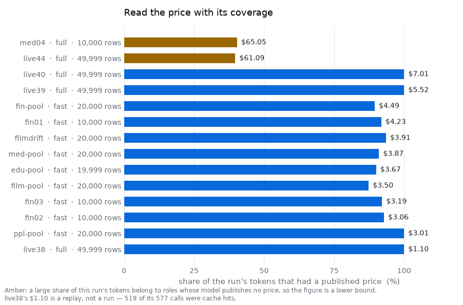
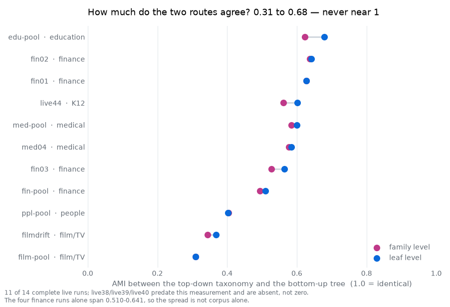
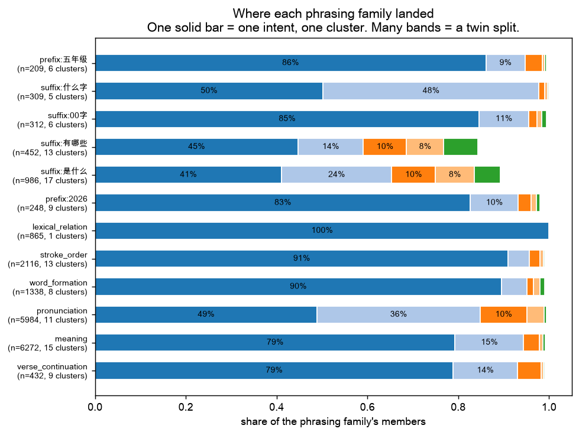
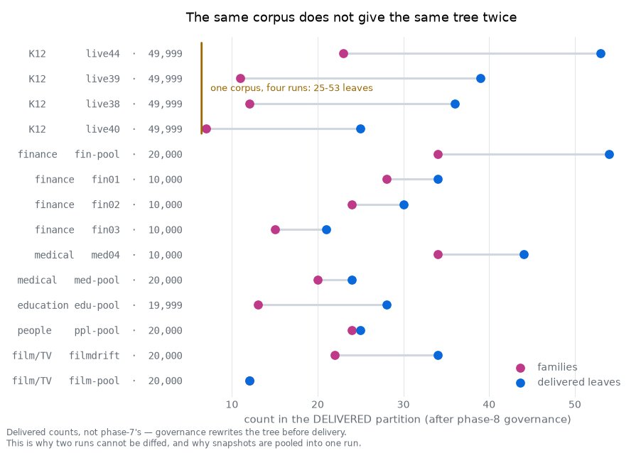
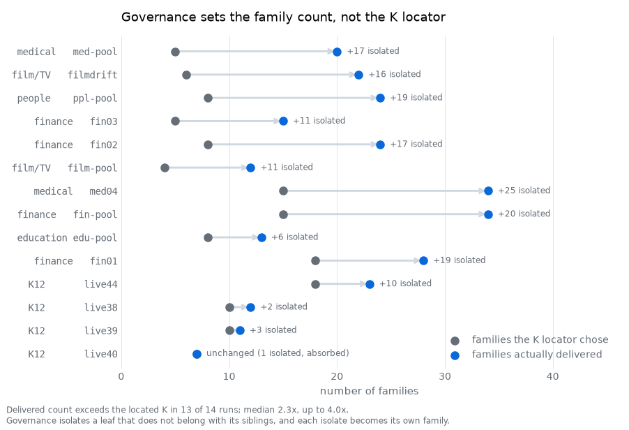

<!-- Moved out of README.md at the owner's request: the evidence is worth keeping
     in full, but it was more for a first-time reader to digest than the README
     should ask. Regenerate the tables and figures with `tools/run_evidence.py`
     and `tools/readme_figures.py`. -->

# Results — every complete live run

Fourteen complete runs on real models, across six corpora and two modes. Every
number below is read from an artifact in `runs/`, and
[`tools/run_evidence.py`](../tools/run_evidence.py) regenerates the whole table.

### Full runs — the ones that measured agreement

| run | corpus | rows | κ | n | L1 classes | leaves / families | calls | cost | hours |
|---|---|---:|---:|---:|---:|---:|---:|---:|---:|
| `live38` | K12 | 49,999 | 0.8221 | 2,991 | 22 | 36 / 12 | 577 | *(replay)* | 0.95 |
| `live39` | K12 | 49,999 | 0.8341 | 2,983 | 22 | 39 / 11 | 668 | **$5.52** | 3.36 |
| `live40` | K12 | 49,999 | 0.8427 | 2,982 | 25 | 25 / 7 | 696 | **$7.01** | 4.03 |
| `live44` | K12 | 49,999 | 0.8796 | 3,000 | 20 | 53 / 23 | 841 | $61.09 ⚠ | 9.81 |
| `med04` | medical | 10,000 | 0.8989 | 3,000 | 18 | 44 / 34 | 905 | $65.05 ⚠ | 7.90 |

**κ 0.8221–0.8989, every measurement on n ≈ 3,000** — a band across five runs and
two corpora, which is a different kind of claim from a single 0.89. Published
multi-annotator query-intent work lands around 0.79–0.82 (ORCAS-I: Cohen's 0.82 on
1,000 queries, two annotators; Product Insights: Fleiss 0.79 on 1,500, three), so
the band sits at the top of that range — read with the caveats in
[How to read that κ](#how-to-read-that-κ) below.

**⚠ on the two big numbers.** `$61.09` and `$65.05` are **lower bounds covering
about 40% of those runs' tokens**: 60.3% of live44's and 59.7% of med04's tokens
belong to roles whose model publishes no price, and those fall back to a frontier
rate. `run_summary.json` names them in `unpriced_roles`. `live39` and `live40` are
0% unpriced and are the honest anchors for what a full 50k run costs. `live38`'s
run was a replay — 519 of its 577 calls were cache hits — so it has no meaningful
price at all. This is the money version of the house rule about reading `n`.

<picture>
  <source media="(prefers-color-scheme: dark)" srcset="img/fig_cost_coverage_dark.png">
  
</picture>

### Fast runs — the same analysis, without the second opinion

| run | corpus | rows | L1 | leaves / families | calls | cost | hours |
|---|---|---:|---:|---:|---:|---:|---:|
| `fin-pool` | finance ×2 snapshots | 20,000 | 17 | 54 / 34 | 252 | $4.49 | 2.11 |
| `med-pool` | medical ×2 | 20,000 | 20 | 24 / 20 | 190 | $3.87 | 1.55 |
| `ppl-pool` | public figures ×2 | 20,000 | 16 | 25 / 24 | 208 | $3.01 | 1.29 |
| `edu-pool` | education ×2 | 19,999 | 20 | 28 / 13 | 197 | $3.67 | 1.47 |
| `film-pool` | film/TV ×2 | 20,000 | 15 | 12 / 12 | 167 | $3.50 | 1.07 |
| `filmdrift` | film/TV ×2 | 20,000 | 17 | 34 / 22 | 217 | $3.91 | 1.97 |
| `fin01` `fin02` `fin03` | finance | 10,000 | 20 / 19 / 16 | 34/28 · 30/24 · 21/15 | 234 / 194 / 193 | $4.23 / $3.06 / $3.19 | 2.40 / 1.75 / 1.35 |

Fast runs have **no κ at all** — one annotator, so there is nothing to compare.
That is recorded as absent, never as 1.0. All eleven pooled and fast runs above
score **21 PASS / 6 N/A / 0 FAIL** under [`tools/verify_run.py`](../tools/verify_run.py);
the six N/A are the checks whose components fast mode skipped, and a fast run's
PASS count is not comparable with a full run's.

### The two routes do not collapse into one

This is the measurement that justifies the architecture. If a cluster tree and an
intent taxonomy were saying the same thing, one of the two routes would be waste.

<picture>
  <source media="(prefers-color-scheme: dark)" srcset="img/fig_route_agreement_dark.png">
  
</picture>

Across every run that recorded it, agreement lands between **0.309 and 0.679 AMI**
and never approaches 1. Neither route is recoverable from the other, so both ship.

What that disagreement looks like up close, on `live44`: queries sharing one
phrasing template, and where the clustering put them.

`lexical_relation` is one bar at 100% — one phrasing family, one cluster, and the
two routes agree about it completely. `suffix:什么字` splits 50/48 across two
clusters: the same surface pattern carrying two different intents, which the
taxonomy separates and the geometry does not. Every point in the dot plot above is
a corpus-wide average over that mixture.
The spread looks like a corpus property — film/TV lowest, education highest — but
the four finance runs alone span 0.510–0.641, so run-to-run variance is a live
competing explanation and this measurement cannot separate them.

### The same corpus does not give the same tree twice

<picture>
  <source media="(prefers-color-scheme: dark)" srcset="img/fig_delivered_shape_dark.png">
  
</picture>

`film-pool` and `filmdrift` are the **same 20,000 rows** — corpora verified
byte-identical and in the same order — through the same config in the same mode.
They delivered **12 leaves / 12 families** and **34 leaves / 22 families**. The
four K12 runs, all on one 49,999-row file, span 25 to 53 leaves.

**Where the variance comes from.** Not from the K locator. It picks a family K,
and then phase-8 governance isolates leaves that do not belong with their
siblings — each isolate becoming its own family. The delivered count exceeds the
located K in **13 of 14 runs**, by a median of **2.3×** and up to 4.0× (`med-pool`,
5 → 20). Only `live40` delivered exactly the K it located.

<picture>
  <source media="(prefers-color-scheme: dark)" srcset="img/fig_governance_shift_dark.png">
  
</picture>

This is why the phase diagram's "K location" box is not where the delivered shape
is decided, and why anything presented as final is read from the delivered
partition rather than from the locator's output.

Two consequences, both load-bearing. A shape quoted from one run is not a property
of the corpus. And two runs' labels **cannot be diffed** — which is why comparing
time periods pools the snapshots into a single run rather than differencing two
([Comparing two time periods](../README.md#comparing-two-time-periods)).

### How to read that κ

It is agreement between two **LLM** annotators from different labs, not between
humans, and it is measured against the annotator's own self-consistency ceiling,
which is the number that makes it interpretable at all.

**The number shipped is the better of two rounds.** A guide-repair pass
re-annotates a fresh sample and the run keeps the repaired guide only if κ does not
fall. On four of the five full runs it *fell* and the guide was reverted — live38
0.8221 → 0.7944, live39 0.8341 → 0.8054, live40 0.8427 → 0.8425, live44 0.8796 →
0.8746 — and only `med04` improved, 0.8814 → 0.8989. So the table reports the
delivered guide's κ, which is the right number, but it is a maximum over two
attempts rather than a single measurement. Both rounds and their separate n are in
`gold_agreement.json` → `kappa_trace`; the keep-or-revert rule is
`graph/nodes/topdown.py`. Agreement degrades with
depth everywhere it has been measured: ORCAS-I's labeller scores 90.2% on three
top-level classes and 78.3% on five, and its residual "abstain" class scores
κ 0.303 where the real classes score 0.68–0.81. A pipeline reporting near-perfect
leaf-level agreement should be suspected, not celebrated. Roughly 3–5% of queries
have no single recoverable intent even for careful human assessors.

For contrast on why the gate exists at all: Rose & Levinson (2004), the
second-most-cited taxonomy in the field, was labelled by "one of the authors" and
reports no agreement statistic — its own Future Work section concedes the
framework still needed testing by judges other than the authors.

> **Read `n` before believing any metric.** That rule is in this repository
> because a κ of 0.813 was once computed on 199 of 600 rows after an outage and
> shipped as a methodology result. Coverage is now reported beside every score,
> and a row nobody labelled counts as missing data, not as agreement.

Three of the source methodology's counter-intuitive findings were reproduced
independently, as measurements rather than restatements: a smaller encoder beat a
larger one on clustering stability; silhouette would have chosen the α that
fragments intents worst; and HDBSCAN produced overwhelming noise at every
`min_cluster_size` tried.

---
