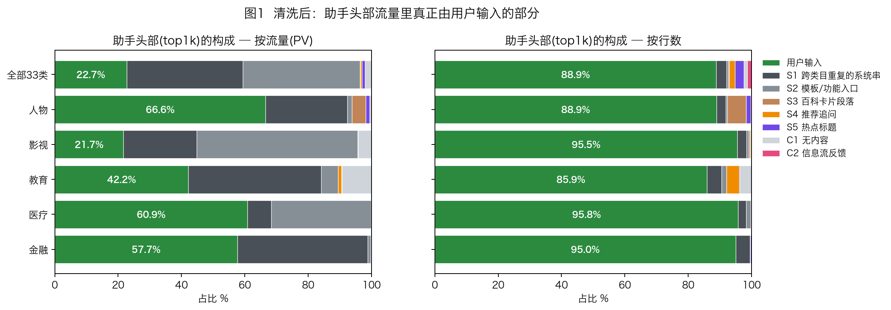
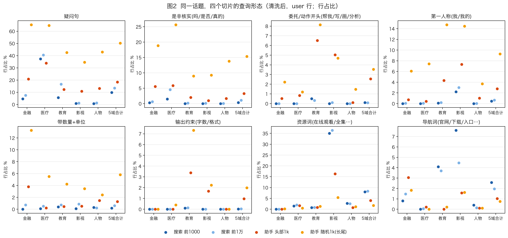
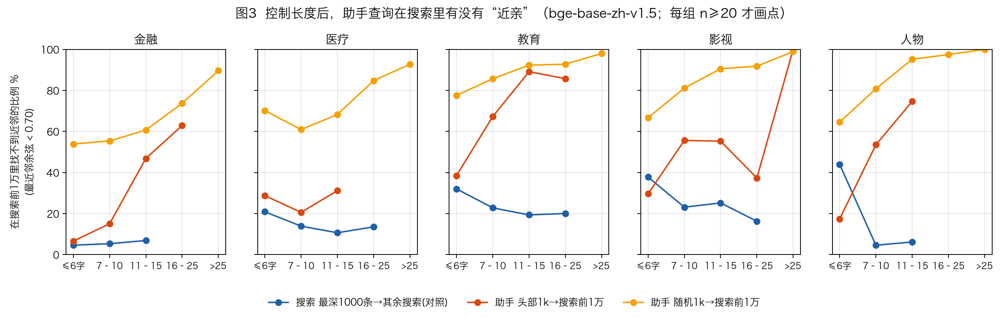
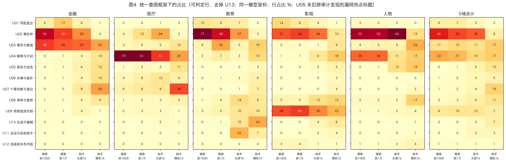
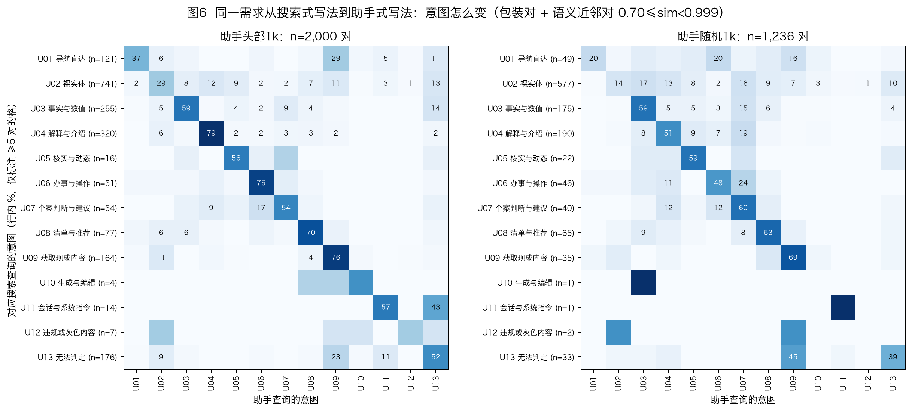
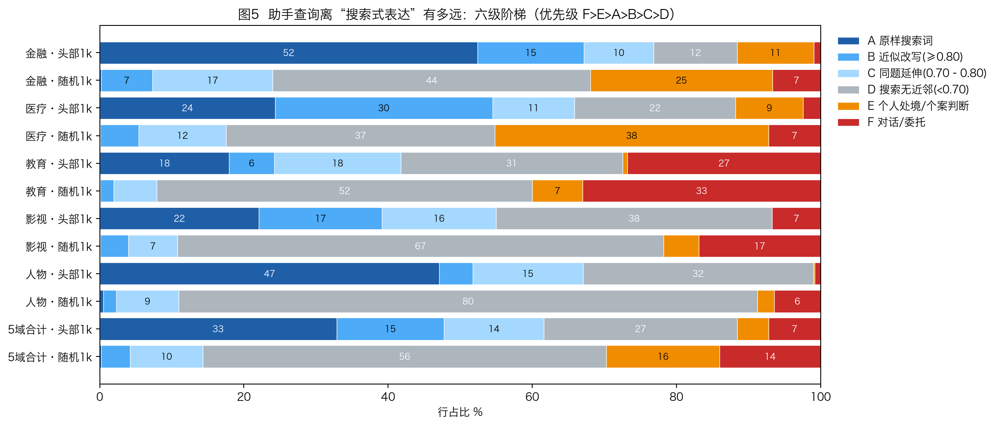

# 2026 同题对比：搜索 vs AI 助手 —— 清洗、查询形态、意图转移与用户画像

> **数据**：2026 年百度搜索 5 个垂类（金融 / 医疗 / 教育 / 影视 / 人物）各前 1 万条查询；2026 年百度系 AI 助手日志中同题的 5 个类目，每类“头部1k + 随机1k”。
> **方法**：7 层可审计清洗（两轮独立审计）；同一模型、同一 13 类意图框架、两边打乱盲标（另一家模型抽查一致性）；语义近邻；同一需求的意图转移；从搜索到助手的六级阶梯；分领域深挖。
> **所有数字都由代码从数据直接计算**，表格由脚本生成后原样插入；复现方式见附录 E。

**目录**

- [0. 一页结论](#0-一页结论)
- [1. 先读这一节：两份数据是什么、怎么比才公平](#1-先读这一节两份数据是什么怎么比才公平)
- [2. 清洗：把“系统替用户说的话”从用户提问里分出来](#2-清洗把系统替用户说的话从用户提问里分出来)
- [3. 查询形态：同一话题，两种写法](#3-查询形态同一话题两种写法)
- [4. 两边问的是不是同一批东西：原样重合、包装与语义近邻](#4-两边问的是不是同一批东西原样重合包装与语义近邻)
- [5. 意图：用同一把尺子量两边](#5-意图用同一把尺子量两边)
- [6. 用户画像与使用方式：谁在用、为什么选这个界面](#6-用户画像与使用方式谁在用为什么选这个界面)
- [7. 分领域深挖](#7-分领域深挖)
- [8. 对产品与运营的启示](#8-对产品与运营的启示)
- [9. 局限：哪些结论不能下](#9-局限哪些结论不能下)
- [附录 A–E](#附录-a清洗规则全文)

## 0. 一页结论

**一句话**：同一话题下，助手头部约有一半仍被当作搜索框使用。真正属于助手的需求——要一个判断、带着自己的处境来问、接着上一轮往下问、要一个做出来的东西——主要集中在助手的长尾，而且在五个领域里的样子完全不同。

**八个核心发现**（每条都能在正文的表格里找到依据）

1. **清洗是一切比较的前提。**
   - 5 个同题领域里，助手头部只有 41.2% 的流量是用户真正打出来的字；全部 33 类里只有 22.7%。其余是按钮、推荐问题、功能入口和推送卡片。
   - 不清洗会严重误读。例如影视助手头部“祈使句”的 PV 占比会显示为 58.6%，清洗后实际只有 2.9%。
   - 清洗规则经过两轮独立审计（§2）：助手侧新移除行的精度为 96.7%，推荐追问 96.0%，热点标题 90.0%；搜索侧被移除的 22 行热点标题精度只有 68.2%（只涉及 5 万行中的 22 行）。保留行里仍有约 7% 是系统文本，所以 5 域合计的比较中，头部差异不到 5 个百分点、长尾差异不到 7 个百分点的，不作解读。
2. **同样热门的头部，两边写法一样短。**
   - 搜索前1000 和助手头部1k 的查询长度中位数都是 6 字。“助手查询更长”只在助手长尾成立（13 字）。
   - “助手里问句更多”也不是普遍规律：医疗搜索头部的问句占 37.3%，助手头部 33.8%，差异不显著（95% 区间含 0）；去掉裸实体和无法判定两类后，反而是助手头部略高（42.5% vs 39.1%，同样不显著）（§3.2、§7.2）。
3. **助手头部有一半是搜索式表达，长尾基本不是。**
   - 助手头部 33.4% 与搜索原词一字不差（金融 52.2%，人物 47.0%），另有 14.9% 是近似改写。
   - 助手长尾与搜索原样重合的只有 0.2%，81.2% 在搜索前1万里找不到近邻（余弦 <0.70）。作为对照，搜索自己最冷门的 1000 条里，找不到近邻的只有 5.5%–27.9%。控制查询长度后，差距依然存在（§4、§6.1）。
4. **问题从“要一个知识点”变成“要一个判断”。**
   - 问句里“是不是 / 是否 / 真的吗”这类是非核实的占比：搜索前1000 3.7%，助手头部 17.1%，助手长尾 26.2%。
   - 当一个搜索词被原样写进更长的助手查询时，意图发生变化的比例在头部是 69%，在长尾是 92%；长尾包装对里最常见的变化是转向“事实与数值”和“解释与介绍”，而在语义近邻对里，长尾最常见的变化是转向“个案判断”（§3.3、§5.3）。
5. **意图差异分领域，不存在一个统一的“助手意图结构”。**
   - 医疗、人物：“解释与介绍”大幅减少（−37.6 与 −24.0 个百分点；人物即使按最坏情况修正清洗误差，差距仍约 19 个百分点）。
   - 金融：“个案判断与建议”从 0.1% 升到 8.5%（低于分领域可读门槛，只看方向）。
   - 教育：去掉 41.6% 的无法判定行后，“会话与系统指令”占 22.1%，“生成与编辑”占 10.0%（全部行口径为 12.9% 和 5.8%）。
   - 影视：“清单”和“解释”增加（+7.3 和 +7.9 个百分点，只看方向；其中一部分是疑似推荐问题的模板行）。
   - 五个领域合在一起，相对搜索前1万只剩“解释与介绍 −6.8pp”一项超过 5 个百分点的可读门槛，因为各领域的变化方向互相抵消。
   - 两家公司的模型对这些差异的方向判断全部一致（对比搜索前1000 为 32/32，对比搜索前1万为 30/30）（§5）。
6. **从文字能推断出几类提问者**（均为推断，依据与反证条件见 §6.2）。
   - 金融：看价的人、要判断的散户、看不懂银行通知的储户。账户异常解读占助手头部 6.2%，搜索前1000 为 0。（可能受两份数据相隔两个月影响）
   - 医疗：查百科的人；带着症状和检查结果来问的患者与家属（长尾 28.6% 陈述了个人处境）；找医院、问价格的人（助手头部点名医院或科室的占 6.7%，搜索头部为 0）。“在助手里更敢问隐私”的猜想没有得到支持。
   - 教育：做作业、写作文的中小学生和家长。
   - 影视：找片源的人、到助手里问演员表和结局的追剧者、同人创作者，以及用图片做视频的人。
   - 人物：追热点的人（多是从热点点进来），以及查询身边普通人的人。助手长尾有 12.5% 在问老师、基层干部等非公众个人，这是准确性和隐私风险最高的一类（§6、§7）。
7. **需求为什么会分到两个界面，可以归为六个机制**：要页面还是要判断；上下文是否在对话或图片里；是否要一个具体的去处或价格；是否需要一个做出来的成品；产品入口与推送；导航、资源、实时数据这类需求仍留在搜索（§6.3）。
8. **最值得先做的四件事**（§8）：
   - 把助手头部当“更好用的搜索框”，先出结构化结果卡。
   - 需求看板改用清洗后的口径，并记录每条查询的来源。
   - 为判断型问题设计“先结论、后条件、再风险”的回答结构，医疗和金融加护栏，并审核产品自己生成的追问。
   - 把“拍题 → 追问 → 改写”的上下文链路做顺。

**不能下的结论**：两份数据相隔约两个月，没有用户 ID，助手只有一个产品。所以这是**“同一需求在两个界面上怎么被表达”**的对比，不能当作“用户从搜索迁移到助手”的证据（§9）。

## 1. 先读这一节：两份数据是什么、怎么比才公平

### 1.1 两份数据

| | 2026 搜索 | 2026 AI 助手 |
|---|---|---|
| 来源 | 百度搜索 5 个垂类的查询导出 | 百度系 AI 助手的查询日志（用户在查询里直接称呼“文心”“小度”“文心助手”） |
| 话题范围 | 金融、医疗、教育、影视、人物 | 33 个话题类目；其中「金融 / 医疗 / 教育培训 / 影视动漫 / 人物」5 类与搜索同题，**本报告只比这 5 类** |
| 抽样方式 | 每个垂类按流量（`wise_pv`）取前 1 万条 | 每类两层：**头部1k** = 按流量（`search_num`）取前 1000 条；**随机1k** = 从该类全部去重查询里均匀随机抽 1000 条 |
| 时间 | 快照标记为 2026-07-01；带“X月X日”的查询以“7月1日”为主 | 未标注采集日期；359 条带“X月X日”的查询里，131 条落在 8 月 24 日—9 月 1 日这 9 天内，是最集中的窗口，推断采集于 2026 年 8 月下旬前后 |
| 一行代表什么 | 一个查询串及其 PV | 一个查询串及其 PV（随机1k 的中位 PV 为 1） |

有两点会直接影响怎么读后面的结论：

1. **两份数据相隔约两个月。** 事件驱动的查询（人物领域的去世、恋情、落马、任免，影视领域的热播剧）两边自然不同。本报告里凡是涉及具体热点人物、剧名的差异，都不当作“界面差异”。
2. **两边的 PV 不是同一把尺子。** 两个产品的流量规模相差一个数量级以上，PV 数值不能跨界面直接比较，只能在各自界面内部换算成占比再比。

### 1.2 为什么要“同深度”比较：本报告用的四个切片

#### T1 数据规模与流量截断点（全部行，含非 user 层）
| 领域 | 搜索第1名 PV | 搜索第1000名 PV（user） | 搜索第1万名 PV（导出下限） | 搜索前1000 占前1万 PV | 搜索前1万 总PV | 助手头部1k 第1名 PV | 助手头部1k 第1000名 PV | 助手头部1k 中位 PV | 助手头部1k 总PV | 助手随机1k 中位 PV |
|---|---|---|---|---|---|---|---|---|---|---|
| 金融 | 805,760 | 1,522 | 158 | 66.4% | 10,896,795 | 37,947 | 44 | 80 | 282,146 | 1 |
| 医疗 | 18,973 | 1,012 | 166 | 39.2% | 5,208,934 | 23,045 | 117 | 177 | 430,112 | 1 |
| 教育 | 72,728 | 2,940 | 477 | 44.9% | 14,802,866 | 135,232 | 280 | 504 | 2,082,968 | 1 |
| 影视 | 328,769 | 2,060 | 284 | 54.5% | 12,498,594 | 484,269 | 100 | 171 | 1,255,937 | 1 |
| 人物 | 178,847 | 1,341 | 179 | 53.7% | 7,794,757 | 25,288 | 107 | 180 | 362,365 | 1 |

从这张表能看出三件事，它们决定了比较怎么做：

- **头部对头部（主比较）：搜索前1000 vs 助手头部1k。** 两者都是“这个话题在该界面上被问得最多的约 1000 个问题”，排名口径一致。
- **覆盖面（第二视角）：搜索前1万 vs 助手头部1k。** 助手头部第 1000 名的 PV 只有 44–280，比搜索第 1 万名（158–477）还低，也就是说，按绝对流量，整个搜索前1万都在助手头部的门槛之上；搜索前1万的总 PV 是助手头部1k 的 7–39 倍。另外，搜索前1000 只占前1万流量的 39.2%–66.4%，而且在个别领域，“最头部”本身很特殊（教育搜索前1000 里大部分是裸校名，见 §5）。所以两个搜索切片都要看：**一个结论只有在两个视角下方向一致，才算稳。**
- **助手随机1k 是助手的长尾，搜索里没有对应物。** 搜索导出的最低 PV 是 158–477，而助手随机1k 的中位 PV 是 1。所以“助手随机1k vs 任何搜索切片”永远是“长尾 vs 头部”，只能作为参照，不能当作界面差异。

> **一条贯穿全文的规则：头部与长尾之间的差异，不能写成搜索与助手之间的差异。** 凡是只在“助手随机1k”上出现的现象，本报告都明确标注为“助手长尾特征”。

### 1.3 这版报告和上一版有什么不同

- **更正。** 上一版《DRIFT_2025_2026_WITH_ASSISTANT》§3.3 说“同一话题同一年两个界面 15 项对比全部同向”，其中混入了“搜索头部 vs 助手长尾”的抽样差异。同深度下，两边的查询长度中位数都是 6 字（§3.1），原文已加更正框。
- **清洗。** 从一次性剔除升级为 7 个可审计的层级，经过两轮独立审计（§2）。
- **意图比较。** 不再把两边各自的分类体系“映射”到一起比份额；映射结果与逐条统一标注在助手头部只有约三分之一一致（§5.1）。改为同一个模型、同一套 13 类框架，把两边查询打乱后**盲标**，并用另一家的模型抽查一致性。
- **新增分析。** 搜索前1万切片、语义近邻、同一需求的意图转移、从搜索到助手的六级阶梯。

### 1.4 读数须知

- **行占比**：某类查询在切片里占多少条。**PV 占比**：这些查询的流量占切片总流量多少。PV 占比容易被少数超高流量的串左右（§2 会看到清洗前后 PV 占比能差几十个百分点），所以**本报告默认用行占比，PV 占比只作补充**，且只在清洗后计算。
- **置信区间**：占比都附 Wilson 95% 置信区间，差异附 Newcombe 95% 置信区间。每个切片约 1000 行，单个占比的误差大约是 ±1 到 ±3 个百分点。
- **最小可读差异**：依据第二轮清洗审计（§2.3）：5 域合计的比较中，头部差异小于 5 个百分点、长尾差异小于 7 个百分点的不作解读。分领域比较时，只解读大于该领域漏检率 95% 上界的差异（头部：金融 8.9%、医疗 6.0%、教育 15.9%、影视 15.9%、人物 31.8%；长尾：金融、医疗、教育 12.9%，影视 23.1%，人物 19.9%），其余只看方向；人物头部的小类别差异一律不解读。“核实与动态（U05）”在助手头部被漏网的热点标题抬高，普查修正后的数字见 §5.2。
- **U13（无法判定）**：助手头部有大量脱离上下文就看不懂的短片段，例如“S”“价格”“怎么治”。意图占比会同时给出“全部行”和“去掉 U13 的可判定行”两个口径。
- **例子**：全部是数据中的真实行。涉及普通个人信息、色情内容，或涉及未成年人隐私与性内容的行只作概括描述，不引用原文；过长的行用“…”截断。括号里的数字会注明是 PV 还是搜索排名。

---

## 2. 清洗：把“系统替用户说的话”从用户提问里分出来

### 2.1 不清洗会错到什么程度

助手日志记录的不只是用户打的字，还有用户**点击**产品给出的按钮、推荐问题、功能入口时产生的文字。这些串往往单条就有几万到几十万 PV。不把它们分出来，任何按 PV 加权的指标说的都是产品界面，而不是用户：

- **影视助手头部**：清洗前，PV 加权的祈使句（帮我…/写…/生成…）占比是 58.6%，清洗后只有 2.9%。原因是“生成视频”（484,269 PV）、“帮我生成一个视频”（228,532 PV）这类功能入口串单条就占了大量流量。
- **医疗助手头部**：PV 加权疑问句占比从 52.3% 降到 34.7%。产品推送的健康问答卡片（如“鼻炎发作只能吃药缓解吗？哪些诱因容易引发鼻炎？日常怎样养护鼻腔黏膜？”，23,045 PV）一条的流量抵得上上百条真实提问。
- **人物助手头部**：超过 60 字的行占比从 6.4% 降到 0.2%，疑问句行占比从 16.7% 降到 13.2%。原因是百科卡片段落（“张又侠，男，汉族，1950年7月生…”）及其下方的模板化追问被当成了“用户写长问题”。
- **金融助手头部**：“👌 好的，继续吧 / 🆗 行，继续吧”两条按钮串占 38.6% 的 PV（整个跨类目系统串层占 41.1%），把真实问句的 PV 占比从 16.0% 稀释成了 9.2%。

### 2.2 七个层级：定义、规则与真实例子

**原则：不删除任何行，只给每行打层级标签。** 所有指标都可以选择包含或排除某个层级重新计算。一行同时命中多条规则时，优先级为 S1 > S2 > S3 > S4 > S5 > C1 > C2。

| 层级 | 是什么 | 判定规则（摘要，全文见附录 A） | 5 域中的真实例子（PV） |
|---|---|---|---|
| **S1 跨类目重复的系统串** | 继续按钮、推荐回复、被点击的通用文案 | 头部里同一字符串出现在 ≥10 个话题类目，或出现在 ≥3 个类目且 ≥6 字 | “👌 好的，继续吧”（金融 37,947）；教育的“嗯”（135,232）、“需要”（131,458）、“要”（86,538）；影视的“帮我生成一个视频”（228,532） |
| **S2 模板 / 功能入口** | 产品模板、工具按钮、功能入口、行动按钮 | ≥15 字且 ≥1,000 PV 的同一长串（关键词型查询豁免）；标点完整的句子且 ≥3,000 PV；≤6 字且 ≥1 万 PV 的工具面板指令；已核实的功能入口名单 | 影视的“生成视频”（484,269）、“滤镜”（91,174）；教育的“帮我全网文本搜题”（45,118）、“翻译文字”（30,022）、“领取AI志愿报告”（9,774）；医疗的健康卡片三连问（每条约 2.2 万） |
| **S3 百科卡片段落** | 人物或作品的百科卡片文字，常附模板化追问 | 百科句式（“，男，”“出生于”“是由…出品”等）且 >40 字；或以“姓名，男/女，”开头 | “陈武（1954年11月-2026年8月24日），男，壮族…”（人物 939）；“《早春晴朗》是由乐酷匠心（济南）影视文化有限公司制作，优酷出品…”（影视 272） |
| **S4 推荐追问** | 产品在回答下方给出、可一键点击的追问 | “能否 / 可否…”开头、“有没有更…的…”、“如果以上…”、“该公司…”等句式 | “能否再写一篇不同角度的作文”（教育 2,196）、“能否再简化一下这篇作文”（1,643）；“如果以上方法都无效，该怎么办”（医疗 174） |
| **S5 热点标题** | 被点击的热点新闻标题 | 新闻标题句法（去世 / 离世 / 回应 / 被查 / 官宣 / 曝光…）、不含疑问或请求词、PV ≥100；只作用于头部；**搜索和助手执行同一规则** | 助手：`“世界最年轻国王”突然离世`（人物 886）、“景甜回应”（597）；搜索：“陈翔六点半妹爷扮演者去世”（2,086）、“李小璐回应无戏可拍”（1,504） |
| **C1 无内容** | 确认语、是 / 否、语气词、问候、唤醒词、纯标点表情 | 规则列表；**搜索侧只去掉纯标点和多字确认语**，因为单个字在搜索框里可能是查字 | 助手：“哈哈哈”（影视 52,880）、“啊”（教育 41,696）、“不是”（教育 12,500）；搜索：教育垂类的“,”“。”等标点和“嗯嗯”“好的”等确认语（共 18 行） |
| **C2 信息流反馈** | 对推荐内容的反馈 | “多推 / 别再给我推…视频”等 | “继续推荐”“如何把推荐他人的作品关掉”（影视随机1k） |

#### T2 清洗分层（v3）：行数与流量
| 层级 | 助手头部1k·5域 行 | 助手随机1k·5域 行 | 助手头部1k·全33类 行 | 助手随机1k·全33类 行 | 搜索前1万·5域 行 | 助手头部1k·5域 PV占比 | 助手随机1k·5域 PV占比 | 助手头部1k·全33类 PV占比 | 助手随机1k·全33类 PV占比 | 搜索前1万·5域 PV占比 |
|---|---|---|---|---|---|---|---|---|---|---|
| 用户输入(user) | 4,611 (92.2%) | 4,887 (97.7%) | 29,312 (88.9%) | 31,969 (96.9%) | 49,959 (99.9%) | 41.2% | 97.3% | 22.7% | 94.5% | 99.9% |
| S1 跨类目重复系统串 | 175 (3.5%) | 0 (0.0%) | 1,070 (3.2%) | 0 (0.0%) | 0 (0.0%) | 31.8% | 0.0% | 36.6% | 0.0% | 0.0% |
| S2 模板/功能入口 | 42 (0.8%) | 0 (0.0%) | 216 (0.7%) | 0 (0.0%) | 0 (0.0%) | 20.3% | 0.0% | 37.1% | 0.0% | 0.0% |
| S3 百科卡片段落 | 64 (1.3%) | 26 (0.5%) | 85 (0.3%) | 47 (0.1%) | 0 (0.0%) | 0.4% | 1.2% | 0.1% | 0.2% | 0.0% |
| S4 推荐追问 | 43 (0.9%) | 85 (1.7%) | 581 (1.8%) | 557 (1.7%) | 0 (0.0%) | 0.5% | 1.5% | 0.6% | 1.6% | 0.0% |
| S5 热点标题 | 22 (0.4%) | 0 (0.0%) | 904 (2.7%) | 0 (0.0%) | 22 (0.0%) | 0.1% | 0.0% | 0.9% | 0.0% | 0.0% |
| C1 无内容 | 43 (0.9%) | 0 (0.0%) | 362 (1.1%) | 29 (0.1%) | 18 (0.0%) | 5.7% | 0.0% | 2.0% | 1.9% | 0.0% |
| C2 信息流反馈 | 0 (0.0%) | 2 (0.0%) | 456 (1.4%) | 398 (1.2%) | 0 (0.0%) | 0.0% | 0.0% | 0.0% | 1.8% | 0.0% |

### 2.3 两轮独立审计

**第一轮审计（针对上一版规则 v2）**：由独立审计员先写好判定标准，再逐条盲判。

| 层级 | 抽样 | 精度（判对的删除 / 全部删除）[95% CI] | PV 加权精度 |
|---|---|---|---|
| S1 跨类目重复 | 全层普查 1,103 行 | 0.964 [0.951, 0.973] | 0.999 |
| S2 模板 / 功能入口 | 随机 150 行 | 0.851 [0.785, 0.900] | 0.998（流量前 50） |
| C1 无内容 | 随机 150 行 | 0.966 [0.923, 0.985] | 0.988（流量前 50） |
| C2 信息流反馈 | 全层普查 854 行 | 0.998 [0.991, 0.999] | 1.000 |
| **被保留为 user 的头部行里的漏网** | 随机 300 行 | **漏检率 11.3% [8.2, 15.4]** | — |

结论是“删得准，漏得多”。漏网的主要是推荐追问、热点标题、百科卡片，以及“不是 / 不对”这类是非应答。它们集中在少数意图类：“核实与动态”一类被抬高了约一倍。同时也发现了少量误删：打字输入的“这是谁”、关键词型的长查询（如“2026年养老金调整方案何时公布”）、单独出现的其他 AI 产品名（“豆包” 5,900 PV），以及非中文文字的提问。

**据此形成 v3 规则**：新增 S4、S5；S3 增加“姓名，男/女，”句式；C1 增加是非应答和告别语；撤销上述误删；搜索侧 C1 收窄。v3 相对 v2，在 5 个同题领域的头部只改动了 78 行（1.6%，占 PV 2.1%），但改动恰好落在最容易扭曲意图比较的地方。

**第二轮审计（针对 v3，全新抽样，不重复第一轮看过的行）**：由另一位独立审计员完成，只用全新样本，第一轮看过的字符串一律排除。审计员先写好判定标准，拿到的是隐去层级的名单，逐条盲判。

| 样本 | 行数 | 结果 [95% CI] |
|---|---|---|
| 5 域助手头部保留下来的 user 行 | 300（每域 60） | **漏检率 7.0% [4.6, 10.5]**；按 PV 加权为 6.1% |
| 其中人物头部 | 60 | **漏检率 20.0% [11.8, 31.8]**；其余四域为 0–6.7% |
| 5 域助手长尾保留下来的 user 行 | 200 | 漏检率 5.0% [2.7, 9.0] |
| v3 新移除的行 | 150 | 精度 96.7% [92.4, 98.6] |
| S4 推荐追问（全 33 类随机 100 行） | 100 | 精度 96.0% [90.2, 98.4] |
| S5 热点标题（全 33 类随机 100 行） | 100 | 精度 90.0% [82.6, 94.5] |
| 搜索前1000 保留行（每域 30 行） | 150 | 漏检率 0.0% [0, 2.5] |
| 搜索被移除的热点标题行（全部 22 行，均为新样本） | 22 | 精度 68.2% [47.3, 83.6] |
| **助手头部所有“核实与动态”（U05）行（普查）** | 182 | **51.6% [44.4, 58.8] 是系统文本** |

**主要发现**

- **漏网集中在“核实与动态”一类。** 头部 21 条漏网里有 12 条是 U05，其中 10 条是人物领域没被规则识别出的热点标题或话题串。
- **按普查结果修正**：5 域助手头部 U05 的占比（全部行口径）从 3.95% 降到 2.05%，人物头部从 11.0% 降到 3.7%。修正后，搜索与助手头部在 U05 上的差距只剩约 1.8 个百分点，只能看方向。
- **“看不清”的行**：头部有 11.3%、长尾有 12.5% 的行，审计员也无法判断是用户输入还是系统文本。头部这类行多是教育领域的单字碎片，本报告已在意图比较中单列 U13 口径。
- **大差异经得起检验**（全部行口径）：裸实体（搜索头部约 44% vs 助手头部约 30%；可判定口径为 44.8% vs 36.0%）、解释与介绍（约 23% vs 约 12%）、助手长尾的个案判断（约 14%，搜索约 1%）。

**审计还提出了几条新规则**，都在规则制定时没用过的样本上验证过精度：`有没有更多…` 追问 12/13；裸回复（“什么”“随便”等）6/6；信息流话题标签 `#…#` 30/30；作文编辑模板 `我想对作文《…` 14/14；搜索侧热点标题的三条豁免。

本报告**没有据此再出一版清洗**。原因是所有表格、图和五份领域深挖都建立在 v3 上，再改一版会造成前后不一致。审计结论以两种方式进入报告：

1. 对 U05 给出普查修正后的数字（§5.2）；
2. 设定最小可读差异（§1.4）。

这些规则留作下一轮数据的清洗升级。领域深挖另外发现了三处残留，同样留待下一轮处理：

- 影视头部有 31 行疑似剧集卡片推荐问题的《X》模板；
- 金融头部有 10 行句式完全相同的“XX未来有上涨空间吗”；
- 金融有 1 行被误删的银行通知解读（“农业银行显示可用余额0账户余额300”）。

### 2.4 清洗后：助手头部流量里有多少是用户真正输入的



#### T3 各领域助手头部1k 的流量构成（PV 占比；括号内为行占比）
| 领域 | 用户输入(user) | S1 跨类目重复系统串 | S2 模板/功能入口 | S3 百科卡片段落 | S4 推荐追问 | S5 热点标题 | C1 无内容 | C2 信息流反馈 |
|---|---|---|---|---|---|---|---|---|
| 金融 | 57.7% (95.0%) | 41.1% (4.5%) | 1.0% (0.1%) | 0.0% (0.0%) | 0.0% (0.0%) | 0.3% (0.4%) | 0.0% (0.0%) | 0.0% (0.0%) |
| 医疗 | 60.9% (95.8%) | 7.5% (2.5%) | 31.4% (1.4%) | 0.0% (0.0%) | 0.0% (0.1%) | 0.0% (0.1%) | 0.1% (0.1%) | 0.0% (0.0%) |
| 教育 | 42.2% (85.9%) | 41.9% (4.6%) | 5.4% (1.6%) | 0.0% (0.0%) | 1.1% (4.0%) | 0.1% (0.2%) | 9.3% (3.7%) | 0.0% (0.0%) |
| 影视 | 21.7% (95.5%) | 23.2% (2.9%) | 50.8% (0.7%) | 0.1% (0.4%) | 0.0% (0.2%) | 0.0% (0.0%) | 4.3% (0.3%) | 0.0% (0.0%) |
| 人物 | 66.6% (88.9%) | 25.8% (3.0%) | 1.4% (0.4%) | 4.4% (6.0%) | 0.0% (0.0%) | 1.2% (1.5%) | 0.6% (0.2%) | 0.0% (0.0%) |
| 全33类 | 22.7% (88.9%) | 36.6% (3.2%) | 37.1% (0.7%) | 0.1% (0.3%) | 0.6% (1.8%) | 0.9% (2.7%) | 2.0% (1.1%) | 0.0% (1.4%) |

- **5 域合计**：头部 92.2% 的**行**是用户输入，但只占 41.2% 的**流量**。放到全部 33 个类目，用户输入只占头部流量的 22.7%。长尾（随机1k）里用户输入占流量 97.3%。
- **各领域“非用户流量”的来源不同，这本身就是产品使用信号：**
  - **影视**：50.8% 的 PV 是功能入口（主要是“生成视频 / 变视频 / 滤镜”），23.2% 是跨类目系统串（其中“帮我生成一个视频”一条占 18.2%）。影视类助手流量的大头是“拿图片做视频”的功能使用，而不是打字提问。
  - **教育**：41.9% 的 PV 是跨类目系统串，其中推荐回复“需要 / 嗯 / 要”约 17.5%、“好的，继续吧”类按钮约 16.0%；另有 9.3% 是无内容应答。大量流量发生在多轮对话的应答轮次里。
  - **金融**：41.1% 的 PV 是跨类目系统串，其中“👌 好的，继续吧 / 🆗 行，继续吧”两条占 38.6%。
  - **医疗**：31.4% 的 PV 是产品推送的健康问答卡片。
  - **人物**：25.8% 是跨类目系统串，4.4% 是百科卡片段落，1.2% 是热点标题。
- **搜索侧几乎不受影响**：5 个垂类前1万共 49,999 行，只标出 40 行（教育垂类 18 行标点和确认语、22 行热点标题），合计不到 0.1% 的 PV。

### 2.5 清洗对指标的影响

#### T4 清洗对助手头部1k 指标的影响（全部行 → 仅 user 行；行占比 / PV 占比）
| 领域 | 行数 | 长度中位 | >60字 行占比 | 疑问句 行% | 疑问句 PV% | 祈使句(严格) 行% | 祈使句(严格) PV% | 第一人称 行% | 第一人称 PV% | 资源词 行% | 资源词 PV% |
|---|---|---|---|---|---|---|---|---|---|---|---|
| 金融 | 1,000→950 | 7→7 | 0.2%→0.2% | 19.8%→20.8% | 9.2%→16.0% | 0.1%→0.1% | 0.0%→0.0% | 0.7%→0.7% | 0.1%→0.2% | 0.0%→0.0% | 0.0%→0.0% |
| 医疗 | 1,000→958 | 7→7 | 0.0%→0.0% | 33.8%→33.8% | 52.3%→34.7% | 0.4%→0.4% | 0.2%→0.4% | 0.4%→0.4% | 0.2%→0.4% | 1.7%→1.7% | 2.4%→3.9% |
| 教育 | 1,000→859 | 3→3 | 0.8%→0.0% | 10.7%→12.2% | 4.5%→10.4% | 7.2%→5.4% | 7.8%→6.3% | 4.9%→4.3% | 5.7%→5.5% | 0.8%→0.8% | 0.3%→0.5% |
| 影视 | 1,000→955 | 8→8 | 1.1%→0.7% | 10.8%→10.8% | 3.1%→13.8% | 4.2%→4.0% | 58.6%→2.9% | 7.3%→7.3% | 21.0%→7.5% | 15.6%→16.3% | 3.7%→17.2% |
| 人物 | 1,000→889 | 4→3 | 6.4%→0.2% | 16.7%→13.2% | 14.0%→14.7% | 0.1%→0.1% | 0.1%→0.1% | 3.0%→1.0% | 2.5%→1.5% | 0.9%→0.8% | 0.6%→0.8% |

行占比的变化普遍很小（多数不到 1 个百分点；人物因为百科段落较多而例外），PV 加权指标却可能变化几十个百分点。这就是本报告默认使用行占比的原因。

---

## 3. 查询形态：同一话题，两种写法

下文所有指标都在清洗后的 user 行上计算，覆盖四个切片。



#### T5 查询形态（user 行；行占比）
| 领域·切片 | n | 长度中位/p90 | 疑问句 | 是非核实 | 委托/动作开头 | 第一人称 | 称呼对方(你/您) | 回指上文 | 句首承接 | 输出约束 | 带数量+单位 | 带具体日期 | 具名二选一比较 | 资源词 | 导航词 |
|---|---|---|---|---|---|---|---|---|---|---|---|---|---|---|---|
| 金融·搜索前1000 | 1,000 | 6/9 | 4.6% | 0.3% | 0.0% | 0.0% | 0.0% | 0.0% | 0.1% | 0.0% | 0.0% | 0.0% | 0.0% | 0.0% | 0.8% |
| 金融·搜索前1万 | 9,999 | 6/11 | 7.5% | 0.7% | 0.0% | 0.1% | 0.0% | 0.0% | 0.1% | 0.0% | 0.7% | 0.1% | 0.1% | 0.0% | 1.5% |
| 金融·助手头部1k | 950 | 7/13 | 20.8% | 5.6% | 0.5% | 0.7% | 0.1% | 0.0% | 0.0% | 0.0% | 3.8% | 0.4% | 0.9% | 0.0% | 3.1% |
| 金融·助手随机1k | 987 | 14/25 | 65.3% | 18.8% | 2.2% | 6.1% | 1.7% | 0.5% | 1.8% | 0.0% | 13.3% | 3.7% | 2.4% | 0.2% | 1.8% |
| 医疗·搜索前1000 | 1,000 | 11/14 | 37.3% | 1.5% | 0.0% | 0.0% | 0.0% | 0.2% | 0.0% | 0.0% | 0.1% | 0.0% | 0.0% | 1.5% | 0.0% |
| 医疗·搜索前1万 | 9,998 | 10/14 | 40.5% | 4.5% | 0.0% | 0.1% | 0.0% | 0.1% | 0.0% | 0.0% | 0.5% | 0.0% | 0.5% | 2.0% | 0.1% |
| 医疗·助手头部1k | 958 | 7/12 | 33.8% | 5.8% | 0.8% | 0.4% | 0.2% | 0.2% | 0.1% | 0.0% | 0.2% | 0.0% | 0.0% | 1.7% | 0.2% |
| 医疗·助手随机1k | 998 | 13/29 | 64.7% | 25.7% | 1.2% | 7.4% | 1.8% | 1.0% | 1.5% | 0.4% | 5.5% | 0.7% | 1.7% | 0.5% | 0.0% |
| 教育·搜索前1000 | 1,000 | 6/10 | 5.6% | 0.0% | 0.5% | 0.1% | 0.0% | 0.0% | 0.1% | 0.1% | 0.4% | 0.0% | 0.0% | 0.8% | 4.1% |
| 教育·搜索前1万 | 9,981 | 6/12 | 16.6% | 0.2% | 0.3% | 0.2% | 0.1% | 0.0% | 0.1% | 0.1% | 0.7% | 0.0% | 0.3% | 0.8% | 3.7% |
| 教育·助手头部1k | 859 | 3/10 | 12.2% | 2.0% | 6.5% | 4.3% | 0.2% | 2.8% | 1.7% | 3.4% | 0.5% | 0.0% | 0.2% | 0.8% | 0.0% |
| 教育·助手随机1k | 970 | 14/34 | 42.6% | 9.0% | 8.1% | 14.7% | 2.8% | 3.4% | 2.3% | 7.3% | 4.2% | 0.2% | 1.5% | 1.3% | 0.2% |
| 影视·搜索前1000 | 1,000 | 8/15 | 0.8% | 0.0% | 0.0% | 2.2% | 1.3% | 0.0% | 0.0% | 0.0% | 0.1% | 0.0% | 0.0% | 35.0% | 7.6% |
| 影视·搜索前1万 | 9,999 | 9/16 | 1.1% | 0.1% | 0.1% | 3.0% | 1.4% | 0.0% | 0.0% | 0.0% | 0.9% | 0.0% | 0.0% | 36.4% | 4.5% |
| 影视·助手头部1k | 955 | 8/15 | 10.8% | 0.9% | 5.0% | 7.3% | 2.0% | 0.0% | 0.1% | 1.7% | 0.5% | 0.1% | 0.0% | 16.3% | 1.6% |
| 影视·助手随机1k | 982 | 14/45 | 34.5% | 9.3% | 4.7% | 14.5% | 5.6% | 0.7% | 3.3% | 2.2% | 3.5% | 0.7% | 0.7% | 5.4% | 1.6% |
| 人物·搜索前1000 | 1,000 | 4/10 | 0.7% | 0.0% | 0.0% | 0.0% | 0.0% | 0.0% | 0.0% | 0.0% | 0.3% | 0.0% | 0.0% | 2.7% | 0.4% |
| 人物·搜索前1万 | 9,982 | 4/10 | 1.3% | 0.1% | 0.0% | 0.0% | 0.0% | 0.0% | 0.0% | 0.0% | 0.2% | 0.0% | 0.0% | 2.6% | 0.1% |
| 人物·助手头部1k | 889 | 3/11 | 13.2% | 1.7% | 0.1% | 1.0% | 0.2% | 0.0% | 0.1% | 0.0% | 1.5% | 0.0% | 0.0% | 0.8% | 0.1% |
| 人物·助手随机1k | 950 | 12/19 | 42.9% | 13.8% | 1.5% | 3.7% | 1.3% | 0.1% | 1.9% | 0.0% | 2.4% | 0.7% | 0.4% | 1.2% | 0.1% |
| 5域合计·搜索前1000 | 5,000 | 6/13 | 9.8% | 0.4% | 0.1% | 0.5% | 0.3% | 0.0% | 0.0% | 0.0% | 0.2% | 0.0% | 0.0% | 8.0% | 2.6% |
| 5域合计·搜索前1万 | 49,959 | 7/13 | 13.4% | 1.1% | 0.1% | 0.7% | 0.3% | 0.0% | 0.0% | 0.0% | 0.6% | 0.0% | 0.2% | 8.4% | 2.0% |
| 5域合计·助手头部1k | 4,611 | 6/13 | 18.4% | 3.3% | 2.6% | 2.8% | 0.6% | 0.6% | 0.4% | 1.0% | 1.3% | 0.1% | 0.2% | 4.0% | 1.0% |
| 5域合计·助手随机1k | 4,887 | 13/30 | 50.2% | 15.4% | 3.5% | 9.3% | 2.6% | 1.1% | 2.1% | 2.0% | 5.8% | 1.2% | 1.4% | 1.7% | 0.8% |

### 3.1 长度：头部一样短，长的是助手的长尾

- **5 域合计**：搜索前1000 的中位长度是 6 字（90 分位 13 字），助手头部1k 也是 6 字（13 字）；搜索前1万 7 字；助手随机1k 13 字（90 分位 30 字）。
- **分领域**：医疗搜索头部 11 字 vs 助手头部 7 字；教育 6 vs 3；人物 4 vs 3；金融 6 vs 7；影视 8 vs 8。
- **为什么医疗是搜索更长？** 搜索头部是“X的功效与作用”“X是什么原因引起的”这类完整模板句；助手头部有大量“怀孕”“痒”“怎么治”这样的短片段，它们的上下文很可能在对话里或用户上传的图片里（这一读法有待会话日志验证，§6.2）。
- 搜索内部越往后排也没有变长（§3.7：各排名段的中位长度基本不变）。

**结论**：“助手查询更长”只对长尾成立。在同样热门的头部，两边一样短。

### 3.2 问句：助手头部问得更多，但医疗、教育的差异不可读

- **5 域合计**疑问句行占比：搜索前1000 9.8%，搜索前1万 13.4%，助手头部1k 18.4%，助手随机1k 50.2%。按 PV 加权（T5b）差距更大：4.5% / 8.4% / 15.5%。
- **差距最大的领域**：金融 4.6% → 20.8%，影视 0.8% → 10.8%，人物 0.7% → 13.2%（影视、人物的差距小于该领域的漏检率上界，只看方向）。
- **两个不能读成“搜索问得更多”的领域**：
  - **医疗**：搜索前1000（37.3%）、前1万（40.5%）与助手头部（33.8%）的差异不显著，而且是构成效应：助手头部有大量“怀孕”“痒”这类短片段；去掉裸实体和无法判定两类后，搜索 39.1%、助手头部 42.5%（§7.2）。
  - **教育**：搜索前1万（16.6%）与助手头部（12.2%）只差 4.4 个百分点，低于分领域的可读门槛；搜索前1000 只有 5.6%，因为头部几乎被裸校名占满。教育的问句率取决于用哪个搜索切片，不作界面差异解读。

#### T5b 头部切片的 PV 加权占比（user 行）
| 领域·切片 | 疑问句 | 是非核实 | 委托/动作开头 | 第一人称 | 资源词 | 导航词 |
|---|---|---|---|---|---|---|
| 金融·搜索前1000 | 2.0% | 0.1% | 0.0% | 0.0% | 0.0% | 0.3% |
| 金融·搜索前1万 | 3.6% | 0.2% | 0.0% | 0.0% | 0.0% | 0.7% |
| 金融·助手头部1k | 16.0% | 3.0% | 0.2% | 0.2% | 0.0% | 4.8% |
| 医疗·搜索前1000 | 33.9% | 1.4% | 0.0% | 0.0% | 1.5% | 0.0% |
| 医疗·搜索前1万 | 37.7% | 3.2% | 0.0% | 0.0% | 1.8% | 0.0% |
| 医疗·助手头部1k | 34.7% | 5.9% | 0.8% | 0.4% | 3.9% | 0.2% |
| 教育·搜索前1000 | 5.0% | 0.0% | 1.1% | 0.2% | 0.5% | 4.4% |
| 教育·搜索前1万 | 12.0% | 0.1% | 0.7% | 0.2% | 0.7% | 4.1% |
| 教育·助手头部1k | 10.4% | 1.0% | 13.7% | 5.5% | 0.5% | 0.0% |
| 影视·搜索前1000 | 0.5% | 0.0% | 0.0% | 1.1% | 33.0% | 16.8% |
| 影视·搜索前1万 | 0.8% | 0.1% | 0.0% | 2.0% | 34.8% | 11.1% |
| 影视·助手头部1k | 13.8% | 1.2% | 4.6% | 7.5% | 17.2% | 2.0% |
| 人物·搜索前1000 | 0.3% | 0.0% | 0.0% | 0.0% | 1.4% | 0.4% |
| 人物·搜索前1万 | 0.7% | 0.0% | 0.0% | 0.0% | 1.9% | 0.3% |
| 人物·助手头部1k | 14.7% | 1.3% | 0.8% | 1.5% | 0.8% | 0.1% |
| 5域合计·搜索前1000 | 4.5% | 0.1% | 0.3% | 0.3% | 8.8% | 5.5% |
| 5域合计·搜索前1万 | 8.4% | 0.4% | 0.2% | 0.5% | 9.2% | 4.1% |
| 5域合计·助手头部1k | 15.5% | 2.0% | 7.6% | 4.1% | 3.5% | 0.8% |

### 3.3 问的是什么样的问题：从“是什么 / 为什么”到“是不是 / 真的吗”

#### T6 问句内部的类型构成（5域合计，user 行；“行%”=占全部行，“问句内%”=占含疑问标记的行）
| 问句类型 | 搜索前1000 行% | 搜索前1000 问句内% | 搜索前1万 行% | 搜索前1万 问句内% | 助手头部1k 行% | 助手头部1k 问句内% | 助手随机1k 行% | 助手随机1k 问句内% |
|---|---|---|---|---|---|---|---|---|
| 含疑问标记（合计） | 9.8% | 100% | 13.4% | 100% | 18.4% | 100% | 50.2% | 100% |
| 因果(为什么/怎么回事) | 2.1% | 21.0% | 1.9% | 14.2% | 1.2% | 6.1% | 3.0% | 5.8% |
| 方法(怎么/如何/怎样) | 0.8% | 8.6% | 1.1% | 7.8% | 2.3% | 11.2% | 5.9% | 10.8% |
| 是非核实(是不是/是否/真的/吗) | 0.4% | 3.7% | 1.1% | 8.1% | 3.3% | 17.1% | 15.4% | 26.2% |
| 可行许可(能不能/可以/能否) | 0.2% | 2.0% | 0.4% | 3.2% | 0.8% | 4.4% | 3.4% | 6.7% |
| 选择清单(哪个/哪些/哪家) | 1.5% | 15.1% | 1.4% | 9.2% | 2.8% | 13.6% | 10.8% | 19.5% |
| 数量(多少/几/多久) | 1.3% | 12.4% | 2.0% | 10.4% | 2.6% | 12.5% | 8.0% | 12.0% |
| 定义(什么意思/是什么) | 2.8% | 28.2% | 3.2% | 23.7% | 3.0% | 16.4% | 4.1% | 8.0% |

- **搜索的问句**里，“定义”（是什么 / 什么意思）占 28.2%，“因果”（为什么 / 怎么回事）占 21.0%。问的是一个事物本身的知识，一个百科页或经验帖就能回答。例（搜索前1万）：“三尖瓣少量反流是什么意思”“95733是什么号码”“半夜醒了就很难入睡是什么原因”“血小板高是怎么回事”。
- **助手头部的问句**里，“是非核实”升到 17.1%（搜索前1000 为 3.7%），“选择清单”占 13.6%（与搜索前1000 的 15.1% 相当）。**助手随机1k** 里，“是非核实”占 26.2%、“选择清单”升到 19.5%，“定义”降到 8.0%。例：头部“工商银行卡9920能柜台取现吗”“近期金价还会继续下跌吗”“西梅治便秘吗”；长尾“重组期间股票还能正常交易吗”“过敏性湿疹可以自愈吗”“碘伏和酒精哪个更安全”。
- **解读**：搜索里的问题多是**求一个知识点**，助手里的问题更常见**求一个判断**（行不行、会不会）。在 5 域合计的头部，“个案判断与建议”（1.2%→4.1%）和“核实与动态”（审计修正后约 +1.8 个百分点）的差异都低于最小可读差异，只能看方向；明显更多的是助手长尾（个案判断 16.0%，核实与动态 9.8%）（§5）。

### 3.4 会话与委托：只在助手里出现的写法

| 写法 | 搜索前1000 | 搜索前1万 | 助手头部1k | 助手随机1k | 最突出的领域 |
|---|---|---|---|---|---|
| 委托 / 动作开头（帮我、给我、写、画、翻译、分析…） | 0.1% | 0.1% | 2.6%（PV 7.6%） | 3.5% | 教育头部 6.5%（PV 13.7%）；影视头部 5.0% |
| 回指上文（这道题、这篇、上面、你说的…） | 0.0% | 0.0% | 0.6% | 1.1% | 教育头部 2.8% |
| 句首承接（再、那、还有、所以…） | 0.0% | 0.0% | 0.4% | 2.1% | 影视随机1k 3.3% |
| 输出约束（字数、格式…） | 0.0% | 0.0% | 1.0% | 2.0% | 教育随机1k 7.3% |
| 称呼对方（你 / 您） | 0.3% | 0.3% | 0.6% | 2.6% | 影视随机1k 5.6% |

真实例子（均为清洗后 user 行）：

- 教育头部：“这道题有没有更简单的解法”“换个风格重写这篇读后感”`以“梦想的力量”为题，帮我写一篇作文`。
- 教育长尾：“帮我按照上述内容生成一个手抄报。”“把这首诗改成竖排格式再写一次”。
- 影视：长尾“给我《主角》的全部演员名单”（头部同类的“给我《醒来》的完整演员表”疑似剧集卡片推荐问题，不作为用户键入的例子）。

§3.7 的对照显示，搜索从第 1 名到第 1 万名，委托句始终只有 0.0%–0.5%。在搜索可见的深度内，这类写法并没有随排名增加。

### 3.5 更具体：数字、日期、具名比较、第一人称

- **带数量和单位**：0.2% / 0.6% / 1.3% / 5.8%（顺序为搜索前1000 / 搜索前1万 / 助手头部 / 助手长尾，下同）。金融长尾高达 13.3%。
- **带具体日期**：0.0% / 0.0% / 0.1% / 1.2%。金融长尾 3.7%。
- **具名二选一比较**：0.0% / 0.2% / 0.2% / 1.4%。
- **第一人称**：0.5% / 0.7% / 2.8% / 9.3%。教育长尾 14.7%，影视长尾 14.5%。
- 例：“装修贷款六万，期限五年，月还款多少，总还款多少？”“卫光生物2026年8月28日开盘价预测”；头部“零钱通和余额宝哪个更安全”，长尾“碘伏和酒精哪个更安全”。

### 3.6 各自的“招牌词”

用加权对数几率（log-odds，带信息先验）比较头部与头部，找出每边显著更常用的词。括号内是“搜索前1000 中含该词的查询数 / 助手头部1k 中含该词的查询数”。

| 领域 | 搜索头部的招牌词 | 助手头部的招牌词 | 助手头部用词不在搜索前1000 词表里的比例 |
|---|---|---|---|
| 金融 | 股票（493/193）、汇率（46/16）、吧（24/1）、电话（25/10）、客服（15/5） | 吗（3/54）、工商银行（3/30）、余额（0/19）、未来（0/19）、上涨（0/15）、预测（0/15）、9920（0/12） | 38.7% |
| 医疗 | 与（405/41）、作用（455/82）、功效（490/161）、主治（78/7）、表现（51/5） | 吗（17/51）、医院（0/37）、咨询（0/12）、人流（0/11）、手术（3/11）、怀孕（4/12） | 30.8% |
| 教育 | 大学（179/3）、学院（159/0）、考试院（34/0）、官网（33/0）、师范学院（34/0） | 字（2/48）、我（1/37）、组词（0/28）、作文（0/24）、读后感（0/20）、手抄报（0/13）、这道题（0/10） | 72.1% |
| 影视 | 观看（294/100）、免费（221/76）、电视剧（237/99）、在线（160/71）、cctv5（59/7）、直播（54/5） | 视频（29/114）、什么（5/54）、短剧（5/40）、生成（0/33）、结局（1/18）、推荐（2/18） | 48.3% |
| 人物 | 个人资料（137/11）、简介（139/13）、百科（79/0）、简历（62/5）、影响力（36/1）、送花（31/2） | 是（5/72）、谁（6/48）、孙宇晨（0/45）、景甜（1/38）、如何（0/25）、关系（0/10）、背景（0/10） | 64.7% |
| 5 域合计 | 作用、与、功效、股票、观看、大学、简介、个人资料 | 吗、我、视频、谁、答案、字、短剧、哪个 | 39.4% |

- **搜索的招牌词是“页面类型”和“对象类型”**：功效与作用页、在线观看页、个人资料页、官网、股吧。用户在告诉搜索引擎“给我哪一类页面”。
- **助手的招牌词有三类**：
  - 对话语法：吗、谁、如何、我。
  - 任务名词：作文、字、组词、生成、推荐、结局。
  - 当期热点：孙宇晨、景甜、醒来、早春晴朗。其中热点词受两边数据相隔两个月影响，不作界面差异解读。

### 3.7 越往搜索深处，查询会不会越像助手？

#### T7 搜索内部的深度对照（清洗后 user 行，按 PV 排名分段：长度中位 / 疑问句% / 第一人称% / 委托%）
| 领域 | 第1–1000名 | 第1001–3000名 | 第3001–6000名 | 第6001名以后 | 助手头部1k | 助手随机1k |
|---|---|---|---|---|---|---|
| 金融 | 6 / 4.6% / 0.0% / 0.0% | 6 / 5.5% / 0.1% / 0.0% | 6 / 7.6% / 0.0% / 0.0% | 6 / 9.1% / 0.1% / 0.0% | 7 / 20.8% / 0.7% / 0.5% | 14 / 65.3% / 6.1% / 2.2% |
| 医疗 | 11 / 37.3% / 0.0% / 0.0% | 10 / 39.0% / 0.0% / 0.0% | 10 / 39.9% / 0.0% / 0.0% | 10 / 42.5% / 0.1% / 0.0% | 7 / 33.8% / 0.4% / 0.8% | 13 / 64.7% / 7.4% / 1.2% |
| 教育 | 6 / 5.6% / 0.1% / 0.5% | 7 / 17.9% / 0.1% / 0.5% | 6 / 18.6% / 0.2% / 0.2% | 6 / 17.2% / 0.2% / 0.3% | 3 / 12.2% / 4.3% / 6.5% | 14 / 42.6% / 14.7% / 8.1% |
| 影视 | 8 / 0.8% / 2.2% / 0.0% | 8 / 1.0% / 2.9% / 0.1% | 9 / 1.1% / 3.4% / 0.1% | 9 / 1.3% / 3.0% / 0.1% | 8 / 10.8% / 7.3% / 5.0% | 14 / 34.5% / 14.5% / 4.7% |
| 人物 | 4 / 0.7% / 0.0% / 0.0% | 4 / 1.0% / 0.1% / 0.0% | 5 / 1.1% / 0.0% / 0.0% | 5 / 1.8% / 0.1% / 0.0% | 3 / 13.2% / 1.0% / 0.1% | 12 / 42.9% / 3.7% / 1.5% |

- 问句占比随搜索排名略有上升（金融 4.6% → 9.1%，医疗 37.3% → 42.5%，教育 5.6% → 17.2%），但离助手随机1k（65.3% / 64.7% / 42.6%）很远；第一人称（影视搜索约 2%–3% 除外）和委托句始终接近 0。
- **结论**：助手长尾的“问句化、第一人称、委托”，不能用“更冷门”来解释。**但要承认边界**：搜索导出没有 158 PV 以下的长尾，这个对照只能排除“头部 → 前1万”这一段的深度效应。

### 3.8 流量集中度

#### T11 流量集中度（user 行）：前10条占PV / 前100条占PV / 有效查询数 1/Σp²
| 领域 | 搜索前1000 | 搜索前1万 | 助手头部1k |
|---|---|---|---|
| 金融 | 30.9% / 57.9% / 49 | 20.5% / 38.4% / 111 | 19.6% / 53.3% / 111 |
| 医疗 | 6.0% / 27.4% / 633 | 2.4% / 10.7% / 3,375 | 12.2% / 37.6% / 314 |
| 教育 | 6.1% / 26.2% / 628 | 2.7% / 11.8% / 2,742 | 24.6% / 53.3% / 99 |
| 影视 | 14.5% / 45.8% / 191 | 7.9% / 25.0% / 630 | 12.2% / 39.4% / 297 |
| 人物 | 19.3% / 50.1% / 152 | 10.4% / 26.9% / 519 | 13.9% / 38.4% / 222 |

- 金融搜索极度集中：前 10 条查询（今日金价、黄金价格、上证指数…）占前1000 流量的 30.9%。
- 教育助手头部也高度集中：前 10 条占 24.6%。
- 医疗搜索最分散：前 10 条占 6.0%，前1万的“有效查询数”超过 3,000。

---

## 4. 两边问的是不是同一批东西：原样重合、包装与语义近邻

### 4.1 原样重合

#### T8 原样重合与“包装”（user 行）
| 领域 | 助手头部1k 原样出现在搜索前1万：行% / PV% | 助手随机1k 原样重合 行% | 搜索前1000 原样出现在助手（任一切片） | 助手头部1k 包装了搜索头部查询 行% | 助手随机1k 包装 行% |
|---|---|---|---|---|---|
| 金融 | 52.2% / 60.2% | 0.1% | 339/1000 | 22.5% | 7.6% |
| 医疗 | 26.5% / 20.8% | 0.1% | 81/1000 | 3.2% | 1.4% |
| 教育 | 18.3% / 28.9% | 0.1% | 21/1000 | 1.0% | 2.9% |
| 影视 | 22.3% / 26.7% | 0.1% | 111/1000 | 18.3% | 15.0% |
| 人物 | 47.0% / 52.1% | 0.5% | 199/1000 | 6.7% | 6.6% |
| 5域合计 | 33.4% / — | 0.2% | 751/5000 | 10.6% | 6.7% |

- **助手头部**：5 域合计 33.4% 的行，与搜索前1万里的某条查询一字不差。金融 52.2%（占 PV 60.2%），人物 47.0%（52.1%）。例（括号内为该串在清洗后搜索里的排名）：
  - 金融：“今日金价”（第 1 名）、“黄金价格”（第 2 名）、“国际金价”（第 5 名）、“美股”（第 9 名）
  - 医疗：“黄精药材有什么功效”（第 3 名）
  - 教育：“翻译”（第 3 名）、“南京理工大学”（第 26 名）
  - 影视：“抖音”（第 20 名）、“电影”（第 38 名）
  - 人物：“景甜”“孙宇晨”等人名
- **长尾几乎不重合**：助手随机1k 只有 0.2%。
- **反向看**：搜索前1000 里有 751 条（15.0%）原样出现在助手里，其中金融占 339 条。

**解读**：助手头部有相当一块，其实是**把助手当搜索框用**。同一批高频需求（金价、股市、明星名字）两边都在问，而且写法一模一样。

### 4.2 包装：把一个搜索词放进一句话

- **比例**：助手头部 10.6% 的行包含一条完整的搜索前1000 查询，并在它之外至少多写了 2 个字；随机1k 为 6.7%。金融头部 22.5%；影视头部 18.3%、随机1k 15.0%。
- **例子**（方括号内是被包含的搜索查询）：
  - [工商银行] → “工商银行收了2000后拒绝交易”“工商银行9920可以柜台转账吗”（头部）
  - [杭电股份] → “杭电股份2026年目标价预测是多少”（长尾）
  - [糖尿病] → “糖尿病人一天能吃多少克单糖”（长尾）
  - [成都理工大学] → “成都理工大学在湖北的录取分数大概是多少”（长尾）
  - [问心2] → “问心2演员表”（头部）
- 包装之后意图有没有变，见 §5.3。

### 4.3 语义近邻：助手查询在搜索里有没有“近亲”

**方法**：
- 用中文句向量模型 bge-base-zh-v1.5，为每条助手查询在同领域搜索前1万里找余弦相似度最高的一条。
- 标定参照：随机两条搜索查询的余弦中位数约 0.26–0.35，99 分位约 0.56–0.65。
- 按最近邻相似度分四档：≥0.999 原样相同；0.80–0.999 近似改写；0.70–0.80 同题延伸；<0.70 找不到近邻。
- 设两个对照：对照A 看搜索前1000 在其余搜索里的近邻；对照B 看搜索最冷门的 1000 条在其余搜索里的近邻。

#### T9 语义近邻：助手查询在搜索前1万里的最近邻（bge-base-zh-v1.5 余弦；中位数 / 找不到近邻(<0.70)的比例）
| 领域 | 对照A 搜索前1000→其余搜索 | 对照B 搜索最深1000→其余搜索 | 助手头部1k | 助手随机1k | 仅≤6字：对照B vs 助手随机1k | 仅7–10字：对照B vs 助手随机1k |
|---|---|---|---|---|---|---|
| 金融 | 0.94 / 0.9% | 0.88 / 5.5% | 1.00 / 18.6% | 0.65 / 65.7% | 4.6% (n=570) vs 53.8% (n=39) | 5.3% (n=227) vs 55.3% (n=150) |
| 医疗 | 0.89 / 2.7% | 0.82 / 13.4% | 0.88 / 26.8% | 0.64 / 73.2% | 20.8% (n=144) vs 70.1% (n=67) | 13.8% (n=376) vs 60.9% (n=225) |
| 教育 | 0.86 / 3.1% | 0.77 / 27.2% | 0.71 / 47.3% | 0.57 / 90.5% | 32.0% (n=547) vs 77.6% (n=98) | 22.8% (n=268) vs 85.6% (n=181) |
| 影视 | 0.92 / 4.5% | 0.82 / 27.9% | 0.73 / 44.3% | 0.56 / 88.5% | 37.8% (n=331) vs 66.7% (n=72) | 23.1% (n=247) vs 81.1% (n=217) |
| 人物 | 0.82 / 8.3% | 0.80 / 27.2% | 0.83 / 32.7% | 0.57 / 88.6% | 43.9% (n=569) vs 64.5% (n=124) | 4.5% (n=331) vs 80.8% (n=208) |



- **助手头部**：找不到近邻（<0.70）的比例从金融 18.6% 到教育 47.3%。**助手随机1k** 高达 65.7%–90.5%。
- **对照**：搜索里最冷门的 1000 条，在其余搜索里找不到近邻的只有 5.5%–27.9%。
- **控制长度**：长句本来就难找到近邻，所以只看同样长度的查询。
  - 只看 ≤6 字：搜索对照 4.6%–43.9% 找不到近邻，助手随机1k 为 53.8%–77.6%。
  - 只看 7–10 字：4.5%–23.1% vs 55.3%–85.6%。
  - 差异不是长度造成的。
- **换用更大的 bge-large-zh-v1.5**：结论方向一致（在 v2 清洗口径上，助手随机1k 找不到近邻的比例为 72.8%–92.9%）。
- **各档真实例子**（箭头右侧为最近的搜索查询和相似度）：
  - 近似改写：“今日股市的行情 → 今日股市行情（0.97）”“灰指甲怎么治 → 灰指甲是怎么引起的,怎么样治疗（0.86）”“梓渝的粉丝群体规模有多大 → 梓渝的影响力（0.81）”“亨通光电未来有上涨空间吗 → 亨通光电科技股票（0.82）”。
  - 找不到近邻：“工商银行转账显示 1072 → 工商银行电话（0.67）”“去狐臭的正规医院 → 狐臭（0.65）”“孙宇晨为什么不能回国 → 孙宇晨（0.66）”。

**解读**：
- 助手头部有一半以上（金融、医疗超过七成）能在搜索里找到近亲，是“同一个需求换个说法”。
- 助手长尾绝大部分在搜索前1万里找不到近邻：带个人条件、接着上文、要一个判断，或者要一个生成结果。由于搜索导出没有 158–477 PV 以下的长尾（§9），我们无法排除搜索自己的长尾里也有这类问法；§5 和 §6 会把这句话拆成可测量的部分。

## 5. 意图：用同一把尺子量两边

### 5.1 为什么不直接比两边各自的分类，以及这把“尺子”有多准

**两边的分类体系不能直接比。** 两边的分类是分别建出来的，切法完全不同：

- **搜索按“对象和去处”切。** 金融搜索的“查询标的实时行情与牌价”占头部 82.0%；教育搜索的“查询院校实体信息（裸校名）”占 71.8%。
- **助手的通用分类按“任务和对话动作”切。** 例如“投资理财与创业加盟建议”“残缺或不可独立解释输入”“修改上一轮输出”“虚构续写与角色扮演”。它**根本没有“裸实体”这一类**。

如果把两套分类各自映射到同一框架再比份额，映射结果与逐条统一标注的一致率是：搜索前1000 76.6%、搜索前1万 72.9%，助手头部只有 35.9%、助手随机1k 41.5%（表 T20）。

> 例：金融助手头部的“投资理财与创业加盟建议”占 36.9%，但这一类里 69.5%（244/351 行）其实是裸股票名或行情数值查询。映射后它们会被读成“建议需求”，实际上不是。

**所以本报告的主口径是“同一把尺子”**：同一个模型、同一提示词、同一套 13 类框架（附录 B）；两边查询打乱后盲标，覆盖所有比较切片里的全部唯一字符串。

**这把尺子有多准：**

#### T14 标注可靠性：deepseek-v4-flash vs qwen3.8-flash（去重 query；两者都有标签的子集）
| 范围 | n | 一致率 | Cohen κ |
|---|---|---|---|
| 全部 | 7,032 | 88.0% | 0.855 |
| 搜索前1000 | 948 | 89.2% | 0.851 |
| 搜索前1万 | 5,431 | 90.7% | 0.879 |
| 助手头部1k | 906 | 83.8% | 0.809 |
| 助手随机1k | 1,006 | 78.6% | 0.761 |
| 金融 | 1,379 | 80.4% | 0.742 |
| 医疗 | 1,435 | 87.7% | 0.823 |
| 教育 | 1,430 | 90.3% | 0.876 |
| 影视 | 1,470 | 89.1% | 0.856 |
| 人物 | 1,330 | 92.6% | 0.893 |
| p（个人处境）字段 | 7,032 | 98.7% | 0.548 |

| 意图 | deepseek 判为该类的条数 | 其中 qwen 也判为该类 | 同判率 |
|---|---|---|---|
| U01 导航直达 | 414 | 401 | 96.9% |
| U02 裸实体 | 2,291 | 2,085 | 91.0% |
| U03 事实与数值 | 906 | 794 | 87.6% |
| U04 解释与介绍 | 1,373 | 1,228 | 89.4% |
| U05 核实与动态 | 170 | 122 | 71.8% |
| U06 办事与操作 | 144 | 122 | 84.7% |
| U07 个案判断与建议 | 275 | 217 | 78.9% |
| U08 清单与推荐 | 298 | 262 | 87.9% |
| U09 获取现成内容 | 632 | 595 | 94.1% |
| U10 生成与编辑 | 84 | 76 | 90.5% |
| U11 会话与系统指令 | 55 | 36 | 65.5% |
| U12 违规或灰色内容 | 66 | 36 | 54.5% |
| U13 无法判定 | 324 | 216 | 66.7% |

- **第二模型（另一家实验室）**：与主模型一致率 88.0%，Cohen κ 0.855（7,032 条唯一查询）。
  - 搜索切片 κ 0.85–0.88，助手头部 0.809，助手随机1k 0.761。长尾最难判。
  - 最稳的类：导航（同判率 96.9%）、获取现成内容（94.1%）、裸实体（91.0%）、生成与编辑（90.5%）。
  - 最不稳的类：违规或灰色（54.5%）、会话与系统指令（65.5%）、无法判定（66.7%）、核实与动态（71.8%）。
- **同一模型的复测**：把 1,000 条已标查询混进另一批“邻居”重新标注，一致率 86.9%，κ 0.850。
- **p（个人处境）字段**：一致率 98.7%，但 κ 只有 0.548，因为 p=1 很稀少，边界案例分歧大。p 只看大差距。
- **方向检验**：在第二模型覆盖的子集上，两个模型各自计算“搜索 → 助手头部”的意图差异。32 个“领域 × 意图”组合的差异超过 3 个百分点，这 32 个里 qwen 给出的方向与 deepseek **全部一致（32/32）**；换成搜索前1万视角，30 个组合也全部一致（30/30）。
- **已知的边界噪声**：同一句式可能被拆进相邻两类。例如金融搜索前1000 里以“股票”结尾的 488 行，被分到 U02 356 行、U03 130 行。读 U02 和 U03 时应合并看。

### 5.2 各领域的意图分布



> 注：图中“核实与动态（U05）”未扣除第二轮审计发现的漏网热点标题；修正后的数字见下文“分领域要点”（5 域助手头部约 2.1%，人物头部约 3.7%，均为全部行口径）。

#### T12 统一意图占比（可判定行，去掉 U13；行占比 [Wilson 95% CI]）

**金融**（n：搜索前1000 997，搜索前1万 9,919，助手头部1k 906，助手随机1k 913）

| 意图 | 搜索前1000 | 搜索前1万 | 助手头部1k | 助手随机1k |
|---|---|---|---|---|
| U01 导航直达 | 6.0 [4.7–7.7] | 17.4 [16.6–18.1] | 5.7 [4.4–7.4] | 0.9 [0.4–1.7] |
| U02 裸实体 | 51.6 [48.5–54.6] | 40.3 [39.3–41.3] | 29.6 [26.7–32.6] | 2.5 [1.7–3.8] |
| U03 事实与数值 | 40.2 [37.2–43.3] | 36.3 [35.3–37.2] | 34.8 [31.7–37.9] | 25.3 [22.6–28.2] |
| U04 解释与介绍 | 0.2 [0.1–0.7] | 1.3 [1.1–1.5] | 3.8 [2.7–5.2] | 9.9 [8.1–12.0] |
| U05 核实与动态 | 0.1 [0.0–0.6] | 1.5 [1.3–1.8] | 5.5 [4.2–7.2] | 11.7 [9.8–14.0] |
| U06 办事与操作 | 0.2 [0.1–0.7] | 1.1 [0.9–1.3] | 3.9 [2.8–5.3] | 11.8 [9.9–14.1] |
| U07 个案判断与建议 | 0.1 [0.0–0.6] | 0.3 [0.2–0.5] | 8.5 [6.9–10.5] | 26.4 [23.6–29.4] |
| U08 清单与推荐 | 0.6 [0.3–1.3] | 1.2 [1.0–1.5] | 4.1 [3.0–5.6] | 8.8 [7.1–10.8] |
| U09 获取现成内容 | 1.0 [0.5–1.8] | 0.7 [0.5–0.9] | 4.1 [3.0–5.6] | 1.3 [0.8–2.3] |
| U10 生成与编辑 | 0.0 [0.0–0.4] | 0.0 [0.0–0.0] | 0.1 [0.0–0.6] | 0.1 [0.0–0.6] |
| U11 会话与系统指令 | 0.0 [0.0–0.4] | 0.0 [0.0–0.0] | 0.0 [0.0–0.4] | 1.0 [0.5–1.9] |
| U12 违规或灰色内容 | 0.0 [0.0–0.4] | 0.0 [0.0–0.1] | 0.0 [0.0–0.4] | 0.3 [0.1–1.0] |

**医疗**（n：搜索前1000 998，搜索前1万 9,974，助手头部1k 843，助手随机1k 886）

| 意图 | 搜索前1000 | 搜索前1万 | 助手头部1k | 助手随机1k |
|---|---|---|---|---|
| U01 导航直达 | 0.1 [0.0–0.6] | 0.3 [0.2–0.4] | 1.2 [0.6–2.2] | 0.1 [0.0–0.6] |
| U02 裸实体 | 4.4 [3.3–5.9] | 12.3 [11.7–13.0] | 24.1 [21.3–27.1] | 2.1 [1.4–3.3] |
| U03 事实与数值 | 3.3 [2.4–4.6] | 4.7 [4.3–5.2] | 5.3 [4.0–7.1] | 9.8 [8.0–12.0] |
| U04 解释与介绍 | 78.6 [75.9–81.0] | 60.9 [59.9–61.8] | 40.9 [37.7–44.3] | 25.4 [22.6–28.4] |
| U05 核实与动态 | 0.7 [0.3–1.4] | 2.6 [2.3–2.9] | 1.8 [1.1–2.9] | 10.6 [8.7–12.8] |
| U06 办事与操作 | 4.0 [3.0–5.4] | 5.9 [5.5–6.4] | 10.0 [8.1–12.2] | 5.8 [4.4–7.5] |
| U07 个案判断与建议 | 5.7 [4.4–7.3] | 8.1 [7.6–8.7] | 9.3 [7.5–11.4] | 37.9 [34.8–41.2] |
| U08 清单与推荐 | 1.2 [0.7–2.1] | 2.3 [2.0–2.6] | 2.7 [1.8–4.1] | 5.1 [3.8–6.7] |
| U09 获取现成内容 | 2.0 [1.3–3.1] | 2.8 [2.5–3.2] | 2.6 [1.7–3.9] | 1.0 [0.5–1.9] |
| U10 生成与编辑 | 0.0 [0.0–0.4] | 0.0 [0.0–0.0] | 1.5 [0.9–2.6] | 1.1 [0.6–2.1] |
| U11 会话与系统指令 | 0.0 [0.0–0.4] | 0.0 [0.0–0.0] | 0.2 [0.1–0.9] | 0.9 [0.5–1.8] |
| U12 违规或灰色内容 | 0.0 [0.0–0.4] | 0.1 [0.0–0.1] | 0.4 [0.1–1.0] | 0.1 [0.0–0.6] |

**教育**（n：搜索前1000 985，搜索前1万 9,550，助手头部1k 502，助手随机1k 838）

| 意图 | 搜索前1000 | 搜索前1万 | 助手头部1k | 助手随机1k |
|---|---|---|---|---|
| U01 导航直达 | 9.7 [8.0–11.8] | 8.4 [7.9–9.0] | 6.8 [4.9–9.3] | 0.1 [0.0–0.7] |
| U02 裸实体 | 77.1 [74.3–79.6] | 49.1 [48.1–50.1] | 26.9 [23.2–30.9] | 3.1 [2.1–4.5] |
| U03 事实与数值 | 5.6 [4.3–7.2] | 24.6 [23.8–25.5] | 5.0 [3.4–7.2] | 16.2 [13.9–18.9] |
| U04 解释与介绍 | 2.3 [1.6–3.5] | 6.6 [6.1–7.1] | 2.8 [1.7–4.6] | 14.6 [12.3–17.1] |
| U05 核实与动态 | 0.1 [0.0–0.6] | 0.1 [0.1–0.2] | 0.4 [0.1–1.4] | 2.7 [1.8–4.1] |
| U06 办事与操作 | 0.3 [0.1–0.9] | 0.8 [0.6–1.0] | 2.0 [1.1–3.6] | 5.7 [4.3–7.5] |
| U07 个案判断与建议 | 0.0 [0.0–0.4] | 0.1 [0.1–0.2] | 0.6 [0.2–1.7] | 7.3 [5.7–9.2] |
| U08 清单与推荐 | 1.3 [0.8–2.2] | 4.2 [3.8–4.6] | 13.5 [10.8–16.8] | 9.1 [7.3–11.2] |
| U09 获取现成内容 | 3.0 [2.1–4.3] | 4.9 [4.5–5.3] | 10.0 [7.6–12.9] | 9.9 [8.1–12.1] |
| U10 生成与编辑 | 0.4 [0.2–1.0] | 0.9 [0.8–1.1] | 10.0 [7.6–12.9] | 23.7 [21.0–26.7] |
| U11 会话与系统指令 | 0.0 [0.0–0.4] | 0.1 [0.1–0.2] | 22.1 [18.7–25.9] | 7.4 [5.8–9.4] |
| U12 违规或灰色内容 | 0.1 [0.0–0.6] | 0.1 [0.1–0.2] | 0.0 [0.0–0.8] | 0.1 [0.0–0.7] |

**影视**（n：搜索前1000 987，搜索前1万 9,868，助手头部1k 828，助手随机1k 804）

| 意图 | 搜索前1000 | 搜索前1万 | 助手头部1k | 助手随机1k |
|---|---|---|---|---|
| U01 导航直达 | 14.2 [12.1–16.5] | 8.3 [7.8–8.8] | 4.5 [3.3–6.1] | 1.0 [0.5–2.0] |
| U02 裸实体 | 37.0 [34.0–40.0] | 39.6 [38.7–40.6] | 33.6 [30.4–36.9] | 9.7 [7.8–11.9] |
| U03 事实与数值 | 2.2 [1.5–3.4] | 2.0 [1.7–2.3] | 1.3 [0.7–2.4] | 9.3 [7.5–11.5] |
| U04 解释与介绍 | 0.8 [0.4–1.6] | 1.4 [1.2–1.6] | 8.7 [7.0–10.8] | 17.9 [15.4–20.7] |
| U05 核实与动态 | 0.0 [0.0–0.4] | 0.1 [0.1–0.2] | 2.1 [1.3–3.3] | 5.3 [4.0–7.1] |
| U06 办事与操作 | 0.1 [0.0–0.6] | 0.1 [0.0–0.2] | 0.1 [0.0–0.7] | 2.6 [1.7–4.0] |
| U07 个案判断与建议 | 0.0 [0.0–0.4] | 0.0 [0.0–0.0] | 0.0 [0.0–0.5] | 3.9 [2.7–5.4] |
| U08 清单与推荐 | 4.9 [3.7–6.4] | 4.7 [4.3–5.1] | 12.2 [10.1–14.6] | 15.0 [12.7–17.7] |
| U09 获取现成内容 | 37.7 [34.7–40.8] | 40.2 [39.2–41.1] | 30.4 [27.4–33.7] | 21.8 [19.1–24.7] |
| U10 生成与编辑 | 0.0 [0.0–0.4] | 0.0 [0.0–0.1] | 4.3 [3.2–6.0] | 8.5 [6.7–10.6] |
| U11 会话与系统指令 | 0.0 [0.0–0.4] | 0.0 [0.0–0.1] | 1.6 [0.9–2.7] | 3.7 [2.6–5.3] |
| U12 违规或灰色内容 | 3.1 [2.2–4.4] | 3.7 [3.3–4.1] | 1.2 [0.7–2.2] | 1.2 [0.7–2.3] |

**人物**（n：搜索前1000 990，搜索前1万 9,886，助手头部1k 802，助手随机1k 862）

| 意图 | 搜索前1000 | 搜索前1万 | 助手头部1k | 助手随机1k |
|---|---|---|---|---|
| U01 导航直达 | 2.5 [1.7–3.7] | 1.8 [1.5–2.0] | 0.1 [0.0–0.7] | 0.2 [0.1–0.8] |
| U02 裸实体 | 54.6 [51.5–57.7] | 53.3 [52.3–54.3] | 64.2 [60.8–67.5] | 12.5 [10.5–14.9] |
| U03 事实与数值 | 3.8 [2.8–5.2] | 5.3 [4.9–5.8] | 5.4 [4.0–7.1] | 23.1 [20.4–26.0] |
| U04 解释与介绍 | 34.8 [31.9–37.9] | 34.4 [33.5–35.3] | 10.8 [8.9–13.2] | 16.9 [14.6–19.6] |
| U05 核实与动态 | 0.2 [0.1–0.7] | 0.9 [0.7–1.1] | 12.2 [10.1–14.7] | 18.0 [15.6–20.7] |
| U06 办事与操作 | 0.0 [0.0–0.4] | 0.1 [0.0–0.1] | 0.0 [0.0–0.5] | 0.1 [0.0–0.7] |
| U07 个案判断与建议 | 0.0 [0.0–0.4] | 0.0 [0.0–0.0] | 0.1 [0.0–0.7] | 2.3 [1.5–3.6] |
| U08 清单与推荐 | 2.3 [1.6–3.5] | 2.3 [2.0–2.6] | 2.5 [1.6–3.8] | 16.6 [14.3–19.2] |
| U09 获取现成内容 | 1.0 [0.5–1.8] | 1.3 [1.1–1.6] | 2.4 [1.5–3.7] | 3.7 [2.6–5.2] |
| U10 生成与编辑 | 0.0 [0.0–0.4] | 0.0 [0.0–0.0] | 0.0 [0.0–0.5] | 1.0 [0.6–2.0] |
| U11 会话与系统指令 | 0.0 [0.0–0.4] | 0.0 [0.0–0.0] | 0.5 [0.2–1.3] | 1.0 [0.6–2.0] |
| U12 违规或灰色内容 | 0.6 [0.3–1.3] | 0.7 [0.5–0.9] | 1.7 [1.0–2.9] | 4.4 [3.2–6.0] |

**5域合计**（n：搜索前1000 4,957，搜索前1万 49,197，助手头部1k 3,881，助手随机1k 4,303）

| 意图 | 搜索前1000 | 搜索前1万 | 助手头部1k | 助手随机1k |
|---|---|---|---|---|
| U01 导航直达 | 6.5 [5.8–7.2] | 7.2 [7.0–7.4] | 3.5 [2.9–4.1] | 0.5 [0.3–0.7] |
| U02 裸实体 | 44.8 [43.5–46.2] | 38.8 [38.4–39.2] | 36.0 [34.6–37.6] | 5.9 [5.2–6.6] |
| U03 事实与数值 | 11.1 [10.2–12.0] | 14.5 [14.2–14.8] | 11.3 [10.4–12.3] | 16.9 [15.8–18.1] |
| U04 解释与介绍 | 23.4 [22.3–24.6] | 21.1 [20.7–21.4] | 14.2 [13.2–15.4] | 16.9 [15.8–18.0] |
| U05 核实与动态 | 0.2 [0.1–0.4] | 1.1 [1.0–1.1] | 4.7 [4.1–5.4] | 9.8 [9.0–10.7] |
| U06 办事与操作 | 0.9 [0.7–1.2] | 1.6 [1.5–1.7] | 3.3 [2.8–4.0] | 5.3 [4.7–6.0] |
| U07 个案判断与建议 | 1.2 [0.9–1.5] | 1.7 [1.6–1.9] | 4.1 [3.5–4.8] | 16.0 [14.9–17.1] |
| U08 清单与推荐 | 2.1 [1.7–2.5] | 2.9 [2.8–3.1] | 6.4 [5.7–7.2] | 10.8 [9.9–11.8] |
| U09 获取现成内容 | 8.9 [8.2–9.7] | 10.0 [9.7–10.2] | 9.8 [8.9–10.8] | 7.2 [6.5–8.0] |
| U10 生成与编辑 | 0.1 [0.0–0.2] | 0.2 [0.2–0.2] | 2.6 [2.1–3.1] | 6.7 [6.0–7.5] |
| U11 会话与系统指令 | 0.0 [0.0–0.1] | 0.0 [0.0–0.1] | 3.3 [2.8–4.0] | 2.7 [2.3–3.3] |
| U12 违规或灰色内容 | 0.8 [0.6–1.1] | 0.9 [0.8–1.0] | 0.7 [0.5–1.0] | 1.2 [0.9–1.6] |

#### T12b U13（无法判定）在全部 user 行中的占比
| 领域 | 搜索前1000 U13 | 搜索前1万 U13 | 助手头部1k U13 | 助手随机1k U13 |
|---|---|---|---|---|
| 金融 | 0.3 [0.1–0.9] | 0.8 [0.6–1.0] | 4.6 [3.5–6.2] | 7.5 [6.0–9.3] |
| 医疗 | 0.2 [0.1–0.7] | 0.2 [0.2–0.4] | 12.0 [10.1–14.2] | 11.2 [9.4–13.3] |
| 教育 | 1.5 [0.9–2.5] | 4.3 [3.9–4.7] | 41.6 [38.3–44.9] | 13.6 [11.6–15.9] |
| 影视 | 1.3 [0.8–2.2] | 1.3 [1.1–1.6] | 13.3 [11.3–15.6] | 18.1 [15.8–20.7] |
| 人物 | 1.0 [0.5–1.8] | 1.0 [0.8–1.2] | 9.8 [8.0–11.9] | 9.3 [7.6–11.3] |
| 5域合计 | 0.9 [0.6–1.2] | 1.5 [1.4–1.6] | 15.8 [14.8–16.9] | 12.0 [11.1–12.9] |

#### T12c 头部切片按流量（PV）加权的意图占比（可判定行；%）
| 领域 | 意图 | 搜索前1000 | 搜索前1万 | 助手头部1k |
|---|---|---|---|---|
| 金融 | U01 导航直达 | 5.0 | 8.8 | 9.0 |
| 金融 | U02 裸实体 | 43.3 | 42.3 | 27.3 |
| 金融 | U03 事实与数值 | 50.8 | 46.4 | 39.8 |
| 金融 | U04 解释与介绍 | 0.1 | 0.5 | 5.0 |
| 金融 | U05 核实与动态 | 0.0 | 0.5 | 5.3 |
| 金融 | U06 办事与操作 | 0.1 | 0.4 | 3.2 |
| 金融 | U07 个案判断与建议 | 0.0 | 0.1 | 5.6 |
| 医疗 | U02 裸实体 | 4.2 | 9.2 | 21.5 |
| 医疗 | U03 事实与数值 | 3.7 | 4.3 | 5.8 |
| 医疗 | U04 解释与介绍 | 80.0 | 68.2 | 35.2 |
| 医疗 | U06 办事与操作 | 3.2 | 4.8 | 11.2 |
| 医疗 | U07 个案判断与建议 | 5.1 | 7.1 | 11.1 |
| 医疗 | U08 清单与推荐 | 0.9 | 1.8 | 5.1 |
| 医疗 | U09 获取现成内容 | 2.0 | 2.5 | 4.8 |
| 教育 | U01 导航直达 | 11.5 | 10.2 | 25.8 |
| 教育 | U02 裸实体 | 75.0 | 60.1 | 24.2 |
| 教育 | U03 事实与数值 | 4.5 | 15.8 | 4.3 |
| 教育 | U04 解释与介绍 | 2.1 | 4.6 | 1.9 |
| 教育 | U08 清单与推荐 | 1.1 | 2.6 | 7.7 |
| 教育 | U09 获取现成内容 | 4.8 | 5.1 | 5.8 |
| 教育 | U10 生成与编辑 | 0.2 | 0.5 | 6.4 |
| 教育 | U11 会话与系统指令 | 0.0 | 0.1 | 22.0 |
| 影视 | U01 导航直达 | 24.1 | 16.8 | 4.0 |
| 影视 | U02 裸实体 | 31.7 | 35.3 | 36.8 |
| 影视 | U04 解释与介绍 | 0.4 | 0.8 | 7.0 |
| 影视 | U08 清单与推荐 | 2.7 | 3.5 | 14.5 |
| 影视 | U09 获取现成内容 | 36.5 | 38.4 | 28.3 |
| 影视 | U10 生成与编辑 | 0.0 | 0.0 | 3.7 |
| 人物 | U02 裸实体 | 70.8 | 63.3 | 67.3 |
| 人物 | U03 事实与数值 | 2.1 | 3.5 | 4.4 |
| 人物 | U04 解释与介绍 | 20.3 | 26.4 | 12.6 |
| 人物 | U05 核实与动态 | 0.1 | 0.5 | 9.7 |
| 人物 | U08 清单与推荐 | 4.3 | 3.3 | 2.0 |
| 5域合计 | U01 导航直达 | 10.5 | 9.2 | 11.0 |
| 5域合计 | U02 裸实体 | 49.5 | 45.5 | 33.6 |
| 5域合计 | U03 事实与数值 | 16.1 | 16.0 | 8.5 |
| 5域合计 | U04 解释与介绍 | 9.9 | 12.7 | 11.0 |
| 5域合计 | U05 核实与动态 | 0.1 | 0.4 | 3.2 |
| 5域合计 | U08 清单与推荐 | 1.7 | 2.4 | 6.9 |
| 5域合计 | U09 获取现成内容 | 10.8 | 11.4 | 8.6 |
| 5域合计 | U10 生成与编辑 | 0.1 | 0.2 | 3.1 |
| 5域合计 | U11 会话与系统指令 | 0.0 | 0.0 | 8.1 |

#### T13 最大的意图差异（可判定行；百分点 [Newcombe 95% CI]；只列 CI 不含 0 且 |差异|≥4pp 的）

**金融**

| 对比 | 变化最大的意图（从 → 到，差异） |
|---|---|
| 搜索前1000 → 助手头部1k | U02裸实体 51.6→29.6（-22.0 [-26.2, -17.6]）；U07个案判断与建议 0.1→8.5（+8.4 [+6.7, +10.4]）；U03事实与数值 40.2→34.8（-5.5 [-9.8, -1.1]）；U05核实与动态 0.1→5.5（+5.4 [+4.0, +7.1]） |
| 搜索前1万 → 助手头部1k | U01导航直达 17.4→5.7（-11.6 [-13.1, -9.8]）；U02裸实体 40.3→29.6（-10.7 [-13.8, -7.5]）；U07个案判断与建议 0.3→8.5（+8.2 [+6.5, +10.2]）；U05核实与动态 1.5→5.5（+4.0 [+2.7, +5.7]） |
| 助手头部1k → 助手随机1k | U02裸实体 29.6→2.5（-27.1 [-30.2, -23.9]）；U07个案判断与建议 8.5→26.4（+17.9 [+14.5, +21.3]）；U03事实与数值 34.8→25.3（-9.5 [-13.6, -5.3]）；U06办事与操作 3.9→11.8（+8.0 [+5.5, +10.5]）；U05核实与动态 5.5→11.7（+6.2 [+3.6, +8.8]）；U04解释与介绍 3.8→9.9（+6.1 [+3.8, +8.5]） |

**医疗**

| 对比 | 变化最大的意图（从 → 到，差异） |
|---|---|
| 搜索前1000 → 助手头部1k | U04解释与介绍 78.6→40.9（-37.6 [-41.7, -33.4]）；U02裸实体 4.4→24.1（+19.7 [+16.5, +22.9]）；U06办事与操作 4.0→10.0（+6.0 [+3.6, +8.4]） |
| 搜索前1万 → 助手头部1k | U04解释与介绍 60.9→40.9（-19.9 [-23.3, -16.4]）；U02裸实体 12.3→24.1（+11.8 [+8.9, +14.8]）；U06办事与操作 5.9→10.0（+4.1 [+2.2, +6.3]） |
| 助手头部1k → 助手随机1k | U07个案判断与建议 9.3→37.9（+28.7 [+24.9, +32.4]）；U02裸实体 24.1→2.1（-21.9 [-25.0, -18.9]）；U04解释与介绍 40.9→25.4（-15.5 [-19.9, -11.1]）；U05核实与动态 1.8→10.6（+8.8 [+6.7, +11.1]）；U03事实与数值 5.3→9.8（+4.5 [+2.0, +7.0]）；U06办事与操作 10.0→5.8（-4.2 [-6.8, -1.7]） |

**教育**

| 对比 | 变化最大的意图（从 → 到，差异） |
|---|---|
| 搜索前1000 → 助手头部1k | U02裸实体 77.1→26.9（-50.2 [-54.6, -45.3]）；U11会话与系统指令 0.0→22.1（+22.1 [+18.7, +25.9]）；U08清单与推荐 1.3→13.5（+12.2 [+9.4, +15.5]）；U10生成与编辑 0.4→10.0（+9.6 [+7.1, +12.5]）；U09获取现成内容 3.0→10.0（+6.9 [+4.3, +10.0]） |
| 搜索前1万 → 助手头部1k | U02裸实体 49.1→26.9（-22.2 [-26.0, -18.0]）；U11会话与系统指令 0.1→22.1（+22.0 [+18.6, +25.8]）；U03事实与数值 24.6→5.0（-19.7 [-21.5, -17.2]）；U08清单与推荐 4.2→13.5（+9.4 [+6.6, +12.7]）；U10生成与编辑 0.9→10.0（+9.0 [+6.7, +12.0]）；U09获取现成内容 4.9→10.0（+5.1 [+2.7, +8.0]） |
| 助手头部1k → 助手随机1k | U02裸实体 26.9→3.1（-23.8 [-27.9, -19.8]）；U11会话与系统指令 22.1→7.4（-14.7 [-18.9, -10.8]）；U10生成与编辑 10.0→23.7（+13.8 [+9.8, +17.6]）；U04解释与介绍 2.8→14.6（+11.8 [+8.9, +14.6]）；U03事实与数值 5.0→16.2（+11.2 [+8.0, +14.3]）；U07个案判断与建议 0.6→7.3（+6.7 [+4.7, +8.7]） |

**影视**

| 对比 | 变化最大的意图（从 → 到，差异） |
|---|---|
| 搜索前1000 → 助手头部1k | U01导航直达 14.2→4.5（-9.7 [-12.3, -7.1]）；U04解释与介绍 0.8→8.7（+7.9 [+6.0, +10.0]）；U08清单与推荐 4.9→12.2（+7.3 [+4.8, +10.0]）；U09获取现成内容 37.7→30.4（-7.3 [-11.6, -2.9]）；U10生成与编辑 0.0→4.3（+4.3 [+3.1, +6.0]） |
| 搜索前1万 → 助手头部1k | U09获取现成内容 40.2→30.4（-9.7 [-12.9, -6.4]）；U08清单与推荐 4.7→12.2（+7.5 [+5.4, +10.0]）；U04解释与介绍 1.4→8.7（+7.3 [+5.6, +9.5]）；U02裸实体 39.6→33.6（-6.0 [-9.3, -2.6]）；U10生成与编辑 0.0→4.3（+4.3 [+3.1, +5.9]） |
| 助手头部1k → 助手随机1k | U02裸实体 33.6→9.7（-23.9 [-27.6, -20.0]）；U04解释与介绍 8.7→17.9（+9.2 [+5.9, +12.5]）；U09获取现成内容 30.4→21.8（-8.7 [-12.9, -4.4]）；U03事实与数值 1.3→9.3（+8.0 [+5.9, +10.3]）；U10生成与编辑 4.3→8.5（+4.1 [+1.7, +6.5]） |

**人物**

| 对比 | 变化最大的意图（从 → 到，差异） |
|---|---|
| 搜索前1000 → 助手头部1k | U04解释与介绍 34.8→10.8（-24.0 [-27.6, -20.3]）；U05核实与动态 0.2→12.2（+12.0 [+9.9, +14.5]）；U02裸实体 54.6→64.2（+9.6 [+5.0, +14.1]） |
| 搜索前1万 → 助手头部1k | U04解释与介绍 34.4→10.8（-23.5 [-25.7, -21.0]）；U05核实与动态 0.9→12.2（+11.3 [+9.2, +13.8]）；U02裸实体 53.3→64.2（+10.9 [+7.4, +14.3]） |
| 助手头部1k → 助手随机1k | U02裸实体 64.2→12.5（-51.7 [-55.5, -47.6]）；U03事实与数值 5.4→23.1（+17.7 [+14.5, +21.0]）；U08清单与推荐 2.5→16.6（+14.1 [+11.4, +16.9]）；U04解释与介绍 10.8→16.9（+6.1 [+2.8, +9.4]）；U05核实与动态 12.2→18.0（+5.8 [+2.3, +9.2]） |

**5域合计**

| 对比 | 变化最大的意图（从 → 到，差异） |
|---|---|
| 搜索前1000 → 助手头部1k | U04解释与介绍 23.4→14.2（-9.2 [-10.8, -7.6]）；U02裸实体 44.8→36.0（-8.8 [-10.8, -6.7]）；U05核实与动态 0.2→4.7（+4.5 [+3.8, +5.2]）；U08清单与推荐 2.1→6.4（+4.4 [+3.5, +5.2]） |
| 搜索前1万 → 助手头部1k | U04解释与介绍 21.1→14.2（-6.8 [-8.0, -5.6]） |
| 助手头部1k → 助手随机1k | U02裸实体 36.0→5.9（-30.1 [-31.8, -28.5]）；U07个案判断与建议 4.1→16.0（+11.9 [+10.7, +13.2]）；U03事实与数值 11.3→16.9（+5.6 [+4.1, +7.1]）；U05核实与动态 4.7→9.8（+5.1 [+4.0, +6.2]）；U08清单与推荐 6.4→10.8（+4.4 [+3.2, +5.6]）；U10生成与编辑 2.6→6.7（+4.1 [+3.2, +5.0]） |

**分领域要点**（可判定口径；下列为 95% 区间不含 0、差异 ≥4 个百分点的变化。按 §1.4，分领域只有大于该领域漏检率 95% 上界的差异才作结论——头部上界为金融 8.9%、医疗 6.0%、教育 15.9%、影视 15.9%、人物 31.8%——其余只看方向）：

- **金融**
  - 搜索头部是“报名字、看数”：裸实体 51.6% + 事实与数值 40.2%。
  - 助手头部仍以这两类为主（29.6% + 34.8%），但**个案判断与建议从 0.1% 升到 8.5%**，核实与动态从 0.1% 升到 5.5%（两者都低于金融头部 8.9% 的误差上界，只看方向）。
  - 长尾里个案判断达 26.4%，办事与操作 11.8%，核实与动态 11.7%。
  - 换搜索前1万视角：搜索里还有 17.4% 是导航（主要是“XX股吧”），助手头部只有 5.7%。
- **医疗**
  - 搜索头部 78.6% 是“解释与介绍”：X的功效与作用、症状表现、原因。其中一部分是搜索头部的词条模板效应：到搜索前1万，这一类降到 60.9%。
  - 助手头部降到 40.9%。**裸实体反而从 4.4% 升到 24.1%**，主要是“怀孕”“痒”这类短片段和药名。办事与操作从 4.0% 升到 10.0%（接近医疗头部 6.0% 的误差上界，只看方向）。
  - **同深度下，助手头部并不更“个人化”**：个案判断 9.3%，搜索前1万为 8.1%，差异不显著。
  - 长尾个案判断 37.9%，核实与动态 10.6%。
- **教育**
  - 搜索头部 77.1% 是裸实体，也就是校名。
  - 助手头部的裸实体 26.9% 多是“批注”“脱式计算”这类光秃的任务词，不是校名。助手头部还有**会话与系统指令 22.1%**、清单与推荐 13.5%、生成与编辑 10.0%、获取现成内容 10.0%（后三项低于教育头部 15.9% 的误差上界，只看方向）。全部行里另有 41.6% 无法判定（T12b）。
  - 搜索前1万里“事实与数值”（读音、分数线等）占 24.6%，助手头部只有 5.0%。
  - 长尾生成与编辑占 23.7%。
- **影视**
  - 两边头部都以“裸片名 + 获取资源”为主：搜索头部裸实体 37.0%、获取现成内容 37.7%；助手头部 33.6%、30.4%。
  - 助手头部**解释与介绍 +7.9pp、清单与推荐 +7.3pp、生成与编辑 +4.3pp**，导航 −9.7pp（均低于影视头部 15.9% 的误差上界，只看方向）。
  - 有两处需要打折扣。其一，导航下降的大半是电视直播：搜索前1000 的 140 行导航查询里 68 行是频道或直播，搜索快照又正赶上世界杯；去掉直播后，差距（全部行口径）从 −10.1pp 缩到 −4.1pp，对比搜索前1万只剩 −2.2pp。其二，解释和清单的增加里包含 31 行疑似推荐问题的模板（“《X》的结局是什么”“给我《X》的完整演员表”），占头部 3.2%。
  - 长尾：解释与介绍 17.9%，清单与推荐 15.0%，生成与编辑 8.5%。
- **人物**
  - 两边头部都以裸名为主（54.6% vs 64.2%）。“解释与介绍”（简介、个人资料）从 34.8% 降到 10.8%，是人物领域最稳的差异：即使按最坏情况修正（保留行中 31.8% 为系统文本且都不属于这一类），差距仍约 19 个百分点。
  - 助手头部“核实与动态”表面上占 12.2%，搜索只有 0.2%。**但第二轮审计逐条核查了助手头部所有“核实与动态”行，其中大多是规则没识别出的热点标题或话题串**；剔除后，人物头部这一类（全部行口径）从 11.0% 降到 3.7%。所以它更像“从热点点进来”，而不是用户在打字核实传闻。人物头部的保留行里约有两成是系统文本（审计漏检率 20.0%），因此人物头部的小类差异都不宜解读。
  - 长尾：事实与数值（职务、任职等）23.1%，核实与动态 18.0%，清单与推荐 16.6%，违规或灰色 4.4%（38 行中可识别出 12 行打听普通人信息、3 行成人内容、2 行八卦）。
- **5 域合计**
  - 与搜索前1000 比，助手头部变化最大的是解释与介绍 −9.2pp、裸实体 −8.8pp、核实与动态 +4.5pp、清单与推荐 +4.4pp。其中“核实与动态”经审计修正后只剩约 +1.8pp（全部行口径从 3.9% 降到约 2.1%），只能看方向；“清单与推荐”的 +4.4pp 也低于头部 5 个百分点的最小可读差异。
  - 与搜索前1万比，超过 4 个百分点的只剩“解释与介绍 −6.8pp”。
  - **不存在一个跨领域统一的“助手意图结构”。** 差异发生在领域内部，且方向各不相同：医疗、人物是“解释”变少，金融是“判断”变多，教育是“会话 / 生成”变多，影视是“清单 / 解释”变多。合在一起就相互抵消了。
- **注意**：助手头部 → 助手随机1k 的差异（如 5 域合计裸实体 −30.1pp、个案判断 +11.9pp）是助手内部头部与长尾之差，**不是界面差异**。

### 5.3 同一需求，意图怎么变

§4 找到了两种“同一需求”的配对。这里比较每对里搜索侧和助手侧的意图标签。



#### T18 同一需求的意图转移（包装对 = 搜索头部查询被原样包含进更长的助手查询；近邻对 = 0.70≤余弦<0.999）

**包装对·助手头部1k**：n=489，意图不变 30.7%

| 搜索侧意图 → 助手侧意图 | 对数 | 占全部对 |
|---|---|---|
| U02裸实体 → U04解释与介绍 | 50 | 10.2% |
| U13无法判定 → U09获取现成内容 | 41 | 8.4% |
| U02裸实体 → U03事实与数值 | 41 | 8.4% |
| U02裸实体 → U09获取现成内容 | 41 | 8.4% |
| U01导航直达 → U09获取现成内容 | 34 | 7.0% |
| U02裸实体 → U05核实与动态 | 32 | 6.5% |
| U02裸实体 → U08清单与推荐 | 29 | 5.9% |
| U02裸实体 → U13无法判定 | 19 | 3.9% |

**包装对·助手随机1k**：n=327，意图不变 8.3%

| 搜索侧意图 → 助手侧意图 | 对数 | 占全部对 |
|---|---|---|
| U02裸实体 → U03事实与数值 | 54 | 16.5% |
| U02裸实体 → U04解释与介绍 | 48 | 14.7% |
| U02裸实体 → U08清单与推荐 | 31 | 9.5% |
| U02裸实体 → U13无法判定 | 29 | 8.9% |
| U02裸实体 → U07个案判断与建议 | 25 | 7.6% |
| U02裸实体 → U05核实与动态 | 21 | 6.4% |
| U02裸实体 → U09获取现成内容 | 18 | 5.5% |
| U13无法判定 → U09获取现成内容 | 12 | 3.7% |

**近邻对·助手头部1k**：n=1,511，意图不变 57.9%

| 搜索侧意图 → 助手侧意图 | 对数 | 占全部对 |
|---|---|---|
| U02裸实体 → U13无法判定 | 74 | 4.9% |
| U02裸实体 → U09获取现成内容 | 42 | 2.8% |
| U02裸实体 → U04解释与介绍 | 38 | 2.5% |
| U03事实与数值 → U13无法判定 | 36 | 2.4% |
| U02裸实体 → U05核实与动态 | 35 | 2.3% |
| U02裸实体 → U08清单与推荐 | 26 | 1.7% |
| U02裸实体 → U11会话与系统指令 | 21 | 1.4% |
| U03事实与数值 → U07个案判断与建议 | 20 | 1.3% |

**近邻对·助手随机1k**：n=909，意图不变 44.0%

| 搜索侧意图 → 助手侧意图 | 对数 | 占全部对 |
|---|---|---|
| U02裸实体 → U07个案判断与建议 | 67 | 7.4% |
| U02裸实体 → U03事实与数值 | 42 | 4.6% |
| U04解释与介绍 → U07个案判断与建议 | 36 | 4.0% |
| U02裸实体 → U13无法判定 | 29 | 3.2% |
| U02裸实体 → U04解释与介绍 | 29 | 3.2% |
| U03事实与数值 → U07个案判断与建议 | 24 | 2.6% |
| U02裸实体 → U09获取现成内容 | 24 | 2.6% |
| U02裸实体 → U05核实与动态 | 24 | 2.6% |

- **包装对**（助手查询里原样包含一条搜索头部查询）
  - 助手头部 489 对，意图不变的只有 30.7%；助手随机1k 327 对，只有 8.3% 不变。
  - 变化多数从“裸实体”出发（头部 72%、长尾 85% 的变化对）。头部最常见的是：裸实体 → 解释与介绍（10.2%）、→ 事实与数值（8.4%）、→ 获取现成内容（8.4%）、→ 核实与动态（6.5%）、→ 清单与推荐（5.9%）。长尾是：→ 事实与数值（16.5%）、→ 解释与介绍（14.7%）、→ 清单与推荐（9.5%）、→ 个案判断（7.6%）。
  - 例（方括号内为搜索头部查询）：
    - [比特币] → “比特币是什么意思”：要解释
    - [美国股市] → “美国股市今日最新行情”：要数值
    - [度小满] → “度小满金融正规合法吗”：要核实
    - [上证指数] → “上证指数未来走势如何”：要判断
    - 注：“比特币是什么意思”“美国股市今日最新行情”“度小满金融正规合法吗”在搜索前1万里也原样出现，说明“名字 + 要什么”的写法搜索用户同样会用；包装对只说明这种写法在助手里比在搜索头部更常见。
    - [杭电股份] → “杭电股份2026年目标价预测是多少”（长尾）
    - [上海大学] → “上海大学哪个专业最受欢迎”（长尾）
    - [光迅科技股票] → “光迅科技股票值得买入吗”（长尾）
- **近邻对**（余弦 0.70–0.999）
  - 头部 1,511 对，意图不变 57.9%；长尾 909 对，不变 44.0%。
  - 长尾里最常见的转移是走向“个案判断”：裸实体 → 个案判断（7.4%）、解释与介绍 → 个案判断（4.0%）、事实与数值 → 个案判断（2.6%）。
- **读法**：同一个对象，在搜索里是一个名字；到了助手里，被加上了“要什么”——要解释、要数值、要核实、要清单。越往长尾，越多是“要一个针对我的判断”。

### 5.4 哪些需求“搜索也能表达”，哪些是助手原生

上一版报告把意图分成“搜索可表达”和“助手原生”两类。这里换成可测量的办法：看每类意图的助手查询，在搜索前1万里能不能找到近邻。

#### T17 意图 × 离搜索多远（5域合计助手 user 行；每类中“搜索前1万里无近邻(<0.70)”的比例，按头部排序）
| 意图 | 助手头部1k n | 头部：原样重合 | 头部：无近邻 | 助手随机1k n | 随机：无近邻 |
|---|---|---|---|---|---|
| U01 导航直达 | 134 | 53.0% | 9.7% | 20 | 45.0% |
| U02 裸实体 | 1,399 | 64.3% | 18.2% | 254 | 68.9% |
| U03 事实与数值 | 439 | 55.1% | 18.7% | 728 | 76.2% |
| U04 解释与介绍 | 552 | 14.7% | 30.1% | 727 | 78.4% |
| U06 办事与操作 | 130 | 11.5% | 35.4% | 229 | 78.6% |
| U09 获取现成内容 | 380 | 18.2% | 37.1% | 311 | 82.6% |
| U08 清单与推荐 | 249 | 16.1% | 40.6% | 465 | 81.5% |
| U07 个案判断与建议 | 159 | 10.7% | 43.4% | 689 | 75.2% |
| U13 无法判定 | 730 | 13.6% | 53.7% | 584 | 90.1% |
| U11 会话与系统指令 | 130 | 3.1% | 55.4% | 118 | 98.3% |
| U05 核实与动态 | 182 | 2.7% | 62.1% | 422 | 84.4% |
| U12 违规或灰色内容 | 27 | 14.8% | 66.7% | 53 | 94.3% |
| U10 生成与编辑 | 100 | 0.0% | 86.0% | 287 | 96.5% |

- **搜索式**（大多有原样或近似对应）：导航（助手头部找不到近邻的只有 9.7%，原样出现在搜索的 53.0%）、裸实体（18.2%，原样 64.3%）、事实与数值（18.7%，原样 55.1%）。
- **中间地带**：解释与介绍（30.1%）、办事与操作（35.4%）、获取现成内容（37.1%）、清单与推荐（40.6%）、个案判断（43.4%）。
- **助手原生**：会话与系统指令（55.4%）、核实与动态（62.1%）、违规或灰色（66.7%）、生成与编辑（86.0%）。
- **到了长尾，每一类意图都有 ≥45% 找不到近邻**，生成与编辑 96.5%，会话与系统指令 98.3%。

**结论**：“搜索可表达 vs 助手原生”不应该按意图类别一刀切。更准确的说法是：**同一类意图里，头部多是搜索式表达，长尾多是助手式表达**；只有生成、会话、核实这几类，从头部起就主要是助手原生的。

### 5.5 同一意图，写法怎么变

#### T19 同一意图，不同写法（5域合计 user 行；长度中位 / 疑问句% / 第一人称% / p=1%）
| 意图 | 搜索前1000 | 搜索前1万 | 助手头部1k | 助手随机1k |
|---|---|---|---|---|
| U01 导航直达 | n=322；7字 / 0% / 0% / 0% | n=3,546；7字 / 0% / 0% / 0% | n=134；4字 / 0% / 0% / 0% | n=20；9字 / 5% / 0% / 0% |
| U02 裸实体 | n=2,223；5字 / 0% / 1% / 0% | n=19,095；4字 / 0% / 1% / 0% | n=1,399；3字 / 0% / 1% / 0% | n=254；6字 / 0% / 2% / 0% |
| U03 事实与数值 | n=549；7字 / 19% / 0% / 0% | n=7,142；7字 / 27% / 0% / 0% | n=439；7字 / 24% / 0% / 0% | n=728；13字 / 59% / 3% / 1% |
| U04 解释与介绍 | n=1,162；10字 / 23% / 0% / 1% | n=10,361；10字 / 28% / 0% / 1% | n=552；8字 / 36% / 1% / 1% | n=727；13字 / 62% / 3% / 2% |
| U05 核实与动态 | — | n=519；10字 / 66% / 0% / 0% | n=182；11字 / 31% / 2% / 6% | n=422；13字 / 63% / 2% / 2% |
| U06 办事与操作 | n=46；12字 / 78% / 0% / 2% | n=786；12字 / 64% / 0% / 3% | n=130；9字 / 61% / 1% / 12% | n=229；14字 / 84% / 4% / 7% |
| U07 个案判断与建议 | n=58；13字 / 91% / 0% / 16% | n=854；13字 / 84% / 0% / 28% | n=159；11字 / 77% / 2% / 24% | n=689；15字 / 73% / 12% / 42% |
| U08 清单与推荐 | n=102；9字 / 15% / 0% / 0% | n=1,431；9字 / 17% / 0% / 0% | n=249；8字 / 21% / 4% / 1% | n=465；13字 / 59% / 5% / 0% |
| U09 获取现成内容 | n=442；12字 / 1% / 2% / 0% | n=4,906；13字 / 1% / 3% / 0% | n=380；10字 / 5% / 4% / 0% | n=311；12字 / 15% / 14% / 0% |
| U10 生成与编辑 | — | n=91；8字 / 15% / 3% / 0% | n=100；12字 / 7% / 45% / 4% | n=287；18字 / 18% / 40% / 5% |
| U11 会话与系统指令 | — | — | n=130；4字 / 11% / 8% / 0% | n=118；14字 / 29% / 23% / 8% |
| U12 违规或灰色内容 | n=38；6字 / 3% / 0% / 0% | n=449；10字 / 1% / 2% / 0% | n=27；11字 / 0% / 4% / 0% | n=53；12字 / 38% / 13% / 0% |
| U13 无法判定 | n=43；4字 / 2% / 5% / 0% | n=762；3字 / 1% / 2% / 1% | n=730；4字 / 26% / 2% / 2% | n=584；12字 / 31% / 15% / 14% |

- **解释与介绍**的疑问句占比：23%（搜索前1000）→ 28%（搜索前1万）→ 36%（助手头部）→ 62%（助手长尾）。
- **事实与数值**：中位长度 7 → 7 → 7 → 13 字；疑问句 19% → 27% → 24% → 59%。
- **个案判断**：陈述个人处境（p=1）的比例 16% → 28% → 24% → 42%；第一人称 0% → 0% → 2% → 12%。
- **生成与编辑**：第一人称在助手头部占 45%（去掉 10 行“我想对作文《…》进行个性化编辑”模板后为 39%）、长尾占 40%（如“帮我写…”）。
- **获取现成内容**：第一人称 2% → 3% → 4% → 14%。

同一类意图里，助手**长尾**的问法更长、更常带“我”、更常附上自己的情况；助手**头部**与搜索相比并没有一致地更完整（例如个案判断中陈述个人处境的比例：搜索前1万 28%，助手头部 24%）。这是头部与长尾之差，不是界面差异。

### 5.6 个人处境

#### T15 陈述个人/家人具体处境（p=1）的占比（全部 user 行；[Wilson 95% CI]）
| 领域 | 搜索前1000 | 搜索前1万 | 助手头部1k | 助手随机1k |
|---|---|---|---|---|
| 金融 | 0.0 [0.0–0.4] | 0.2 [0.1–0.3] | 4.3 [3.2–5.8] | 7.1 [5.7–8.9] |
| 医疗 | 1.7 [1.1–2.7] | 3.4 [3.1–3.8] | 4.3 [3.2–5.8] | 28.6 [25.8–31.4] |
| 教育 | 0.0 [0.0–0.4] | 0.0 [0.0–0.1] | 0.9 [0.5–1.8] | 5.6 [4.3–7.2] |
| 影视 | 0.0 [0.0–0.4] | 0.0 [0.0–0.1] | 0.0 [0.0–0.4] | 3.5 [2.5–4.8] |
| 人物 | 0.0 [0.0–0.4] | 0.0 [0.0–0.0] | 0.1 [0.0–0.6] | 0.5 [0.2–1.2] |
| 5域合计 | 0.3 [0.2–0.5] | 0.7 [0.7–0.8] | 2.0 [1.6–2.4] | 9.2 [8.4–10.0] |

- **5 域合计**：搜索前1000 0.3%，搜索前1万 0.7%，助手头部 2.0%，助手长尾 9.2%。
- **长尾最高的领域**：医疗 28.6%，金融 7.1%，教育 5.6%。
- 医疗搜索前1万也有 3.4%（“孩子发烧怎么快速退烧”这一类）。“带着处境问”在健康搜索里同样存在，只是助手长尾要高得多。

### 5.7 两边各自的分类体系在说什么

两边的分类名字不同，份额也不能跨界面比，但**它们各自是怎么切的**，本身就是界面差异的证据。

| 领域 | 搜索自身分类（头部占比最高的几类） | 助手自身分类（头部占比最高的几类） | 切法上的差别 |
|---|---|---|---|
| 金融 | 查询标的实时行情与牌价 82.0%；查找机构客服联系方式 2.8%；进入官网或下载官方App 2.5%；进入个股股吧讨论区 2.4% | 投资理财与创业加盟建议 36.9%；数值事实与年度政策查询 17.5%；残缺或不可独立解释输入 10.2%；价格或费用查询 9.7% | 搜索按“标的与去处”切，有牌价、股吧、客服；助手没有这些类，裸股名只能进“投资建议” |
| 医疗 | 查询药/材/食物/保健品功效与主治 50.9%；查询疾病或状态有哪些症状表现 10.0%；解释症状或身体异常的原因 9.9%；求速效根治或特效方案 5.6% | 医疗咨询与用药剂量 41.2%；解释含义或识别指称 23.9%；残缺或不可独立解释输入 15.2%；索取或生成成人、色情或暴力内容 4.6% | 搜索把健康问题细分为功效、症状、原因、判读、剂量；助手一个大类装下所有，还把“成人bmi”这类查询误归为成人内容 |
| 教育 | 查询院校实体信息（裸校名）71.8%；进入政府或公共教育服务平台 7.4%；其他或意图不可辨 3.5%；猜解生肖谜语谜底 3.0% | 残缺或不可独立解释输入 40.2%；生成或改写文本 15.8%；修改上一轮输出 12.5%；解释含义或识别指称 12.0% | 搜索有院校层次、分数线、考试时间等招录细类；助手没有院校类，却有“修改上一轮输出”等会话类 |
| 影视 | 返回裸片名作品枢纽页 33.9%；获取指定作品的在线播放页 25.8%；观看电视频道直播或查节目单 9.1%；导航到指定影视站点或平台 6.8% | 按线索查找或获取影音书资源 54.8%；残缺或不可独立解释输入 19.0%；核验真伪、传闻与进展 4.4%；枚举清单或建议推荐 4.3% | 搜索把“看”细分为枢纽页、播放页、直播、网盘、集数；助手合成一类，另有“虚构续写与角色扮演”（长尾 11.6%） |
| 人物 | 裸名身份查询 50.5%；人物生平简介查询 30.9%；粉丝送花与影响力查询 5.4%；由职务/作品/关系反查人物 3.4% | 核查人物或机构背景 44.2%；残缺或不可独立解释输入 24.0%；核验真伪、传闻与进展 15.6%；解释含义或识别指称 4.7% | 搜索有“送花 / 影响力”这种粉丝打榜类，助手没有；助手有“核验传闻与进展”，长尾占 24.1% |

**一句话**：搜索的分类是一份“页面与对象的目录”，助手的分类是一份“任务与对话动作的目录”。

---

## 6. 用户画像与使用方式：谁在用、为什么选这个界面

> 日志里没有年龄、性别、地域等字段。下面的“画像”全部从查询文本推断，每条都写明依据（可测量的数字）和“什么证据会推翻它”。外部统计数据只作背景（§6.4）。

### 6.1 从搜索到助手的六级阶梯

把每条助手查询放到一个阶梯上，看它离“搜索式表达”有多远。优先级从高到低：

- **F 对话 / 委托**：会话或生成类意图，或带会话、委托标记。
- **E 个人处境 / 个案判断**。
- **A 原样搜索词**：一字不差地出现在搜索里。
- **B 近似改写**：最近邻余弦 ≥0.80。
- **C 同题延伸**：0.70–0.80。
- **D 搜索无近邻**：<0.70。

规则细节见附录 D。



#### T16 从搜索到助手的六级阶梯（助手 user 行；优先级 F>E>A>B>C>D；行占比，头部附 PV 占比）
| 领域·切片 | n | A 原样搜索词 | B 近似改写(≥0.80) | C 同题延伸(0.70–0.80) | D 搜索无近邻(<0.70) | E 个人处境/个案判断 | F 对话/委托 |
|---|---|---|---|---|---|---|---|
| 金融·助手头部1k | 950 | 52.4%（PV 60.4%） | 14.7%（PV 9.1%） | 9.7%（PV 8.6%） | 11.6%（PV 12.5%） | 10.6%（PV 9.0%） | 0.9%（PV 0.4%） |
| 金融·助手随机1k | 987 | 0.2% | 7.1% | 16.7% | 44.1% | 25.2% | 6.7% |
| 医疗·助手头部1k | 958 | 24.3%（PV 19.0%） | 30.2%（PV 26.3%） | 11.4%（PV 18.1%） | 22.3%（PV 24.0%） | 9.4%（PV 10.4%） | 2.4%（PV 2.2%） |
| 医疗·助手随机1k | 998 | 0.1% | 5.3% | 12.1% | 37.3% | 38.0% | 7.2% |
| 教育·助手头部1k | 859 | 17.9%（PV 21.3%） | 6.3%（PV 9.8%） | 17.6%（PV 18.1%） | 30.7%（PV 21.8%） | 0.7%（PV 0.3%） | 26.8%（PV 28.7%） |
| 教育·助手随机1k | 970 | 0.1% | 1.9% | 6.0% | 52.1% | 7.0% | 33.0% |
| 影视·助手头部1k | 955 | 22.1%（PV 26.1%） | 17.1%（PV 17.2%） | 15.8%（PV 15.1%） | 38.3%（PV 35.0%） | 0.0%（PV 0.0%） | 6.7%（PV 6.5%） |
| 影视·助手随机1k | 982 | 0.1% | 3.9% | 6.8% | 67.4% | 4.9% | 16.9% |
| 人物·助手头部1k | 889 | 47.1%（PV 52.2%） | 4.6%（PV 4.6%） | 15.3%（PV 12.3%） | 31.9%（PV 29.4%） | 0.2%（PV 0.2%） | 0.8%（PV 1.4%） |
| 人物·助手随机1k | 950 | 0.5% | 1.8% | 8.6% | 80.3% | 2.3% | 6.4% |
| 5域合计·助手头部1k | 4,611 | 32.9%（PV 29.3%） | 14.9%（PV 12.6%） | 13.9%（PV 16.1%） | 26.8%（PV 24.2%） | 4.3%（PV 2.5%） | 7.2%（PV 15.4%） |
| 5域合计·助手随机1k | 4,887 | 0.2% | 4.0% | 10.1% | 56.0% | 15.7% | 14.0% |

- **5 域合计，助手头部**：A 32.9%、B 14.9%、C 13.9%、D 26.8%、E 4.3%、F 7.2%。F 的 PV 占比达 15.4%。**头部接近一半（A+B 47.8%）仍是搜索式表达。**
- **助手随机1k**：A 0.2%、B 4.0%、C 10.1%、D 56.0%、E 15.7%、F 14.0%。
- **分领域差别很大**：
  - **金融**：头部 A 52.4%，把“看价”习惯直接搬进助手；长尾 E 25.2%。
  - **医疗**：头部 B 30.2%，同一个健康问题换个说法；长尾 E 38.0%。
  - **教育**：头部 F 26.8%（PV 28.7%），长尾 F 33.0%。教育是最“对话化”的领域。
  - **影视**：头部 D 38.3%；长尾 D 67.4%、F 16.9%。
  - **人物**：头部 A 47.1%，主要是热点人名；长尾 D 80.3%。
- **读法**：越往 E、F 走，越依赖助手特有的能力（理解处境、多轮修改、生成）；越往 A、B 走，助手承担的是搜索框的角色。

### 6.2 从查询里读出来的用户群

#### T10 行为标记（user 行；行占比）
| 标记 | 5域·搜索前1000 | 5域·搜索前1万 | 5域·助手头部1k | 5域·助手随机1k | 助手头部1k·全33类 | 助手随机1k·全33类 | 最集中的领域（助手随机1k） |
|---|---|---|---|---|---|---|---|
| 图像/画面指代(多模态) | 0.00% | 0.00% | 0.17% | 0.18% | 0.50% | 0.38% | 人物 0.21% |
| 核查身边的人(非名人:老师/医生/校长) | 0.00% | 0.00% | 0.00% | 0.45% | 0.00% | 0.08% | 人物 2.11% |
| 事件/八卦词 | 0.04% | 0.06% | 0.41% | 0.74% | 0.43% | 0.93% | 人物 2.32% |
| 作业/学习任务 | 0.00% | 0.39% | 2.34% | 2.05% | 0.43% | 0.42% | 教育 10.31% |
| 个人健康处境(我/家人+症状/检查) | 0.00% | 0.01% | 0.04% | 0.16% | 0.04% | 0.10% | 医疗 0.70% |
| 个人财务处境(我/家人+贷款/股票…) | 0.00% | 0.01% | 0.04% | 0.23% | 0.02% | 0.11% | 金融 1.01% |
| 假设/脑洞(如果/假如) | 0.00% | 0.02% | 0.15% | 1.82% | 0.49% | 2.14% | 影视 3.87% |
| 预测/判断走势(金融) | 0.00% | 0.03% | 1.00% | 1.45% | 1.00% | 0.66% | 金融 7.19% |
| 敏感健康话题(人流/私密/性功能/腋臭) | 0.50% | 0.54% | 1.19% | 0.55% | 0.37% | 0.36% | 医疗 2.30% |
| 长句无标点(>20字，语音输入迹象) | 0.34% | 0.38% | 0.37% | 3.01% | 0.64% | 3.15% | — |
| 粘贴材料(>60字) | 0.00% | 0.00% | 0.24% | 3.60% | 1.17% | 4.64% | — |

#### T21 “谁在问”的线索词（user 行；行占比；最后两列分别是助手头部1k、助手随机1k 中占比最高的领域）
| 线索 | 5域·搜索前1000 | 5域·搜索前1万 | 5域·助手头部1k | 5域·助手随机1k | 最集中的领域（助手头部1k） | 最集中的领域（助手随机1k） |
|---|---|---|---|---|---|---|
| 年级/学段词 | 0.70% | 0.99% | 0.91% | 2.64% | 教育 3.96% | 教育 10.21% |
| 家长视角(孩子/儿子/女儿/宝宝) | 0.04% | 0.19% | 0.35% | 1.25% | 影视 0.94% | 影视 2.24% |
| 成人应试/考证 | 0.10% | 0.20% | 0.13% | 0.35% | 教育 0.70% | 教育 1.55% |
| 称呼助手为“老师” | 0.00% | 0.00% | 0.00% | 0.02% | 金融 0.00% | 医疗 0.10% |
| 老人/父母/退休 | 0.06% | 0.04% | 0.04% | 0.41% | 医疗 0.21% | 影视 0.71% |
| 孕产 | 0.08% | 0.11% | 0.39% | 0.20% | 医疗 1.67% | 医疗 0.80% |
| 持仓操作词(股民) | 0.04% | 0.01% | 0.04% | 0.12% | 金融 0.21% | 金融 0.61% |
| 病程词(确诊/复查/术后/住院) | 0.00% | 0.03% | 0.07% | 0.61% | 医疗 0.31% | 医疗 2.91% |
| 儿童动画 IP | 0.10% | 0.18% | 0.50% | 0.98% | 影视 1.88% | 影视 4.07% |
| 二创/同人/角色扮演 | 0.00% | 0.01% | 0.13% | 0.63% | 教育 0.35% | 影视 1.73% |
| 具体地方机构(XX中学/医院/支行…) | 0.00% | 0.26% | 1.17% | 1.94% | 医疗 5.53% | 教育 3.61% |

**1. 金融：看价的人、要判断的散户、看不懂银行通知的储户**

- **证据**
  - 搜索头部可判定行里，裸实体 + 事实与数值占 91.8%。
  - 助手头部原样搜索词占 52.4%。
  - “预测 / 判断走势”表达：搜索前1000 0.00%、前1万 0.11%，助手头部 4.84%、随机1k 7.19%。
  - 银行账户异常解读（扣费、余额、冻结、错误码）占助手头部 6.2% 的行、9.0% 的 PV；搜索前1000 为 0 行，前1万为 0.2%。
  - 持仓操作词：助手头部 0.21%，长尾 0.61%。
  - 个人处境：助手头部 4.3%，长尾 7.1%。
- **例**
  - 头部：“工商银行9920能自动解冻吗”“金价还会继续涨吗”
  - 长尾：“集合竞价怎么判断股票能涨”“兴业银行2026年目标价是多少”
- **什么会推翻它**
  - 如果同期（8 月下旬）的搜索日志里同样大量出现“9920只收不付”这类查询，银行通知解读就是事件效应，而不是界面效应。
  - 如果“XX未来有上涨空间吗”被证实是产品给出的推荐问法（头部 10 行，PV 集中在 44–76，句尾完全相同），头部个案判断的份额就偏高。

**2. 医疗：查百科的人，带着具体症状和检查结果来问的患者与家属，以及找医院、问价格的人**

- **证据**
  - 搜索头部可判定行里，解释与介绍占 78.6%；1,000 行中有 780 行是“名词 + 固定信息后缀”的模板。
  - 助手长尾：个案判断 37.9%，个人处境 28.6%；病程词（确诊、复查、术后、住院）2.91%；家长视角 1.90%。
  - 助手头部点名医院或科室的行占 6.7%（PV 10.0%），搜索头部为 0.0%。“留电话 / 24小时 / 预约”这类导流词占 2.2%，搜索前1万为 0.2%。
  - 头部有识图请求，如“请解读图中的医学报告单”。
- **一个没有得到支持的猜想：“在助手里更敢问隐私”**
  - 隐私难言话题（人流、私密部位、性功能、体味等）在助手头部占 8.2%，搜索前1000 占 4.6%，差 +3.6pp，没有超过最小可读差异。
  - 去掉带就医、费用、选择词的行后，只剩 5.3%（+0.7pp，不显著）。
  - 多出来的是**找机构、问价格**：人工流产类 15 行中有 13 行，腋臭手术类 16 行中有 11 行。并不是更敢问隐私方面的知识。
- **例**
  - 头部：“去狐臭的正规医院”“腋臭手术一般多少钱正规医院”
  - 长尾：“十个月宝宝反复发烧怎么办”“孩子头痛频繁发作，需要做哪些检查”
- **什么会推翻它**
  - 如果会话日志显示“吃什么药”“怎么治疗”这类短追问大多是首轮提问，也没有上传图片，“上下文在对话或图片里”的读法就不成立。
  - 如果医院类查询主要来自投放入口而不是用户键入，它们就是导流，而不是用户需求。

**3. 教育：找学校和官网的考生与家长、做作业写作文的中小学生、替孩子写寄语的家长、成人考证者**

- **证据**
  - 搜索头部：裸校名 71.2%，官方入口（考试院、学信网等）7.1%。助手头部分别只有 0.5% 和 0.0%。
  - 作业 / 学习任务词：助手头部 12.22%、长尾 10.31%；搜索前1000 0.00%、前1万 1.91%。
  - 助手头部：会话与系统指令 22.1%，生成与编辑 10.0%（可判定口径）；长尾生成与编辑 23.7%。
  - 年级学段词：助手头部 3.96%，长尾 10.21%。成人应试 / 考证：长尾 1.55%。
  - 助手日志自带的子类里，头部 79.4% 是 K12。
- **例**：“这道题有没有更简单的解法”“帮我按照上述内容生成一个手抄报。”“二年级下册家长寄语怎么写”“阿克苏哪里可以报名考电工证”
- **什么会推翻它**：季节混杂。搜索快照在 7 月初招录季，助手约在 8 月下旬开学前后。如果非招录季的搜索头部仍有约七成是裸校名，“季节”这个解释就不成立。

**4. 影视：找片源的观众、到助手里“补课”的追剧者、动画 IP 爱好者（含儿童与怀旧的成年人）、同人创作者、用图片做视频的人**

- **证据**
  - 资源词：搜索前1000 35.0%、前1万 36.4%，助手头部 16.3%。
  - 获取现成内容：搜索头部 37.7%，助手头部 30.4%。
  - 儿童动画 IP（奥特曼、喜羊羊、熊出没等）：助手头部 1.88%，长尾 4.07%。家长视角在影视最高（头部 0.94%、长尾 2.24%）。
  - 假设 / 脑洞：长尾 3.87%；二创 / 同人：长尾 1.73%。
  - 生成与编辑：头部 4.3%，长尾 8.5%。
  - 功能入口“生成视频”等占影视助手头部 PV 的 50.8%。
  - 在播剧：助手头部问演员表和结局的占 48.2%（去掉疑似推荐问题的模板行后为 35.5%），搜索里的热剧查询只有 8.4%。
- **例**：“给我《醒来》的完整演员表”“电视剧推荐2026热播的剧”“还有哪些动漫与《熊先生在冬眠中》类似”“假如在一些动画里面，反派一直失败被逼崩溃了，会说什么？”
- **什么会推翻它**：影视深挖发现，长尾里儿童向 IP 的查询有 5.3% 带怀旧用语，至少一部分来自成年人，所以“孩子在用”只是弱证据。另外，两边的热剧名单完全不重合、时间相隔约 8 周，“助手里问结局多”可能部分是因为剧已播到收尾。

**5. 人物：追热点的人、查身边人和地方干部的人、在搜索里打榜的粉丝、历史爱好者**

- **证据**
  - 两边头部都以裸名为主。搜索在名字后加“简介 / 个人资料 / 百科”（34.2%）；助手加问句（19.0%）、关系词（7.9%）和第二个人名（7.3%）。
  - 事件 / 八卦词：助手头部 2.02%、长尾 2.32%，搜索前1000 为 0.00%。“核实与动态”在助手头部表面上占 11.0%（全部行口径；可判定口径 12.2%），经审计剔除漏网的热点标题后只有约 3.7%，更多是从热点点进来的。
  - **长尾里有 12.5%（119/950）在查询非公众个人**，包括老师、基层干部、公司员工等，人工审计精度 93.3%。这些人名 70.7% 不在搜索前1万里。其中教育类占 58.6%，政务类占 35.1%，另有 10 行涉及学生。
  - 粉丝打榜：“送花 / 影响力”在搜索头部占 5.5%，助手头部只有 0.2%。
  - 长尾：事实与数值（职务、任职年限等）23.1%，清单与推荐 16.6%，违规或灰色 4.4%。
- **例**
  - 头部：“孙宇晨和景甜为何会分手”“李维康去世的原因是什么”
  - 长尾：“陈武同志的逝世对政协有何影响”；另有“某老师有哪些教学成果”“某中学现任副校长有几人”这类查询，涉及普通人姓名，只作概括。
- **什么会推翻它**
  - 时间差：两份数据的热点人物不同。
  - 长尾里查普通人的句子，如果主要是产品推荐的追问，用户的主动性就弱得多。被移除的推荐追问里，恰好有 37.9% 是履历、任职类。要下定论，需要日志区分“键入”和“点选”。

**6. 跨领域信号：疑似语音输入、粘贴、图片、提到其他 AI 产品**

- **疑似语音输入**：长句无标点（>20 字）在搜索前1000 0.34%、助手头部 0.37%、**助手长尾 3.01%**。唤醒词本身很少：5 域长尾 0.02%，全 33 类头部 0.10%。
- **粘贴材料**（>60 字）：搜索 0.00%，助手头部 0.24%，助手长尾 3.60%（全 33 类长尾 4.64%）。
- **图片指代**（图中、这张图…）：搜索 0.00%，助手头部 0.17%（全 33 类头部 0.50%）。
- **提到其他 AI 产品**：全 33 类长尾里，提到豆包 30 行、DeepSeek 6 行、千问 / 通义 5 行、Kimi 3 行，例如“千问与豆包哪个应用下载使用的多”。用户会在这个助手里比较或谈论别的助手（提到不等于并用）。

### 6.3 为什么同一类需求会分到两个界面：六个机制

| 机制 | 数据里的证据 | 最明显的领域 |
|---|---|---|
| **要页面 vs 要判断**：搜索擅长给“关于某个东西的页面”，助手被用来“对我的情况下判断” | 问句类型从“定义 / 因果”转向“是非 / 选择”（T6）；个案判断在助手长尾明显更多（T12：16.0%），头部差异低于最小可读差异；近邻对在长尾最常见的转移是走向个案判断（T18） | 金融、医疗 |
| **上下文在对话或图片里** | 教育头部会话与系统指令 22.1%、无法判定 41.6%（其中约四成是依赖图片或上文的跟进）；教育头部 41.9% 的 PV 是跨类目系统串（推荐回复“需要 / 嗯 / 要”约 17.5%、继续按钮约 16.0%）；回指上文 2.8% | 教育 |
| **要一个具体的去处或价格** | 医疗助手头部点名医院或科室的占 6.7%，搜索头部为 0.0%；隐私难言话题多出来的部分主要是找机构、问价格（人工流产类 15 行中有 13 行）；金融长尾问“哪个银行最划算”，教育长尾问具体学校的分数线和学费 | 医疗、金融、教育 |
| **要一个做出来的东西** | 生成与编辑：助手头部 2.6%、长尾 6.7%（5 域可判定口径），教育长尾 23.7%；输出约束在教育长尾 7.3%；影视头部 PV 一半是“生成视频”入口 | 教育、影视 |
| **产品入口与推送在“替用户发问”** | 5 域助手头部 PV 里，系统层（S1–S5）合计 53.1%；医疗健康卡片、金融“继续吧”按钮、推荐追问；疑似推荐问法“XX未来有上涨空间吗” | 全部 |
| **仍然留在搜索的需求** | 导航（金融搜索前1万导航 17.4%，影视搜索前1000 14.2%，其中近一半是电视频道或直播，搜索快照正值世界杯）；资源（影视资源词 35.0% vs 16.3%）；实时行情；考试院和官网；粉丝打榜（送花 / 影响力） | 影视、金融、教育、人物 |

**把几条合起来看**：

- **两个界面上的需求大面积重叠。** 助手头部一半左右是搜索原词和近似改写，同一批高频需求两边都在问；但这说明的是查询重叠，不是用户重叠。
- **不同的需求在两个界面上呈现不同的写法。** 需要一个网页、一个入口、一个实时数字时，写法是“名字”，两边几乎一样；需要一个判断、一个成品、一次多轮修改，或者要找一个具体的去处时，写法变成“一句话”，这些主要出现在助手里。
- **我们无法区分“同一个人在两个界面之间切换”和“两群人各用一个界面”**，因为日志没有用户 ID（§9）。

### 6.4 外部可信数据：这些现象放在更大的背景里

> 这里只引用在发布方原文（或原文快照）上核对过的数字；转录稿或媒体转述会单独注明。外部数据用来交代大背景，不能替代本报告的日志证据；外部调查和本报告的日志也不是同一口径。

**1. 两类产品此消彼长（使用量层面）**

- **CNNIC《第57次中国互联网络发展状况统计报告》**
  - 截至 2025 年 12 月，生成式 AI 用户 6.02 亿，比 2024 年底增长 141.7%；普及率 42.8%，分母是整体人口，不是网民。
  - 同期搜索引擎用户 7.82 亿，占网民 69.5%；2024 年 12 月为 8.78 亿、79.2%。
  - 来源：[CNNIC PDF](https://cnnic.cn/NMediaFile/2026/0304/MAIN1772588317069TUXN3827X8.pdf)
- **QuestMobile**
  - 2026 年 5 月，传统搜索行业人均使用次数、时长同比分别下降 19.1% 和 13.5%。这是人均指标，不是总量。
  - 2026 年 6 月月活：豆包 3.82 亿，千问 1.67 亿，DeepSeek 1.29 亿。
  - 来源：[QuestMobile 半年报](https://www.questmobile.cn/research/report/2076954943839809537/)
- **百度财报**
  - 百度 App 月活从 2025 年 9 月的 7.08 亿降到 2026 年 6 月的 6.44 亿。
  - 文心助手 2025 年 12 月月活 2.02 亿；2026 年 6 月日活同比增长 83%（后者出自电话会，第三方转录稿）。
  - 百度移动搜索结果页中，含 AI 生成内容的**页面**占比：2025 年 1 月 22%，7 月 64%，10 月约 70%。这是结果页的占比，不是“由 AI 回答的查询”的占比。
  - 来源：[Q2 2026 财报](https://www.prnewswire.com/news-releases/baidu-announces-second-quarter-2026-results-302853860.html)、[Q4 2025 财报](https://www.prnewswire.com/news-releases/baidu-announces-fourth-quarter-and-fiscal-year-2025-results-302698026.html)、[Q2 2025 财报](https://www.prnewswire.com/news-releases/baidu-announces-second-quarter-2025-results-302534389.html)、[Q3 2025 财报](https://www.prnewswire.com/news-releases/baidu-announces-third-quarter-2025-results-302618226.html)；22% 出自 CNNIC《生成式人工智能应用发展报告（2025）》
- **与本报告的关系**
  - 百度在电话会上说（第三方转录稿），正在把 AI 搜索与文心助手整合成多轮对话，AI 内容也已大量进入搜索结果页。所以两个界面的差异，有一部分是产品设计造成的，并不全是用户自发的选择。
  - 这也有助于理解为什么助手头部有一半是搜索式表达（§6.1）。

**2. 谁在用生成式 AI（调查口径）**

- **CNNIC 第57次报告**：
  - 年龄：19 岁及以下占生成式 AI 用户的 26.4%，网民中这一比例为 18.1%；50 岁及以上占 15.2%，网民中为 34.4%（18.1% 与 15.2% 由同一报告的分项推算）。
  - 职业与性别：学生占 30.1%；男女比例 50.3:49.7。
  - 使用目的（多选）：回答问题 76.0%，生成或处理图片、视频 47.8%，生成或处理文本 37.6%。
- **与本报告的关系**：学生占三成、用户偏年轻，与教育领域助手头部以作业和写作为主的形态方向一致。这只是旁证，不是因果。
- **不引用的数字**：QuestMobile 页面上有“男性用户占比 64.6%”一句，但没有说明分母，也与 CNNIC 的调查口径冲突，本报告不引用。

**3. 国际研究：聊天机器人和搜索怎么分工**

- **OpenAI / NBER（2025）**：ChatGPT 消息中，Asking 占 49%，Doing 占 40%，Expressing 占 11%；“信息搜寻”类从 14% 升到 24%，作者认为它与网页搜索非常接近、可以相互替代。来源：[NBER w34255](https://www.nber.org/papers/w34255)
- **微软研究院（2024，基于 2023 年数据）**：Bing Copilot 对话里 72.9% 属于知识工作领域，Bing 搜索会话里是 37%；高复杂度任务分别占 37.0% 和 13.4%。来源：[arXiv 2404.04268](https://arxiv.org/abs/2404.04268)
- **Google（公司口径）**：AI Mode 的查询长度是传统搜索的三倍。 来源：[Alphabet Q4 2025](https://blog.google/company-news/inside-google/message-ceo/alphabet-earnings-q4-2025/)
- **Pew（2025）**：1–2 个词的 Google 搜索只有 8% 出现 AI 摘要，10 个词以上的搜索有 53%。 来源：[Pew](https://www.pewresearch.org/short-reads/2025/07/22/google-users-are-less-likely-to-click-on-links-when-an-ai-summary-appears-in-the-results/)
- **与本报告的关系**：国际上同样观察到，对话式界面承接的请求更长、更复杂，也更偏向“下判断”或“把事办成”。本报告多了一层更细的发现：在同样热门的头部，两边的查询一样短，差异主要出现在长尾（§3.1）。

**4. 健康**

- **KFF（2026，美国成人概率样本）**：
  - 32% 的成年人过去一年用过 AI 聊天机器人获取健康信息。
  - 使用者中，41% 先用 AI 查一查，再决定要不要就医。
  - 事后没有找医生跟进的：问心理健康的有 58%，问身体健康的有 42%。
  - 来源：[KFF](https://www.kff.org/health-information-trust/poll-1-in-3-adults-are-turning-to-ai-chatbots-for-health-information-equaling-the-share-who-use-social-media-for-health/)
- **微软 Copilot 健康使用报告（2026）**：手机端询问症状和病情管理的比例是桌面端的 2 倍；症状类对话里，每 7 条就有 1 条是替别人问的。
- **丁香园医生调研（2026，非概率样本，经媒体转述）**：近 60% 的医生经常遇到带着 AI 诊疗建议来就诊的患者。
- **缺口**：没有找到可信的、有全国代表性的“中国公众用 AI 问诊”调查。
- **与本报告的关系**：医疗长尾有 28.6% 陈述了自己或家人的处境，个案判断占 37.9%，与“先替自己或家人问一下”的用法一致，也说明回答需要护栏。

**5. 教育**

- **中国青少年研究中心（2025 年 6–8 月；7 省市 8,563 名中小学生；非全国概率样本）**：
  - 超过六成用过 AI。
  - 用途中，“辅助完成作业”占 71.0%。
  - 34.6% 遇到过 AI 给出错误信息。
  - 来源：[中国青年报](https://zqb.cyol.com/pc/content/202603/26/content_423920.html)
- **Pew（2026，美国 13–17 岁青少年）**：用聊天机器人找信息的占 57%，用来写作业的占 54%；10% 的人全部或大部分作业借助聊天机器人完成。
- **与本报告的关系**：教育领域助手头部里，“会话与系统指令”“生成与编辑”和作业类用词占比都很高，与上述调查方向一致。“直接给答案”的需求和“遇到过错误信息”的比例同时存在，是产品策略必须面对的。

**6. 金融**

- **清华五道口与蚂蚁集团研究院（2025，线上问卷，1,514 名个人投资者，非概率样本）**：深度使用 AI 工具的占 14.80%，偶尔使用的占 28.14%，从未使用的占 52.11%。
- **证监会（2025-12-31）**：提醒投资者不要轻信“金融网红”“智能投顾”。来源：[证监会](https://www.csrc.gov.cn/csrc/c100210/c7605970/content.shtml)
- **与本报告的关系**：金融长尾里个案判断占 26.4%，还出现了目标价、买卖点这类问题，正好落在监管关注的范围内。

**7. 核验行为**

- **Reuters Institute《数字新闻报告 2026》**：在 27 个市场的全部受访者中，“总是或经常”从 AI 聊天机器人点回原始新闻来源的只有 4%，从搜索点回的为 19%。
- **Pew（2025）**：页面出现 AI 摘要时，用户点击传统搜索结果的比例是 8%；没有摘要时是 15%。
- **缺口**：没有找到关于“中国用户用搜索核验 AI 答案”的实证研究。
- **与本报告的关系**：人物长尾里有查询普通人的请求，医疗和金融长尾里有判断类请求。国际调查显示用 AI 获取信息时点回原始来源的比例较低（口径与本报告不同，只作参照），所以准确性和标注来源在助手里更要紧。

## 7. 分领域深挖

每个领域由单独的分析完成，全文见《[SEARCH_VS_ASSISTANT_2026_领域深挖](SEARCH_VS_ASSISTANT_2026_领域深挖.zh.md)》，内容包括清洗影响、形态指标、意图对比、各自分类体系、配对样例、助手独有需求、画像推断和启示。这里每个领域只给一页摘要。

> 领域深挖是在统一意图标注全部完成之前写的：金融、教育两节没有“搜索前1万”的统一意图占比，五节都没有第二模型的一致性；这两项以本报告 §5 的表 T12 和 T14 为准。深挖中的其他数字都在 v3 清洗口径上重新计算过。

### 7.1 金融

**核心结论**

1. **助手头部约一半就是搜索框里的输入。** 52.2% 的行、60.2% 的 PV 与搜索原词一字不差。这些行里疑问句只占 4.4%，没有一行陈述个人处境。反过来，搜索前1000 中占 73.8% PV 的字符串，在助手里也原样出现。
2. **搜索要“数”，助手要“判断”。**
   - 裸实体 + 事实与数值：搜索头部 91.5% → 助手头部 61.4% → 助手长尾 25.7%（全部 user 行）。
   - 解释、核实、办事、判断、清单五类合计：1.2% → 24.5% → 63.4%。
   - 在助手的“证券业”子类里单独比较，差异依然存在，所以不是助手多了银行、保险话题造成的。
3. **助手独有的高流量需求：看不懂银行通知。**
   - 账户异常解读（扣费、余额不足、冻结、错误码）占助手头部 6.2% 的行、9.0% 的 PV。搜索前1000 为 0 行，搜索前1万只有 20 行。
   - 错误码“9920”一个就有 12 行、3,041 PV。
   - 可能受两个月时间差影响，需要同期搜索日志核实。
4. **投资判断集中在长尾。** 个案判断（全部行口径）从助手头部 8.1% 升到长尾 24.4%；长尾“证券业”子类里达 33.4%。预测 / 买卖时机类措辞（领域深挖的宽口径正则）从 5.2% 升到 10.9%，按 T10 的窄口径为 4.84% → 7.19%。
5. **长尾大多在搜索里找不到近邻（65.7%）。** 其中最大的主题是借贷、征信与利息计算（13.3%），公司事件与财报（11.7%），走势预测与买卖时机（10.5%）。

**同一需求，两种问法**

| 搜索 | 助手 | 变化 |
|---|---|---|
| 黄金价格走势 | 黄金价格未来走势如何 | 加上判断 / 预测 |
| 光迅科技股票 | 光迅科技股票值得买入吗（长尾） | 加上买卖判断 |
| 工商银行 | 工商银行9920只收不付 | 加上自己账户里的现象 |
| 10万元一年利息多少 | 年利率11.95%的借款，一年利息是多少（长尾） | 加上金额和利率 |
| 长江电力股票 | 长江电力适合搭配哪些股票构建组合（长尾） | 从单一标的变成组合 |

**风险与启示**

- **合规**：长尾里有目标价、首日涨幅、买卖点这类问题，还有整段“荐股提示词”，涉及持牌投资咨询的边界。更需要先审的是**产品自己生成的追问**，其中出现了“能否给出中天科技的具体买入价格”。头部“XX未来有上涨空间吗”10 行句式完全相同、PV 集中在 44–76，也疑似推荐问法。
- **产品**：
  - 对“今日金价 / 美股 / 上证指数”这类原词，先出带时间戳的实时行情卡。
  - 建立“银行错误码 + 扣款商户”解读知识库，回答给出可能原因和官方核实渠道，不下确定性结论。
  - 带数字的计算交给确定性计算器。

### 7.2 医疗

**核心结论**

1. **搜索头部是“名词 + 固定信息后缀”的参考资料检索。** 1,000 行里 780 行是这种模板，其中“功效 / 作用 / 主治”占 52.0%。统一意图“解释与介绍”占 78.4%，搜索前1万为 60.7%（全部 user 行口径）。
2. **助手头部的上下文常常在对话或图片里。**
   - 无主语或指代类追问占 8.6%，搜索为 0.0%。
   - 裸实体占 21.2%，搜索前1000 为 4.4%，前1万为 12.3%。
   - 无法判定占 12.0%，115 行里有 63 行是“吃什么药”“怎么治疗”这类追问。
3. **同深度下，助手头部并不更“个人化”。**
   - 个案判断（全部行口径）：助手头部 8.1%，搜索前1万也是 8.1%。
   - 个人处境：4.3% vs 3.4%，差异不显著。
   - 问句率的“反转”只是构成不同：去掉裸实体和无法判定两类后，搜索 39.1%，助手头部 42.5%，差异不显著。
4. **“在助手里更敢问隐私”没有得到支持。**
   - 隐私难言话题从 4.6% 升到 8.2%，只多了 3.6 个百分点，差异不显著，也远低于分领域的最小可读差异。
   - 多出来的主要是找机构、问价格：人工流产类 15 行中 13 行，腋臭手术类 16 行中 11 行。去掉这些行，只剩 +0.7 个百分点。
   - 助手头部点名医院或科室的行占 6.7%（PV 10.0%），搜索头部为 0.0%；其中一部分带“留电话 / 24小时”这类导流词。
5. **长尾是带着自己或家人的情况来问个案。**
   - 个案判断占 33.7%（全部行口径；可判定口径 37.9%），个人处境占 28.6%。
   - 73.2% 在搜索前1万里找不到近邻，搜索内部对照只有 13.4%。
   - 具名药物的剂量、服药时间或联合用药占 2.4%；危险信号占 0.7%，其中有疑似儿童过量服药的询问。
6. **清洗与路由问题。**
   - 头部 39.1% 的 PV 是产品写的文本，其中健康卡片占 31.4%。
   - 助手医疗头部有 4.9% 的行是身体、姿态类图片编辑指令，多为性化内容；47 行中有 46 行落在“疾病知识”子类。

**同一需求，两种问法**

| 搜索 | 助手 | 变化 |
|---|---|---|
| 阿莫西林一次吃几粒 | 一次吃几粒 | 把主语交给上下文 |
| 糖尿病的症状有哪些表现 | 糖尿病 | 缩成裸词 |
| 肝囊肿是怎么回事?有危险吗 | 肝囊肿严重吗 | 从查资料到要判断 |
| 血糖正常标准是多少 | 日常血糖6.2到8.2正常吗？（长尾） | 带上自己的数值 |
| 木香顺气丸功效作用与主治 | 木香顺气丸和逍遥丸一起服用多久见效（长尾） | 药物组合 |
| 安宫牛黄丸的功效作用 | 安宫牛黄丸的价格是多少 | 从“是什么”到“多少钱” |

**风险与启示**

- **把省略主语的追问和裸实体当作正常请求接住。** 继承上一轮提到的药名或病名，识别用户上传的图片；统计时不要把这些行当噪声剔除。
- **就医导流按医疗广告风险来治理。** 回答机构类问题时，给出资质核验方法和正规渠道，不给机构排序，也不承接留电话之类的导流。
- **长尾个案需要用药安全护栏。** 包括药物相互作用检查、儿童剂量校验，出现红旗症状时即时提示就医。
- **清理医疗类目里的非医疗流量。** 身体、姿态类图片编辑应改走图片编辑和内容安全策略，并从医疗需求指标里剔除。

### 7.3 教育

**核心结论**

1. **搜索头部是“说出机构名”。** 裸校名 71.2%，官方入口（考试院、学信网）7.1%；助手头部只有 0.5% 和 0.0%。换成搜索前1万，裸校名降到 21.0%，字音字形字义升到 20.7%。但作业、跟进、官方入口这三项的差异在前1万视角下依然存在。
2. **助手头部是“对手里已有的东西下指令”。**
   - 作业与写作任务词（领域深挖正则，含“这道题 / 竖式”等）14.6%（T10 窄口径为 12.22%；搜索头部 0.0%），依赖上文的跟进 8.0%（0.0%）。
   - 可判定口径下，会话与系统指令 22.1%，生成与编辑 10.0%。
3. **助手头部四成看不懂，大部分不是噪声。** 无法判定占 41.6% 的行、49.3% 的 PV。其中：
   - 38.7% 是依赖图片或上一轮的指令和追问，例如“答案”（19,353 PV）、“怎么读”（10,383）、“这是谁”。
   - 31.7% 像是在回答助手的提问，例如“价格”、字数、选项字母。
   - “拍照 OCR 残文”的解释不被支持：头部无法判定的行里，没有一行带试卷格式。
4. **清洗在教育头部移除了 57.8% 的 PV。** 最大的两块是推荐回复“需要 / 嗯 / 要”（17.5%）和继续按钮（16.0%）。
5. **长尾 90.5% 在搜索里找不到近邻。** 生成与编辑占 20.5%（全部行口径）；在去掉无法判定的低相似行中，升学、专业与职业选择占 5.9%；成人与职业学习占全部长尾行的 2.4%。

**同一需求，两种问法**

| 搜索 | 助手 | 变化 |
|---|---|---|
| 拼豆图纸 | 帮我画 拼豆图纸 | 取现成内容 → 让助手生成 |
| 翻译 | 翻译成中文 | 工具名 → 带方向的指令 |
| 簟字怎么读 | 这个字怎么读 | 字写在查询里 → 字移到图片或上文 |
| 太原理工大学 | 太原理工大学安全工程怎么样（长尾） | 裸校名 → 加专业并求评价 |
| 高考 | 平时400多分，高考能上本科吗（长尾） | 加入自身处境求判断 |
| 斗方名士打一肖 | 能再给我几个类似的生肖谜语吗 | 要谜底 → 让助手再出题 |

**画像、混杂与启示**

- **画像**：搜索头部像招录季的考生和家长，在找那所学校或那个官网。助手头部像中小学生（作业形态为主）、代写寄语的家长，以及英语对话练习者；助手日志自带的子类中 K12 占 79.4%。长尾里，成人、大学生和具体处境的比例上升。
- **季节混杂**：搜索快照 7 月初正值招录季，助手约在 8 月下旬开学前后。“校名 vs 作业”的对照有一部分可能来自季节，本数据无法剥离。
- **启示**：
  - 日志补上 turn 序号、附件标记、上一轮是否为助手提问，否则四成头部行无法计量。
  - 头部指标要把“点选”和“手打”分开报。
  - “直接给答案”是 K12 主场景之一（“答案”“直接给我答案”“直接出答案”），需要默认的解题策略，例如先给思路。
  - 具体学校的分数线、升学率等问题容易被编造，应接入可引用的官方来源。

### 7.4 影视

**核心结论**

1. **清洗移除了影视头部 78.3% 的 PV。** 光“生成视频”一条就占原始头部 PV 的 38.6%；所有视频生成入口串加起来占 62.6%。影视类助手的流量，大头是“用图片做视频”这类功能使用。
2. **头部约三分之一的查询和搜索写法一样。**
   - 22.3% 的行与搜索原词完全相同；≤6 字、不带动作的裸短串，两边都占约 34.5%。
   - 但播放页和资源类词减半（37.4% → 18.5%），“获取现成内容”意图减少 10.8 个百分点（全部行口径；可判定口径 −7.3）。
3. **导航的下降，大半来自电视直播，而且搜索快照正好赶上世界杯。**
   - 搜索前1000 的 140 行导航类查询里，68 行是频道或直播。
   - 去掉直播后，差距从 −10.1pp 缩小到 −4.1pp；对比搜索前1万，只剩 −2.2pp。
4. **在播剧：助手里问演员表和结局，搜索里找播放页。**
   - 助手头部的在播剧查询中，问演员表和结局的占 48.2%；去掉疑似推荐问题的模板行后仍有 35.5%。搜索里的热剧查询只有 8.4% 是这类。
   - 但两边的热剧名单完全不重合，数据又相隔约 8 周，差异可能部分来自播出进度。
5. **长尾基本是搜索里没有的需求。** 88.5% 在搜索前1万里找不到近邻，而按查询长度推算的期望只有 22.1%。长尾里剧情和人物讨论占 22.2%，假设、对战与同人设定占 9.5%。
6. **写在用户行里的生成请求**在头部占 3.7%，搜索前1万为 0；其中 16 行使用“请帮我生成一个视频：X，比例为原比例。”模板，X 可能由系统填入。这 35 条里有 8 条（22.9%）带性暗示；儿童向 IP 与性暗示内容的交集为 0。

**同一需求，两种问法**

| 搜索 | 助手 | 变化 |
|---|---|---|
| cctv5在线直播 | cctv5在线直播 | 原样照搬 |
| 醒来电视剧 | 《醒来》的结局是什么；醒来演员表 | 从“看”到“了解” |
| 鬼灭之刃第一季 | 鬼灭之刃最新一集（长尾） | 加上时效 |
| 熊出没 | 在熊出没第一部光头强为何开枪不打死熊大熊二？（长尾） | 追问因果 |
| 舞蹈视频 | 请帮我生成一个视频：跳舞，比例为原比例。 | 从找现成的到要生成 |
| 边凤梅和江德才是什么电视剧 | 这是什么电视剧？ | 线索从文字变成画面 |

**画像、数据修正与启示**

- **画像**
  - 头部约三分之一的人把助手当搜索框：找片、找台、找站。
  - 追热播剧的观众到助手里“补课”，问演员表和结局。
  - 动画 IP 的提问者既有儿童，也有怀旧的成年人（证据较弱）。
  - 同人与设定创作者集中在长尾。
  - 视频生成主要是产品推出来的尝鲜。
- **数据修正**：31 条《X》模板问句（“《X》的结局是什么 / 给我《X》的完整演员表”，占头部 3.2%）看起来是剧集卡片自带的推荐问题。它们抬高了“解释”和“清单”两类意图，下一轮清洗应划入 S4。
- **启示**
  - 找片需求用正版播放卡片承接；带盗版站名的请求单独做合规路由。
  - 为在播剧预先建好演员表、分集剧情和结局卡片，结局要防剧透。
  - 把截图识别做成显式入口，并把图片写进日志。
  - 视频生成需要在提示词层面做安全拦截。
  - 长尾的剧情讨论需要剧集级知识，也需要续写和创作的版权边界。

### 7.5 人物

**核心结论**

1. **两边头部都以裸名为主，差别在名字之外加了什么。**
   - 搜索加的是“简介 / 个人资料 / 百科”：34.2%，助手只有 4.4%。
   - 助手加的是问句（领域深挖正则 1.1% → 19.0%；T5 通用正则 0.7% → 13.2%）、关系词（0.5% → 7.9%）和第二个人名（0.3% → 7.3%）。
   - 助手头部有 47.0% 的行与搜索原词完全相同。
2. **粉丝打榜在助手里没有对应。**
   - “送花 / 影响力”在搜索头部占 5.5%，在助手头部占 0.2%。
   - 28 位打榜明星占搜索头部 35.3% 的行。在助手里，用户问这些明星的是作品清单、个人生活和粉丝规模。
3. **助手头部是新闻入口，但体量受两份数据的日期不同影响。**
   - “核实与动态”表面上从 0.2%（搜索前1万为 0.9%）升到 11.0%，但第二轮审计普查发现其中 73.5% 是漏网的热点标题或话题串，剔除后只有约 3.7%（全部行口径）。
   - 剩下的行也多是没有问词的话题式陈述，更像是点击热点进来的，而不是用户在打字核实传闻。
4. **长尾被用来核查非公众个人。**
   - 950 行长尾里有 119 行（12.5%）在问老师、基层干部、公司员工等，这一识别经人工审计精度为 93.3%。
   - 这些人名 70.7% 不在搜索前1万里。按类型看，教育类 58.6%，政务类 35.1%；有 10 行涉及学生。
   - 产品自己给出的推荐追问里，29 条中有 2 条在引导用户索要联系方式。
5. **识图类问题目前只看到方向。** “这是谁？”这类指代或识图问题占助手头部 3.7% 的行、6.2% 的 PV，搜索头部为 0（差值 <4pp）；指代、识图或缺主语的行合计占头部“无法判定”行的 58.6%。

**同一需求，两种问法**

| 搜索 | 助手 | 变化 |
|---|---|---|
| 孙宇晨 | 孙宇晨和景甜的关系如何 | 加入第二个人或关系 |
| 陈武 | 陈武同志的逝世原因是什么 | 追问原因（受日期不同影响） |
| 景甜个人简介 | 景甜的个人生活如何 | 从资料卡转向私生活 |
| 十大元帅 | 十大元帅中谁最厉害 | 要判断、要排名 |
| 耿彦波 | 耿彦波现在什么职位 | 加上时间：问近况与现任 |
| 梓渝的影响力 | 梓渝的粉丝群体规模有多大 | 从打榜数值变成可以描述的量 |

**风险与启示**

- **最大的风险是编造普通人的履历。** 没有可靠公开来源时，应明确回答“查不到”，不生成履历；同时删掉引导索要联系方式的推荐追问。
- **新闻人物的回答要给出“事件 + 时间 + 来源”。** 日志也要能区分“点击热点”和“用户打字”。
- **识图前先确认有没有图。** 照片里是普通人时，不做身份识别。
- **任免和领导班子名单接入权威的结构化数据；打榜仍然是搜索的事。**

## 8. 对产品与运营的启示

下面每条启示都对应前文的一个测量。分领域的具体建议见 §7。

| # | 发现（证据） | 启示 | 建议的衡量方式 |
|---|---|---|---|
| 1 | 助手头部接近一半是搜索式表达：原样搜索词 32.9% + 近似改写 14.9%；金融头部原词达 52.4%，人物 47.1%（§6.1） | **把助手头部当“更好用的搜索框”来运营。** 对原词和近似改写的查询，优先给结构化结果卡（实时行情、人物卡、院校官网、播放入口），模型只做补充 | 原词类查询的一跳满足率；结果卡覆盖率 |
| 2 | 清洗后，5 域助手头部的 PV 只有 41.2% 是用户输入（全 33 类只有 22.7%）；“生成视频”入口、“继续吧”按钮、健康卡片单条就有几万到几十万 PV（§2） | **需求看板必须用清洗后的口径**，并区分“用户输入 / 点选按钮或推荐问题 / 产品推送”。建议日志增加来源字段（手打、推荐追问、功能按钮、卡片、语音） | 各来源的 PV 与行数；把推荐问题的点击率单独报 |
| 3 | 问题从“是什么 / 为什么”转向“是不是 / 选哪个”：是非核实在问句中的占比 3.7%（搜索前1000）→ 17.1%（助手头部）→ 26.2%（长尾）（§3.3）；长尾近邻对最常见的意图转移是走向个案判断（§5.3） | **为“判断型问题”设计回答结构**：先给结论（能 / 不能、选哪个），再说成立条件和依据，最后是风险提示；信息不足时先追问关键条件 | 判断型问题的首句结论率；追问后的完成率 |
| 4 | 长尾是助手的主场，也是风险区：随机1k 中 81.2% 在搜索里找不到近邻（阶梯 D 级 56.0%）；医疗长尾个案判断 37.9%、陈述个人处境 28.6%；金融长尾个案判断 26.4%（§5、§6） | **医疗、金融的个案判断需要护栏**：医疗做就医紧急程度分级并提示线下就诊；金融不给具体买卖点和涨幅预测，给事实、区间和风险。**先审产品自己生成的追问**（已发现“能否给出中天科技的具体买入价格”） | 高风险回答的抽检不合规率；推荐追问的内容审核覆盖率 |
| 5 | 上下文在对话和图片里：教育头部 41.6% 的行离开上下文看不懂，其中约四成依赖图片或上一轮；会话与系统指令 22.1%（§5.2、§7.3） | **把“拍题 → 追问 → 改写”这条链路做顺**：对“答案 / 怎么读 / 这是谁”这类跟进自动带上附件和上一轮；日志补 turn 序号和附件标记；K12“直接给答案”需要默认策略（如先给思路） | 跟进轮次的满足率；无法判定行占比能否下降 |
| 6 | 要一个做出来的东西：生成与编辑在教育长尾占 23.7%，影视头部 PV 一半是“生成视频”入口；同时人物长尾违规或灰色占 4.4%（其中约三分之一是打听普通人信息），影视头部有带性暗示的生成请求（§5.2、§7.4） | **生成能力是留存点，也要配套分级的内容安全和隐私保护**：普通人信息查询不给具体隐私；生成类请求按内容分级拦截 | 生成类请求的完成率与拦截率；普通人隐私类请求的拒答率 |
| 7 | 有些需求仍然留在搜索：影视资源词 35.0%（搜索前1000）vs 16.3%（助手头部）；金融搜索前1万里导航（股吧）17.4%；教育搜索头部裸校名 71.2%、官方入口 7.1%；人物搜索有粉丝“送花 / 影响力”打榜（§3、§5、§7） | **搜索不必把这部分“对话化”**，应继续强化导航、资源、实时数据和官方入口。反过来，搜索里本就以问句出现的需求（医疗搜索头部疑问句 37.3%），可以在结果页提供“结合你的情况问问助手”的入口 | 导航、资源类查询的点击满足率；搜索到助手的入口点击与后续满意度 |
| 8 | 本报告有三个无法消除的混杂：两份数据相隔约两个月，没有用户或会话 ID，两边“同题”边界不完全一致（§9） | **下一轮数据最好做到三件事**：两个界面同期抽样；带匿名用户 / 会话 ID 的小样本，用来区分“同一人在两个界面切换”和“两群人各用一个”；按季度复跑本报告的清洗与统一标注流程（脚本见附录 E） | 同期复跑后，核心结论（T13、T16）方向是否保持 |

## 9. 局限：哪些结论不能下

下面这些限制决定了本报告**能说什么、不能说什么**。每一条都注明它影响哪些结论。

1. **这是横截面对比，不是追踪。** 两份日志都没有用户 ID 或会话 ID。我们看不到“同一个人先搜索、后来改用助手”，只能看到同一话题在两个界面上各自被怎么问。所以文中的“演变 / 迁移”指的是**需求的表达方式从搜索式走向助手式**（有配对证据：原样重合、包装、近邻改写），不是指某群用户离开了搜索。外部数据（§6.4）只能说明两类产品的使用量在此消彼长，不能替代个体层面的证据。
2. **两份数据相隔约两个月**（搜索快照 7 月初，助手约 8 月下旬）。热点人物、热播剧、行情相关的差异，可能完全来自时间，所以一律不作界面差异解读。
3. **“同题”是近似的。** 搜索的 5 个垂类由各自的查询池定义，助手的 5 个类目由助手日志自带的分类器划定，两边的边界不完全一致。例如教育垂类里有“生肖谜语”，助手的教育培训类目里有大量作文和作业题。
4. **只有一个助手产品**（百度系）。结论是“百度搜索 vs 百度系 AI 助手”，不能直接推广到豆包、DeepSeek 等其他助手，也不能推广到这 5 个话题以外。
5. **搜索没有长尾。** 搜索导出最低 158–477 PV，助手随机1k 的中位 PV 是 1。“助手长尾有而搜索没有”的现象，有一部分可能只是因为搜索的长尾没有被导出，这部分无法排除。
6. **助手头部仍混有“看不懂的片段”。** U13 在助手头部占比不小，其中既有漏网的系统串，也有依赖上文的真实追问。清洗的残留误差见 §2.3，差异小于最小可读差异时不作解读。
7. **意图标签来自大模型。** 主标注模型和第二模型的一致率、κ 见 §5.1。个别类别之间（如 U04 解释 vs U07 个案判断、U02 裸实体 vs U13 无法判定）的边界本身就模糊。所有意图差异都附了置信区间，并检查了第二模型是否给出同方向的结论。
8. **形态标记是正则规则。** 它们有误报（如“再次为你”被算作句首承接），也有漏报。只用来比较同一规则在不同切片上的相对差异，不代表绝对精度（附录 C）。
9. **语义近邻依赖向量模型。** 余弦阈值是约定的档位，不是“同一需求”的严格定义。已用对照组、长度分档和第二个向量模型检验，结论方向不变，但具体百分比会随模型浮动几个点。
10. **PV 口径。** 两个产品的 PV 统计方式可能不同，本报告从不跨界面比较 PV 绝对值。助手头部的 PV 加权指标高度依赖清洗决定，仅作补充。
11. **用户画像是推断。** 日志里没有年龄、性别、地域等字段。§6 的画像全部从查询文本推断（如“初二”“我孩子”“我老婆”“字数要求”），每条推断都写明依据和什么证据能推翻它；外部人口统计数据只作背景参照。

---

## 附录 A：清洗规则全文

工具：`tools/clean_assistant_functional.py`（v3）。只读地给每行打 `tier` 标签，不删除任何数据；`flag_*` 列保留每条规则单独的命中结果，便于按规则重算。

**优先级**：一行命中多条时，S1 > S2 > S3 > S4 > S5 > C1 > C2。

**S1 跨类目重复的系统串**（只作用于助手头部1k）
- 同一字符串在头部出现于 ≥10 个话题类目；或出现于 ≥3 个类目且 ≥6 字；或为“👌/🆗 好的/行，继续吧”。
- 豁免（打字输入的追问）：`这是什么意思 / 这是怎么回事 / 这是什么情况`、`电话`、`deepseek`，以及以“百度视频 / 中文百度”结尾的串；`这是谁 / 这是哪里 / 这是什么？` 这类识图提问。

**S2 模板 / 功能入口**（前三条只作用于头部）
- ≥15 字且 ≥1,000 PV 的同一长串。**豁免**关键词型查询（含“是多少 / 是什么 / 何时公布 / 怎么 / 可以…吗 / 在线观看 / 全集 / 分数线 / 查询”等），除非同时带模板痕迹（“帮我画 / 生成一 / 请 / 帮我 / 我想对作文 / 参考上传”开头，含冒号、书名号、零宽字符、“，男，”、“梦见”，或一句里有两个问号）。
- 以句号 / 问号 / 感叹号结尾、≥5 字且 ≥3,000 PV 的完整句。
- ≤6 字、≥10,000 PV 的工具面板单步指令。
- 功能入口与行动按钮名单（每条都在上下文中核实过）：总结全文概要、生成视频、变视频、根据对话内容生成视频、今日早报、今日晚报、相似图、找相似图、答题红包、领红包、百度推荐官、翻译文字、帮我全网文本搜题、AI写真、AI扩图、证件照、启动AI打分、测测我的今日运势、夏夜麦霸，测测歌声得几分、点我帮你画出来看看、我想唱信仰、能否再提供一个更简洁/更简短/更押韵的版本、发送我对以上文章进行编辑后的全部内容、再生成几张不同场景的、这个梦是否预示着什么、领取AI志愿报告、直接生成研究报告、领现金、这是什么。
- 固定提示模板：以“生成一首适合 / 生成一期讨论”开头；“梦见…代表什么？…好兆头”类解梦模板。

**S3 百科卡片段落**
- 含百科句式（“，男，/，女，”、“出生于”、“XXXX年X月出生”、“是由…制作/出品/执导”、“中国内地演员/歌手”、“现任…书记/主任/局长/市长/县长”）且 >40 字；或以“2–4 个汉字姓名（可带括注），男/女，”开头。

**S4 推荐追问**
- 以“能否 / 可否”开头；“有没有更…的…”；“如果以上…”；含“该公司 / 该岗位 / 该产品 / 该企业 / 该平台 / 该机构 / 该车型 / 该品牌”；“用更…的语言/方式/语气”；“再生成几张”；“能帮我找到这张…的原图吗”。

**S5 热点标题**（只作用于头部；搜索侧执行同一条 B 规则）
- 规则 A（仅“新闻”类目，不影响本报告的 5 个领域）：≥8 字且不含疑问、请求、资源类词。
- 规则 B：含标题句法（已致 N 人、遇难、失联、被查、官宣、回应、通报、表态、曝光、≥7 字且以“来了”结尾、以“去世 / 离世”结尾、身亡、被罚、获刑、落马，或 1–10 字的引号短语），不含“吗 / 什么 / 怎么 / 如何 / 哪 / 多少 / 为何 / 为什么 / 是否 / 问号 / 能否 / 可以 / 帮我 / 请”，且 PV ≥100。

**C1 无内容**
- 助手：确认语（嗯 / 好的 / 行 / 是的 / 对 / 要 / 需要 / 可以 / 继续 / OK / 谢谢 / 没有 / 不用 / 知道了 / 明白，可带“继续吧 / 吧 / 的 / 了”等尾巴和按钮表情）；是非应答、告别语与辱骂（不是、不对、是吗、谢谢你、快点、去吧、生成吧、好滴、晚安、早安、拜拜、再见等）；纯语气词；本产品唤醒词（百度AI助手、文心助手、小度、文心一言、文心，可带“你好”）；**重复呼叫**其他助手名（如“豆包，豆包”）；问候语；不含任何字母或数字的串（按 Unicode 逐字符判断，任何文字都算内容）。
- 搜索：只标出不含任何字母或数字的串，以及 ≥2 字的确认语。单个字在搜索框里可能是查字或查片名。

**C2 信息流反馈**
- “多推 / 少推 / 别推 / 不要推…”，或“（别再）给我推…视频 / 作者 / 内容 / 主播 / 博主”，或原分类为“信息流调节指令”且 ≤40 字。

**质量控制记录**
- 第一轮审计后形成 v3。
- v3 首次运行时，“是否含文字”的判断在 pandas 3 的默认字符串引擎（pyarrow / RE2，`\w` 只认 ASCII）下把所有中文判成了空，81.7% 的头部行被误标为无内容。
- 已改为逐字符 Unicode 判断，并在工具启动时加了自检，引擎行为不符就直接报错退出。
- 修正后又收紧了“来了”规则：短串多是节目名，如“爸爸回来了”。

## 附录 B：统一意图框架与标注协议

**13 类框架**（`tools/unified_intent_frame.py`；定义中的例子是框架说明，不是数据行）

| 编码 | 名称 | 定义 |
|---|---|---|
| U01 | 导航直达 | 想打开某个网站、App、官方入口、账号主页、频道直播、论坛或下载页；只输入工具名（如“翻译”）也算 |
| U02 | 裸实体 | 只输入一个名称、代码或词，没有任何动作、问题或修饰 |
| U03 | 事实与数值 | 要一个具体事实值：价格行情、分数线、日期时间、数量、年龄籍贯、电话号码、读音、换算或计算结果 |
| U04 | 解释与介绍 | 要对概念、事物、人物、作品、专业、症状表现等的解释或介绍 |
| U05 | 核实与动态 | 要判断一个说法、传闻、平台是否属实可靠，或某件事、某人的最新进展与状态 |
| U06 | 办事与操作 | 要做成一件事的步骤、流程、办法或去处（非个案判断） |
| U07 | 个案判断与建议 | 针对用户自己或一个具体个案要判断、建议或预测：该不该、能不能治好、吃什么药、结果是否正常、怎么选、会不会涨 |
| U08 | 清单与推荐 | 要一组条目、排行、名单或推荐片单 |
| U09 | 获取现成内容 | 要拿到资源本身：在线观看、下载、原文全文、图片、答题答案、按线索找歌找书找片 |
| U10 | 生成与编辑 | 要系统新写、画、翻译给定内容、续写、改写，或编辑用户上传的图片视频 |
| U11 | 会话与系统指令 | 依赖上文或作用于系统本身：修改上一轮输出、确认寒暄、评价或抱怨助手、控制推荐流 |
| U12 | 违规或灰色内容 | 索取成人色情内容、黑料爆料，或普通人的非公开隐私信息 |
| U13 | 无法判定 | 脱离上下文无法判断用户要什么的碎片 |

**判定规则**（写在提示词里）
1. 只看这一行文字本身，不猜测没写出来的上下文；看不出要做什么就选 U13。
2. 一行里有多个任务时，选用户最终想得到的结果。
3. 只有名称 → U02；名称 + 官网 / 下载 / 直播 / 入口 → U01；名称 + 简介 / 是什么 → U04。
4. 只写“翻译”等工具名 → U01；给出了要翻译的具体文字 → U10。
5. 编辑已上传的图片视频 → U10；修改上一轮回答 → U11。
6. 涉及成人色情、黑料爆料、普通人隐私 → U12，即使它同时是生成请求。

另设 **p 字段**：这一行陈述了用户本人或家人的具体情况 → p=1，泛泛提问 → p=0。

**协议**
- **标注范围**：每个比较切片里的**所有**唯一字符串（不是抽样）。清洗规则变化只影响“拿哪些行来算”，不需要重新标注。
- **盲标**：搜索和助手的字符串打乱后混在同一批次（每批 25 条），模型看不到来源。
- **主标注**：deepseek-v4-flash，temperature 0。它是推理模型，完成 token 预算设为 16,000；预算 4,000 时推理耗尽，会返回空内容。每批先跑一个预检批，空返回过半就中止。超过 300 字的行只给前 300 字。
- **第二模型**：qwen3.8-flash（另一家实验室），抽 20% 的唯一字符串，用于计算一致率和 Cohen κ。
- **搜索前1万的扩展**：搜索第 1,101 名以后的 43,701 个字符串用同一提示词和模型补标，其中混入 1,000 条已标字符串作为“锚点”，用来检验批次组成变化后标签是否稳定（复测一致率 86.9%，κ 0.850）。第二模型抽其中 10%（4,370 条），已计入表 T14。
- **标注覆盖率与一致性结果**：见 §5.1。

## 附录 C：形态与行为标记的正则定义

所有标记都是可复核的正则规则。它们会有误报和漏报，所以只用于比较**同一规则在不同切片上的相对差异**，不代表绝对精度。

```text
疑问句      (怎么|如何|为什么|什么|哪个|哪家|哪些|多少|吗|呢|是不是|能不能|可不可以|\?|？)
祈使句(严格) (帮我|帮忙|请你|请帮|给我(写|画|生成|做|翻译|总结|出|来)|(写|画|生成|做|翻译|总结|改写|续写|润色)(一|个|篇|份|张|下|成|出)|^(写|画|生成|翻译|总结|改写|续写|润色).{2,})
委托/动作开头 ^(请你?|帮我|帮忙|给我|麻烦|你给我|你帮我|能不能帮我|能否帮我|能帮我|可以帮我|写|画|生成|制作|分析|预测|推荐|总结|概括|解读|翻译|计算|对比|比较|列出|整理)
第一人称    (我|我的|我家|我们|本人|俺)
称呼对方    (你|您)
输出约束    (\d+字|字数|字左右|格式|表格|简短|一句话|分点|分条|比例为|不超过|以内)
资源词      (在线观看|免费观看|全集|原文|图片|网盘|百度云|完整版|高清)
导航词      (官网|下载|入口|app|APP|登录|直播|客户端|网址)
回指上文    (上面|上述|以上|刚才|刚刚|你说的|你刚|前面说|之前说|你给的|你写的|你画的|你生成的|这篇|这首诗|这段话|这张图|这道题|这个题|这句话|这份报告)
句首承接    ^(那么|那(?!英|些|年|一|座|个|里|时|天|夜|山|片|是)|所以|还有|另外|然后|再(?!见|婚|生|别)|继续|接着|也就是说|不是|不对|对了|好的|嗯)
是非核实    (是不是|是否|真的|吗[？?。，,]?$|对吗|对不对)
因果        (为什么|为啥|怎么回事|什么原因|原因是)
方法        (怎么(做|办|弄|用|治|写|查|算|去|买|选|设置|处理|才能|吃|喝|调理|消除|恢复)|如何|怎样|咋)
可行许可    (能不能|可不可以|可以.{0,6}吗|能否|能.{0,6}吗)
选择清单    (哪个|哪些|哪家|哪种|哪里|哪儿)
数量        (多少|几(个|次|天|岁|年|周|月|粒|片|号|点)|多久|多长)
定义        (什么意思|是什么|啥意思|指什么)
带数量+单位 \d+(\.\d+)?\s?(岁|周|天|个月|年|mg|毫克|克|斤|公斤|kg|元|块|万|千|cm|厘米|米|分|次|粒|片|度|℃|mmol|%)
带具体日期  (\d{4}年\d{1,2}月|\d{1,2}月\d{1,2}(日|号)|昨天|上周|下周|前天)
具名比较    [一-鿿A-Za-z0-9]{2,}(和|与|跟|还是)[一-鿿A-Za-z0-9]{2,}.{0,8}(哪个|区别|对比|更好|更适合|选)
图像指代    (图中|图片中|图里|图上|这张(图|照片|截图)|这个图|照片(中|里)|截图|如图|上传的(图|照片)|识别(一下)?(这|图))
核查身边的人 [一-鿿]{2,3}(语文|数学|英语|物理|化学|班主任)?(老师|医生|大夫|教授|校长)(是否|有没有|有哪些|怎么样|的评价|评价|教学|获得|获过|还在|在哪|现在|的代表)
事件/八卦   (去世|逝世|离世|离婚|结婚|恋情|出轨|分手|被查|落马|曝光|回应|官宣|绯闻|传闻|丑闻|塌房|免职)
作业/学习   (作文|读后感|观后感|手抄报|这道题|题目|竖式|组词|造句|练习题|作业|解题|周记)
个人健康处境 (我|我家|我妈|我爸|孩子|宝宝|老公|老婆|老人)[^，。？?]{0,8}(发烧|咳嗽|疼|痛|怀孕|血压|血糖|过敏|检查|吃了|手术|化验|报告|症状)
个人财务处境 (我|我的|我家|老婆|老公)[^，。？?]{0,10}(贷款|征信|信用卡|工资|股票|基金|亏|赚|保险|存款|理财|借|还款)
假设/脑洞   (如果|假如|假设|要是)
预测/走势   (预测|目标价|会涨|会跌|能涨|还会涨|还会跌|上涨空间|值得买|值得投资|能买吗|还能买|走势如何|涨停)
敏感健康话题 (人流|打胎|流产|私密|私处|阴|性功能|阳痿|早泄|腋臭|狐臭|包皮|前列腺|避孕|性病|梅毒|hpv|HPV)
长句无标点  长度 >20 且不含任何中英文标点或空白
粘贴材料    长度 >60
```

## 附录 D：统计与方法细节

- **比较单元**：清洗后 user 行。“搜索前1000”是按 PV 排序的前 1,000 条 user 行；“搜索前1万”是该垂类导出的全部 user 行。
- **置信区间**：单个占比用 Wilson 95% 区间；两个占比之差用 Newcombe 混合得分区间。
- **招牌词（§3.6）**：jieba 分词，按“含该词的查询数”计数，用带信息先验的加权对数几率（Monroe 等 2008，先验强度 α0=500），z 值排序，只列至少一侧 ≥5 条的词。
- **语义近邻（§4.3）**：
  - 模型为 bge-base-zh-v1.5，向量归一化后取余弦；在同领域搜索前1万里找最近邻。
  - 对照A：搜索前1000 在第 1,001 名以后的搜索里找近邻。对照B：搜索最后 1,000 名在其余搜索里找近邻。
  - 长度分档：≤6、7–10、11–15、16–25、>25 字，每档 n≥20 才报告。
  - 稳健性检验改用 bge-large-zh-v1.5。
- **包装（§4.2 / §5.3）**：以搜索前1000 中长度 ≥3、非纯数字的查询为“核心”，按长度从长到短匹配；助手查询包含核心、且比核心至少长 2 个字时算一次包装（只取最长的一个核心）。
- **近邻转移（§5.3）**：助手查询与其最近邻搜索查询的余弦在 [0.70, 0.999) 之间时，比较两者的统一意图标签。搜索邻居若在第 1,100 名以后，用补标标签。
- **六级阶梯（§6.1）**：
  - F 对话 / 委托 = 意图为 U10 或 U11，或命中任一会话标记（句首承接、回指上文、对助手说话、委托句式、动作动词开头、多问或带输出约束）。
  - E 个人处境 / 个案判断 = p=1 或意图为 U07。
  - 其余按最近邻相似度分为 A（≥0.999）、B（0.80–0.999）、C（0.70–0.80）、D（<0.70）。
  - 优先级 F > E > A > B > C > D。

## 附录 E：文件与复现

- **清洗工具**：`tools/clean_assistant_functional.py -o <输出目录>`，输出 `assistant_tiered.parquet` 与 `search2026_tiered.parquet`。
- **意图框架与映射**：`tools/unified_intent_frame.py`。
- **统一意图标注**：`tools/label_unified_intent.py --tiered <清洗输出目录> -o <输出目录> --full-cells`（调用 DeepSeek 与通义 API，会产生费用）。
- **分析脚本与生成的表格**：所有分析脚本（清洗差异、统一意图表、语义近邻、阶梯、表格与图表生成、报告拼装）以及它们用到的中间数据，都已复制到 `analysis/sva2026/`，运行顺序见该目录下的 `README.md`。
- 这些都是运行后的分析工具，**不修改 QMine 流水线源码**，不影响已测试的主程序。
